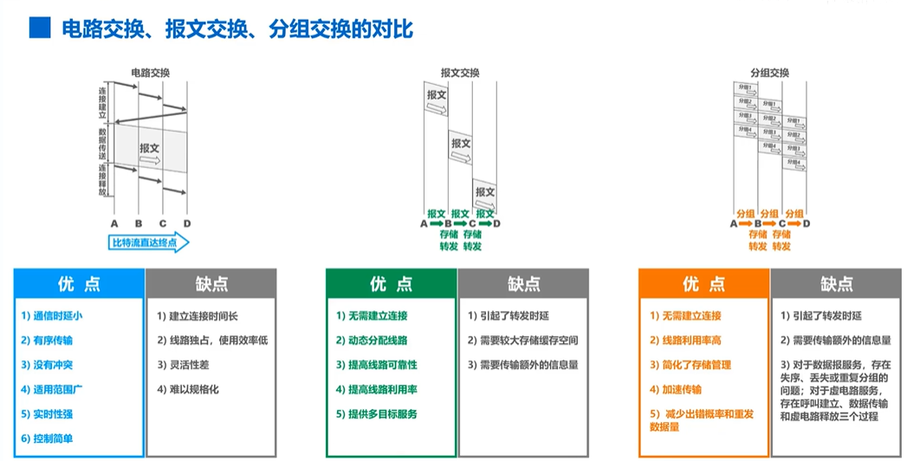
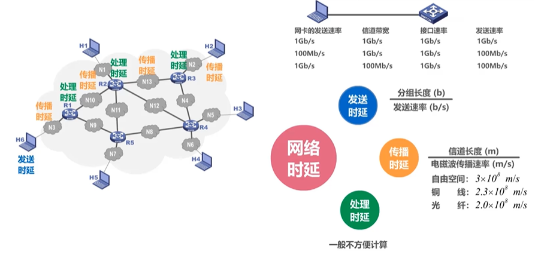
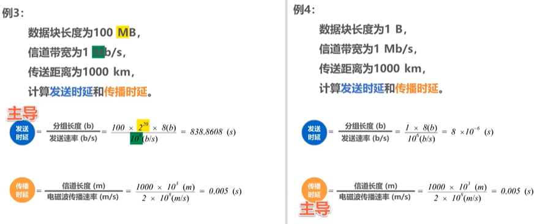
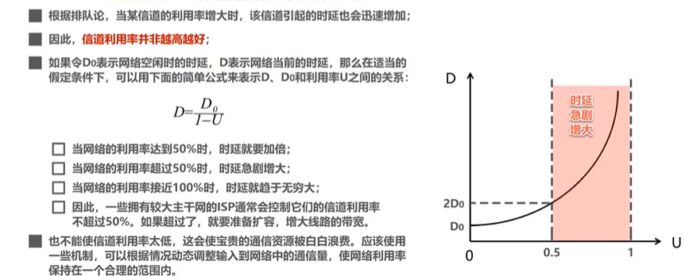
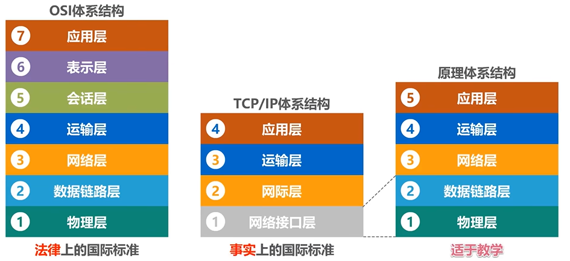
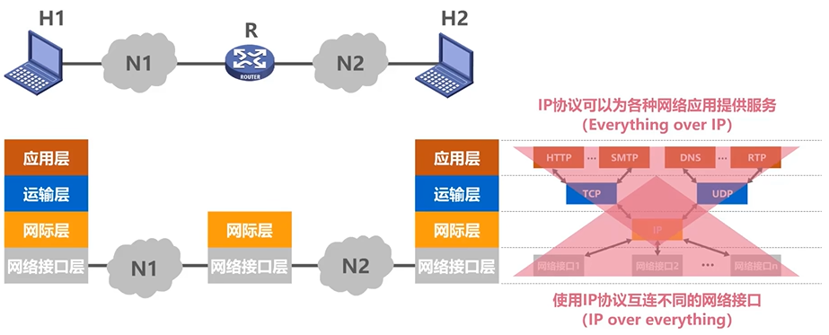
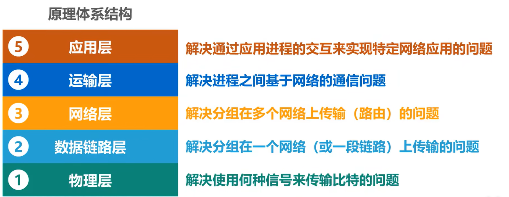
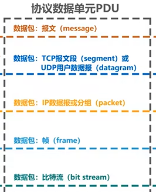

# 1-概述

> 鸣谢：湖科大教书匠【计算机网络微课堂（有字幕无背景音乐版）】https://www.bilibili.com/video/BV1c4411d7jb?vd_source=b7f14ba5e783353d06a99352d23ebca9

#### 1.网络、互联网和因特网

+ 网络由若干结点和连接这些结点的链路组成。
+ 多个网络通过路由器互连起来，构成一个覆盖范围更大的网络，即互联网。
+ 因特网是世界上最大的互连网络。
+ 连接在因特网上面的计算机称为主机。

#### 2.因特网服务提供者ISP

+ 我国主要的ISP有3个：中国移动、中国联通、中国电信。
+ 基于ISP的三层结构的因特网：
  + 第一层：主干网，覆盖国际性区域。
  + 第二层：区域性或国家性覆盖规模。
  + 第三层：本地范围。

#### 3.因特网的组成

+ 边缘部分：由所有连接在因特网上的主机组成。这部分是用户直接使用的，用来进行通信（传送数据、音频或视频）和资源共享。
+ 核心部分：由大量网络和连接这些网络的路由器组成。这部分是为边缘部分提供服务的（提供连通性和交换）。

#### 4.三种交换方式

##### 4.1 电路交换

+ 电话交换机接通电话线的方式称为电路交换。
+ 电路交换的3个步骤：
  1. 建立连接：分配通信资源。
  2. 通话：一直占用通信资源。
  3. 释放连接：归还通信资源。
+ 当使用电路交换来传送计算机数据时，其线路的传输线路往往很低。

##### 4.2 分组交换

+ 发送方：构造分组、发送分组。
+ 路由器：缓存分组、转发分组。
+ 接收方：接收分组、还原报文。

##### 4.3 报文交换

现在较少使用，通常被较先进的分组交换所取代。

##### 4.4 三种交换的对比

假设A,B,C,D是分组传输路径上所要经过的4个结点交换机。

#### 5.计算机网络的分类

| 按交换技术分类 | 按使用者分类 | 按传输介质分类 | 按覆盖范围分类 | 按拓扑结构分类 |
| :------------: | :----------: | :------------: | :------------: | :------------: |
|  电路交换网络  |    公用网    |    有线网络    |   广域网WAN    |   总线型网络   |
|  报文交换网络  |    专用网    |    无线网络    |   城域网MAN    |    星型网络    |
|  分组交换网络  |              |                |   局域网LAN    |    环型网络    |
|                |              |                |   个域网PAN    |   网状型网络   |

#### 6.计算机网络的性能指标

常用的计算机网络的性能指标有8个：速率、带宽、吞吐量、时延、时延带宽积、往返时间、利用率、丢包率。

##### 6.0 比特(bit)与字节(Byte)

+ 比特是计算机中数据量的单位，也是信息论中信息量的单位。一个比特就是就是二进制数字中的一个0或1。
+ $1Byte=8 bit$，Byte简称为B。
+ $1KB=2^{10}B=1024B,1MB=1024KB,1GB=1024MB,1TB=1024GB.$

##### 6.1 速率

+ 速率是连接在计算机网络上的主机在数字信道上传送比特的速率，也称为比特率或数据率。
+ 常用数据率单位：
  + $bit/s(b/s,bps)$
  + 注意：$1kb/s=1000kb/s,\ne1024kb/s.$

##### 6.2 带宽

+ 在模拟信号系统中，带宽是信号所包含的各种不同频率成分所占据的频率范围。单位$Hz(kHz,MHz,GHz)$。
+ 在计算机网络中，带宽用来表示网络的通信线路所能传送数据的能力，因此网络带宽表示在单位时间内从网络中的一点到另一点所能通过的“最高数据率”。单位：$b/s(kb/s,Mb/s,Gb/s,Tb/s)$。
+ 带宽的以上两种表述有着密切联系：一条通信线路的频带宽度约宽，其所传输数据的最高数据率也越高。

##### 6.3 吞吐量

+ 吞吐量表示在单位时间内通过某个网络/信道/端口的数据量。
+ 吞吐量受网络带宽或额定速率的限制。

##### 6.4 时延

##### 6.5 时延带宽积

+ 时延带宽积=传播时延$\times$带宽。
+ 链路的时延带宽积又称为以比特为单位的链路长度。

##### 6.6 往返时间RTT

+ 往返时间是因特网上信息双向交互一次所需的时间。

##### 6.7 利用率

利用率有2种：

+ 信道利用率：用来表示某信道有百分之几的时间是被利用的（有数据通过）。
+ 网络利用率：全网络的信道利用率的加权平均值。

##### 6.8 丢包率

+ 丢包率是分组丢失率，是指在一定时间范围内，传输过程中丢失的分组数量与总分组数量的比率。

+ 丢包率具体可分为：接口丢包率、结点丢包率、链路丢包率、路经丢包率、网络丢包率。

+ 分组丢失主要有2种情况：

  + 分组在传输过程中出现误码，被结点丢弃。
  + 分组到达一台队列已满的分组交换机时被丢弃，在通信量较大时可能造成网络拥塞。

+ 丢包率反映了网络的拥塞情况：

  | 网络拥塞情况 | 路径丢包率 |
  | :----------: | :--------: |
  |    无拥塞    |     0      |
  |   轻度拥塞   |   1%~4%    |
  |   严重拥塞   |   5%~15%   |

#### ==7.计算机网络体系结构==

##### 7.1 常见的计算机网络体系结构

##### 7.2 分层的必要性

##### 7.3 专用术语

###### 7.3.1 实体

+ 实体：任何可发送或接收信息的硬件或软件进程。
+ 对等实体：收发双方相同层次中的实体。

###### 7.3.2 协议

+ 协议：控制两个对等实体进行逻辑通信的规则的集合。（逻辑通信并不存在，只是一种假设）

  |    协议类型    |            举例            |
  | :------------: | :------------------------: |
  |   应用层协议   |         HTTP、SMTP         |
  |   运输层协议   |          TCP、UDP          |
  |   网络层协议   |             IP             |
  | 数据链路层协议 |     传统以太网CSMA/CD      |
  |   物理层协议   | 传统以太网使用曼彻斯特编码 |

+ 协议的三要素：

  + 语法：定义所交换信息的格式。
  + 语义：定义收发双方所要完成的操作。
  + 同步：定义收发双方的时序关系。

###### 7.3.3 服务

+ 在协议的控制下，两个对等实体间的逻辑通信使得本层能够向上一层提供服务。

+ 要实现本层协议，还需要使用下面一层所提供的服务。

+ 协议是水平的，服务是垂直的。

+ 实体看得见相邻下层所提供的服务，但并不知道实现该服务的具体协议，也就是说下面的协议对上面的实体是透明的。

+ 服务访问点：在同一系统中相邻两层的实体交换信息的逻辑接口，用于区分不同的服务类型。

+ 服务原语：上层使用下层所提供的服务必须通过与下层交换一些命令，这些命令称为服务原语。

+ 协议数据单元PDU：对等层次之间传送的数据包称为该层的协议数据单元。

  

+ 服务数据单元SDU：同一系统内，层与层之间交换的数据包称为服务数据单元。

+ 多个SDU可以合成为一个PDU，一个SDU也可以划分为多个PDU。