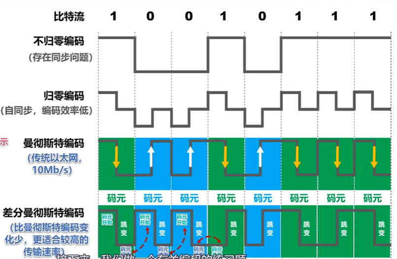
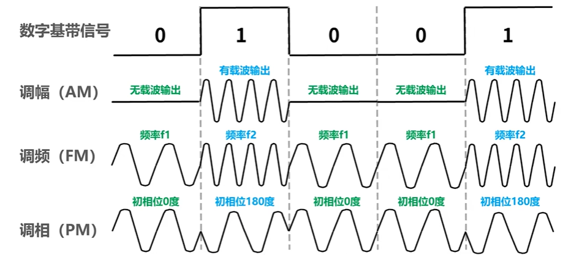
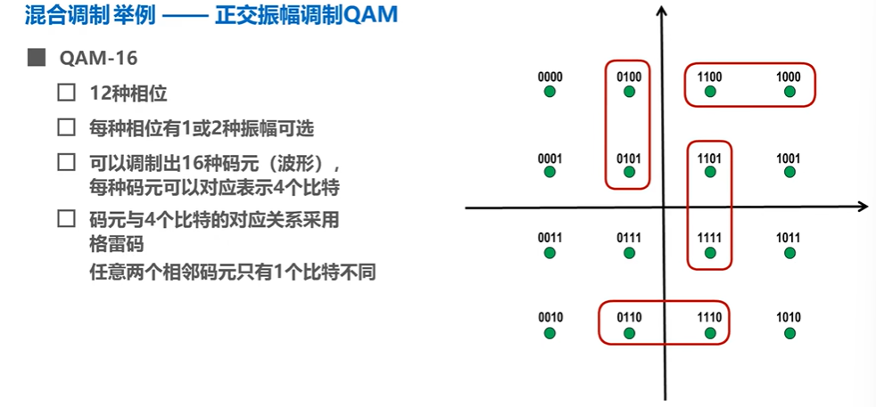

# 2-物理层

> 鸣谢：湖科大教书匠【计算机网络微课堂（有字幕无背景音乐版）】https://www.bilibili.com/video/BV1c4411d7jb?vd_source=b7f14ba5e783353d06a99352d23ebca9

> [!Important]
>
> 解决使用何种信号来传输比特的问题。

#### 1.物理层协议的4个主要任务

+ 机械特性：指明接口所用接线器的形状和尺寸、引脚数目和排列、固定和锁定装置。
+ 电气特性：指明在接口电缆的各条线上出现的电压的范围。
+ 功能特性：指明某条线上出现的某一电平的电压表示何种意义。
+ 过程特性：指明对于不同功能的各种可能事件的出现顺序。

#### 2.物理层下面的传输媒体

+ 导引型传输媒体：同轴电缆、双绞线、光纤、电力线。
  + 绞合的作用：抵御部分来自外界的电磁波干扰；减少相邻导线的电磁干扰。
+ 非导引型传输媒体：无线电波、微波、红外线、可见光。

#### 3.传输方式

##### 3.1 串并行传输

+ 串行传输：
  + 数据是一个bit一个bit依次发送的，因此在发送端和接收端之间只需要一条数据传输线路。
  + 适合远距离传输。
+ 并行传输：
  + 数据是一次发送n个bit的，因此在发送端和接收端之间需要有n条数据传输线路。
  + 优点是速度为串行传输的n倍，缺点是成本高。
  + 适合计算机内部的数据传输。

##### 3.2 同异步传输

+ 同步传输：
  + 数据块以稳定的比特流形式传输，**字节之间没有间隔**。
  + 接收端在每个比特信号的中间时刻进行检测，以判别接收到的是bite0还是比特1，检测时间积累会导致时钟误差积累，导致判别错位，因此需要采取保证收发双方时钟同步的方法，有2种：
    + 外同步：在收发双方之间添加一条单独的时钟信号线。
    + 内同步：发送端将时钟同步信号编码到发送的数据中一起传输（例如传统以太网所采用的曼彻斯特编码）。
+ 异步传输：
  + 数据块以字节为独立单位进行传输，**字节之间异步（时间间隔不固定）**，但字节中的每个比特仍然要同步（各比特的持续时间相同）。
  + 接收端仅在每个字节的起始处对字节内的比特实现同步，因此需要在每个字节前后分别加上起始位和结束位。

##### 3.3 通信

+ 单工（单向通信）：例如无线电台广播。
+ 半双工（双向交替通信）：例如对讲机。
+ 全双工（双向同时通信）：例如电话。

#### 4.编码与调制

+ 码元：在使用时间域的波形表示数字信号时，代表不同离散数值的基本波形。

  

+ 常用编码：

  

+ 基本调制方法：

  

+ 混合调制：

  

#### 5.信道的极限容量

##### 5.1 奈氏准则（无噪声）

在假定的理想条件下，为了避免码间串扰，码元传输速率是有上限的。

理想低通信道的最高码元传输速率=2W Baud；理想带通信道的最高码元传输速率=1W Baud。

> W：信道带宽（单位为Hz）
>
> Baud：波特，即码元/秒

+ 码元传输速率又称为波特率/调制速率/波形速率/符号速率。它与比特率有一定关系：
  + 当1码元只携带1bit的信息量时，波特率与比特率在数值上相等。
  + 当1码元携带n bit的信息量时，波特率在数值上是比特率的$\frac{1}{n}$，比特率在数值上是波特率的n倍。
+ 要提高信息传输速率（比特率），就必须设法使每个码元携带更多个bit的信息量，这需要采用多元调制（混合调制）。
+ 实际信道所能传输的最高码元速率，要明显低于奈氏准则所给出的上限数值。

##### 5.2 香农公式（有噪声）

香农公式推导出了带宽受限且有高斯白噪声干扰的信道的极限信息传输速率。

$c=W\times \log_2(1+\dfrac{S}{N})$

> c：信道的极限信息传输速率（单位：b/s）
>
> W：信道带宽（单位：Hz）
>
> S：信道内所传信号的平均功率
>
> N：信道内的高斯噪声功率
>
> $\dfrac{S}{N}$：信噪比（dB）=$10\times \lg(\dfrac{S}{N})$（dB）。

+ 要提高信息传输速率（比特率），就必须尽可能提高信噪比。