# 计算机网络

## Part1  专业名词解释

### A

+ ACK(Acknowledge)：表示“确认”的意思。
+ AP(Access Point)：接入点。
+ ARP(Address Resolution Protocol)：地址解析协议。是一个通过解析网络层地址来寻找数据链路层地址的网络传输协议，它在IPv4中极其重要。


### B

+ BER(Bit Error Rate)：误码率。在一段时间内，传输错误的比特占所传输比特总数的比率。


### C

+ CDM(Code Division Multiplexing)：码分复用。
+ CDMA(Code Division Multiple Access)：码分多址。
+ chip：码片。在CDMA中，每一个比特时间被划分为m个短间隔，称为码片。
+ chip sequence：码片序列。
+ circuit switching：电路交换。是使用电话交换机接通电话线的方式。
+ CRC(Cyclic Redundancy Check)：循环冗余检验。
+ CSMA/CA(Carrier Sense Multiple Access/Collision Avoidance)：载波监听多址接入/碰撞避免。
+ CSMA/CD(Carrier Sense Multiple Access/Collision Detection)：载波监听多址接入/碰撞检测。
+ CTS(Clear To Send)：允许发送帧。是信道预约中的一个响应控制帧


### D

+ data link：数据链路。是指把实现通信协议的硬件和软件加到链路上，就构成了数据链路。
+ DCF(Distributed Coordination Function)：分布式协调功能。
+ DIFS(Distributed Interframe Space)：DCF帧间间隔，又称分布式帧间间隔。
+ DSSS(Direct Sequence Spread Spectrum)：直接序列扩频。是一种用于无线通信的技术，它能够提高通信信号的可靠性、安全性。


### E

+ Ethernet：以太网。是一种计算机局域网技术，也是随机接入技术的一种，它规定了包括物理层的连线、电子信号和介质访问层（数据链路层的一部分）协议的内容。
+ EUI(Extended Unique Identifier)：可扩展的唯一标识符。用于识别和区分不同的通信设备或网络接口。


### F

+ FCS(Frame Check Sequence)：帧检测序列。
+ FDM(Frequency Division Multiplexing)：频分复用。
+ FDMA(Frequency Division Multiple Access)：频分多址。


### G

+ GBN(Go-Back-N)：回退N帧协议。


### H

+ host：主机。是连接在因特网上面的计算机。
+ hub：集线器。


### I

+ IEEE(Institute of Electrical and Electronics Engineers)：电子电气工程师学会。于1963年正式成立，前身是成立于1884年的美国电气工程师协会（AIEE）和成立于1912年的无线电工程师协会（IRE），总部位于美国纽约，是一个国际性的电子技术与信息科学工程师的协会，也是全球最大的非营利性专业技术学会。

+ IEEE 802：又称为LMSC(LAN/MAN Standards Committee，局域网/城域网标准委员会），致力于研究局域网和城域网的物理层和MAC层中定义的服务和协议，对应于OSI模型中的物理层和数据链路层。它也可指代IEEE标准中关于局域网和城域网的一系列标准。

+ IEEE 802.11：是现今无线局域网通用的标准，是由IEEE定义的无线网络通信的标准。它与Wi-Fi是两个不同的东西。

+ IFS(Interframe Space)：帧间间隔。802.11标准规定，所有站点必须在持续检测到信道空闲一段指定时间后才能发送帧，这段时间就是帧间间隔。

+ Internet：因特网。是一个专用名词，指当前全球最大的、开放的、由众多网络相互连接而成的特定计算机网络，它采用`TCP/IP`协议族。

+ internet：互联网或互连网。是一个通用名词，泛指由多个计算机网络互连而成的网络，在这些网络之间的通信协议可以说任意的。
+ IP(Internet Protocol)：网际互联协议。是TCP/IP体系中的网络层协议。

+ ISP(Internet Service Provider)：因特网服务提供者。


### J

+ jamming signal：人为干扰信号。


### K

+ 


### L

+ LAN(Local Area Network)：局域网。

+ link：链路。是从一个结点到相邻结点的一段物理线路，中间没有任何其他的交换结点。


### M

+ MAC(Medium Access Control)：媒体接入控制。

+ MAN(Metropolitan Area Network)：城域网。

+ message switching：报文交换。

+ MTU(Maximum Transfer Unit)：最大传送单元。

+ multiplexing：复用。就是通过一条物理线路同时传输多路用户的信号。


### N

+ network：网络。
+ NIC(Network Interface Controller)：网卡（网络适配器、网络接口卡）。是一块被设计用来允许计算机在计算机网络上进行通讯的计算机硬件，每个网卡拥有全球唯一的MAC地址。
+ node：结点。


### O

+ OSI(Open System Interconnect)：开放式系统互联。一般都叫作OSI参考模型，是ISO组织在1985年研究的网络互联模型。该体系结构标准定义了网络互联的7层框架：物理层、数据链路层、网络层、运输层、会话层、表示层、应用层。


### P

+ packet switching：分组交换。
+ PAN(Personal Area Network)：个域网。
+ PCF(Point Coordination Function)：点协调功能。
+ PDU(Protocol Data Unit)：协议数据单元。是对等层次之间传送的数据包。
+ PPP(Point to Point Protocol)：点对点协议。


### Q

+ 


### R

+ router：路由器。是连接两个或多个网络的硬件设备，在网络间起到网关的作用。是读取每一个数据包中的地址然后决定如何传送的专用智能性的网络设备。它能够理解不同协议，例如某个局域网使用的以太网协议、因特网使用的TCP/IP协议，然后分析不同类型网络传来的数据包的目的地址，实现非TCP/IP网络的地址和TCP/IP地址之间的相互转换，再根据选定的路由算法把各数据包按最佳路线传送到指定位置。因此路由器可以把非TCP/IP网络连接到因特网上。
+ RTS(Request To Send)：请求发送帧。是信道预约中所使用的一个短的控制帧，包括源地址、目的地址以及此次通信（包括相应的ACK帧）所需的持续时间。
+ RTT(Round-Trip Time)：往返时间。


### S

+ SDU(Service Data Unit)：服务数据单元。是同一系统内，层与层之间交换的数据包。
+ SIFS(Short Interframe Space)：短帧间间隔。
+ SR(Selective Request)：选择重传协议。
+ STP(Spanning Tree Protocol)：以太网交换机中的生成树协议。
+ SW(Stop-and-Wait)：停止-等待协议。
+ switch：交换机。
+ switching：交换。是按照某种方式动态地分配传输线路的资源。


### T

+ TCP(Transmission Control Protocol)：传输控制协议。是一种面向连接的、可靠的、基于字节流的传输层（即运输层）通信协议。
+ TDM(Time Division Multiplexing)：时分复用。
+ TDMA(Time Division Multiple Access)：时分多址。


### U

+ 


### V

+ VLAN(Virtual Local Area Network)：虚拟局域网。
+ VID(VLAN ID)：VLAN标识符。是VLAN标记的最后12bit。


### W

+ WAN(Wide Area Network)：广域网。
+ WDM(Wave Division Multiplexing)：波分复用。


---


## Part2  知识梳理

### Chapter1  概述

#### 1.网络、互联网和因特网

+ 网络由若干结点和连接这些结点的链路组成。
+ 多个网络通过路由器互连起来，构成一个覆盖范围更大的网络，即互联网。
+ 因特网是世界上最大的互连网络。
+ 连接在因特网上面的计算机称为主机。


#### 2.因特网服务提供者ISP

+ 我国主要的ISP有3个：中国移动、中国联通、中国电信。
+ 基于ISP的三层结构的因特网：
  + 第一层：主干网，覆盖国际性区域。
  + 第二层：区域性或国家性覆盖规模。
  + 第三层：本地范围。


#### 3.因特网的组成

+ 边缘部分：由所有连接在因特网上的主机组成。这部分是用户直接使用的，用来进行通信（传送数据、音频或视频）和资源共享。
+ 核心部分：由大量网络和连接这些网络的路由器组成。这部分是为边缘部分提供服务的（提供连通性和交换）。


#### 4.三种交换方式

##### 4.1 电路交换

+ 电话交换机接通电话线的方式称为电路交换。
+ 电路交换的3个步骤：
  1. 建立连接：分配通信资源。
  2. 通话：一直占用通信资源。
  3. 释放连接：归还通信资源。
+ 当使用电路交换来传送计算机数据时，其线路的传输线路往往很低。

##### 4.2 分组交换

+ 发送方：构造分组、发送分组。
+ 路由器：缓存分组、转发分组。
+ 接收方：接收分组、还原报文。

##### 4.3 报文交换

现在较少使用，通常被较先进的分组交换所取代。

##### 4.4 三种交换的对比

假设A,B,C,D是分组传输路径上所要经过的4个结点交换机。

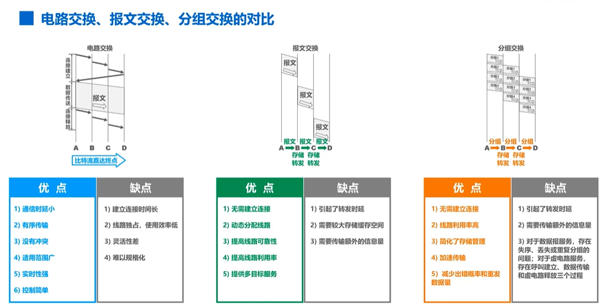


#### 5.计算机网络的分类

| 按交换技术分类 | 按使用者分类 | 按传输介质分类 | 按覆盖范围分类 | 按拓扑结构分类 |
| :------------: | :----------: | :------------: | :------------: | :------------: |
|  电路交换网络  |    公用网    |    有线网络    |   广域网WAN    |   总线型网络   |
|  报文交换网络  |    专用网    |    无线网络    |   城域网MAN    |    星型网络    |
|  分组交换网络  |              |                |   局域网LAN    |    环型网络    |
|                |              |                |   个域网PAN    |   网状型网络   |


#### 6.计算机网络的性能指标

常用的计算机网络的性能指标有8个：速率、带宽、吞吐量、时延、时延带宽积、往返时间、利用率、丢包率。

##### 6.0 比特(bit)与字节(Byte)

+ 比特是计算机中数据量的单位，也是信息论中信息量的单位。一个比特就是就是二进制数字中的一个0或1。
+ $1Byte=8 bit$，Byte简称为B。
+ $1KB=2^{10}B=1024B,1MB=1024KB,1GB=1024MB,1TB=1024GB.$

##### 6.1 速率

+ 速率是连接在计算机网络上的主机在数字信道上传送比特的速率，也称为比特率或数据率。
+ 常用数据率单位：
  + $bit/s(b/s,bps)$
  + 注意：$1kb/s=1000kb/s,\ne1024kb/s.$

##### 6.2 带宽

+ 在模拟信号系统中，带宽是信号所包含的各种不同频率成分所占据的频率范围。单位$Hz(kHz,MHz,GHz)$。
+ 在计算机网络中，带宽用来表示网络的通信线路所能传送数据的能力，因此网络带宽表示在单位时间内从网络中的一点到另一点所能通过的“最高数据率”。单位：$b/s(kb/s,Mb/s,Gb/s,Tb/s)$。
+ 带宽的以上两种表述有着密切联系：一条通信线路的频带宽度约宽，其所传输数据的最高数据率也越高。

##### 6.3 吞吐量

+ 吞吐量表示在单位时间内通过某个网络/信道/端口的数据量。
+ 吞吐量受网络带宽或额定速率的限制。

##### 6.4 时延

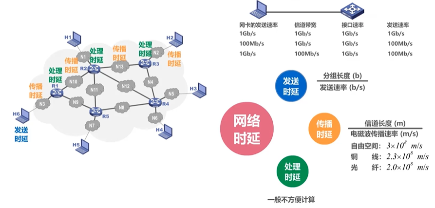

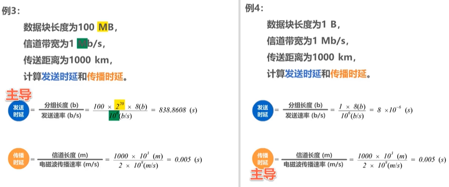

##### 6.5 时延带宽积

+ 时延带宽积=传播时延$\times$带宽。
+ 链路的时延带宽积又称为以比特为单位的链路长度。

##### 6.6 往返时间RTT

+ 往返时间是因特网上信息双向交互一次所需的时间。

##### 6.7 利用率

利用率有2种：

+ 信道利用率：用来表示某信道有百分之几的时间是被利用的（有数据通过）。
+ 网络利用率：全网络的信道利用率的加权平均值。

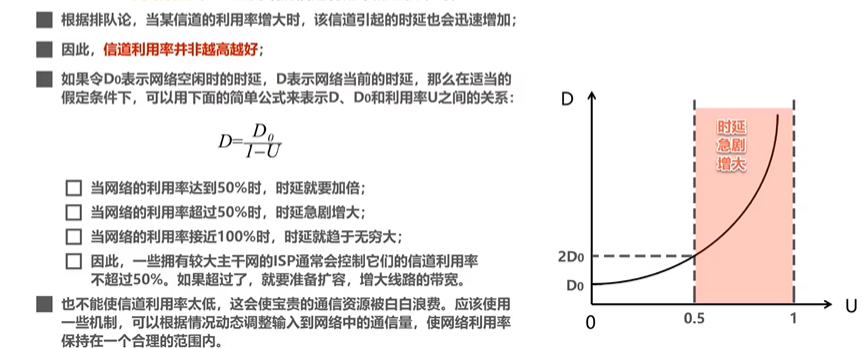

##### 6.8 丢包率

+ 丢包率是分组丢失率，是指在一定时间范围内，传输过程中丢失的分组数量与总分组数量的比率。

+ 丢包率具体可分为：接口丢包率、结点丢包率、链路丢包率、路经丢包率、网络丢包率。

+ 分组丢失主要有2种情况：
  + 分组在传输过程中出现误码，被结点丢弃。
  + 分组到达一台队列已满的分组交换机时被丢弃，在通信量较大时可能造成网络拥塞。
  
+ 丢包率反映了网络的拥塞情况：
  
  | 网络拥塞情况 | 路径丢包率 |
  | :----------: | :--------: |
  |    无拥塞    |     0      |
  |   轻度拥塞   |   1%~4%    |
  |   严重拥塞   |   5%~15%   |


#### ==7.计算机网络体系结构==

##### 7.1 常见的计算机网络体系结构

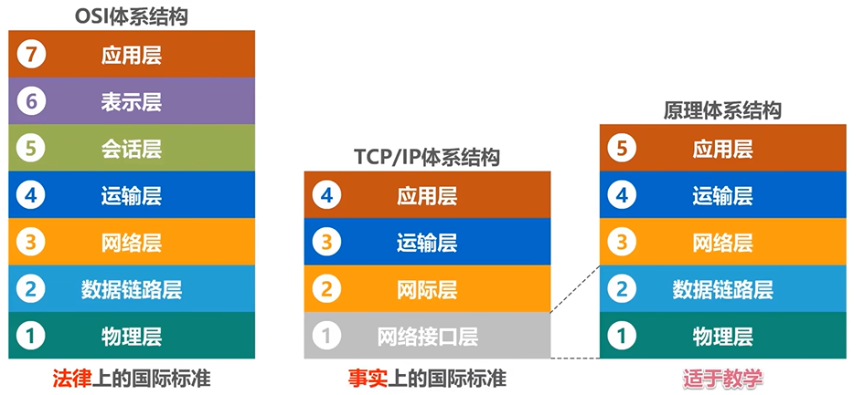

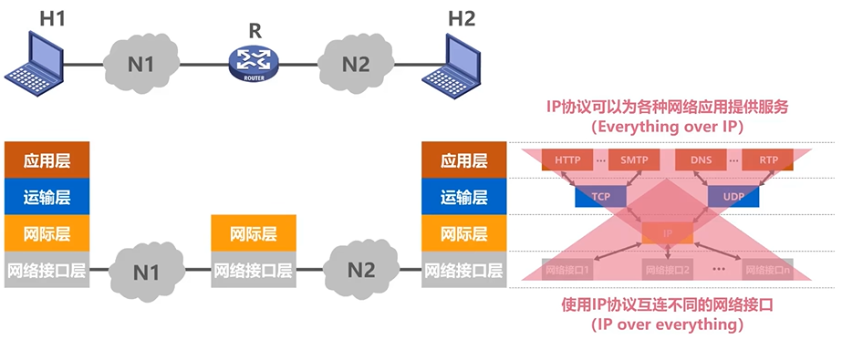

##### 7.2 分层的必要性

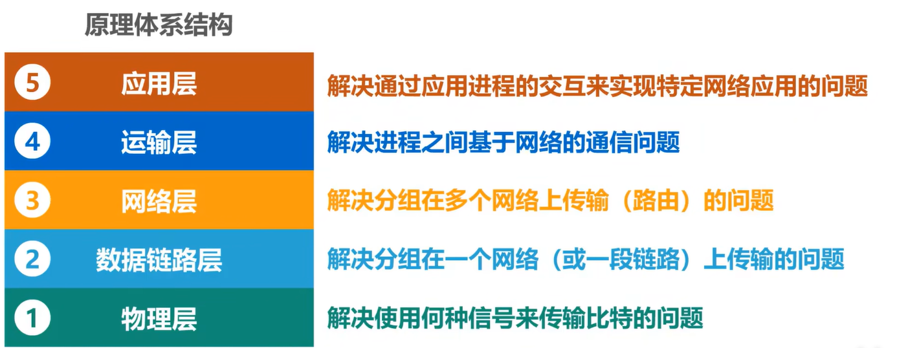

##### 7.3 专用术语

###### 7.3.1 实体

+ 实体：任何可发送或接收信息的硬件或软件进程。
+ 对等实体：收发双方相同层次中的实体。

###### 7.3.2 协议

+ 协议：控制两个对等实体进行逻辑通信的规则的集合。（逻辑通信并不存在，只是一种假设）

  |    协议类型    |            举例            |
  | :------------: | :------------------------: |
  |   应用层协议   |         HTTP、SMTP         |
  |   运输层协议   |          TCP、UDP          |
  |   网络层协议   |             IP             |
  | 数据链路层协议 |     传统以太网CSMA/CD      |
  |   物理层协议   | 传统以太网使用曼彻斯特编码 |

+ 协议的三要素：

  + 语法：定义所交换信息的格式。
  + 语义：定义收发双方所要完成的操作。
  + 同步：定义收发双方的时序关系。

###### 7.3.3 服务

+ 在协议的控制下，两个对等实体间的逻辑通信使得本层能够向上一层提供服务。

+ 要实现本层协议，还需要使用下面一层所提供的服务。

+ 协议是水平的，服务是垂直的。

+ 实体看得见相邻下层所提供的服务，但并不知道实现该服务的具体协议，也就是说下面的协议对上面的实体是透明的。

+ 服务访问点：在同一系统中相邻两层的实体交换信息的逻辑接口，用于区分不同的服务类型。

+ 服务原语：上层使用下层所提供的服务必须通过与下层交换一些命令，这些命令称为服务原语。

+ 协议数据单元PDU：对等层次之间传送的数据包称为该层的协议数据单元。

  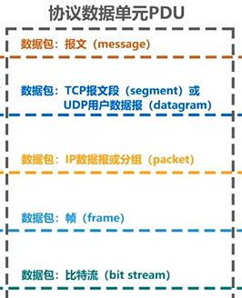

+ 服务数据单元SDU：同一系统内，层与层之间交换的数据包称为服务数据单元。

+ 多个SDU可以合成为一个PDU，一个SDU也可以划分为多个PDU。


---


### Chapter2  物理层

> 解决使用何种信号来传输比特的问题。

#### 1.物理层协议的4个主要任务

+ 机械特性：指明接口所用接线器的形状和尺寸、引脚数目和排列、固定和锁定装置。
+ 电气特性：指明在接口电缆的各条线上出现的电压的范围。
+ 功能特性：指明某条线上出现的某一电平的电压表示何种意义。
+ 过程特性：指明对于不同功能的各种可能事件的出现顺序。


#### 2.物理层下面的传输媒体

+ 导引型传输媒体：同轴电缆、双绞线、光纤、电力线。
  + 绞合的作用：抵御部分来自外界的电磁波干扰；减少相邻导线的电磁干扰。
+ 非导引型传输媒体：无线电波、微波、红外线、可见光。


#### 3.传输方式

##### 3.1 串并行传输

+ 串行传输：
  + 数据是一个bit一个bit依次发送的，因此在发送端和接收端之间只需要一条数据传输线路。
  + 适合远距离传输。
+ 并行传输：
  + 数据是一次发送n个bit的，因此在发送端和接收端之间需要有n条数据传输线路。
  + 优点是速度为串行传输的n倍，缺点是成本高。
  + 适合计算机内部的数据传输。

##### 3.2 同异步传输

+ 同步传输：
  + 数据块以稳定的比特流形式传输，**字节之间没有间隔**。
  + 接收端在每个比特信号的中间时刻进行检测，以判别接收到的是bite0还是比特1，检测时间积累会导致时钟误差积累，导致判别错位，因此需要采取保证收发双方时钟同步的方法，有2种：
    + 外同步：在收发双方之间添加一条单独的时钟信号线。
    + 内同步：发送端将时钟同步信号编码到发送的数据中一起传输（例如传统以太网所采用的曼彻斯特编码）。
+ 异步传输：
  + 数据块以字节为独立单位进行传输，**字节之间异步（时间间隔不固定）**，但字节中的每个比特仍然要同步（各比特的持续时间相同）。
  + 接收端仅在每个字节的起始处对字节内的比特实现同步，因此需要在每个字节前后分别加上起始位和结束位。

##### 3.3 通信

+ 单工（单向通信）：例如无线电台广播。
+ 半双工（双向交替通信）：例如对讲机。
+ 全双工（双向同时通信）：例如电话。


#### 4.编码与调制

+ 码元：在使用时间域的波形表示数字信号时，代表不同离散数值的基本波形。

  

+ 常用编码：

  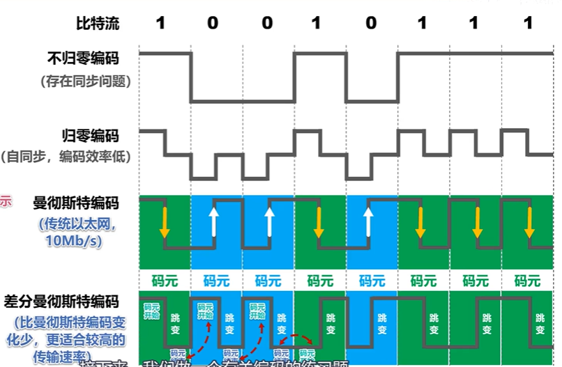

+ 基本调制方法：

  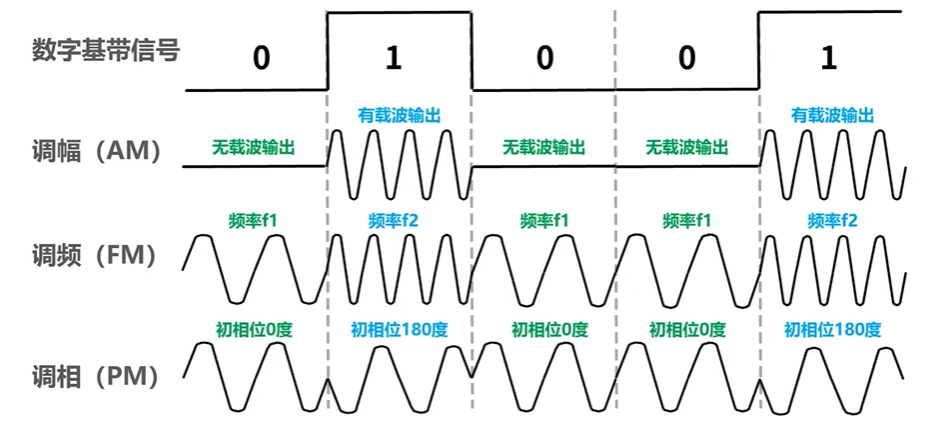

+ 混合调制：

  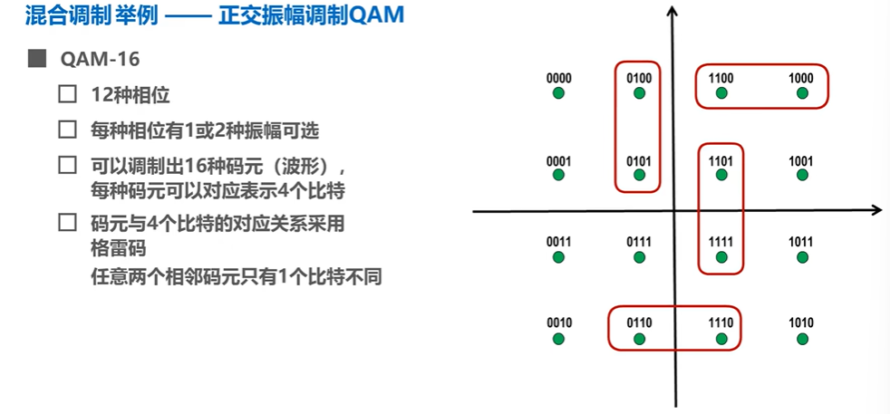


#### 5.信道的极限容量

##### 5.1 奈氏准则（无噪声）

在假定的理想条件下，为了避免码间串扰，码元传输速率是有上限的。

理想低通信道的最高码元传输速率=2W Baud；理想带通信道的最高码元传输速率=1W Baud。

> W：信道带宽（单位为Hz）
>
> Baud：波特，即码元/秒

+ 码元传输速率又称为波特率/调制速率/波形速率/符号速率。它与比特率有一定关系：
  + 当1码元只携带1bit的信息量时，波特率与比特率在数值上相等。
  + 当1码元携带n bit的信息量时，波特率在数值上是比特率的$\frac{1}{n}$，比特率在数值上是波特率的n倍。
+ 要提高信息传输速率（比特率），就必须设法使每个码元携带更多个bit的信息量，这需要采用多元调制（混合调制）。
+ 实际信道所能传输的最高码元速率，要明显低于奈氏准则所给出的上限数值。

##### 5.2 香农公式（有噪声）

香农公式推导出了带宽受限且有高斯白噪声干扰的信道的极限信息传输速率。

$c=W\times \log_2(1+\dfrac{S}{N})$

> c：信道的极限信息传输速率（单位：b/s）
>
> W：信道带宽（单位：Hz）
>
> S：信道内所传信号的平均功率
>
> N：信道内的高斯噪声功率
>
> $\dfrac{S}{N}$：信噪比（dB）=$10\times \lg(\dfrac{S}{N})$（dB）。

+ 要提高信息传输速率（比特率），就必须尽可能提高信噪比。


---


### Chapter3  数据链路层

> 解决分组在一个网络或一段链路上传输的问题。

#### 1.数据链路层概述

+ 链路：从一个结点到相邻结点的一段物理线路，中间没有任何其他的交换结点。
+ 数据链路：把实现通信协议的硬件和软件加到链路上，就构成了数据链路。
+ 数据链路层以帧为单位传输和处理数据。
+ 数据链路层的3个重要问题：封装成帧、差错检测、可靠传输。
  + 尽管误码无法避免，但若能实现发送方发送什么，接收方就能收到什么，就可称为可靠传输。


#### 2.封装成帧

+ 封装成帧是指数据链路层将**上层交付下来的PDU**添加帧头和帧尾使之形成帧的操作。

+ 帧头和帧尾的作用之一就是帧定界，便于接收方的数据链路层从物理层交付上来的比特流中提取出一个个的帧。

+ 透明传输是指数据链路层对上层交付下来的传输数据没有任何限制，就好像数据链路层不存在一样。
  + 面向字节的物理链路使用字节填充（或字符填充）的方法实现透明传输。
  
  + 面向比特的物理链路使用比特填充的方法实现透明传输。
  
    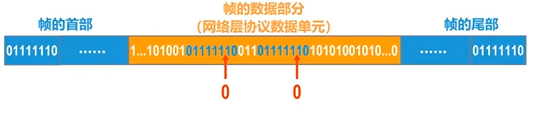
  
    （每五个连续1后面插入一个0）

+ 为了提高帧的传输效率，应当使帧的数据部分的长度尽可能大。但考虑到差错检制等多种因素，每一种数据链路层协议都规定了帧数据部分的长度上限，即最大传送单元MTU。


#### 3.差错检测

+ 比特差错（误码）：比特在传输过程中可能产生差错，1可能会变成0，0也可能会变成1。
+ 误码率BER：在一段时间内，传输错误的比特占所传输比特总数的比率。

##### 3.1 奇偶校验（漏检率较高）

+ 在待发送的数据后面添加1位奇偶校验位，使整个数据（包括奇偶校验位）中“1”的个数为奇数（奇校验）或偶数（偶校验）。
+ 如果有奇数个位置发生误码，则奇偶性变化，可以检查出误码；如果有偶数个位置发生误码，则奇偶性不变，无法检查出误码（漏检）。

##### 3.2 循环冗余校验CRC（漏检率极低）

###### 3.2.1 操作步骤

```
收发双方约定一个生成多项式G(x)
发送方基于待发送数据和G(x)计算出差错检测码即冗余码，并将其添加到待发送数据后面一起发送
接收方通过G(x)计算收到的数据是否产生误码
```

###### 3.2.2 具体操作示意图

*注意除法过程中所进行的是**异或**运算。*

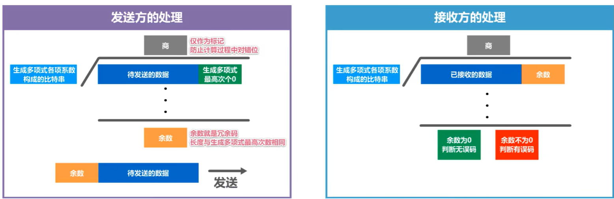

###### 3.2.3 生成多项式举例

$$
G(x)=x^4+x^2+x+1\\
=1*x^4+0*x^3+1*x^2+1*x^1+1*x^0
$$

故生成多项式各项系数构成的比特串为：10111.

###### 3.2.4 常用的生成多项式

$$
CRC-16=x^{16}+x^{15}+x^2+1\\
CRC-CCITT=x^{16}+x^{12}+x^5+1\\
CRC-32=x^{32}+x^{26}+x^{23}+x^{22}+x^{16}+x^{12}+x^{11}+x^{10}
+x^8+x^7+x^5+x^4+x^2+x+1
$$

注意：生成多项式必须包含最低次项，即末尾必须+1.

###### 3.2.5 示例

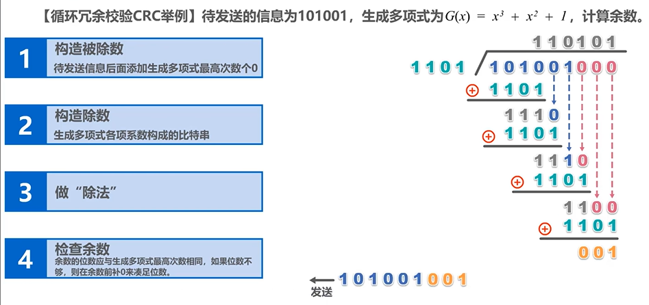

注意事项：商中的1表示够除，0表示不够除，够除的判断标准是每次的被除数与除数1101相当；除法进行的是异或运算。

CRC的计算虽然比较复杂，但非常易于用硬件实现，因此被广泛用于数据链路层。


#### 4.可靠传输

##### 4.1 可靠传输的基本概念

+ 使用差错检测技术检测出误码后，我们要根据数据链路层向上层提供的服务类型来决定对误码进行何种操作：
  + 不可靠传输服务：仅仅丢弃有误码的帧，其他什么也不做。
  + 可靠传输服务：想办法实现发送端发生什么，接收端就收到什么。
+ 一般情况下，有线链路的误码率比较低，为了减小开销，并不要求数据链路层向上提供可靠传输服务。即使出现了误码，可靠传输的问题也交由上层解决。
+ 无线链路易受干扰，误码率高，因此要求数据链路层必须向上层提供可靠传输服务。
+ 从整个计算机网络体系结构来看，传输差错不只有比特差错，还包括分组丢失、分组失序、分组重复。
+ 可靠传输服务并不仅局限于数据链路层，其他各层均可选择实现可靠传输。

##### 4.2 可靠传输实现机制

以下3种机制的基本原理并不局限于数据链路层，而可以应用到其它各层协议中。

###### 4.2.1 停止-等待协议SW

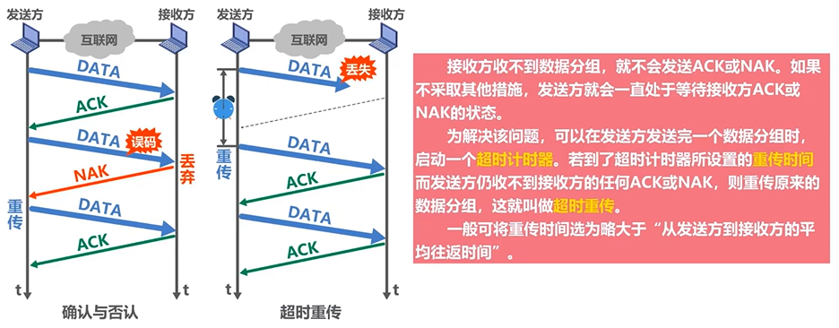

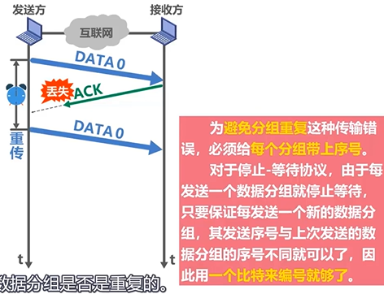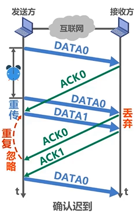


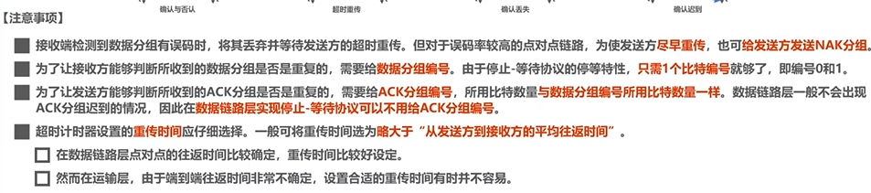

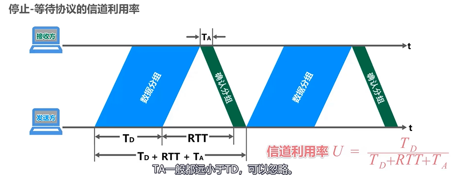


###### 4.2.2 回退N帧协议GBN（滑动窗口协议）

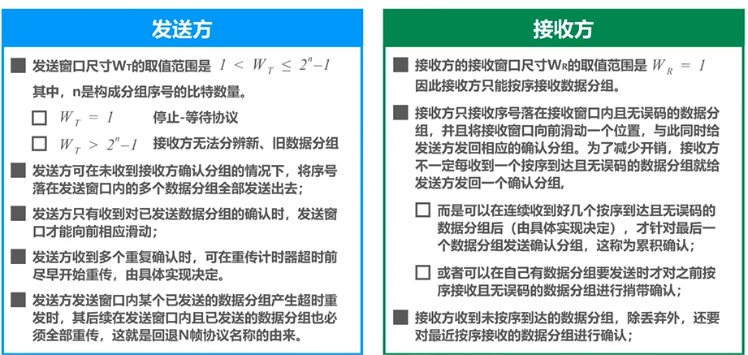

###### 4.2.3 选择重传协议SR

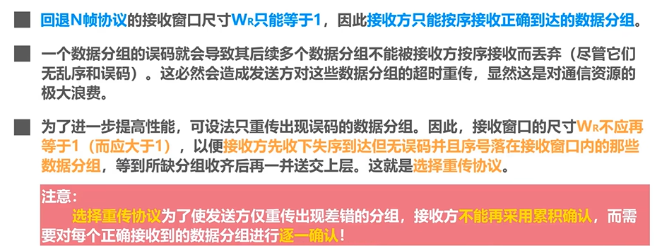

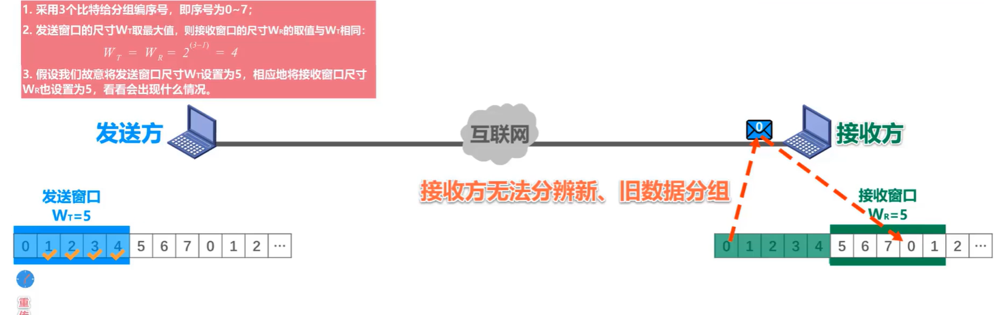


#### 5.点对点协议PPP

+ PPP是目前使用最广泛的点对点数据链路层协议。

+ 帧格式：

  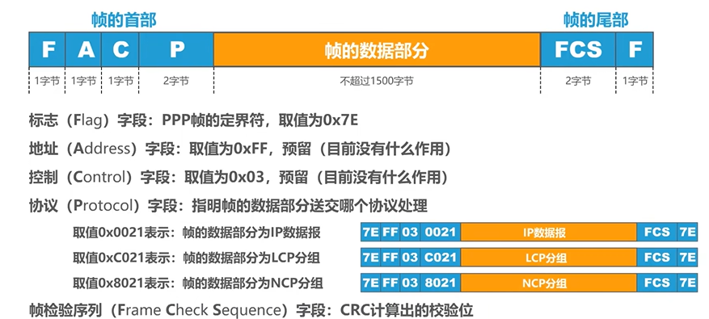

+ 实现透明传输的方法：

  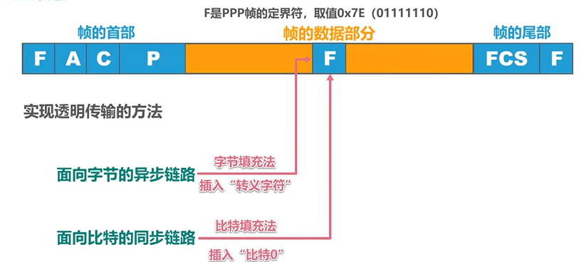

+ 差错检测：

  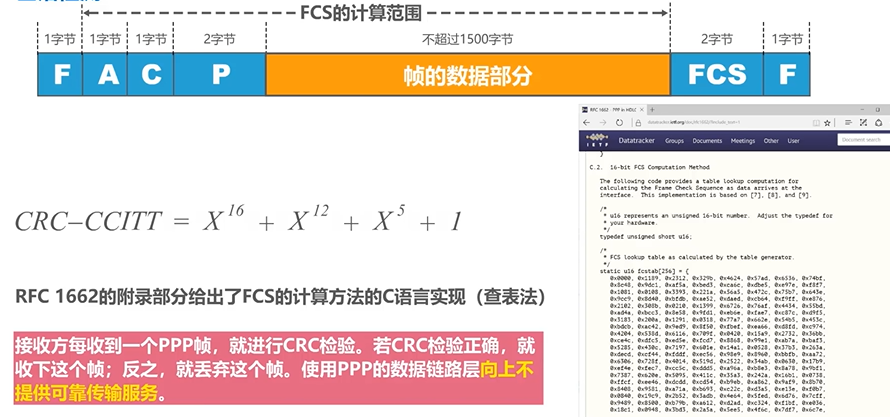


#### 6.1 媒体接入控制MAC的基本概念

+ 共享信道要重点考虑的一个问题是：如何协调多个发送和接收站点对一个共享传输媒体的占用，即媒体接入控制MAC。

+ 框架：

  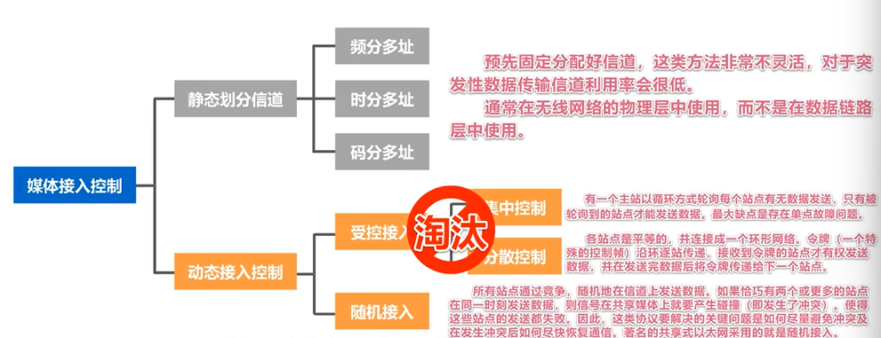


#### 6.2 静态划分信道

+ 复用：就是通过一条物理线路同时传输多路用户的信号。
+ 当网络中传输媒体的传输容量大于多条单一信道传输的总通信量时，可利用复用技术在一条物理线路上建立多条通信信道来充分利用传输媒体的带宽。

##### 6.2.1 信道复用的常用技术

###### 1.频分复用FDM

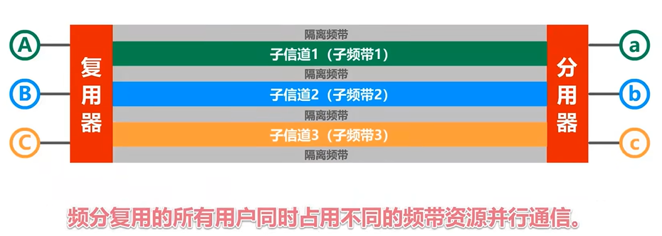

###### 2.时分复用TDM

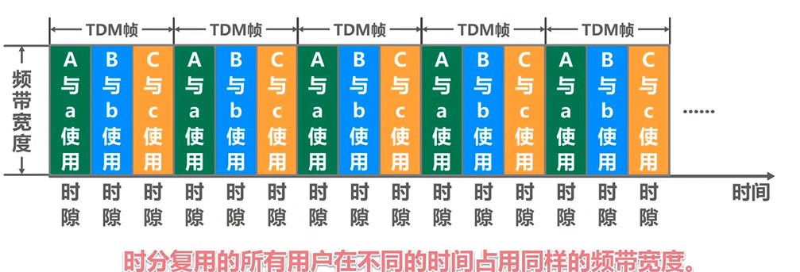

###### 3.波分复用WDM

> 实质上就是光的频分复用。

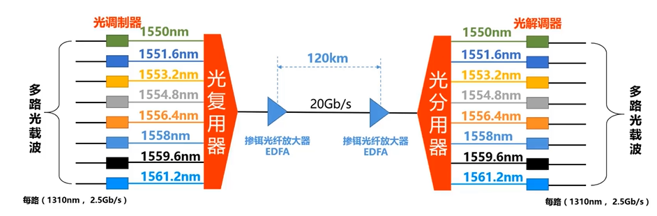

###### 4.码分复用CDM

与FDM和TDM不同，CDM的各用户使用经过特殊挑选的不同码型，因此彼此互不干扰，可同时使用同频带进行通信。

###### 5.码分多址CDMA

+ 实际上，由于CDM主要用于多址接入，人们更常用的是CDMA。

+ 在CDMA中，每一个比特时间被划分为m个短间隔，称为码片。通常m=64或128。

+ 使用CDMA的每一个站被指派一个唯一的m bit码片序列：

  + 一个站若要发送比特1，则发送它自己的m bit码片序列。
  + 一个站若要发送比特0，则发送它自己的m bit码片序列的二进制反码。

+ 码片序列的挑选原则：

  1. 分配给每个站的码片序列必须各不相同，实际中常采用伪随机码序列。
  2. 分配给每个站的码片序列必须相互正交，即将码片序列表示成向量，不同向量的单位化内积为0。

+ 关于码片序列挑选的一道例题：

  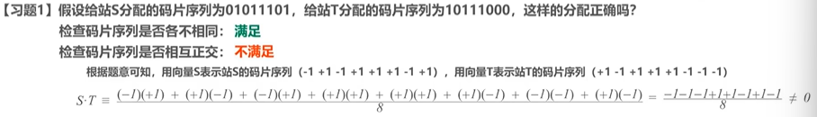

+ 应用举例：

  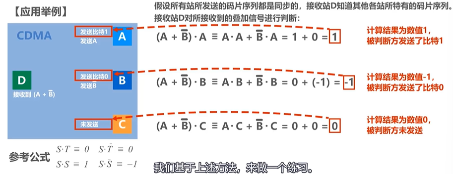

##### 6.2.2 复用与多址的区别

+ 复用是将单一媒体的频带资源划分成很多子信道，这些子信道之间相互独立，互不干扰。从媒体的整体频带资源上来看，每个子信道只占用该媒体频带资源的一部分。
+ 多址（多点接入）处理的是动态分配信道给用户，这在用户仅暂时性占用信道的情况下是必需的，所有移动通信系统基本上都属于这种情况。而在用户永久性占用信道的情况下，多址是不需要的（例如无线广播、电视广播站）。
+ 某种程度上，FDMA、TDMA、CDMA可以分别看作是FDM、TDM、CDM的应用。


#### 6.3 随机接入——CSMA/CD协议（总线局域网）

CSMA/CD是指载波监听多址接入/碰撞检测。

##### 6.3.1 载波监听CS

每个站（即主机）在发送帧之前先要检测一下总线上是否有其他站在发送帧，称为“**先听后说**”。

若检测到总线空闲**96比特时间**，则发送这个帧；若检测到总线忙，则继续检测并等待总线转为空闲96比特时间，然后再发送这个帧。

*注意：只有当某一帧路过某站时，该站才能检测到总线上是非空闲的。*

> 96比特时间：发送96bit所耗费的时间，也称为帧间最小间隔，其作用是使接收方可以检测出一个帧的结束，同时也使得其他站都有机会平等竞争信道并发送帧。

##### 6.3.2 多址接入MA

多个站（即主机）连接在一条总线上，竞争使用总线。

##### 6.3.3 碰撞检测CD

每一个正在发送帧的站边发送边检测碰撞，称为“**边说边听**”，发送完毕后不再对该帧负责。一旦发现总线上发生碰撞，就立即停止发送，退避一段随机时间（==退避时间==）后再次发送。

以太网还采取了一种叫作**强化碰撞**的措施：当发送帧的站检测到碰撞时，除了立即停止发送帧以外，还要另外发送32bit或48bit的人为干扰信号，以便有足够多的碰撞信号使得所有站都能检测出碰撞。

##### 6.3.4 争用期（碰撞窗口）


##### 6.3.5 最小帧长

> 最小帧长=争用期$\times$数据传输速率

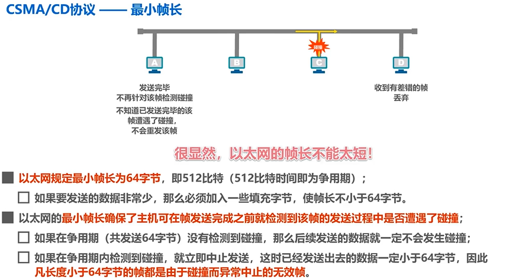

##### 6.3.6 最大帧长

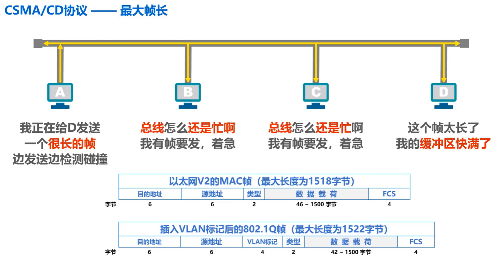

##### 6.3.7 截断二进制指数退避算法

> 计算[退避时间](#####6.3.3 碰撞检测CD)的一种算法。

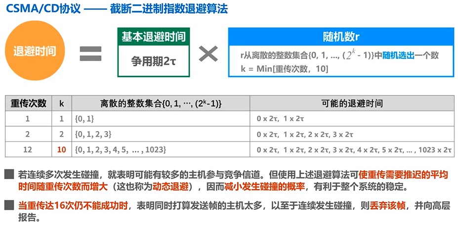

##### 6.3.8 信道利用率

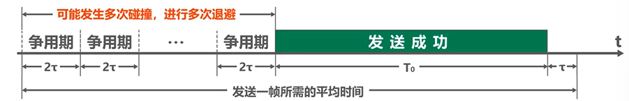

考虑以下的理想情况：

+ 各主机发送帧都不会发生碰撞；
+ 总线一旦空闲就有某个主机立刻发送帧。

在上述理想情况下，争用期不存在，则发送一帧所占用总线的时间为$T_0+\tau$，而帧本身发送完毕所需的时间为$T_0$.

那么我们可以计算出极限信道利用率$S_{max}=\dfrac{T_0}{T_0+\tau}=\dfrac{1}{1+\dfrac{\tau}{T_0}}$.

记$\dfrac{\tau}{T_0}$为参数$a$。为了提高信道利用率，应使$a$尽量小。这意味着$\tau$应尽量小（以太网端到端的距离受到限制）和$T_0$应尽量大（主机所发送的帧长应尽量大）。

##### 6.3.9 帧发送&接收流程图

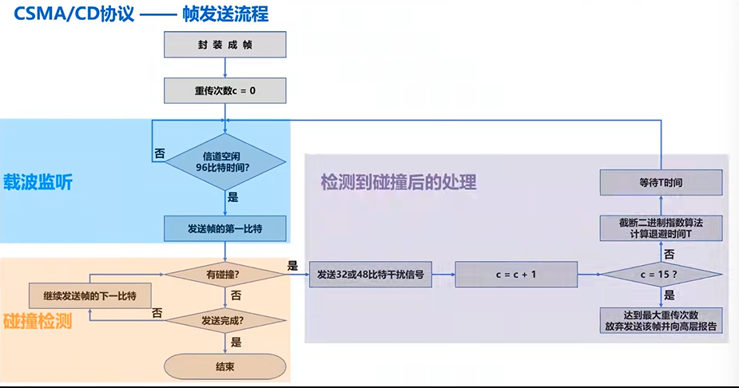

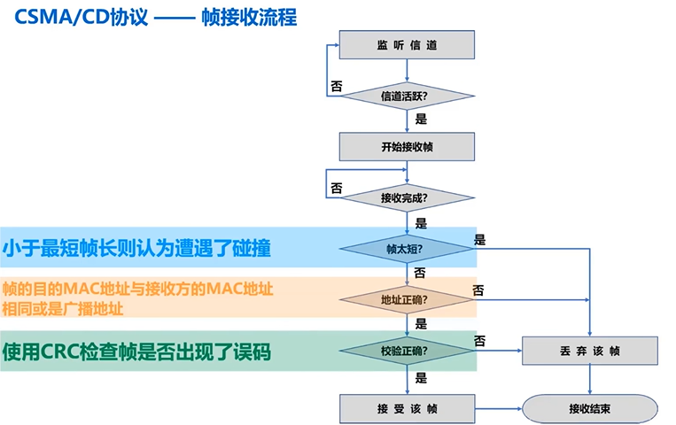


#### 6.4 随机接入——CSMA/CA协议（无线局域网）

CSMA/CA是指载波监听多址接入/碰撞避免。

在无线局域网中，可以使用CSMA，但不能使用CD。

802.11无线局域网使用CSMA/CA协议，在CSMA的基础上增加了一个CA功能，而不再实现CD功能。

由于不可能避免所有碰撞，且无线信道误码率较高，802.11标准还使用了[停止-等待协议SW](######4.2.1 停止-等待协议SW)来保证数据的可靠传输。

##### 6.4.1 802.11的MAC层标准定义的MAC方式

+ 分布式协调功能DCF（802.11定义的**默认方式**）：在DCF方式下，没有中心控制站点，每个站点使用CSMA/CA协议通过争用信道来获取发送权。
+ 点协调功能PCF（802.11定义的**可选方式**）：在PCF方式下，使用集中控制的接入算法，一般在接入点AP实现集中控制，在实际中较少使用。

##### 6.4.2 帧间间隔IFS

+ 802.11标准规定，所有站点必须在持续检测到信道空闲一段指定时间后才能发送帧，这段时间就是帧间间隔。
+ IFS的长短取决于该站点要发送的帧的类型：高优先级帧的IFS短，低优先级帧的IFS长。
+ 常用的2种IFS：
  + 短帧间间隔SIFS（28$\mu s$）：是最短的IFS，用于分隔属于一次对话的各帧。一个站点应当能够在这段时间内从发送方式切换到接收方式。
    + 使用SIFS的帧类型有ACK帧、CTS帧、由过长的MAC帧分片后的数据帧、所有回答AP探询的帧、所有在PCF方式中接入AP发送出的任何帧。
  + DCF帧间间隔DIFS（128$\mu s$）：在DCF方式中用来发送数据帧和管理帧。

##### 6.4.3 退避算法及其使用规则

###### 1.退避算法

在执行退避算法时，站点为退避计时器设置一个随机的退避时间。

+ 当退避计时器清零时，站点开始发送数据；
+ 当退避计时器未清零，而信道又转变为忙状态时，退避计时器冻结直到信道重新空闲，此时退避计时器不能立即启动，而要再经过时间DIFS后才能启动。

在进行第$i$次退避时，退避时间在时隙编号$\{0,1,2,...,2^{2+i}-1\}$中随机选择一个，然后乘以基本退避时间（即一个时隙的长度），就可得到随机的退避时间。这样做是为了使不同站点恰好选取到相同退避时间的概率降低。当时隙最大编号达到255（即第6次退避）时，时隙编号数量不再增加。

###### 2.退避算法的使用规则

当站点检测到信道空闲，且所发送的数据帧不是成功发送完上一个数据帧之后立即继续发送的数据帧，则不使用退避算法。

以下情况必须使用退避算法：

+ 发送数据帧之前检测到信道忙；
+ 每次重传一个数据帧时；
+ 每次成功发送后，要立即继续发送下一个帧时（这是为了避免某个站点长时间占用信道）。

##### 6.4.4 信道预约

为了尽可能减少碰撞的频率和降低碰撞的影响，802.11标准允许要发送数据的站点对信道进行预约。预约步骤如下：

1. 源站在发送数据帧之前先发送一个短的控制帧，称为**请求发送RTS**，它包括源地址、目的地址以及此次通信（包括相应的ACK帧）所需的持续时间。
2. 若目的站正确接收到源站发来的RTS帧，且此时媒体空闲，就发送一个响应控制帧，称为**允许发送CTS**，它包括此次通信所需的持续时间（从RTS帧中将此持续时间复制到CTS帧中）。
3. 源站收到CTS帧后，再等待SIFS后，即可发送其数据帧。
4. 若目的站正确接收到源站发来的数据帧，再等待SIFS后，就向源站发送ACK帧。

*注：除源站和目的站外的其他站，在收到CTS帧或数据帧后就推迟接入无线局域网中，以避免对源站和目的站的通信造成干扰。*

---

若RTS帧发生碰撞，源站就收不到CTS帧，需要执行退避算法重传RTS帧。

由于RTS帧和CTS帧都很短，发生碰撞的概率、碰撞产生的开销及它们本身的开销都很小，而对于一般的数据帧，其发送时延往往大于传播时延，发送碰撞的概率很大，且一旦发生碰撞并导致数据帧重发就会浪费很多时间。因此，用很小的代价对信道进行预约是值得的。

802.11标准规定了3种情况供用户选择：

+ 使用RTS帧和CTS帧
+ 不使用RTS帧和CTS帧
+ 只有当数据帧的长度超过某一数值时，才使用RTS帧和CTS帧

##### 6.4.5 虚拟载波监听

除RTS帧和CTS帧会携带通信需要持续的时间，数据帧也能携带通信需要持续的时间，这称为802.11的虚拟载波监听机制。

由于利用虚拟载波监听机制，站点只要监听到RTS帧、CTS帧、数据帧中的任何一个，就能知道信道被占用的持续时间，而不需要真正监听到信道上的信号，因此该机制能减少**隐蔽站**（处于站点监听范围外的站点）带来的碰撞问题。


#### 7.1 MAC地址

> MAC地址是以太网的MAC子层所使用的地址。（数据链路层范畴）

##### 7.1.1 概述

+ 使用点对点信道的数据链路层不需要使用地址。

+ 当多个主机连接在同一个广播信道上时，要想实现两个主机之间的通信，则每个主机都必须有一个唯一标识，即一个数据链路层地址。
  + 在每个主机发送的帧中必须携带标识发送主机和接收主机的地址，由于这类地址用于媒体接入控制MAC，因此这类地址被称为MAC地址。
  + MAC地址一般被固化在网卡（网络适配器）的电可擦可编程只读存储器EEPROM中，所以MAC地址也称为硬件地址。
  + MAC地址有时也被称为物理地址。==*注意：这并不意味着MAC地址属于物理层！*==

+ 一般情况下，用户主机包含2个网卡：有线网卡和无线网卡。每个网卡都有一个全球唯一的MAC地址。而交换机和路由器往往拥有更多网络接口，所以会拥有更多MAC地址。
+ **MAC地址是对网络上各接口的唯一标识，而不是对网络上各设备的唯一标识。**

##### 7.1.2 IEEE 802局域网的MAC地址格式

*注：前三个字节代表网络硬件制造商的编号，可在网上查询。*

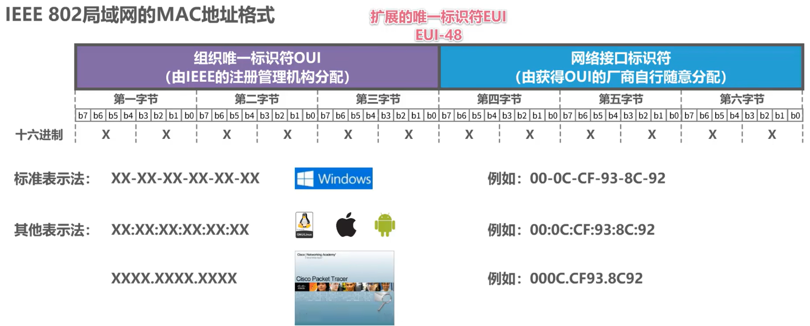

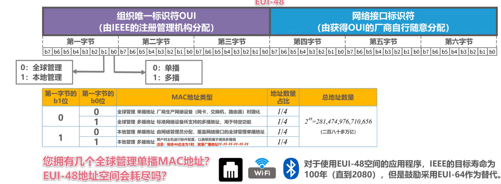

+ 快速判断是单播地址还是多播地址的方法：如果第一个字节对应的16进制数是偶数，则为单播地址；若是奇数，则为多播地址。（==偶单奇多==）

##### 7.1.3 MAC地址的发送顺序

+ 字节发送顺序：第一字节——>第六字节
+ 每个字节内的比特发送顺序：$b_0——>b_7$


#### 7.2 IP地址

> IP地址是TCP/IP体系结构中网际层所使用的地址。（网际层范畴）

##### 7.2.1 概述

IP地址是因特网上的主机和路由器所使用的地址，用于标识两部分信息：

+ 网络编号：标识因特网上数以百万计的网络。
+ 主机编号：标识**同一网络上**的不同主机或路由器各接口。

##### 7.2.2 MAC和IP的使用规则

+ 若是一个不接入因特网的单独网络，则可以只使用MAC地址，但这不是一般用户的应用方式。
+ 若主机所在网络需要接入因特网，则必须同时使用MAC地址和IP地址。

##### 7.2.3 数据包转发过程中IP和MAC的变化情况

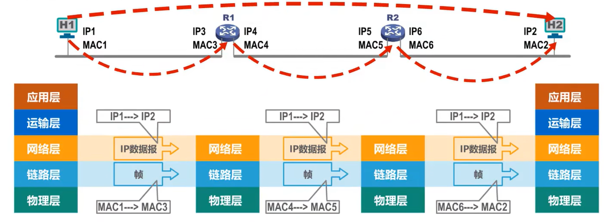

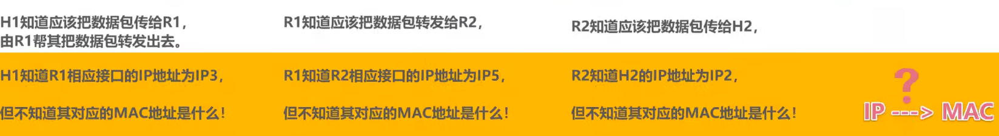

+ 数据包转发过程中源IP地址和目的IP地址始终保持不变。
+ 数据包转发过程中源MAC地址和目的MAC地址逐个链路或逐个网络改变。


#### 7.3 ARP协议

> ARP地址属于TCP/IP体系结构的网际层，作用是通过已知的IP地址获取设备的MAC地址。（网际层范畴）

##### 7.3.1 工作原理

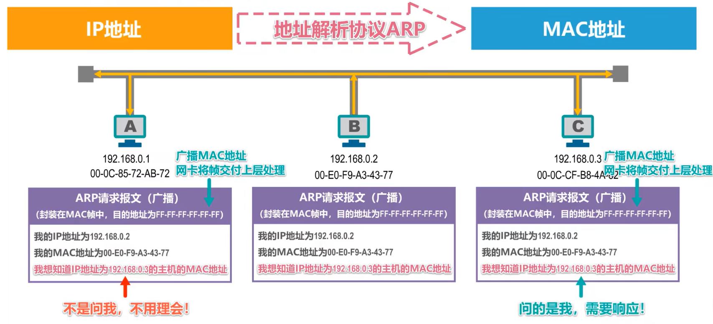

主机C的响应步骤：

1. 将主机B的IP地址与MAC地址记录到自己的ARP高速缓存表中；
2. 给B发送ARP响应，告知自己的MAC地址。

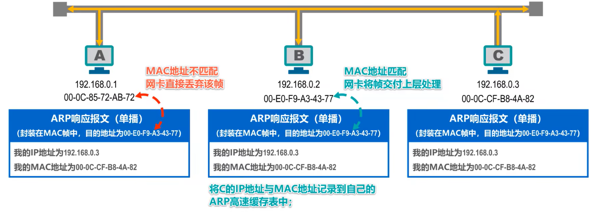

##### 7.3.2 ARP高速缓存表

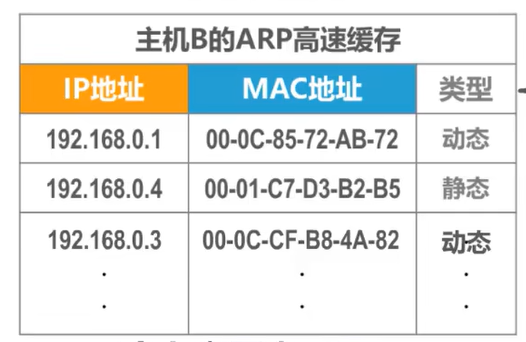

+ 动态：自动获取，生命周期默认为2分钟。
  + 这样做的原因是：**IP地址与MAC地址的对应关系不是永久性的**。例如主机的网卡坏了，更换新的网卡后，MAC地址就会改变，而IP地址保持不变。
+ 静态：手工设置，不同操作系统下的生命周期不同。
  + 例如A操作系统下的生命周期是系统重启后消失，B操作系统下的生命周期则是系统重启后仍然存在。

##### 7.3.3 注意事项

+ ARP协议只能在一段链路上或一个网络内使用，不能跨网络使用。
+ ARP协议没有安全验证机制，存在ARP欺骗（攻击）问题。


#### 8.集线器与交换机的区别

> 由于以太网交换机不仅性能远高于集线器，且价格不贵，所以集线器已逐步被市场淘汰。

##### 8.1 使用双绞线和集线器的星型以太网

+ 使用集线器的以太网在逻辑上仍是一个总线网，各站共享总线资源，使用CSMA/CD协议。
+ 集线器只工作在物理层，它的每个接口仅简单地转发比特，而**不进行碰撞检测**（由各站的网卡检测）。
+ 集线器一般具有少量的容错能力和网络管理功能，例如断开与故障网卡的连线以保证整个以太网的正常工作。

##### 8.2 使用集线器在物理层扩展以太网

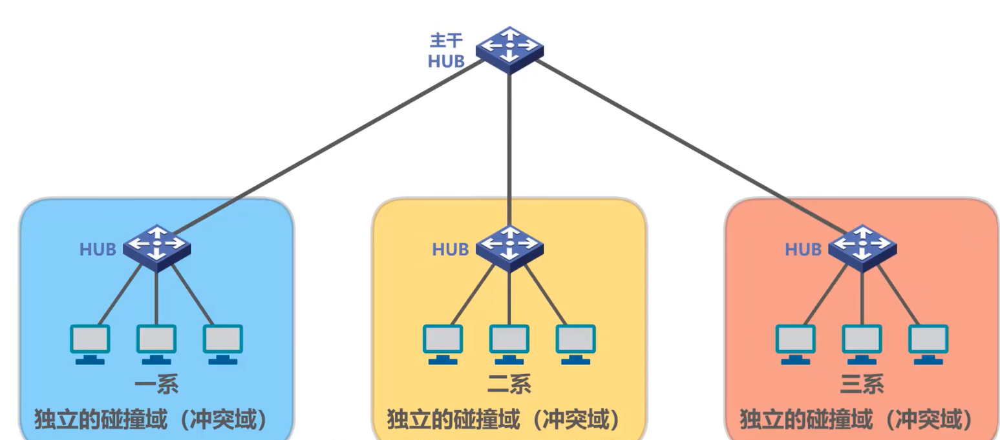

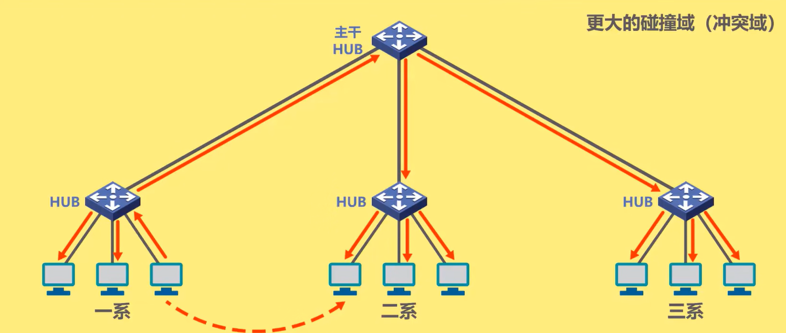

##### 8.3 以太网交换机


以太网交换机的特点：

+ 通常有多个接口。每个接口都可以直接与一台主机或另一个以太网交换机相连。一般都工作在全双工方式。
+ 具有并行性，能同时连通多对接口，使多对主机能同时通信，**无碰撞**（不使用CSMA/CD协议）。
+ 一般具有多种速率的接口。
+ 工作在数据链路层（也包括物理层），它收到帧后，在帧交换表中查找帧的目的MAC地址所对应的接口号，然后通过该接口转发帧。
  + 帧的2种转发方式：存储转发、直通转换（交换时延小但不检查帧是否有差错）。
+ 是一种即插即用的设备，其内部的帧交换表是通过[自学习算法](####9.以太网交换机自学习和转发帧的过程)自动逐步建立起来的。

##### 8.4 对比

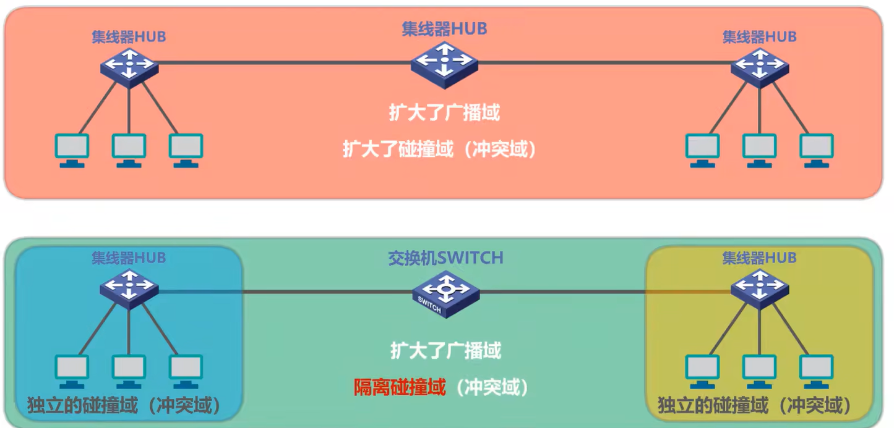


#### 9.以太网交换机自学习和转发帧的过程

以太网交换机刚上电时，其内部的帧交换表是空的，随着网络中各主机间的通信，以太网交换机通过**自学习算法**自动逐步建立起帧交换表。

以下假设各主机已知网络中其他各主机的MAC地址（即忽略ARP过程）。

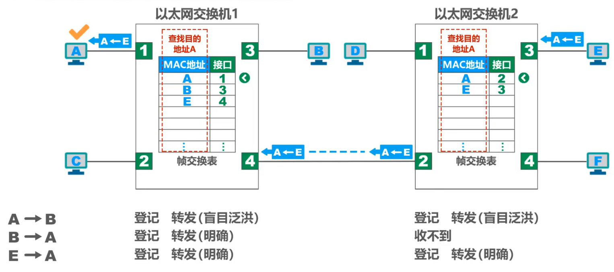

*注：帧交换表中的每条记录都有自己的有效时间，到期会自动删除。这是因为MAC地址与交换机接口的对应关系并不是永久性的。*


#### 10.以太网交换机的生成树协议STP

##### 10.1 问题引入

问题1：若AB链路发生故障，则会导致AB、BC之间均无法通信，只有AC可以正常通信。

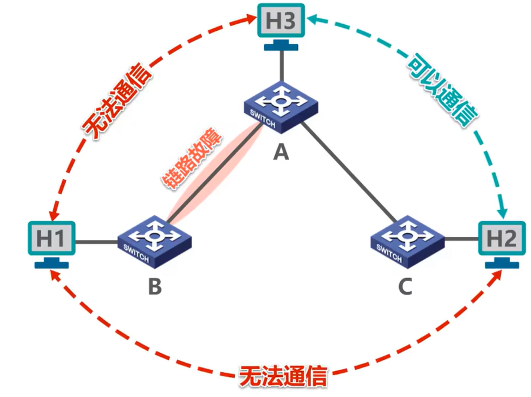

问题2：若AB、AC链路均发生故障，则会导致原来的大以太网分割成三个独立的小以太网，互不通信。


问题3：基于问题1和2，我们想到可以通过添加**冗余链路**的方法来提高以太网的可靠性，但是冗余链路也会带来负面效应——**网络环路**，从而会产生新的问题：**广播风暴**。

H1发送的广播帧将在各交换机之间反复转发，分别按顺时针和逆时针同时兜圈。

+ 广播风暴会消耗大量网络资源，使得网络无法正常转发其他数据帧；
+ 也会使主机收到大量重复的广播帧，消耗大量主机资源
+ 还会使交换机的帧交换表震荡（漂移）。

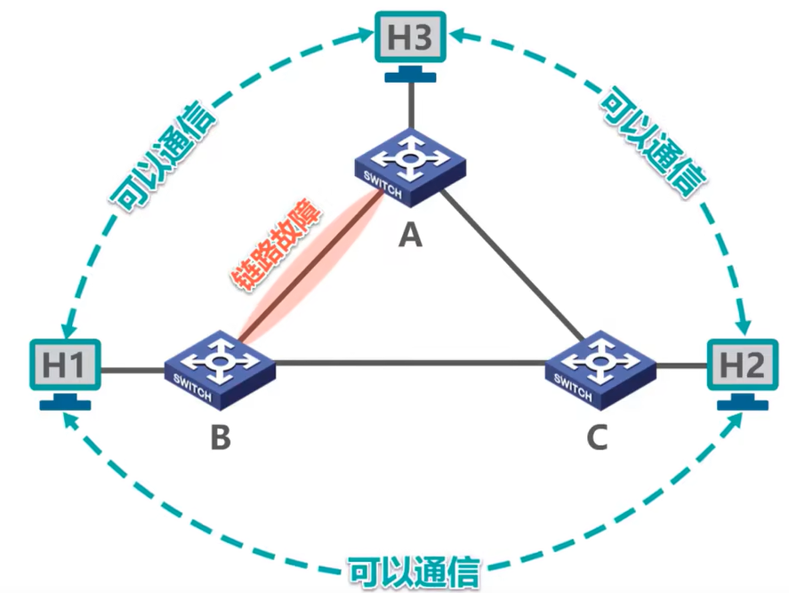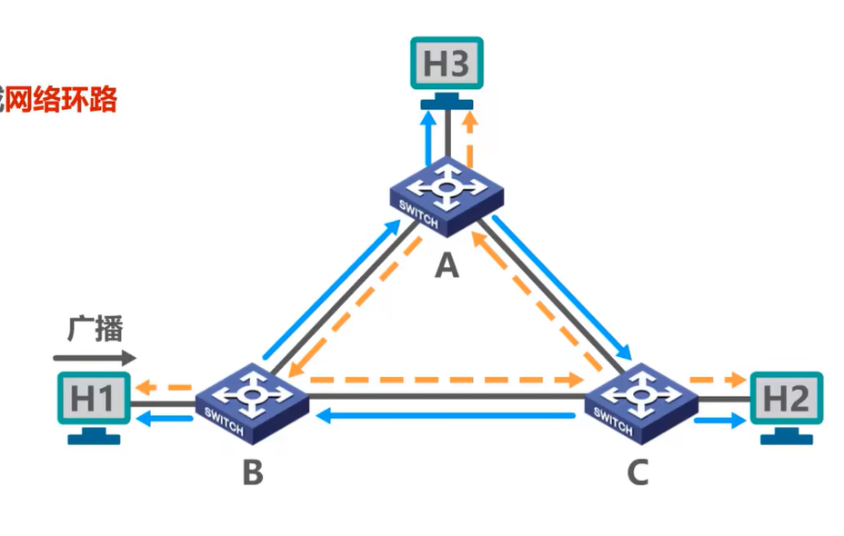


##### 10.2 生成树协议STP

内容：

1. 不论交换机之间采用何种物理连接，交换机都能自动计算并构建一个逻辑上无环路的网络，其逻辑拓扑结构必须是树型的。
2. 最终生成的树型逻辑拓扑结构必须要确保连通整个网络。
3. 当首次连接交换机或网络物理拓扑结构发生变化（有可能是人为改变或故障）时，交换机都将重新计算生成树。

作用：可以在增加冗余链路来提高以太网可靠性的同时，避免网络环路带来的各种问题。

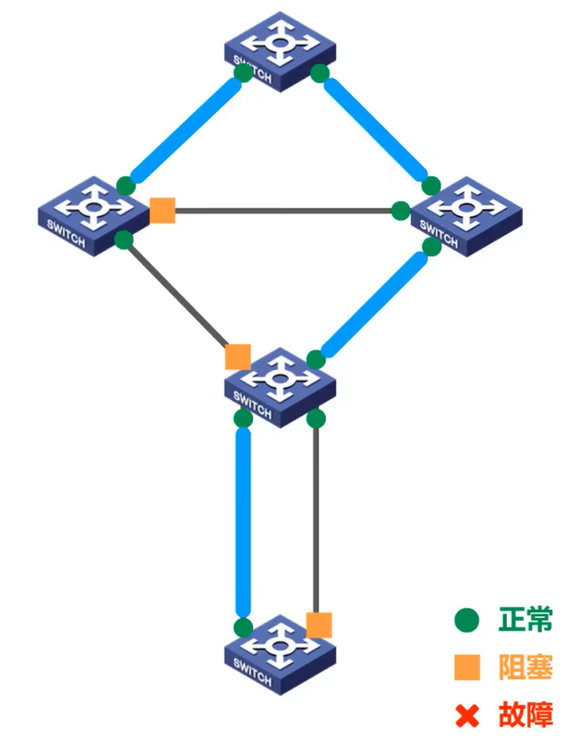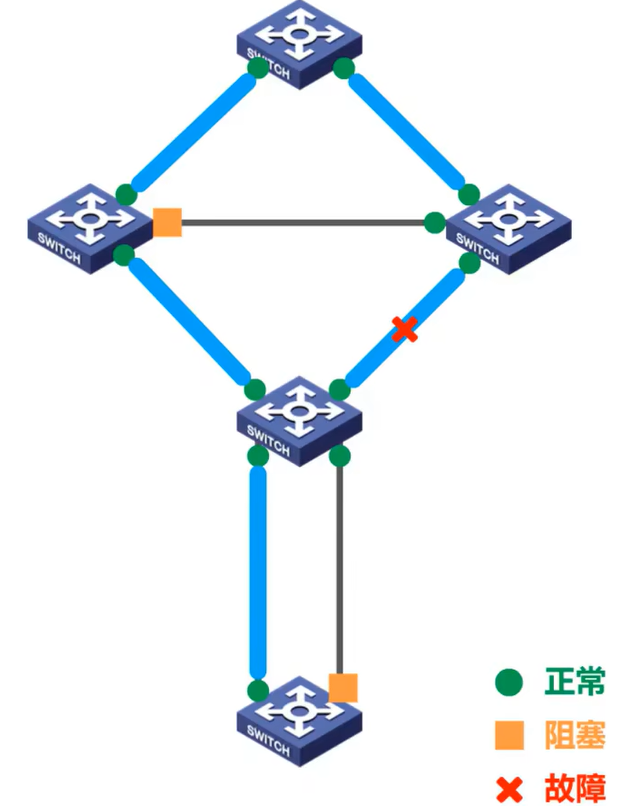


#### 11.1 虚拟局域网VLAN概述

随着交换式以太网规模的扩大，广播域也相应扩大。

但巨大的广播域会带来很多弊端：

+ 广播风暴。
+ 难以管理和维护。
+ 潜在的安全问题。

分割广播域的方法：使用路由器可以隔离广播域（因为路由器工作在网络层，默认情况下不对广播数据包进行转发）。

然而路由器成本较高，因此虚拟局域网VLAN应运而生。

VLAN是一种将局域网内的设备划分成与物理位置无关的逻辑组的技术，这些逻辑组具有某些共同的需求。


#### 11.2 虚拟局域网VLAN的实现机制

##### 11.2.1 IEEE 802.1 Q帧（Dot One Q帧）

###### 1.VLAN标识符VID

IEEE 802.1 Q帧对以太网的MAC帧格式进行了扩展，插入了4字节的VLAN标记。


VLAN标记的最后12bit称为VLAN标识符VID，它唯一标识了该以太网MAC帧属于哪一个VLAN。

+ VID的取值范围是0~4095$(2^{12}-1)$。
+ 0和4095都不用来表示VLAN，因此用于表示VLAN的VID的有效取值范围是1~4094。

###### 2.打标签与去标签

802.1 Q帧是由交换机来处理的，而不是用户主机来处理的。

+ 当交换机收到普通的MAC帧时，会插入4字节的VLAN标记使之变为802.1 Q帧，简称“打标签”。
+ 当交换机转发802.1 Q帧时，可能会删除其4字节的VLAN标记使之变为普通的MAC帧，简称“去标签”。

##### 11.2.2 交换机的端口类型

###### 1.交换机各端口的缺省VLAN ID

+ 在思科交换机上称为Native VLAN，即本征VLAN。
+ 在华为交换机上称为Port VLAN ID，即端口VLAN ID，简记为PVID。

###### 2.三种端口类型

*a*.Access：

+ 一般用于连接用户计算机。

+ 只能属于一个VLAN。

+ 其PVID值与端口所属VLAN的ID相同（默认为1）。

+ Access端口接收处理方法：

  一般只接收普通MAC帧，根据接收帧的PVID给接收帧打标签，即插入4字节VLAN标记字段，字段中的VID等于接收帧的PVID。

+ Access端口发送处理方法：

  若目的端口的PVID等于待发送帧的VID，则去标签并转发该帧，否则不转发。

*b*.Trunk

+ 一般用于交换机之间或交换机与路由之间的互连。
+ 可以属于多个VLAN。
+ 用户可以设置Trunk端口的PVID值（默认为1）。
+ Trunk端口接收处理方法：
  + 若接收普通MAC帧，则根据该帧的PVID给其打标签，即插入4字节的VLAN标记字段，字段中的VID等于该帧的PVID；
  + 若接收“已打标签”的MAC帧，则不作其他任何操作，直接接收。
+ Trunk端口发送处理方法：
  + 对VID等于PVID的帧，去标签后转发；
  + 对VID不等于PVID的帧，直接转发。
+ 在由多个交换机互连而成的交换式以太网中划分VLAN时，连接主机的交换机端口应设置为Access类型，交换机之间互连的端口应设置为Trunk类型。

*c*.Hybrid（华为交换机独有的端口类型）

+ 既可用于交换机之间或交换机与路由之间的互连（同Trunk），也可用于交换机与用户计算机之间的互连（同Access）。

+ 可以属于多个VLAN。

+ 用户可以设置Hybrid端口的PVID值（默认为1）。

+ Hybrid端口接收处理方法：同Trunk。

+ Hybrid端口发送处理方法：（==与Trunk不同==）

  查看待发送帧的VID是否在端口的去标签列表中：

  + 若是，则去标签后转发；
  + 若否，则直接转发。


---


### Chapter4  网络层

> 解决分组在多个网络上传输（路由）的问题。


---


### Chapter5  运输层

> 解决进程之间基于网络的通信问题。


---


### Chapter6  应用层

> 解决通过应用进程的交互来实现特定网络应用的问题。

