# 1-MySQL-Basic

> 鸣谢：黑马程序员。（【黑马程序员 MySQL数据库入门到精通，从mysql安装到mysql高级、mysql优化全囊括】https://www.bilibili.com/video/BV1Kr4y1i7ru?vd_source=b7f14ba5e783353d06a99352d23ebca9）
>
> 


## 一、概述

### 1.数据库相关概念

|        中文名        |                    英文名                    |                             说明                             |
| :------------------: | :------------------------------------------: | :----------------------------------------------------------: |
|        数据库        |                 DataBase(DB)                 |                   有组织地存储数据的仓库。                   |
|     关系型数据库     |           Relational DataBase(RDB)           | 是基于关系模型，由多张通过主键和外键相互连接的二维表组成的数据库。 |
|    数据库管理系统    |       DataBase Managememt System(DBMS)       |                 操纵和管理数据库的大型软件。                 |
| 关系型数据库管理系统 | Reletional DataBase Managememt System(RDBMS) | 是实现关系型数据库功能的软件系统，负责数据的存储、管理、查询和安全控制。 |
|    结构化查询语言    |        Structured Query Language(SQL)        | 操作**关系型**数据库的编程语言，定义了一套操作关系型数据库的统一标准。 |


### 2.MySQL数据模型


---

---


## 二、SQL

### 1.SQL通用语法

+ SQL语句可以单行或多行书写，以分号结尾。
+ SQL语句可以使用空格/缩进来增强语句的可读性。
+ MySQL的SQL语句不区分大小写，关键字建议使用大写。
+ **注释**：
  + 单行注释： `--`或`#`，后者为MySQL特有。
  + 多行注释：`/* */`。


### 2.SQL分类

| 名称 |          英文全称          |                           说明                           |
| :--: | :------------------------: | :------------------------------------------------------: |
| DDL  |  Data Definition Language  |  数据定义语言，用于定义数据库对象（数据库、表、字段）。  |
| DML  | Data Manipulation Language |   数据操作语言，用于对数据库表中的数据进行增、删、改。   |
| DQL  |    Data Query Language     |         数据查询语言，用于查询数据库中表的记录。         |
| DCL  |   Data Control Language    | 数据控制语言，用于创建数据库用户，控制数据库的访问权限。 |


---


### 3.MySQL数据类型

#### 3.1 数值类型

|    类型     | 大小 |          说明          |
| :---------: | :--: | :--------------------: |
|   tinyint   |  1B  |       微小整数值       |
|  smallint   |  2B  |        小整数值        |
|  mediumint  |  3B  |        中整数值        |
| int/integer |  4B  |         整数值         |
|   bigint    |  8B  |        大整数值        |
|    float    |  4B  |     单精度浮点数值     |
|   double    |  8B  |     双精度浮点数值     |
|   decimal   |  -   | 小数值（精确的定点数） |


#### 3.2 字符串类型

> [!Tip]
>
> char的性能相比varchar会更高一些。

|    类型    |     大小     |             说明              |
| :--------: | :----------: | :---------------------------: |
|    char    |    0-255B    | **定长**字符串 (需要指定长度) |
|  varchar   |   0-65535B   | **变长**字符串 (需要指定长度) |
|  tinyblob  |    0-255B    |    二进制形式的短文本数据     |
|  tinytext  |    0-255B    |          短文本数据           |
|    blob    |   0-65535B   |     二进制形式的文本数据      |
|    text    |   0-65535B   |           文本数据            |
| mediumblob | 0 ~ 2^24-1 B | 二进制形式的中等长度文本数据  |
| mediumtext | 0 ~ 2^24-1 B |       中等长度文本数据        |
|  longblob  | 0 ~ 2^32-1 B |   二进制形式的极大文本数据    |
|  longtext  | 0 ~ 2^32-1 B |         极大文本数据          |


#### 3.3 日期时间类型

|   类型    | 大小 |                    范围                    |        格式         |           说明           |
| :-------: | :--: | :----------------------------------------: | :-----------------: | :----------------------: |
|   date    |  3B  |          1000-01-01 至 9999-12-31          |     YYYY-MM-DD      |          日期值          |
|   time    |  3B  |          -838:59:59 至 838:59:59           |      HH:MM:SS       |     时间值或持续时间     |
|   year    |  1B  |                1901 至 2155                |        YYYY         |          年份值          |
| datetime  |  8B  | 1000-01-01 00:00:00 至 9999-12-31 23:59:59 | YYYY-MM-DD HH:MM:SS |     混合日期和时间值     |
| timestamp |  4B  | 1970-01-01 00:00:01 至 2038-01-19 03:14:07 | YYYY-MM-DD HH:MM:SS | 混合日期和时间值，时间戳 |


---


### 4.DDL

#### 4.1 数据库操作

```mysql
-- 查询所有数据库
show databases;
-- 查询当前数据库
select database();
-- 创建数据库
create database [if not exists] 数据库名 [default charset 字符集] [collate 排序规则];
-- 删除数据库
drop database [if exists] 数据库名;
-- 切换数据库
use 数据库名;
```


---


#### 4.2 表操作

##### 4.2.1 查询

```mysql
-- 查询当前数据库所有表
show tables;
-- 查看指定表结构：包括字段、字段类型、是否可以为Null，是否存在默认值等信息
desc 表名;
-- 查询指定表的建表语句
show create table 表名;
```


##### 4.2.2 创建

```mysql
create table 表名(
    字段1 字段1类型 [comment '字段1注释'] [约束],
    字段2 字段2类型 [comment '字段2注释'] [约束],
    ...
    字段n 字段n类型 [comment '字段n注释'] [约束]
) [comment '表注释'] ;
```


##### 4.2.3 修改

```mysql
-- 添加字段
alter table 表名 add 字段名 字段类型（长度） [comment '注释'] [约束];
-- 修改字段类型
alter table 表名 modify 字段名 新字段类型（长度）;
-- 修改字段名和字段类型
alter table 表名 change 旧字段名 新字段名 新字段类型（长度） [comment '注释'] [约束];
-- 删除字段
alter table 表名 drop 字段名;
-- 修改表名
alter table 表名 rename to 新表名;
```


##### 4.2.4 删除

```mysql
-- 删除表
drop table [if exists] 表名;
-- 删除指定表，并重新创建该表
truncate table 表名;
```


---


### 5.DML

#### 5.1 添加记录

> [!CAUTION]
>
> + 插入记录时，值的顺序需要与指定的字段顺序一一对应。
> + 字符串和日期型字段值应该包含在引号中。
> + 插入记录的字段值长度应该在字段的规定范围内。

```mysql
-- 添加包含指定字段值的记录
insert into 表名 (字段名1, 字段名2, ...) values (值1, 值2, ...); 
-- 添加包含全部字段值的记录
insert into 表名 values (值1, 值2, ...);

-- 批量添加包含指定字段值的记录
insert into 表名 (字段名1, 字段名2, ...) values (值1, 值2, ...), (值1, 值2, ...), (值1, 值2, ...);
-- 批量添加包含全部字段值的记录
insert into 表名 values (值1, 值2, ...), (值1, 值2, ...), (值1, 值2, ...);
```


#### 5.2 修改与删除记录

```mysql
-- 修改记录
update 表名 set 字段名1 = 值1 , 字段名2 = 值2 , .... [where 条件];
-- 删除记录
delete from 表名 [where 条件];
```


---


### 6.DQL

#### 6.1 基本语法

```mysql
select 字段列表
from 表名列表
where 条件列表
group by 分组字段列表
having 分组后条件列表
order by 排序字段列表
limit 分页参数;
```


#### 6.2 基本查询

```mysql
-- 查询包含全部字段值的记录
select * from 表名;
-- 查询包含指定字段值的记录
select 字段1, 字段2, ... from 表名;
-- 给字段设置别名
select 字段1 [as 别名1] , 字段2 [as 别名2] ... from 表名;
select 字段1 [别名1] , 字段2 [别名2] ... from 表名;
-- 去除重复记录
select distinct 去重字段, 字段1, 字段2, ... from 表名;
```


#### 6.3 条件查询-`where`

##### P1 语法

```mysql
select 字段列表 from 表名 where 条件列表;
```

##### P2 比较运算符

|        比较运算符        |                    功能                    |
| :----------------------: | :----------------------------------------: |
|            >             |                    大于                    |
|            >=            |                  大于等于                  |
|            <             |                    小于                    |
|            <=            |                  小于等于                  |
|            =             |                    等于                    |
|         <> 或 !=         |                   不等于                   |
|  `between ... and ...`   |         在某个范围之内（含边界值）         |
|        `in (...)`        |            in后列表中的值多选一            |
| `like '占位符xxx占位符'` | 模糊匹配（_匹配单个字符，%匹配任意个字符） |
|        `is null`         |                    为空                    |

##### P3 逻辑运算符

| 逻辑运算符 | 功能 |
| :--------: | :--: |
| `and`/`&&` | 并且 |
| `or`/`||`  | 或者 |
| `not`/`!`  | 不是 |


---


#### 6.4 聚合函数-`count、max、min、avg、sum`

> [!Tip]
>
> 将一列数据作为一个整体，进行纵向计算。null值不参与所有聚合函数的运算。

```mysql
select 聚合函数(字段列表) from 表名;
```


#### 6.5 排序查询-`order by`

+ 排序方式：ASC升序（默认值），DESC降序。
+ 如果是升序, 可以不指定排序方式ASC。
+ 如果是多字段排序，当第一个字段值相同时，才会根据第二个字段进行排序 。

```mysql
select 字段列表 from 表名 order by 字段1 排序方式1 , 字段2 排序方式2;
```


#### 6.6 分页查询-`limit`

+ 注意：起始索引从0开始，起始索引=（查询页码-1）* 每页显示记录数。
+ 如果查询的是第一页数据，起始索引可以省略，直接简写为`limit 查询记录数`。

```mysql
select 字段列表 from 表名 limit 查询记录数 offset 起始索引;
select 字段列表 from 表名 limit 起始索引, 查询记录数;
```


#### 6.7 分组查询-`group by + having`

##### P1 语法

```mysql
select 字段列表 from 表名 [where 条件] group by 分组字段名 [having 分组后过滤条件];
```

##### P2 `where`与`having`的区别

|   区别   |                       `where`                       |        `having`        |
| :------: | :-------------------------------------------------: | :--------------------: |
| 执行时机 | 分组之前进行过滤，不满足`where`条件的记录不参与分组 | 分组之后对结果进行过滤 |
| 判断条件 |               不能对聚合函数进行判断                | 可以对聚合函数进行判断 |

##### P3 注意事项

+ **执行顺序**：`where->聚合函数->having`。
+ 分组之后，查询的字段一般为聚合字段和分组字段，查询其他字段没有意义。


---


#### 6.8 DQL语句的执行顺序


---


### 7.DCL

#### 7.1 管理用户

+ 主机名可以使用%通配。
+ DCL语句开发人员较少使用，主要是DBA（DataBase Administrator：数据库管理员）使用。

```mysql
-- 查询用户
use mysql;
select * from user;
-- 创建用户
create user '用户名'@'主机名' identified by '密码';
-- 修改用户密码
alter user '用户名'@'主机名' identified with mysql_native_password by '密码';
-- 删除用户
drop user '用户名'@'主机名';
```


#### 7.2 权限控制

##### P1 常用权限

|      常用权限       |        说明        |
| :-----------------: | :----------------: |
| ALL, ALL PRIVILEGES |      所有权限      |
|       SELECT        |      查询数据      |
|       INSERT        |      插入数据      |
|       UPDATE        |      修改数据      |
|       DELETE        |      删除数据      |
|        ALTER        |       修改表       |
|        DROP         | 删除数据库/表/视图 |
|       CREATE        |   创建数据库/表    |

##### P2 语法

+ 多个权限之间，使用逗号分隔。
+ 授权时， 数据库名和表名可以使用*进行通配，代表所有。

```mysql
-- 查询权限
show grants for '用户名'@'主机名';
-- 授予权限
grant 权限列表 on 数据库名.表名 to '用户名'@'主机名';
-- 撤销权限
revoke 权限列表 on 数据库名.表名 from '用户名'@'主机名';
```


---

---


## 三、函数

### 1.字符串函数

| 函数                       | 功能                                         |
| :------------------------- | -------------------------------------------- |
| `concat(s1,s2,...,sn)`     | 将s1，s2，...，sn拼接成一个字符串。          |
| `lower(str)`               | 将字符串str全部转小写。                      |
| `upper(str)`               | 将字符串str全部转大写。                      |
| `lpad(str,n,pad)`          | 用字符串pad对str的左边填充，直到str长度为n。 |
| `rpad(str,n,pad)`          | 用字符串pad对str的右边填充，直到str长度为n。 |
| `trim(str)`                | 去除字符串str头部和尾部的空格。              |
| `substring(str,start,len)` | 返回字符串str从start位置起，长len的子串。    |


### 2.数值函数

| 函数         | 功能                   |
| :----------- | ---------------------- |
| `ceil(x)`    | 向上取整。             |
| `floor(x)`   | 向下取整。             |
| `mod(x,y)`   | 返回x/y的余数。        |
| `rand()`     | 返回0~1内的随机数。    |
| `round(x,y)` | 将x四舍五入到y位小数。 |


### 3.日期函数

| 函数                                 | 功能                                                         |
| :----------------------------------- | ------------------------------------------------------------ |
| `curdate()`                          | 返回当前日期。                                               |
| `curtime()`                          | 返回当前时间。                                               |
| `now()`                              | 返回当前日期时间。                                           |
| `year(date)`                         | 获取指定date的年。                                           |
| `month(date)`                        | 获取指定date的月。                                           |
| `day(date)`                          | 获取指定date的日。                                           |
| `DATE_ADD(date, INTERVAL expr unit)` | date: 要操作的日期；expr: 添加的时间间隔值；unit: 时间单位，如 DAY、MONTH、YEAR等。返回一个日期加上一个时间间隔后的日期。 |
| `datediff(date1,date2)`              | 返回date1和date2间隔的天数。                                 |


### 4.流程函数

#### P1 `if(value,t,f)`

如果value为true，则返回t，否则返回f（t和f可以是任意类型的数据）。

#### P2 `ifnull(value1,value2)`

如果value1为空，则返回value2，否则正常返回value1。

#### P3 `case`语句

```mysql
case 字段
	when value1 then res1
	when value2 then res2
	...
	else default_res
end
```

如果字段值value1为true，返回res1；如果字段值value2为true，返回res2；...；其他情况下返回default_res。

---

```mysql
case 
	when condition1 then res1
	when condition2 then res2
	...
	else default_res
end
```

如果条件表达式condition1为true，返回res1；如果条件表达式condition2为true，返回res2；...；其他情况下返回default_res。


---

---


## 四、约束

> [!TIP]
>
> 约束是作用于表中字段的规则，用于限制存储在表中的数据格式，从而保证数据库中数据的正确性、有效性和完整性。

### 1.分类

|           约束            |      关键字      |                            说明                            |
| :-----------------------: | :--------------: | :--------------------------------------------------------: |
|         非空约束          |    `not null`    |                 限制该字段的值不能为null。                 |
|         唯一约束          |     `unique`     |           保证该字段的所有值都是唯一、不重复的。           |
|         主键约束          |  `primary key`   |         主键是一条记录的唯一标识，要求非空且唯一。         |
|         外键约束          |  `foreign key`   | 用于让两张表的记录之间建立连接，保证数据的一致性和完整性。 |
|         默认约束          |    `default`     |   保存记录时，如果未指定记录中该字段的值，则采用默认值。   |
|         自增约束          | `auto increment` |       在新记录插入表中时通过自增生成一个唯一的数字。       |
| 检查约束（MySQL 8.0.16+） |     `check`      |               保证该字段的值满足某一个条件。               |


### 2.外键约束

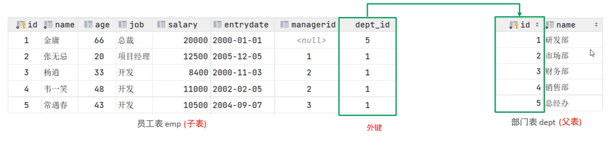

#### 2.1 语法

```mysql
-- 添加外键
-- 方式一：建表时就添加外键
create table 表名(
	字段名 字段类型,
    ...
    [constraint 外键名称] foreign key(外键字段名) references 父表（父表字段名）
);

-- 方式二：后续根据需要修改表结构
alter table add constraint 外键名称 foreign key(外键字段名) references 父表（父表字段名）;


-- 删除外键
alter table 表名 drop foreign key 外键名称;
```


#### 2.2 删除/更新行为

添加外键之后，在删除父表记录时产生的约束行为，我们称之为删除/更新行为。主要有以下几种：

|    行为     |                             说明                             |
| :---------: | :----------------------------------------------------------: |
|  NO ACTION  | **默认行为**：当在父表中删除/更新对应记录时，首先检查该记录是否有对应外键，如果有则不允许删除/更新。 |
|  RESTRICT   | **默认行为**：当在父表中删除/更新对应记录时，首先检查该记录是否有对应外键，如果有则不允许删除/更新。（与NO ACTION一致） |
|   CASCADE   | 当在父表中删除/更新对应记录时，首先检查该记录是否有对应外键，如果有，则同步删除/更新外键在子表中的记录。 |
|  SET NULL   | 当在父表中删除对应记录时，首先检查该记录是否有对应外键，如果有则设置子表中外键值为null（前提是该外键没有非空约束）。 |
| SET DEFAULT | 父表有变更时，子表将外键列设置成一个默认的值（InnoDB不支持） |

具体语法如下：

```mysql
alter table 表名 
	add constraint 外键名称 foreign key(外键字段名) references 父表（父表字段名）
	on update 更新行为 on delete 删除行为;
```


---

---


## 五、多表查询

### 1.多表关系

由于业务之间相互关联，所以各个表结构之间也存在着各种联系，大致可以分为以下三种：

#### 1.1 一对多（多对一）

+ **举例**：部门与员工的关系是一对多，一个部门对应多个员工。

+ **实现**：在多的一方建立外键，指向一的一方的主键。

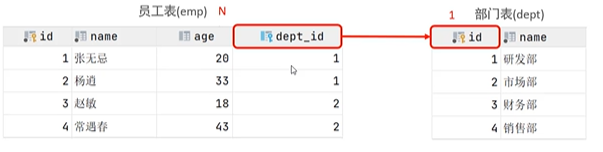

#### 1.2 多对多

+ **举例**：学生与课程的关系是多对多，一个学生可以选修多门课程，一门课程也可以供多个学生选择。
+ **实现**：建立第三张表（中间表），中间表至少包含两个外键，分别关联双方的主键。

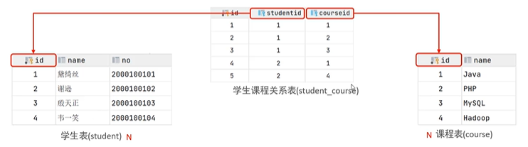

#### 1.3 一对一

+ **举例**：用户与用户详情的关系是一对一，一个用户和一个用户详情一一对应。
+ **应用场景**：常用于单表拆分，将一张表的核心字段保留，其他字段放在另一张表中，以提升操作效率。
+ **实现**：在任意一方加入外键，设置外键是**唯一**的，关联另一方的主键。

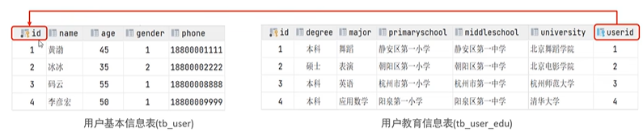


---


### 2.多表查询概述

#### 2.1 笛卡尔积

+ **笛卡尔积**：是指两个集合之间所有可能有序对的集合，其中每个有序对的第一个元素来自集合A，第二个元素来自集合B。
+ 在多表查询中，我们需要消除笛卡尔积中无效的有序对。

#### 2.2 多表查询分类

+ **连接查询**：
  + **内连接**：相当于查询A、B交集部分的记录。
  + **外连接**：
    + 左外连接：查询左表所有记录，以及两张表交集部分的记录。
    + 右外连接：查询右表所有记录，以及两张表交集部分的记录。
  + **自连接**：当前表与自身的连接查询，自连接必须使用表别名。
+ **子查询**：嵌套在查询中的查询。

#### 2.3 表别名

```mysql
table1 as 别名1, table2 as 别名2;
table1 别名1, table2 别名2;
```

一旦为表起了别名，就只能使用表别名而不能使用表名来指定字段，否则报错。

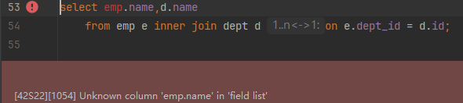


---


### 3.内连接

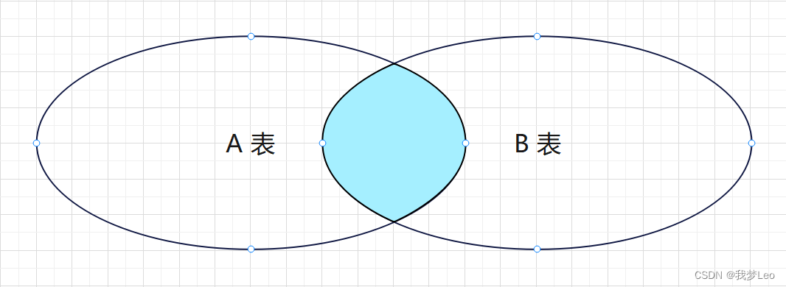

*图源*：https://blog.csdn.net/m0_50513629/article/details/138345063?fromshare=blogdetail&sharetype=blogdetail&sharerId=138345063&sharerefer=PC&sharesource=2401_83600210&sharefrom=from_link

```mysql
-- 隐式内连接
select 字段列表 from 表1, 表2 where 条件列表;
-- 显式内连接
select 字段列表 from 表1 [inner] join 表2 on 连接条件列表;
```


### 4.外连接

左外连接：

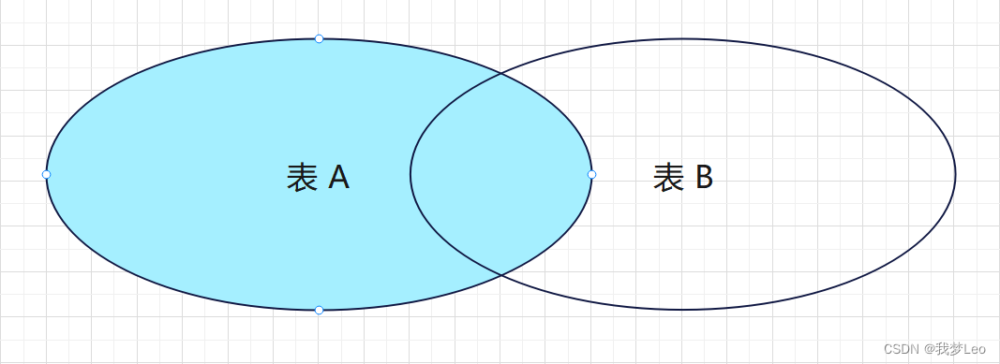

右外连接：

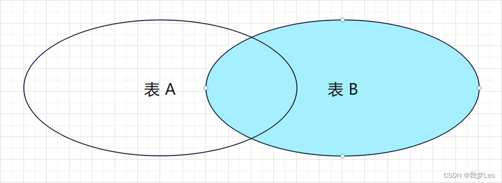

*以上图源*：https://blog.csdn.net/m0_50513629/article/details/138345063?fromshare=blogdetail&sharetype=blogdetail&sharerId=138345063&sharerefer=PC&sharesource=2401_83600210&sharefrom=from_link

```mysql
-- 左外连接
select 字段列表 from 表1 left [outer] join 表2 on 条件列表; 
-- 右外连接
select 字段列表 from 表1 right [outer] join 表2 on 条件列表; 
```


---


### 5.自连接

#### 5.1 自连接查询

自连接就是自己连接自己，自连接查询可以是内连接查询，也可以是外连接查询。

在自连接查询中，必须要为表起别名，否则我们不清楚所指定的条件、返回的字段，到底是针对哪一张表。

```mysql
select 字段列表 from 表1 别名1 join 表2 别名2 on 条件列表;
```


#### 5.2 联合查询

联合查询就是把多次查询的结果合并起来，形成一个新的查询结果集。

对于联合查询的多张表的列数必须保持一致，字段类型也需要保持一致，否则会报错。

```mysql
-- union all会将全部的数据直接合并在一起，union会对合并之后的数据去重
select 字段列表 from 表1 ...
union [all]
select 字段列表 from 表2 ...;
```


---


### 6.子查询

> [!Tip]
>
> SQL语句中嵌套select语句，称为嵌套查询，又称子查询。

#### 6.1 语法

```mysql
select/insert/update/delete... 表1 where 字段 = (
	select 字段 from 表2
);
```

#### 6.2 分类

根据子查询结果的不同，可分为：

+ 标量子查询：子查询结果为单个值（数字、字符串、日期等）。
+ 列子查询：子查询结果为一列。
+ 行子查询：子查询结果为一行。
+ 表子查询：子查询结果为多行多列。

根据子查询位置的不同，可分为：

+ `where`之后的子查询
+ `from`之后的子查询
+ `select`之后的子查询


---


#### 6.3 标量子查询

示例如下：

```mysql
-- 查询销售部所有员工的信息
select * from emp where dept_id=(
    select id from dept where name='销售部'
);

-- 查询在方东白入职之后的员工信息
select * from emp where entrydate>(
    select entrydate from emp where name='方东白'
);
```


#### 6.4 列子查询

##### P1 常用操作符

|  操作符  |                             说明                             |
| :------: | :----------------------------------------------------------: |
|   `in`   |                     在指定范围内多选一。                     |
| `not in` |                       不在指定范围内。                       |
|  `any`   | 子查询返回的列中，有任意一行（即任意一个字段值）满足要求即可。 |
|  `some`  |               与`any`等同，功能上无任何区别。                |
|  `all`   |   子查询返回的列中，所有行（即所有字段值）都必须满足要求。   |

##### P2 示例

```mysql
-- 查询销售部和市场部的所有员工信息
select * from emp where dept_id in (
    select id from dept where name='销售部' or name='市场部'
);

-- 查询比财务部所有人的工资都高的员工信息
select * from emp where salary > all(
    select salary from emp where dept_id=(
        select id from dept where name='财务部'
    )
);

-- 查询比研发部其中任意一人工资高的员工信息
select * from emp where salary > any(
    select salary from emp where dept_id=(
        select id from dept where name='研发部'
    )
);
```


#### 6.4 行子查询

示例如下：

```mysql
-- 查询与张无忌的薪资及直属领导相同的员工信息
select * from emp where (salary,managerid) = (
    select salary,managerid from emp where name='张无忌'
);
```


#### 6.5 表子查询

常用的操作符是`in`。

示例如下：

```mysql
-- 查询与鹿杖客、宋远桥的职位及薪资相同的员工信息
select * from emp where (job,salary) in (
    select job,salary from emp where name in ('鹿杖客','宋远桥')
);

-- 查询入职日期是2006-01-01之后的员工信息及其部门信息
select * from (select * from emp where entrydate>'2006-01-01') temp
    left join dept on temp.dept_id=dept.id;
```


---

---


## 六、事务

### 1.概述

事务是一组操作的集合，它是一个不可分割的工作单位。事务会把所有操作作为一个整体一起向系统提交或撤销操作，这意味着这些操作要么同时成功，要么同时失败。

比如对于转账操作，我们就需要通过事务来保障它的安全性：在业务逻辑执行之前开启事务，执行完毕后提交事务。如果执行过程中报错，则回滚事务，把数据恢复到事务开始之前的状态。


**注意**：MySQL的事务默认是自动提交的，也就是说，当执行完一条DML语句时，MySQL会立即隐

式地提交事务。


---


### 2.事务操作

#### 2.0 数据准备

```mysql
create table account(
    id int primary key AUTO_INCREMENT comment 'ID',
    name varchar(10) comment '姓名',
    money double(10,2) comment '余额'
) comment '账户表';
insert into account(name, money) VALUES ('张三',2000), ('李四',2000);
```


#### 2.1 未开启事务

##### P1 正常情况

```mysql
-- 转账操作：张三给李四转账1000
-- 1.查询张三账户余额
select money from account where name='张三';
-- 2.如果张三余额大于1000，则将张三余额-1000
update account set money=money-1000 where name='张三' and money>1000;
-- 3.将李四余额+1000
update account set money=money+1000 where name='李四';
```

运行以上三行代码后查看`account`表，可以看到转账成功：

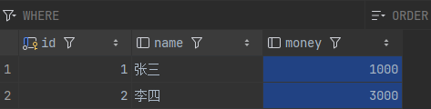

##### P2 异常情况

```mysql
select money from account where name='张三';
update account set money=money-1000 where name='张三' and money>1000;
模拟程序出现异常
update account set money=money+1000 where name='李四';
```

我们把张三和李四的余额都恢复到2000，运行以上三代码后查看`account`表，可以发现转账失败，张三余额减少1000，李四余额却没有增加，这是一个巨大的安全漏洞：

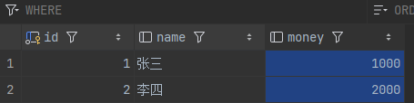


#### 2.2 开启事务

##### P1 方法一

```mysql
-- 查看事务提交方式，设置为手动提交事务
-- 这样我们执行的DML语句都不会提交, 需要手动的执行commit进行提交
select @@autocommit;
set @@autocommit=0;
/*
	此处是业务逻辑代码
*/
-- 执行以上代码，若正常则提交事务
commit;
-- 执行以上代码，若出现异常则回滚事务
rollback;
```

##### P2 方法二

```mysql
-- 开启事务
start transaction或begin;
/*
	此处是业务逻辑代码
*/
-- 执行以上代码，若正常则提交事务
commit;
-- 执行以上代码，若出现异常则回滚事务
rollback;
```


---


### 3.事务的四大特性ACID

+ **原子性(Atomicity)**：事务是不可分割的最小操作单元，要么全部成功，要么全部失败。
+ **一致性(Consitency)**：事务完成时，必须使所有的数据都保持一致状态。
+ **隔离性(Isolation)**：数据库系统提供的隔离机制，保证事务在不受外部并发操作影响的独立环境下运行。
+ **持久性(Durability)**：事务一旦提交或回滚，它对数据库中的数据的改变就是永久的。


### 4.并发事务的三大问题

#### 4.1 脏读

**定义**：一个事务读到另一个事务还未提交的记录。

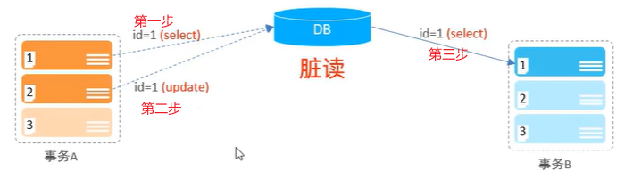

#### 4.2 不可重复读

**定义**：一个事务先后读取同一条记录，但两次读取到的记录内容不同。

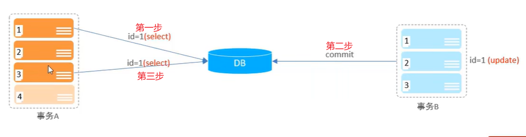

#### 4.3 幻读

**定义**：一个事务按照条件查询记录时，没有对应的记录行，但是在插入记录时又发现这行记录已经存在，好像出现了“幻觉”。

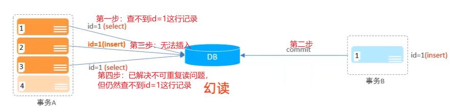


### 5.事务隔离级别

#### 5.1 事务隔离级别

|        隔离级别         | 是否可能脏读 | 是否可能不可重复读 | 是否可能幻读 |
| :---------------------: | :----------: | :----------------: | :----------: |
|    Read Uncommitted     |      ✓       |         ✓          |      ✓       |
|     Read Committed      |      ×       |         ✓          |      ✓       |
| Repeatable Read（默认） |      ×       |         ×          |      ✓       |
|      Serializable       |      ×       |         ×          |      ×       |

隔离级别越高，数据越安全，但SQL性能越差。

#### 5.2 语法

```mysql
-- 查看事务隔离级别
select @@transaction_isolation;
-- 设置事务隔离级别
set session/global transaction isolation level 事务隔离级别;
```


