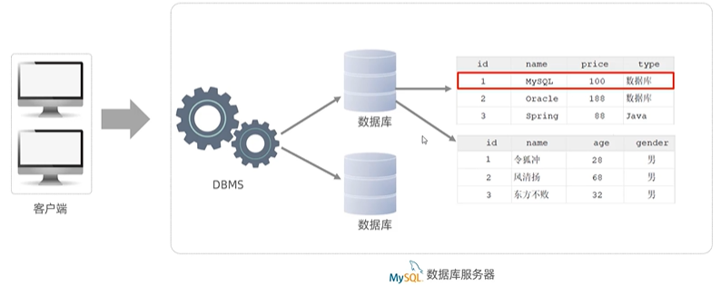
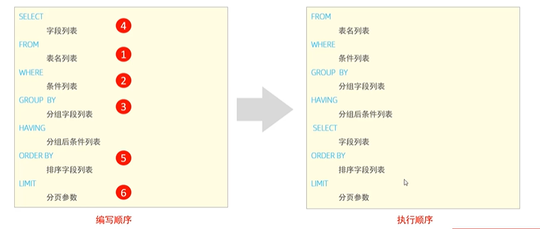

# 1-MySQL-Basic

> 鸣谢：黑马程序员。（【黑马程序员 MySQL数据库入门到精通，从mysql安装到mysql高级、mysql优化全囊括】https://www.bilibili.com/video/BV1Kr4y1i7ru?vd_source=b7f14ba5e783353d06a99352d23ebca9）
>
> 


## 一、概述

### 1.数据库相关概念

|        中文名        |                    英文名                    |                             说明                             |
| :------------------: | :------------------------------------------: | :----------------------------------------------------------: |
|        数据库        |                 DataBase(DB)                 |                   有组织地存储数据的仓库。                   |
|     关系型数据库     |           Relational DataBase(RDB)           | 是基于关系模型，由多张通过主键和外键相互连接的二维表组成的数据库。 |
|    数据库管理系统    |       DataBase Managememt System(DBMS)       |                 操纵和管理数据库的大型软件。                 |
| 关系型数据库管理系统 | Reletional DataBase Managememt System(RDBMS) | 是实现关系型数据库功能的软件系统，负责数据的存储、管理、查询和安全控制。 |
|    结构化查询语言    |        Structured Query Language(SQL)        | 操作**关系型**数据库的编程语言，定义了一套操作关系型数据库的统一标准。 |


### 2.MySQL数据模型




---

---


## 二、SQL

### 1.SQL通用语法

+ SQL语句可以单行或多行书写，以分号结尾。
+ SQL语句可以使用空格/缩进来增强语句的可读性。
+ MySQL的SQL语句不区分大小写，关键字建议使用大写。
+ **注释**：
  + 单行注释： `--`或`#`，后者为MySQL特有。
  + 多行注释：`/* */`。


### 2.SQL分类

| 名称 |          英文全称          |                           说明                           |
| :--: | :------------------------: | :------------------------------------------------------: |
| DDL  |  Data Definition Language  |  数据定义语言，用于定义数据库对象（数据库、表、字段）。  |
| DML  | Data Manipulation Language |   数据操作语言，用于对数据库表中的数据进行增、删、改。   |
| DQL  |    Data Query Language     |         数据查询语言，用于查询数据库中表的记录。         |
| DCL  |   Data Control Language    | 数据控制语言，用于创建数据库用户，控制数据库的访问权限。 |


---


### 3.MySQL数据类型

#### 3.1 数值类型

|    类型     | 大小 |          说明          |
| :---------: | :--: | :--------------------: |
|   tinyint   |  1B  |       微小整数值       |
|  smallint   |  2B  |        小整数值        |
|  mediumint  |  3B  |        中整数值        |
| int/integer |  4B  |         整数值         |
|   bigint    |  8B  |        大整数值        |
|    float    |  4B  |     单精度浮点数值     |
|   double    |  8B  |     双精度浮点数值     |
|   decimal   |  -   | 小数值（精确的定点数） |


#### 3.2 字符串类型

> [!Tip]
>
> char的性能相比varchar会更高一些。

|    类型    |     大小     |             说明              |
| :--------: | :----------: | :---------------------------: |
|    char    |    0-255B    | **定长**字符串 (需要指定长度) |
|  varchar   |   0-65535B   | **变长**字符串 (需要指定长度) |
|  tinyblob  |    0-255B    |    二进制形式的短文本数据     |
|  tinytext  |    0-255B    |          短文本数据           |
|    blob    |   0-65535B   |     二进制形式的文本数据      |
|    text    |   0-65535B   |           文本数据            |
| mediumblob | 0 ~ 2^24-1 B | 二进制形式的中等长度文本数据  |
| mediumtext | 0 ~ 2^24-1 B |       中等长度文本数据        |
|  longblob  | 0 ~ 2^32-1 B |   二进制形式的极大文本数据    |
|  longtext  | 0 ~ 2^32-1 B |         极大文本数据          |


#### 3.3 日期时间类型

|   类型    | 大小 |                    范围                    |        格式         |           说明           |
| :-------: | :--: | :----------------------------------------: | :-----------------: | :----------------------: |
|   date    |  3B  |          1000-01-01 至 9999-12-31          |     YYYY-MM-DD      |          日期值          |
|   time    |  3B  |          -838:59:59 至 838:59:59           |      HH:MM:SS       |     时间值或持续时间     |
|   year    |  1B  |                1901 至 2155                |        YYYY         |          年份值          |
| datetime  |  8B  | 1000-01-01 00:00:00 至 9999-12-31 23:59:59 | YYYY-MM-DD HH:MM:SS |     混合日期和时间值     |
| timestamp |  4B  | 1970-01-01 00:00:01 至 2038-01-19 03:14:07 | YYYY-MM-DD HH:MM:SS | 混合日期和时间值，时间戳 |


---


### 4.DDL

#### 4.1 数据库操作

```mysql
-- 查询所有数据库
show databases;
-- 查询当前数据库
select database();
-- 创建数据库
create database [if not exists] 数据库名 [default charset 字符集] [collate 排序规则];
-- 删除数据库
drop database [if exists] 数据库名;
-- 切换数据库
use 数据库名;
```


---


#### 4.2 表操作

##### 4.2.1 查询

```mysql
-- 查询当前数据库所有表
show tables;
-- 查看指定表结构：包括字段、字段类型、是否可以为Null，是否存在默认值等信息
desc 表名;
-- 查询指定表的建表语句
show create table 表名;
```


##### 4.2.2 创建

```mysql
create table 表名(
    字段1 字段1类型 [comment '字段1注释'] [约束],
    字段2 字段2类型 [comment '字段2注释'] [约束],
    ...
    字段n 字段n类型 [comment '字段n注释'] [约束]
) [comment '表注释'] ;
```


##### 4.2.3 修改

```mysql
-- 添加字段
alter table 表名 add 字段名 字段类型（长度） [comment '注释'] [约束];
-- 修改字段类型
alter table 表名 modify 字段名 新字段类型（长度）;
-- 修改字段名和字段类型
alter table 表名 change 旧字段名 新字段名 新字段类型（长度） [comment '注释'] [约束];
-- 删除字段
alter table 表名 drop 字段名;
-- 修改表名
alter table 表名 rename to 新表名;
```


##### 4.2.4 删除

```mysql
-- 删除表
drop table [if exists] 表名;
-- 删除指定表，并重新创建该表
truncate table 表名;
```


---


### 5.DML

#### 5.1 添加记录

> [!CAUTION]
>
> + 插入记录时，值的顺序需要与指定的字段顺序一一对应。
> + 字符串和日期型字段值应该包含在引号中。
> + 插入记录的字段值长度应该在字段的规定范围内。

```mysql
-- 添加包含指定字段值的记录
insert into 表名 (字段名1, 字段名2, ...) values (值1, 值2, ...); 
-- 添加包含全部字段值的记录
insert into 表名 values (值1, 值2, ...);

-- 批量添加包含指定字段值的记录
insert into 表名 (字段名1, 字段名2, ...) values (值1, 值2, ...), (值1, 值2, ...), (值1, 值2, ...);
-- 批量添加包含全部字段值的记录
insert into 表名 values (值1, 值2, ...), (值1, 值2, ...), (值1, 值2, ...);
```


#### 5.2 修改与删除记录

```mysql
-- 修改记录
update 表名 set 字段名1 = 值1 , 字段名2 = 值2 , .... [where 条件];
-- 删除记录
delete from 表名 [where 条件];
```


---


### 6.DQL

#### 6.1 基本语法

```mysql
select 字段列表
from 表名列表
where 条件列表
group by 分组字段列表
having 分组后条件列表
order by 排序字段列表
limit 分页参数;
```


#### 6.2 基本查询

```mysql
-- 查询包含全部字段值的记录
select * from 表名;
-- 查询包含指定字段值的记录
select 字段1, 字段2, ... from 表名;
-- 给字段设置别名
select 字段1 [as 别名1] , 字段2 [as 别名2] ... from 表名;
select 字段1 [别名1] , 字段2 [别名2] ... from 表名;
-- 去除重复记录
select distinct 去重字段, 字段1, 字段2, ... from 表名;
```


#### 6.3 条件查询-`where`

##### P1 语法

```mysql
select 字段列表 from 表名 where 条件列表;
```

##### P2 比较运算符

|        比较运算符        |                    功能                    |
| :----------------------: | :----------------------------------------: |
|            >             |                    大于                    |
|            >=            |                  大于等于                  |
|            <             |                    小于                    |
|            <=            |                  小于等于                  |
|            =             |                    等于                    |
|         <> 或 !=         |                   不等于                   |
|  `between ... and ...`   |         在某个范围之内（含边界值）         |
|        `in (...)`        |            in后列表中的值多选一            |
| `like '占位符xxx占位符'` | 模糊匹配（_匹配单个字符，%匹配任意个字符） |
|        `is null`         |                    为空                    |

##### P3 逻辑运算符

| 逻辑运算符 | 功能 |
| :--------: | :--: |
| `and`/`&&` | 并且 |
| `or`/`||`  | 或者 |
| `not`/`!`  | 不是 |


---


#### 6.4 聚合函数-`count、max、min、avg、sum`

> [!Tip]
>
> 将一列数据作为一个整体，进行纵向计算。null值不参与所有聚合函数的运算。

```mysql
select 聚合函数(字段列表) from 表名;
```


#### 6.5 排序查询-`order by`

+ 排序方式：ASC升序（默认值），DESC降序。
+ 如果是升序, 可以不指定排序方式ASC。
+ 如果是多字段排序，当第一个字段值相同时，才会根据第二个字段进行排序 。

```mysql
select 字段列表 from 表名 order by 字段1 排序方式1 , 字段2 排序方式2;
```


#### 6.6 分页查询-`limit`

+ 注意：起始索引从0开始，起始索引=（查询页码-1）* 每页显示记录数。
+ 如果查询的是第一页数据，起始索引可以省略，直接简写为`limit 查询记录数`。

```mysql
select 字段列表 from 表名 limit 查询记录数 offset 起始索引;
select 字段列表 from 表名 limit 起始索引, 查询记录数;
```


#### 6.7 分组查询-`group by + having`

##### P1 语法

```mysql
select 字段列表 from 表名 [where 条件] group by 分组字段名 [having 分组后过滤条件];
```

##### P2 `where`与`having`的区别

|   区别   |                       `where`                       |        `having`        |
| :------: | :-------------------------------------------------: | :--------------------: |
| 执行时机 | 分组之前进行过滤，不满足`where`条件的记录不参与分组 | 分组之后对结果进行过滤 |
| 判断条件 |               不能对聚合函数进行判断                | 可以对聚合函数进行判断 |

##### P3 注意事项

+ **执行顺序**：`where->聚合函数->having`。
+ 分组之后，查询的字段一般为聚合字段和分组字段，查询其他字段没有意义。


---


#### 6.8 DQL语句的执行顺序




---


### 7.DCL

#### 7.1 管理用户

+ 主机名可以使用%通配。
+ DCL语句开发人员较少使用，主要是DBA（DataBase Administrator：数据库管理员）使用。

```mysql
-- 查询用户
use mysql;
select * from user;
-- 创建用户
create user '用户名'@'主机名' identified by '密码';
-- 修改用户密码
alter user '用户名'@'主机名' identified with mysql_native_password by '密码';
-- 删除用户
drop user '用户名'@'主机名';
```


#### 7.2 权限控制

##### P1 常用权限

|      常用权限       |        说明        |
| :-----------------: | :----------------: |
| ALL, ALL PRIVILEGES |      所有权限      |
|       SELECT        |      查询数据      |
|       INSERT        |      插入数据      |
|       UPDATE        |      修改数据      |
|       DELETE        |      删除数据      |
|        ALTER        |       修改表       |
|        DROP         | 删除数据库/表/视图 |
|       CREATE        |   创建数据库/表    |

##### P2 语法

+ 多个权限之间，使用逗号分隔。
+ 授权时， 数据库名和表名可以使用*进行通配，代表所有。

```mysql
-- 查询权限
show grants for '用户名'@'主机名';
-- 授予权限
grant 权限列表 on 数据库名.表名 to '用户名'@'主机名';
-- 撤销权限
revoke 权限列表 on 数据库名.表名 from '用户名'@'主机名';
```


---

---


## 三、函数


---

---


## 四、约束


---

---


## 五、多表查询


---

---


## 六、事务


