# 2-MySQL-Advanced

> 鸣谢：黑马程序员。（【黑马程序员 MySQL数据库入门到精通，从mysql安装到mysql高级、mysql优化全囊括】https://www.bilibili.com/video/BV1Kr4y1i7ru?vd_source=b7f14ba5e783353d06a99352d23ebca9）
>
> 

> [!CAUTION]
>
> 注意，在MySQL进阶篇中，本人使用的是Ubuntu 24.04中的MySQL 8.0.45。


## 一、存储引擎

### 1.MySQL体系结构

自上而下分别是连接层、服务层、引擎层、存储层。

+ **连接层**：包含一些客户端和链接服务，主要完成一些类似于连接处理、授权认证及相关的安全方案，服务器也会为安全接入的每个客户端验证它所具有的操作权限。
+ **服务层**：主要完成大多数的核心功能（如SQL接口），并完成缓存查询、SQL分析和优化、部分内置函数的执行。所有跨存储引擎的功能也在这一层实现，比如过程、函数等。
+ **引擎层**：存储引擎负责MySQL中数据的存储和提取，服务器通过API和存储引擎进行通信。不同的存储引擎具备不同功能，我们可以根据需要选择合适的存储引擎。
+ **存储层**：主要是将数据存储在文件系统之上，并完成与存储引擎的交互。

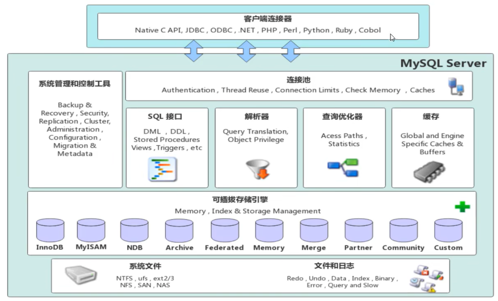


---


### 2.存储引擎简介

+ 存储引擎就是存储数据、建立索引、更新和查询数据等技术的实现方式。
+ 存储引擎是基于表的，而不是基于库的，因此存储引擎也被称为表类型。

#### 2.1 在建表时指定存储引擎

若不指定存储引擎，则：

+ MySQL 5.5起：默认是InnoDB
+ MySQL 5.5之前：默认是MyISAM

```mysql
create table 表名(
	字段1 字段1类型,
    ...
    字段n 字段n类型
)engine=InnoDB;
```


#### 2.2 查看当前数据库支持的存储引擎

```mysql
show engines;
```


---


### 3.存储引擎特点

#### 3.1 InnoDB

+ **介绍**：InnoDB是一种兼顾高可靠性和高性能的通用存储引擎。

+ **特点**：

  + DML操作支持ACID模型，支持==事务==。
  + 支持==行锁==，提高并发访问性能。
  + 支持==外键==约束，保证数据的完整性和正确性。

+ **文件**：

  + `xxx.ibd`：xxx是表名，InnoDB引擎的每张表都会对应这样一个表空间文件，存储该表的表结构（frm、sdi）、数据和索引。
  + 参数：`innodb_file_per_table`。

+ **逻辑存储结构**：

  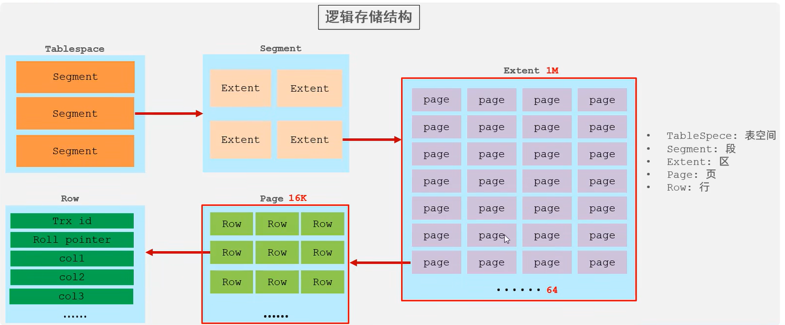


#### 3.2 MyISAM

+ **介绍**：MyISAM是MySQL早期的默认存储引擎。
+ **特点**：
  + 不支持事务，不支持外键。
  + 支持表锁，不支持行锁。
  + 访问速度快。
+ **文件**：
  + `xxx.sdi`：存储表结构信息。
  + `xxx.MYD`：存储数据。
  + `xxx.MYI`：存储索引。


#### 3.3 Memory

+ **介绍**：表数据存储在内存中，由于受到硬件或断电问题的影响，只能将使用Memory引擎的表作为临时表或缓存使用。
+ **特点**：
  + 存放在内存中，访问速度快。
  + 支持显式哈希索引。
+ **文件**：只有`xxx.sdi`这一文件，存储表结构信息。


#### 3.4 总结

|     特点     |      InnoDB       |          MyISAM          |      Memory      |
| :----------: | :---------------: | :----------------------: | :--------------: |
|   存储限制   |       64TB        | 取决于操作系统和文件系统 | 取决于内存和参数 |
|   支持事务   |         ✓         |            ×             |        ×         |
|    锁机制    |       行锁        |           表锁           |       表锁       |
|   支持外键   |         ✓         |            ×             |        ×         |
|  B+tree索引  |         ✓         |            ✓             |        ✓         |
| 显式Hash索引 |         ×         |            ×             |        ✓         |
|   全文索引   | ✓ (MySQL 5.6之后) |            ✓             |        ×         |
| 磁盘空间使用 |        高         |            低            |      不占用      |
|   内存使用   |        高         |            低            |        中        |
| 批量插入速度 |        低         |            高            |        高        |


---


### 4.存储引擎选择

#### 4.1 原则

+ 根据应用系统的特点来选择存储引擎。
+ 对于复杂的应用系统，可以根据实际情况选择多种存储引擎进行组合。

#### 4.2 具体选择

+ InnoDB：应用对于事务的完整性要求较高，在并发条件下要求数据的一致性，数据操作除了插入和查询之外，还包含很多更新和删除操作。
+ MyISAM：
  + 应用以读和插入操作为主，并且对事务的完整性和并发性要求不高。
  + 当今更好的选择是MongoDB。
+ Memory：
  + 将所有数据保存在内存中，访问速度快，通常用于临时表或缓存。缺点是对表的大小有限制，太大的表无法缓存在内存中，而且无法保障数据的安全性。
  + 当今更好的选择是Redis。


---

---


## 二、索引

### 1.概述

+ 除了数据，数据库系统还维护着满足特定查找算法的数据结构，这些数据结构以某种方式引用/指向数据，这样数据库系统就可以基于这些数据结构来实现高级查找算法。

+ 索引(index)就是这样一种有助于MySQL高效获取数据的有序数据结构。

+ **演示**：

  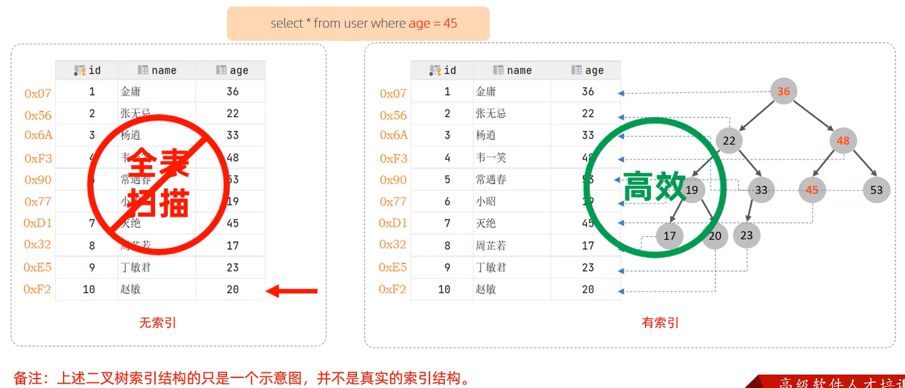

+ **优缺点**：

  |                           优点                            |                             缺点                             |
  | :-------------------------------------------------------: | :----------------------------------------------------------: |
  |        提高数据检索的效率，降低数据库的磁盘IO成本         |                   索引列需要占用一部分空间                   |
  | 通过索引列对数据进行排序，降低数据排序的成本，降低CPU消耗 | 索引大大提高了查询效率，却也降低了更新表的速度，对表进行增删改操作时效率降低 |

  

---


### 2.索引结构

#### 2.1 介绍

MySQL的索引是在存储引擎层实现的，不同的存储引擎有着不同的结构，主要包含以下几种：

+ B+树索引（**默认**）：最常见的索引类型，大部分引擎都支持B+树索引。
+ Hash索引：底层数据结构是用哈希表实现的，只有精确匹配索引列的查询才有效，不支持范围查询。
+ R-tree（空间索引）：空间索引是MyISAM引擎的一个特殊索引类型，主要用于地理空间数据类型，一般情况下较少使用。
+ Full-text（全文索引）：是一种通过建立倒排索引，快速匹配文档的方式，类似于Apache Lucene、Solr、ES。

|          |      InnoDB       | MyISAM | Memory |
| :------: | :---------------: | :----: | :----: |
| B+树索引 |         ✓         |   ✓    |   ✓    |
| Hash索引 |         ×         |   ×    |   ✓    |
| 空间索引 |         ×         |   ✓    |   ×    |
| 全文索引 | ✓ (MySQL 5.6之后) |   ✓    |   ×    |


#### 2.2 B树

B树是一种自平衡的多路搜索树，它通过控制每个结点的子结点数量，来保证树的高度较低，从而实现高效的插入、删除和查找操作。

一棵m阶B树(m ≥ 2)必须满足以下性质：

1. 如果根结点不是叶子结点，则至少有2个子结点。
2. 每个非根非叶结点至少有⌈m/2⌉个子结点，最多有m个子结点。
3. 所有叶子结点都在同一层，并且不包含任何子结点。
4. 每个结点包含k个关键字和k+1个指向子结点的指针，其中`⌈m/2⌉-1 ≤ k ≤ m-1`。关键字按升序排列，子树中的所有关键字都分别小于、等于或大于结点内的关键字。

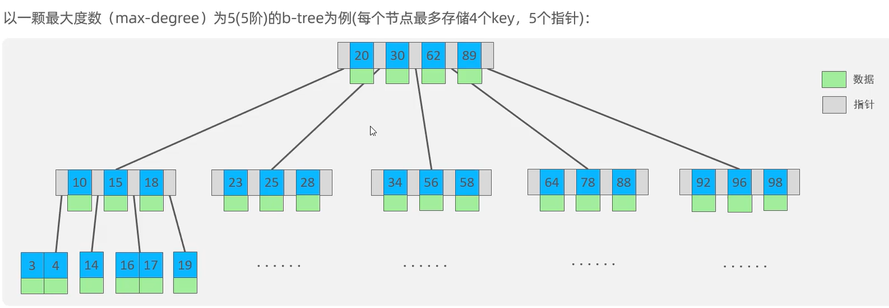


#### 2.3 B+树

B+树是B树的一种变形形式，B+树上的叶子结点存储关键字以及指向相应记录的指针，叶子结点以上的各层仅作为索引使用。

一棵m阶B+树定义如下: 

1. 每个结点至多有m个子结点。
2. 除根结点外，每个结点至少有[m/2]个子结点，根结点至少有2个子结点。
3. 有k个子结点的结点必有k个关键字。 

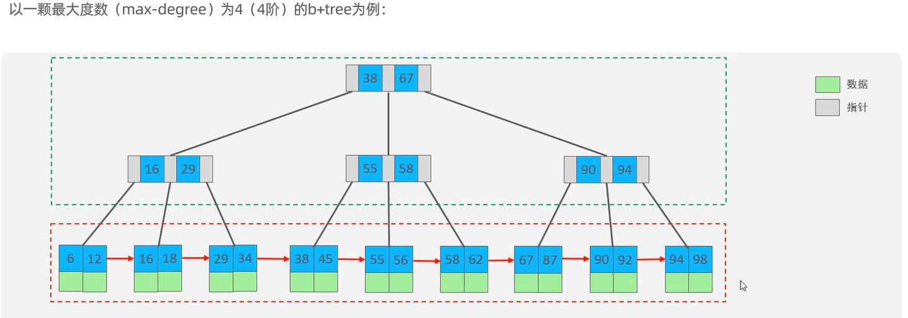

B+树相对于B树的区别：

+ 所有数据都会出现在叶子结点。
+ 所有叶子结点形成一个单向链表。


#### 2.4 MySQL中的B+树

MySQL索引数据结构对经典B+树进行了优化，使得所有叶子结点形成一个双向循环链表，提高区间访问性能。

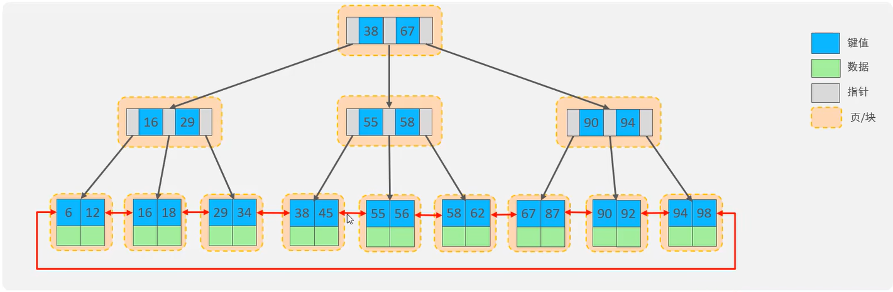


#### 2.5 Hash索引

##### P1 概述

Hash索引就是采用一定的Hash算法，将关键字换算成新的Hash值并映射到对应槽位上，然后存储在Hash表中。

如果多个关键字映射到同一槽位上，就产生了Hash冲突（也称Hash碰撞），这时候可以使用链表来解决。

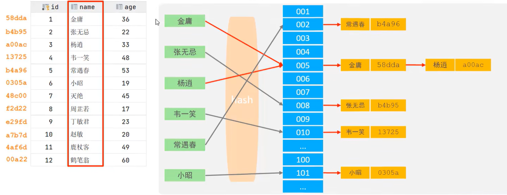

##### P2 特点

+ Hash索引只能用于对等比较（=, in），不支持范围查询（between, >, <, ...）。
+ 无法利用Hash索引完成排序操作。
+ 查询效率高，通常只需要进行一次检索即可，效率通常高于B+树索引。

##### P3 支持Hash索引的引擎

Memory引擎支持Hash索引，而InnoDB引擎具有自适应Hash功能，可以根据B+树索引在指定条件下自动构建Hash索引。


---


### 3.索引分类

#### 3.1 四种索引

|   分类   |                         含义                         |           特点           |   关键字   |
| :------: | :--------------------------------------------------: | :----------------------: | :--------: |
| 主键索引 |               针对于表中主键创建的索引               | 默认自动创建，只能有一个 | `primary`  |
| 唯一索引 |           避免同一个表中某数据列中的值重复           |        可以有多个        |  `unique`  |
| 常规索引 |                   快速定位特定数据                   |        可以有多个        |            |
| 全文索引 | 全文索引查找的是文本中的关键词，而不是比较索引中的值 |        可以有多个        | `fulltext` |


#### 3.2 聚集索引与二级索引

在InnoDB存储引擎中，根据索引的存储形式，又可以分为以下两种：

+ 聚集索引/聚簇索引(Clustered Index)：
  + 将数据与索引放在一块存储，索引结构的叶子结点保存了行数据。
  + 必须有，而且只能有一个。
  + 聚集索引的选举规则：
    + 如果存在主键，那么主键索引就是聚集索引。
    + 如果不存在主键，那么将第一个唯一索引作为聚集索引。
    + 如果既没有主键，也没有合适的唯一索引，那么InnoDB会自动生成一个rowid作为隐藏的聚集索引。
+ 二级索引/辅助索引(Secondary Index)：
  + 将数据与索引分开存储，索引结构的叶子结点关联的是对应的主键。
  + 可以存在多个。

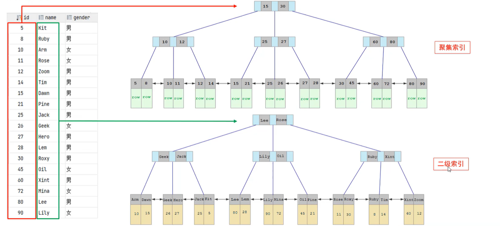


#### 3.3 回表查询

回表查询就是先走二级索引获得主键，再通过主键走聚集索引获得行。

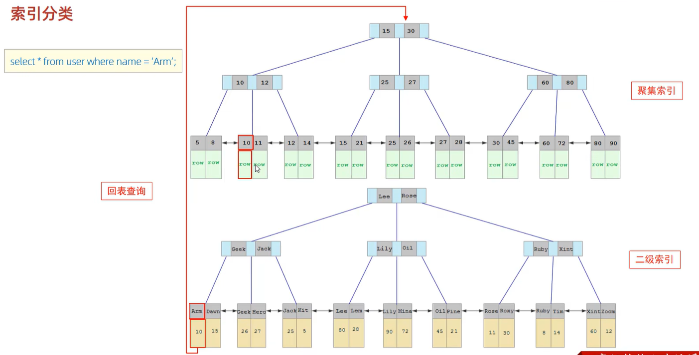


---


### 4.索引语法

```mysql
-- 创建索引
create [unique/fulltext] index 索引名 on 表名 (索引关联字段1,...,索引关联字段n);
-- 查看索引
show index from 表名;
-- 删除索引
drop index 索引名 on 表名;
```


---


### 5.SQL性能分析

#### 5.1 SQL执行频率

连接MySQL数据库后，可以通过`show [session/global] status`命令来查询服务器状态信息。

`show global status like 'Com_______'`这条命令（七个下划线）可以查看当前数据库的`INSERT`、`UPDATE`、`DELETE`、`SELECT`的访问频次。


#### 5.2 慢查询日志

慢查询日志记录了所有执行时间超过指定参数（long_query_time，单位：秒，默认为10秒）的所有SQL语句的日志。

可以通过`show variables like '%slow_query%'`这条命令来查看MySQL的慢查询日志是否开启以及日志存放路径：

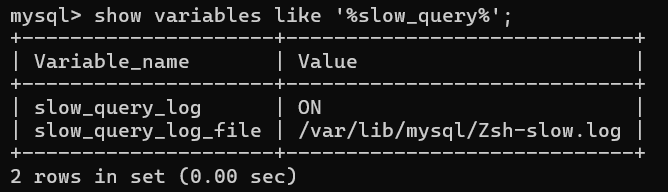

MySQL默认不开启慢查询日志，我们需要打开MySQL的配置文件`/etc/mysql/mysql.conf.d/mysqld.cnf`：

```bash
sudo nano /etc/mysql/mysql.conf.d/mysqld.cnf
```

然后配置如下信息：

```
# 开启MySQL的慢查询日志
slow_query_log = ON
# 设置慢查询日志的时间为2秒，SQL语句执行时间超过2秒就视为慢查询，记录到慢查询日志中
long_query_time = 2
```

配置完毕后，我们重启MySQL服务器，然后通过`sudo -i`进入root权限的Shell，再查看慢查询日志文件中记录的信息`/var/lib/mysql/Zsh-show.log`：

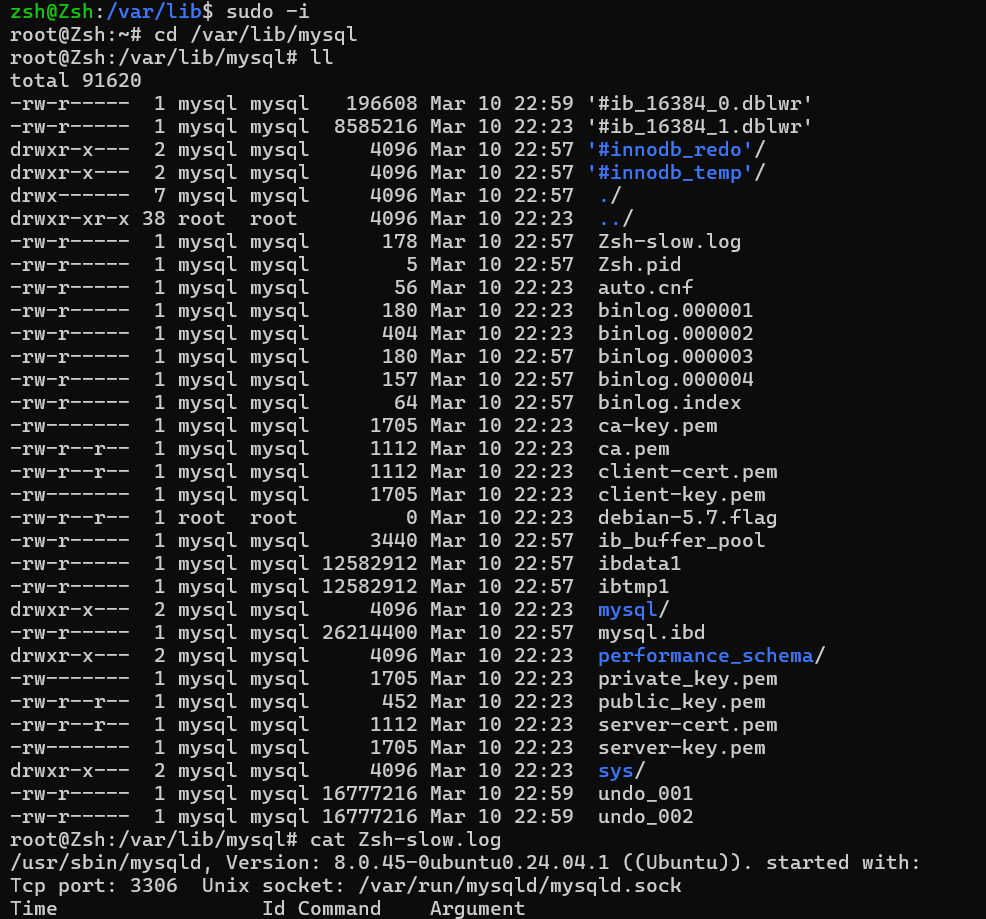

导入1000w的模拟数据到数据库cszsh的表tb_sku中后，我们执行一条SQL：`select count(*) from tb_sku`，再去查看慢查询日志：

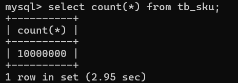

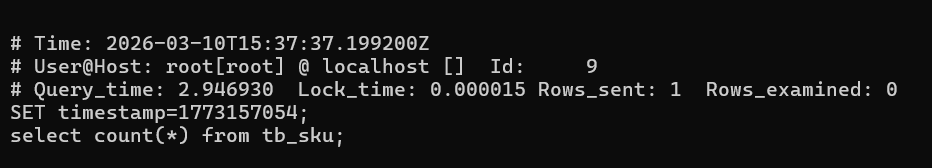

可以发现，该SQL的执行时间超过2秒，因此被记录到了慢查询日志中。


#### 5.3 profile详情（已弃用）

执行命令`select @@have_profiling`，可以查看当前MySQL是否支持profile操作。

再执行命令`select @@profiling`，可以查看profiling是否打开，默认情况下是关闭的。

我们可以通过执行命令`set profiling = 1`来打开profiling。

之后，我们可以执行一系列的业务SQL操作，然后通过如下指令来查看这些SQL语句的执行耗时：

```mysql
-- 查看每一条SQL的耗时基本情况
show profiles;
-- 查看指定query_id的SQL各个阶段的耗时情况
show profile for query query_id;
-- 查看指定query_id的SQL的CPU使用情况
show profile cpu for query query_id;
```


#### 5.4 explain执行计划

通过`explain`或`desc`命令，我们可以获取到MySQL执行`select`语句的详细信息，包括执行过程中表如何连接以及连接顺序。语法如下：

```mysql
-- 直接在要分析的select语句前加上关键字explain/desc
explain/desc select...;
```

使用`explain`分析`select * from tb_user where id = 1;`这条SQL语句，结果如下：

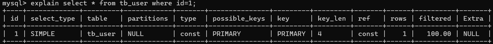

主要字段含义如下：

|      字段       |                             含义                             |                             备注                             |
| :-------------: | :----------------------------------------------------------: | :----------------------------------------------------------: |
|      `id`       | select查询的序列号，表示查询中执行select子句或者是操作表的顺序 | 若id相同，则执行顺序从上到下；若id不同，则值越大的越先执行。 |
|  `select_type`  |                         select的类型                         | 常见的取值有：SIMPLE（简单表，不适用表连接或子查询）、PRIMARY（主查询，即最外层的查询）、UNION（UNION中除第一个外的子查询）、SUBQUERY（非UNION中的子查询）。 |
|     `type`      |                           连接类型                           | 性能由好到差的连接类型分别是NULL、system、const、eq_ref、ref、range、index、all。 |
| `possible_keys` |               可能用在这张表上的一个或多个索引               |                                                              |
|      `key`      |                    实际用在这张表上的索引                    |                                                              |
|    `key_len`    |                       索引使用的字节数                       | 该值为索引字段最大可能长度，并非实际使用长度，在不损失精确性的前提下，长度越短越好。 |
|     `rows`      |                    MySQL估计要查询的行数                     |                                                              |
|   `filtered`    |            返回结果的行数占需要读取的行数的百分比            |                        该值越大越好。                        |


---


### 6.索引使用

#### 6.1 验证索引效率

在未建立索引之前，执行如下SQL语句，查看该SQL的耗时：

```mysql
select * from tb_sku where sn = '100000003145001'\G;
```

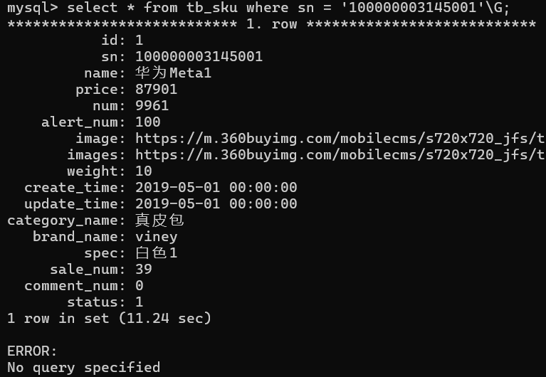

可以看到，该SQL的耗时较多，这是因为我们没有给`sn`这个字段建立索引。

现在，我们针对`sn`字段建立索引：

```mysql
create index idx_sku_sn on tb_sku(sn);
```

然后再次执行那条SQL语句，耗时如下：

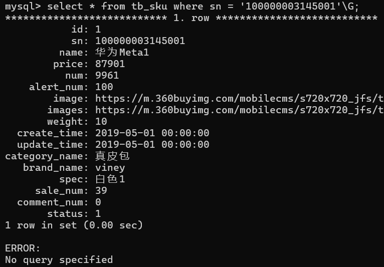

可以看到，该SQL几乎不耗时，这说明索引大大提升了查询效率。


#### 6.2 最左前缀法则

联合索引必须遵守最左前缀法则，最左前缀法则是指查询从索引的最左列开始，并且不跳过索引中的列。

如果跳过了索引中的某一列，会导致索引部分失效（后面的字段索引失效）。

例如，我为表`tb_user`中的三个字段`profession, age, status`创建了联合索引，然后依次执行以下查询语句，索引使用情况如下：

```mysql
select * from tb_user where profession='计算机' and age=18 and status='0';# 用到了联合索引
select * from tb_user where profession='计算机' and age=18;# 用到了联合索引
select * from tb_user where profession='计算机';# 用到了联合索引
select * from tb_user where age=18 and status='0';# 查询没有从索引的最左列profession开始，导致索引失效
select * from tb_user where profession='计算机' and status='0';# 用到了联合索引，但跳过了age，导致status字段索引失效
```

特别注意：以下查询语句虽然字段的书写顺序不同，但由于查询条件中包含索引的最左列`profession`，所以依然用到了联合索引，等价于上面第一条语句。

```mysql
select * from tb_user where age=18 and status='0' and profession='计算机';
```


#### 6.3 范围查询

联合索引中，如果出现了范围查询(>,<)，那么范围查询右侧的列索引失效。示例如下：

```mysql
select * from tb_user where profession='计算机' and age>18 and status='0';# status字段索引失效
select * from tb_user where profession='计算机' and age>=18 and status='0';# 三个字段都用到了联合索引
```


#### 6.4 索引失效情况

+ 如果在查询条件中对索引字段进行运算操作，那么索引会失效。
+ 如果在查询条件中使用字符串类型的索引字段时，没有加引号，那么索引会失效。
+ 模糊查询时，如果**仅仅**是尾部模糊匹配（`like 'a%'`），那么索引不会失效；如果存在头部模糊匹配（`like '%a'`），那么索引会失效。
+ 用or分割开的条件，如果or前的条件中的列有索引，or后的条件中的列没有索引，那么涉及到的索引全部失效。
+ 如果MySQL评估后认为使用索引比全表扫描慢，那么不使用索引。


#### 6.5 SQL提示

SQL提示是优化数据库查询的一个重要手段，简单来说就是在SQL语句中加入一些人为提示来达到优化数据库查询的目的。

+ `use index`：建议MySQL使用某个索引。
+ `ignore index`：告诉MySQL不要使用某个索引。
+ `force index`：强制MySQL使用某个索引。

示例如下；
```mysql
explain select * from tb_user use index(idx_user_pro) where profession='软件工程';
explain select * from tb_user ignore index(idx_user_pro) where profession='软件工程';
explain select * from tb_user force index(idx_user_pro) where profession='软件工程';
```


#### 6.6 覆盖索引

覆盖索引是指查询时使用到了索引，并且查询所需要返回的列都包含在索引中，无需回表查询。简单来说，就是索引本身“覆盖”了查询的所有需求。

在查询过程中，我们应该尽可能使用覆盖索引，避免使用`select *`。

先来看一下当前`tb_user`表具备的索引：

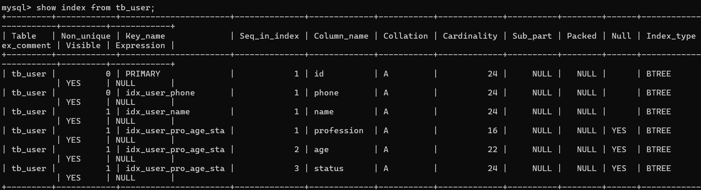

我们首先执行`explain select id,profession,age,status from tb_user where profession='软件工程' and age=31 and status='0'\G`，结果如下：

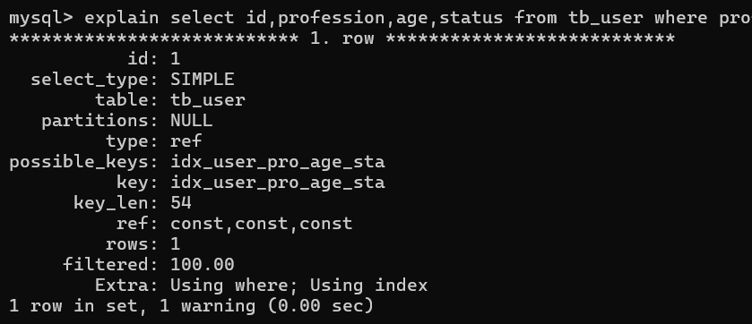

结果中的`Extra: Using where; Using index`表明：查询时使用到了索引，并且查询所需要返回的列都包含在索引中，即查询使用了覆盖索引。这是因为`idx_user_pro_age_status`是一个二级索引，其叶子结点关联了对应的主键`id`，所以`select`的四个字段`id,profession,age,status`都可以在索引列中找到，无需回表查询。

---

接着我们执行`explain select id,profession,age,status,name from tb_user where profession='软件工程' and age=31 and status='0'\G` ，结果如下：

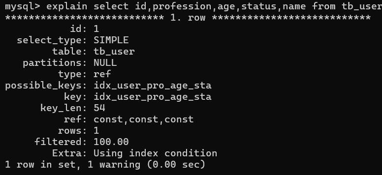

结果中的`Extra: Using index condition`表明：查询时使用到了索引，但是需要回表查询，性能显然比覆盖索引慢。这是因为`select`的五个字段`id,profession,age,status,name`中，`name`字段不在索引列中，故还需要进行一次回表查询。


#### 6.7 前缀索引

##### P1 概述

当字段类型为字符串时，有时候需要索引很长的字符串，这会让索引占据很大的空间，查询时浪费大量的磁盘IO，降低查询效率。

此时我们可以只给字符串的一部分前缀建立索引，这样可以大大节约索引空间，从而提高查询效率。

语法：`create index 索引名 on 表名(索引字段名(n));`，表示我要提取该字段的前n个字符建立索引。

##### P2 如何决定最佳的前缀长度n？

我们可以根据**索引的选择性**来决定。索引的选择性是指不重复的索引值数量和数据表的总记录数的比值，索引的选择性越高则查询效率越高。

```mysql
# 计算给整个email字段建立索引后，该索引的选择性
select count(distinct email)/count(*) from tb_user;
# 计算给email字段的前n个字符建立索引后，该索引的选择性
select count(distinct substring(email,1,n))/count(*) from tb_user;
```

我们可以将n从高到低逐步试探，找到某个最合适的索引选择性，此时的n就是最佳的前缀长度。


#### 6.8 单列索引与联合索引

在业务场景中，如果存在多个查询条件，考虑为查询字段建立索引时，建议优先建立联合索引而非单列索引，这样可以尽可能避免回表查询。


---


### 7.索引设计原则

1. 针对于数据量较大，且查询比较频繁的表建立索引。
2. 针对于常作为查询条件（`where`）、排序（`order by`）、分组（`group by`）操作的字段建立索引。
3. 尽量选择区分度高（索引选择性高）的列作为索引，尽量建立唯一索引，区分度越高，使用索引的效率越高。
4. 如果是字符串类型的字段，字段的长度较长，可以针对该字段的特点建立前缀索引。
5. 尽量使用联合索引，减少单列索引，查询时，联合索引很多时候可以覆盖索引，节省存储空间，避免回表，提高查询效率。
6. 要控制索引的数量，索引并不是多多益善，索引越多，维护索引结构的代价也就越大，会影响增删改的效率。
7. 如果索引列不能存储`NULL`值，请在创建表时使用`NOT NULL`约束它。这样当优化器知道每列是否包含`NULL`值时，它可以更好地确定哪个索引用于查询是最有效的。


---

---


## 三、SQL优化

### 1.插入数据

#### 1.1 `insert`优化

+ 批量插入优于多次单条插入。
+ 手动提交事务优于自动提交事务。
+ 主键顺序插入优于乱序插入。

#### 1.2 大批量插入数据

如果需要一次性插入大批量数据，使用`insert`性能较低，此时可以使用MySQL提供的`load`指令进行插入，具体操作如下：

```mysql
# 客户端连接服务端时，加上参数 --local-infile
mysql --local-infile -u root -p
# 设置全局参数local_infile为1，开启从本地加载文件导入数据的开关
set gloabl local_infile=1;
# 执行load指令将准备好的数据加载到表结构中
load data local infile '文件路径' into table 表名 fields terminated by ',' lines terminated by '\n';
```

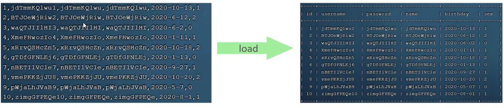


---


### 2.主键优化

#### 2.1 数据组织方式

在InnoDB存储引擎中，表数据都是根据主键顺序组织存放的，采用这种存储方式的表称为**索引组织表**(Index Organized Table: IOT)。

#### 2.2 页分裂

在InnoDB存储引擎中，每一行数据都存放在页当中，页的大小是16KB。

假如数据按主键顺序插入，那么数据会依次填入第一页，第一页满了就开辟第二页，然后数据依次填入第二页……以此类推。


请看下面的示意图，假如数据按主键乱序插入，此时第一页和第二页已经被填满了，我们想要插入id=50的数据。

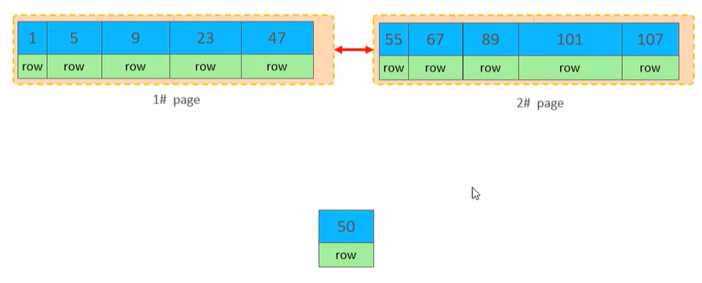

那么InnoDB会开辟第三页，然后将第一页后半部分的数据挪到第三页，再把id=50的这条数据填入第三页，然后修改页与页之间的指针使之有序：

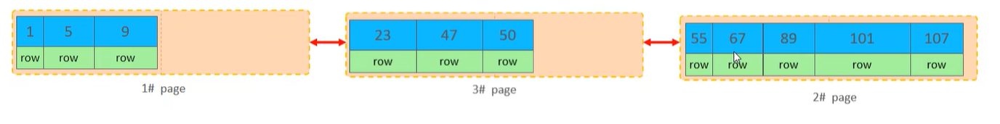

这个过程叫做**页分裂**，新数据成功插入，但带来以下几个副作用：

+ 搬动大量数据行、修改页与页之间的指针，都需要耗费大量IO和CPU资源，让此次插入操作变得很慢。
+ 制造页内碎片，导致数据表占用的磁盘空间变大，但实际存储的数据量没变。

#### 2.3 页合并

当我们删除一行数据时，实际上它并没有被物理删除，只是被标记为“已删除”，并且它占用的空间允许被其他数据覆盖。

当一页中删除的数据达到`MERGE_THRESHOLD`（默认为页的一半）时，InnoDB会开始寻找最邻近的页看看能否将两个页合并以优化空间使用情况。

这个过程就叫做**页合并**。

#### 2.4 主键设计原则

+ 在满足业务需求的前提下，尽量降低主键的长度。
  + 这样可以减少二级索引叶子结点占用的磁盘空间，提高查询效率。
+ 插入数据时尽量顺序插入，选择`AUTO_INCREMENT`自增主键。
  + 这样可以减少页分裂。
+ 尽量不要使用UUID做主键或其他自然主键（如身份证号）。
  + 因为它们是无序的，导致数据按主键乱序插入，产生页分裂。
+ 在业务操作中，尽量避免对主键的修改。


---


### 3.`order by`优化

+ `Using filesort`：通过表的索引或全表扫描读取满足条件的数据行，然后在排序缓冲区(sort buffer)中完成排序操作。所有不通过索引**直接**返回排序结果的排序都叫做`FileSort`排序。
+ `Using index`：通过有序索引顺序扫描直接返回有序数据，不需要额外排序，操作效率高。

所以我们要根据排序字段建立合适的索引，多字段排序时也遵循最左前缀法则（但是与字段顺序有关）。

```mysql
explain select id,age,phone from tb_user order by age asc, phone desc;# Using filesort
create index idx_user_age_phone_ad on tb_user(age asc, phone desc);# 创建age升序、phone降序的联合索引
explain select id,age,phone from tb_user order by age asc, phone desc;# Using index，性能提升
```

如果不可避免地出现`FileSort`排序或大数据量排序，那么我们可以适当增加排序缓冲区的大小（`sort_buffer_size`，默认为256KB）。


---


### 4.`group by`优化


---


### 5.`limit`优化


---


### 6.`count`优化


---


### 7.`update`优化


---

---


## 四、视图/存储过程/触发器


---

---


## 五、锁


---

---


## 六、InnoDB核心


---

---


## 七、MySQL管理


