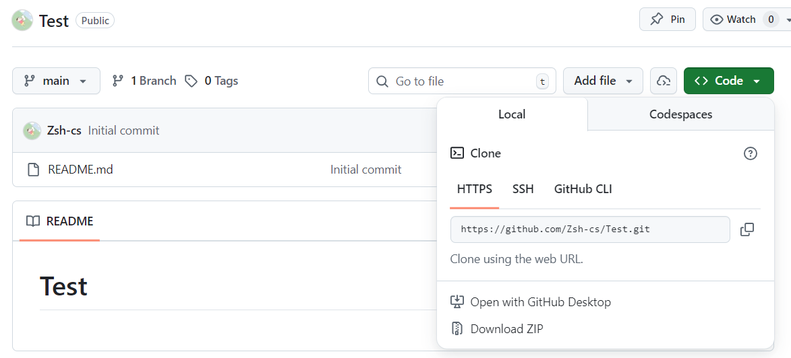

# 使用git初始化本地仓库并链接远程仓库

### 1.使用git初始化本地仓库

在本地文件夹内右键打开`Git Bash`，输入如下内容：

```bash
git init
git config --global user.name Zsh-cs              # Zsh-cs是GitHub用户名
git config --global user.email 1294012402@qq.com  # 1294012402@qq.com是GitHub邮箱
```

这样完成了本地仓库的初始化。


### 2.在GitHub上创建远程仓库



创建完毕后，复制远程仓库的HTTPS地址。


### 3.将本地仓库链接到远程仓库

在`Git Bash`输入如下内容：

```bash
git remote add origin https://github.com/Zsh-cs/Test.git  #上一步复制的远程仓库的HTTPS地址
git fetch  #拉取远程仓库
git checkout main #将本地仓库由master分支切换到main分支
```


