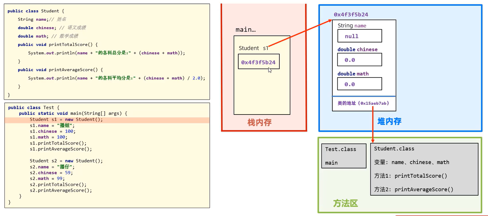
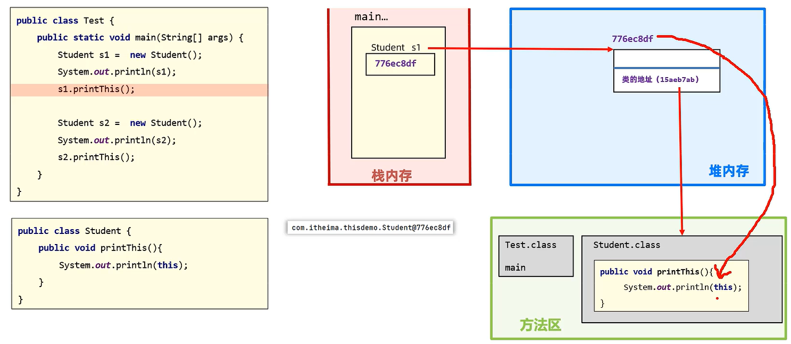
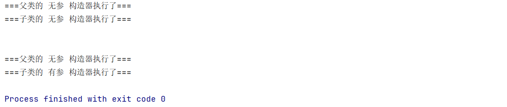
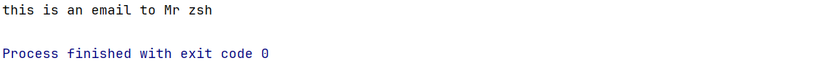
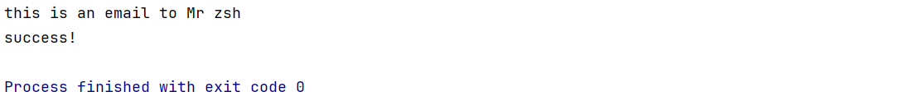
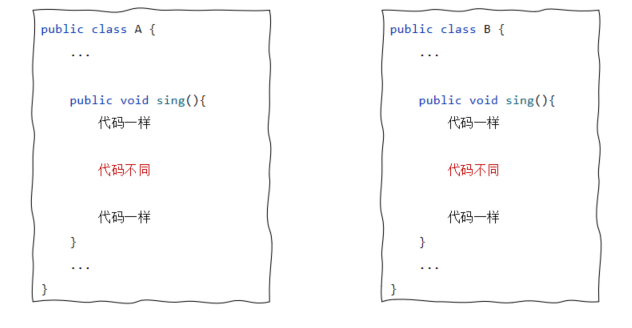
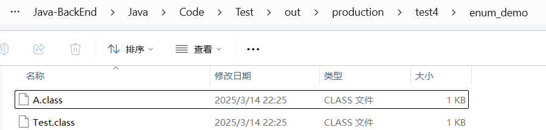
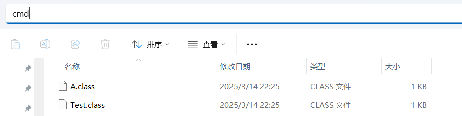
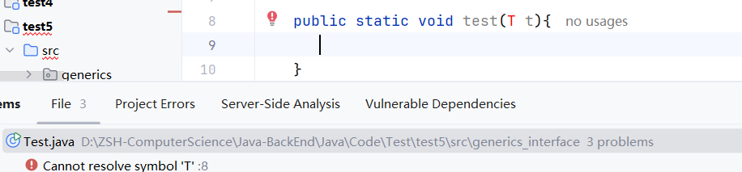
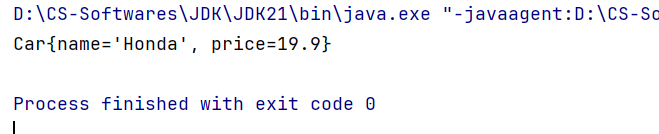

# 面向对象编程OOP

> 鸣谢：黑马程序员
>
> 


## 一、深刻认识面向对象编程

### 1.简介

面向对象编程OOP(Object Oriented Programming)是一种编程范式，它将现实世界中的事物抽象为程序中的对象，以更贴近人类思维的方式来进行软件开发。我们通过开发一个个的对象，将数据交给对象并调用对象的方法，从而完成对数据的处理。

### 2.面向对象编程的优点

面向对象编程符合人类的思维习惯，使得编程更简单、更直观。

### 3.对象的本质

对象本质上是一种特殊的数据结构。

### 4.类`class`

+ 对象的设计图或者模板。
+ 通过类这张设计图，我们可以创建出无数个不同的对象，它们既有共性，也有差异。
+ 对象是用类`new`出来的，有了类我们才可以创建出对象。


### 5.对象在计算机中的执行原理

假设我们创建了一个`Student`类，然后我们再创建一个`Test`类，在里面执行`Student s1=new Student();`这行代码。

这时候，计算机会在**堆内存**中开辟一块内存区域来存储这一个学生类对象`s1`。

**注意**：`s1`这个变量存储的是它的内存地址！因此`s1`变量也被称为**引用类型**的变量。




### 6.类和对象的一些注意事项

+ 类名建议用英文单词，首字母要大写，满足驼峰命名法。

+ 类中定义的变量称为**成员变量**（对象的属性），成员变量本身存在默认值，我们**不需要为其初始化赋值**。

  <table border="1">
    <thead>
      <tr>
        <th>数据类型</th>
        <th>明细</th>
        <th>默认值</th>
      </tr>
    </thead>
    <tbody>
      <tr>
        <td rowspan="3">基本类型</td>
        <td>byte、short、char、int、long</td>
        <td>0</td>
      </tr>
      <tr>
        <td>float、double</td>
        <td>0.0</td>
      </tr>
      <tr>
        <td>boolean</td>
        <td>false</td>
      </tr>
      <tr>
        <td>引用类型</td>
        <td>数组、String</td>
        <td>null</td>
      </tr>
    </tbody>
  </table>

+ 类中定义的方法称为**成员方法**（对象的行为）。

+ 一个代码文件中，可以写多个类，但只能有一个类用`public`**权限修饰符**修饰，且`public`修饰的类名必须成为代码文件名。

+ 如果某个对象没有任何变量引用它，则该对象无法被操作，称为“垃圾对象”。


### 7.`this`关键字

#### 7.1 简介

`this`是一个变量，用于在方法中拿到当前对象。哪个对象在其方法中调用`this`，`this`就指向哪个对象。

#### 7.2 `this`在计算机中的执行原理



#### 7.3 应用场景：主要用于解决变量名冲突的问题。

+ **问题示例**：

  ```java
  package thisdemo;
  
  public class Student {
      double score;//这里的score指代该学生的高考成绩
  
      public void printPass(double score) {//这里的score指代清华录取分数线
          if (score > score) {
              System.out.println("你的高考成绩超过了清华录取分数线！");
          }
      }
  }
  ```

  不难发现，`if`语句内产生了变量名冲突的问题。根据就近原则，`if`语句内的2个`score`都会就近访问形参`score`，此时`score > score`永不成立，该方法作废。

+ **解决方法**：使用`this`关键字区分2个`score`。

  ```java
  package thisdemo;
  
  public class Student {
      double score;
  
      public void printPass(double score) {
          if (this.score > score) {
              System.out.println("你的成绩超过了清华录取分数线！");
          }
      }
  }
  ```

  此时，`this.score`指代该学生的高考成绩，而大于号后面的`score`则指代清华录取分数线，两者不会产生冲突。


---


## 二、面向对象编程的三大特征

### 1.封装

+ 用类设计对象处理某一个事物的数据时，应该把要处理的数据以及处理这些数据的方法，涉及到一个对象中去。

+ **设计规范**：合理隐藏、合理暴露，善于使用`public`、`private`等权限修饰符。

+ **代码示例**：

  ```java
  public class Student {
      //成员变量私有化，不让外部访问，可以理解为将汽车的内部零件（比如发动机、变速箱）隐藏起来
      private String name;
      private double chineseScore;
      private double mathScore;
      private double englishScore;
     
      //成员方法公开化，可以理解为将汽车的操作方法（比如方向盘、油门、刹车）公开出来
      public void printTotalScore(){
          System.out.println(name+"同学的总分是："+(chineseScore+mathScore+englishScore));
      }
      
      public void printAverageScore(){
          System.out.println(name+"同学的各科平均分是："+(chineseScore+mathScore+englishScore)/3.0);
      }
  }
  ```

  

---


### 2.继承

#### 2.1 简介

+ `Java`中提供了一个关键字`extends`，使用该关键字可以让一个类和另一个类建立起父子关系。

  `public class Son extends Father{}`，`	Son`类称为子类或派生类。

+ **特点**：子类继承父类的**非私有成员**（成员变量和成员方法）。

+ 子类对象实际上是由父类和子类这两张设计图共同创建出来的。

+ **使用继承的优点**：减少了重复代码的编写，提高了代码的复用性。

  

#### 2.2 注意事项

+ `Java`是**单继承**的，`Java`中的类不支持**多继承**（即一个儿子不能有多个父亲），但支持**多层继承**（即儿子有父亲，父亲也可以有他的父亲）。

+ `Object`类是`Java`所有类的**祖宗类**，我们编写的每一个类，其实都继承了`Object`类或其子孙类。


#### 2.3 方法重写

+ 当子类觉得父类中的某个方法不好用或者无法满足自己的需求时，子类可以重写该方法（要保证方法名称和参数列表一致），去覆盖父类的该方法。
+ 建议加上`@Override`注解它可以让编译器帮助我们检查重写格式是否正确，同时增强代码可读性。
+ 方法重写后，`Java`会遵循**就近原则**优先调用子类的方法。
+ 子类重写父类方法时，访问权限必须>=父类该方法的权限（`public`>`protected`>缺省）。
+ 重写方法的返回值类型必须保证一致，或者范围更小。
+ **私有方法**和**类方法**不能被重写。
+ 子类重写`Object`类的`toString()`方法（可以使用IDEA快捷生成），以便返回对象的内容而非对象的内存地址。


#### 2.4 子类中访问其他成员的特点

+ 依照**就近原则**。

+ 如果子类和父类中出现了重名的成员，由于子类会优先访问子类的成员，那该如何在子类中访问父类的成员呢？

  可以通过使用`super`关键字：`super.父类成员变量/父类成员方法`。


#### 2.5 子类构造器的特点

+ 默认情况下，子类全部构造器（无论是无参还是有参）内部的**第一行**代码都是`super()`，即**优先调用**父类的**无参**构造器，之后才会调用自身的构造器。

  这样做的原因是子类对象是由子类和父类两张设计图共同创建出来的，因此构造器也被拆分到这两个类中。

  这样做的目的是减少代码量以及耦合程度。

  ---示例：

  ```java
  package extends_constructor;
  
  class Father {
      public Father() {
          System.out.println("===父类的 无参 构造器执行了===");
      }
  }
  
  class Son extends Father {
      public Son() {
          super();//默认存在的，可写可不写
          System.out.println("===子类的 无参 构造器执行了===");
      }
  
      public Son(String name) {
          super();//默认存在的，可写可不写
          System.out.println("===子类的 有参 构造器执行了===");
      }
  }
  
  public class Test {
      public static void main(String[] args) {
          Son son = new Son();
          System.out.println("\n");
          Son son2 = new Son("zsh");
      }
  }
  ```

  ---控制台输出结果：

  

+ 若父类没有无参构造器，则我们必须在子类构造器内部的**第一行**写上`super(参数1,参数2,...)`，即调用父类的某一有参构造器。

+ **补充知识**：`this()/this(参数1,参数2,...)`可以调用兄弟构造器（就是同一个类中的其他构造器，包括无参构造器）。

  + **注意**：若构造器内已经使用了`this`关键字调用兄弟构造器，就不能再使用`super`关键字调用父类构造器，因为兄弟构造器中已经使用过`super`了；而且`this`必须放在构造器内**第一行**。
  
  ```java
  public class Student{
      private String schoolName;
      private String name;
      
      //有参构造器A
      public Student(String name){
          //这里使用this关键字调用了有参构造器B，有了this就不能写super了！
          this(name,"Harbin Institute of Technology");
      }
      
      //有参构造器B
      public Student(String name,String schoolName){
          this.name=name;
          this.schoolName=schoolName;
      }
  }
  ```
  


---


### 3.多态

#### 3.1 简介

多态是在继承(`extends`)/实现(`implements`)下的一种现象，表现为：对象多态、行为多态。


#### 3.2 代码示例

（1）创建3个类：`People、Student、Teacher`，后面两个类都继承了`People`，并且都重写了`run()`方法。

```java
public class People {
    public void run(){
        System.out.println("人可以跑");
    }
}
```

```java
public class Student extends People{
    @Override
    public void run() {
        System.out.println("学生跑得很快");
    }
}
```

```java
public class Teacher extends People{
    @Override
    public void run() {
        System.out.println("老师跑得慢吞吞的");
    }
}
```

（2）`main`方法中演示多态：

```java
People p1=new Student();
p1.run();

People p2=new Teacher();//对象多态
p2.run();//行为多态
```

（3）控制台输出结果：

```java
学生跑得很快
老师跑得慢吞吞的
```


#### 3.3 多态的前提

+ 有继承(`extends`)/实现(`implements`)关系
+ 存在父类引用子类对象
+ 存在方法重写


#### 3.4 注意事项

+ 多态是**对象和行为**的多态，`Java`中的成员变量不讨论多态。

+ 多态下会产生的**问题**：多态创建出的对象无法使用子类独有的功能。

  + 解决方法：**强制类型转换**。

    ```java
    People p=new Teacher();
    Teacher t=(Teacher) p;
    //强转后就可以使用Teacher的独有功能
    ```

    

------


## 三、类`class`的五大成分

### 1.成员变量

#### 1.1 类变量

> [!CAUTION]
>
> 有`static`修饰。

+ 属于类的成员变量，与类一起加载一次，在内存中只有一份，可以被类和类的所有对象共享。
+ 调用格式：
  + 推荐：`类名.类变量`
  + 不推荐：`对象.类变量`

#### 1.2 实例变量

> [!CAUTION]
>
> 无`static`修饰，也称为**对象的变量**。

+ 属于对象的成员变量，每个对象中都有一份，数据各不相同，只能由创建出来的对象访问。
+ 调用格式：`对象.实例变量`

#### 1.3 成员变量和局部变量的区别

|     区别     |   成员变量   |             局部变量             |
| :----------: | :----------: | :------------------------------: |
| 书写位置不同 |  类中方法外  |           常见于方法中           |
|  初始化不同  |   有默认值   |             无默认值             |
| 内存位置不同 |    堆内存    |              栈内存              |
|  作用域不同  |   整个对象   |        在所归属的大括号中        |
| 生命周期不同 | 与对象共存亡 | 随方法调用而生，方法运行结束而亡 |


---


### 2.构造器

+ 构造器分为**无参**构造器和**有参**构造器（可以使用IDEA快捷生成）。

+ **特点**：每创建一个对象，该对象都会去调用构造器。
+ **常见应用场景**：创建对象的同时完成对象成员变量的初始化赋值。
+ **注意事项**：
  + 类在设计时，如果不写构造器，那么IDEA会自动为类生成一个无参构造器。
  + 类在设计时，一旦手写了有参构造器，那么IDEA就不会自动生成无参构造器，此时我们必须手写一个无参构造器出来，否则后续可能产生bug。


---


### 3.成员方法

#### 3.1 类方法

> [!CAUTION]
>
> 有`static`修饰。

+ 最常见的应用场景：做**工具类**。

  + **工具类**：工具类中的方法都是类方法，每个类方法都用于完成一个特定功能，工具类是给全体开发人员使用的。

  + 工具类没有创建对象的需求，实际工作中建议将工具类的**构造器私有**。

  + 为什么工具类中的方法都是类方法而不用实例方法？

    + 实例方法需要创建出对象以后才能调用，而此时对象的唯一作用就是调用方法，并无其他作用，反而会浪费内存。
    + 类方法直接用类名就可以调用，无需创建对象，既方便又节省内存。

  + **代码演示**：

    ```java
    public class XxxxUtil{//Util后缀表示某某工具类
        //建议将构造器私有化
        private XxxxUtil(){
            
        }
        
        public static void xxx(){
            ...
        }
        
        public static boolean xxxx(String message){
            ...
        }
        
        public static String xxxxx(int a){
            ...
        }
        
        ...
    }
    ```

+ 调用格式：

  + 推荐：`类名.类方法`
  + 不推荐：`对象.类方法`

#### 3.2 实例方法

> [!CAUTION]
>
> 无`static`修饰。

+ 调用格式：`对象.实例方法`

#### 3.3 注意事项

+ 类方法中：可以直接访问类成员（包括类变量和其他类方法），但不可以直接访问实例成员（包括实例变量和实例方法）。
+ 实例方法中：既可以直接访问类成员，也可以直接访问实例成员。
+ 实例方法中可以出现`this`关键字，而类方法中不可以。


------


### 4.代码块

#### 4.1 静态代码块

+ **格式**：

  ```java
  static{
  
  }
  ```

+ **特点**：类加载时自动执行，由于类只会加载一次，故静态代码块也**只会加载一次**。

+ **作用**：完成类的初始化操作，比如对类变量进行**初始化赋值**。（好比生出一个小孩，你要马上为他洗澡、穿衣、打疫苗等等，这就是对小孩的初始化）


#### 4.2 实例代码块

+ **格式**：

  ```java
  {
      
  }
  ```

+ **特点**：每次创建一个新的对象时，都会执行一次实例代码块，注意是**先于构造器执行**。

+ **作用**：和构造器一样，都是用来完成对象的初始化操作，比如对实例变量进行**初始化赋值**。

+ **示例**：将有参和无参构造器中的重复代码放至实例代码块中，降低耦合程度。

  ---原代码：

  ```java
  package codeblock;
  
  public class Student {
      int age;
      String name;
  
      public Student() {
          System.out.println("有人创建了对象：" + this);
      }
  
      public Student(int age, String name) {
          this.age = age;
          this.name = name;
          System.out.println("有人创建了对象：" + this);
      }
  }
  ```

  ---优化后代码：

  ```java
  package codeblock;
  
  public class Student {
      int age;
      String name;
  
      {
          System.out.println("有人创建了对象：" + this);
      }
  
      public Student() {
  
      }
  
      public Student(int age, String name) {
          this.age = age;
          this.name = name;
      }
  }
  ```

  

------


### 5.内部类

+ 如果一个类定义在另一个类的内部，那么这个类就叫作**内部类**。
+ **使用场景**：当一个类的内部包含了一个完整的事物，且这个事物没有必要单独设计时，我们就可以把这个事物设计成内部类。

+ **代码演示**：

  ```java
  public class Car{
      //内部类
      public class Engine{
          
      }
  }
  ```


#### 5.1 成员内部类

+ 类中的一个普通成员，类似于成员变量、成员方法。
+ `JDK 16`之后，成员内部类中支持定义静态成员。

+ ```java
  public class Outer{
      //成员内部类
      public class Inner{
          
      }
  }
  ```

  `main`方法中创建对象的格式：

  ```java
  Outer.Inner in=new Outer().new Inner();//必须使用2个new！！！
  ```

+ 成员内部类中访问其他成员的特点：

  + 成员内部类中的实例方法中，可以直接访问外部类的实例成员和静态成员。
  + 成员内部类中的实例方法中，可以通过`外部类名.this`拿到当前的外部类对象。


#### 5.2 静态内部类

+ 有`static`修饰的内部类，属于外部类自己持有。

+ ```java
  public class Outer{
      //成员内部类
      public class Inner{
          
      }
  }
  ```

  `main`方法中创建对象的格式：

  ```java
  Outer.Inner in=new Outer.Inner();//只需使用1个new！！！
  ```

+ 静态内部类中访问其他成员的特点：

  可以直接访问外部类的静态成员，不能直接访问外部类的实例成员。


#### 5.3 局部内部类

+ 定义在**方法/代码块/构造器**中的内部类。

+ ```java
  public class Outer{
      //构造器
      public Outer(){
          //局部内部类A
          class A{
              
          }
      }
      
      //代码块
      static{
          //局部内部类B
          class B{
              
          }
      }
      
      //方法
      public void calculate(){
          //局部内部类C
          class C{
              
          }
      }
  }
  ```


---


#### 5.4 匿名内部类（重点）

##### 5.4.1 简介

+ 一种特殊的局部内部类。

+ **匿名**：程序员不需要为这个类起名，

+ **代码演示**：

  假设我们预先定义了一个`Animal`类；

  在`main`方法中，我们来创建一个`Animal`类的匿名内部类对象。

  ```java
  new Animal(){
      //类体（一般是方法重写）
      @Override
      public void cry(){
          System.out.println("小狗汪汪叫");
      }
  }
  ```

+ **特点**：匿名内部类本质上就是一个子类，并会立即创建出一个子类对象。

+ **作用**：更方便地创建出一个子类对象。

+ **常见使用场景**：作为一个参数传递给方法。


---


##### 5.4.2 `Lambda`表达式(JDK8新特性)

> [!Tip]
>
> **作用**：只能用于简化函数式接口。（函数式接口中==只有一个抽象方法==）
>
> 小技巧：可以在函数式接口顶部添加注解`@FunctionalInterface`，提升可读性，并且易于debug。

###### A.接口方法为无参数的情况

（1）**原代码**：创建一个接口`Message`，再创建两个类`Email`、`Sms`分别实现`Message`接口，然后在`Main`类中进行测试。

---`Message`接口：

```java
package lambda;

public interface Message {
    public void send();
}
```

---`Email`类：

```java
package lambda;

public class Email implements Message {
    @Override
    public void send() {
        System.out.println("this is an email.");
    }
}
```

---`Sms`类：

```java
package lambda;

public class Sms implements Message {
    @Override
    public void send() {
        System.out.println("this is an sms.");
    }
}
```

---`Main`类：

```java
package lambda;

public class Main {
    public static void main(String[] args) {
        Message email = new Email();
        sendMessage(email);

        Message sms = new Sms();
        sendMessage(sms);
    }

    static void sendMessage(Message message) {
        message.send();
    }
}
```

---控制台输出结果：


以上，按照传统方法，我们已经正确地实现和使用了接口，应用场景也合适。

但是我们会发现，要发送一条消息，每次都要好几个步骤：

1. 创建一个Xxx类；
2. 在Xxx类中重写`Message`接口中的`send()`方法；
3. 在`Main`类中实例化一个Xxx类的对象，最终才能发送。


（2）**优化后代码**：利用匿名内部类，简化大量代码，只需要一个`Main`类。

本质上，我们所创建的匿名内部类是用于充当`sendMessage(Message message)`方法里面的参数`message`，这样就不用再单独写一个`Email`类来实现`Message`接口了，省去了以上3个步骤。

```java
public class Main {
    public static void main(String[] args) {
        sendMessage(new Message() {
            @Override
            public void send() {
                System.out.println("this is an email.");
            }
        });
    }
    static void sendMessage(Message message) {message.send();}
}
```


（3）**二次优化后代码**：在利用匿名内部类的基础上，使用`Lambda`表达式进一步简化代码。

```java
public class Main {
    public static void main(String[] args) {
        sendMessage(() -> {
            System.out.println("this is an email.");
        });
    }
    static void sendMessage(Message message) {message.send();}
}
```

以上代码的另一种写法如下：

```java
public class Main {
    public static void main(String[] args) {
        Message lambda = () -> {
            System.out.println("this is an email.");
        });
        sendMessage(lambda);
    }
    static void sendMessage(Message message) {message.send();}
}
```


---


###### B.接口方法为单参数的情况

我们将`Message`接口里的`send()`方法改为有一个参数的方法：

```java
package lambda;

public interface Message {
    public void send(String name);
}
```

此时，`Main`类中的代码也需要作出相应修改：

**注意**：其实还可以进一步简化，即把第3行包裹住`name`的小括号去掉，但为了可读性强，不建议这么做。

```java
public class Main {
    public static void main(String[] args) {
        sendMessage((name) -> {//此处不需要写出name的数据类型，Java会自动识别
            System.out.println("this is an email to " + name);
        });
    }
    static void sendMessage(Message message) {message.send("zsh");}
}
```

控制台输出结果：


---


###### C.接口方法为多参数的情况

我们将`Message`接口里的`send()`方法改为有多个参数的方法：

```java
package lambda;

public interface Message {
    public void send(String name, String title);
}
```

此时，`Main`类中的代码也需要作出相应修改：

```java
package lambda;

public class Main {
    public static void main(String[] args) {
        sendMessage((name, title) -> {
            System.out.println("this is an email to " + title + " " + name);
        });
    }
    static void sendMessage(Message message) {message.send("zsh", "Mr");}
}
```

控制台输出结果：




---


###### D.接口方法有返回值的情况

---`Message`接口：

```java
package lambda;

public interface Message {
    public String send(String name, String title);
}
```

---`Main`方法：

```java
package lambda;

public class Main {
    public static void main(String[] args) {
        sendMessage((name, title) -> {
            System.out.println("this is an email to " + title + " " + name);
            return "success!";
        });
    }

    static void sendMessage(Message message) {
        String status = message.send("zsh", "Mr");//status用于接收send()方法的返回值
        System.out.println(status);
        //如果没有这条语句，那么success!不会打印出来，因为sendMessage()方法中没有对应的业务逻辑实现
    }
}
```

---控制台输出结果：




---


## 四、单例设计模式`singleton`

### 1.简介

+ **设计模式(Design Pattern)**：人们对于一个问题所总结出的最优解决方案。
+ 单例设计模式能确保一个类只有一个对象，避免浪费内存。
+ 电脑上的任务管理器就运用了单例设计模式，防止用户重复开启，避免浪费电脑性能。


### 2.饿汉式单例

> [!CAUTION]
>
> 对象预先创建完毕。适用于对象需要频繁使用的场景。

**写法**：

+ 将类的构造器私有，从而禁止外部创建对象。

+ 定义一个类变量用于记住类的一个对象。

+ 定义一个类方法用于返回该类变量所记住的对象，从而使得无论外部调用该方法多少次，返回的始终是同一个对象。

**示例**：

```java
package singleton;

public class A {
    //2.定义一个类变量用于记住类的一个对象
    private static A a = new A();

    //1.将类的构造器私有
    private A() {

    }

    //3.定义一个类方法用于返回类变量所记住的对象
    public static A getObject() {
        return a;
    }
}
```


### 3.懒汉式单例

> [!CAUTION]
>
> 拿对象时才会开始创建对象。适用于对象较少使用的场景。

**写法**：

+ 将类的构造器私有。
+ 定义一个类变量用于存储对象。
+ 定义一个类方法用于返回对象，并确保第一次调用时才创建一个对象，而后面再次调用时都会用这同一个对象返回。

**示例**：

```java
package singleton;

public class B {
    //2.定义一个类变量用于存储对象
    private static B b;

    //1.将类的构造器私有
    private B() {

    }

    //3.定义一个类方法用于返回对象，并确保第一次调用时才创建一个对象，而后面再次调用时都会用这同一个对象返回
    public static B getObject() {
        //第一次调用时b是null，后面再次调用时b已经创建完毕，不会再次创建
        if (b == null) {
            b = new B();
        }
        return b;
    }
}
```


---


## 五、实体类`JavaBean`

### 1.简介

+ 实体类是一种特殊形式的类：

  + 类中的成员变量都要私有，并且要对外提供相应的`get&set`方法（可以使用IDEA快捷生成）。
  + 类中必须要有一个公共的无参构造器。

+ 代码示例：

  ```java
  package javabean;
  
  public class Student {
      //1.类中的成员变量都要私有，并且要对外提供相应的get&set方法。
      private String name;
      private double score;
  
      public String getName() {
          return name;
      }
      public void setName(String name) {
          this.name = name;
      }
      public double getScore() {
          return score;
      }
      public void setScore(double score) {
          this.score = score;
      }
  
      //2.类中必须要有一个公共的无参构造器。由于IDEA会自动帮我们生成，故此处不手写。
  }
  ```


### 2.应用场景

+ 实体类只负责数据存取，而对数据的处理则交给其他类来完成（一般是`XxxxOperator`），从而实现数据和数据业务处理相分离。

+ 代码示例：`StudentOperator`。

  ```java
  package javabean;
  
  public class StudentOperator {
      private Student student;
  
      public StudentOperator(Student student) {
          this.student = student;
      }
  
      //判断学生成绩是否及格属于对数据的处理，不应该写在实体类，而应该分离出来给其他类完成
      public void printPass() {
          if (student.getScore() >= 60) {
              System.out.println(student.getName() + "同学成绩及格");
          } else {
              System.out.println(student.getName() + "同学成绩不及格");
          }
      }
      
      //...其他数据业务处理相关的方法
  }
  ```

  

---


## 六、抽象类`abstract class`

### 1.简介

+ 在`Java`中有一个关键字叫：`abstract`，可以用来修饰类和成员方法。
+ `abstract`修饰类，这个类就是抽象类；修饰成员方法，这个方法就是抽象方法。


###　2.注意事项

+　抽象类中不一定有抽象方法，但有抽象方法的类一定是抽象类。
+　类该有的五大成员（包括**构造器**），抽象类都可以有。
+　==注意：抽象方法中只能有方法签名（方法名称、参数列表、返回值类型），不能有方法体。==
+　一个类继承抽象类，必须重写完抽象类的所有**抽象方法**，否则这个类也必须定义成抽象类。（IDEA中Alt+Enter可以快速重写方法）


### 3.特点

+ 抽象类不能创建对象（不能`new`出来），仅仅作为一种特殊的父类，让子类继承并重写抽象类的全部抽象方法（必须重写）。

+ 抽象类虽然不能被实例化，但它可以作为一种类型存在。也就是说，我们不能直接创建抽象类的对象，但可以定义抽象类类型的引用变量，即使用父类类型的引用变量来引用子类类型的对象。

  + 示例：创建一个抽象类`Animal`，再创建一个类`Cat`继承`Animal`，此时在`Test`类的`main`方法中允许写出如下语句：

    `Animal a = new Cat();`


### 4.应用场景和好处

+  用抽象类可以把子类中相同的代码，包括方法签名都抽象到父类中，这样能更好地支持多态，提高代码的灵活性。
+ 当我们不知道系统未来具体的业务实现时，我们可以预先定义一个抽象类，将来让子类去继承，以方便系统的扩展。


### 5.模板方法设计模式

**作用**：解决方法中存在重复代码的问题。




#### 5.1 写法

（1）定义一个抽象类；

（2）在这个抽象类内部定义2个方法。

	模板方法：把相同的代码放进去
	抽象方法：具体事现交由子类完成
  + 建议使用`final`关键字修饰模板方法，原因如下：
    + 模板方法是给对象直接使用的，不能被子类重写。
    + 一旦子类重写了模板方法，模板方法就失效了。


#### 5.2 代码演示

（1）先定义一个抽象类

```java
public abstract class People{
    /**模板方法设计模式*/
    //1.定义一个模板方法出来
    public final void write(){
        System.out.println("\t\t\t\t\t《我的父亲》");
        System.out.println("\t\t我的父亲是一个伟大的人，我很敬爱他。");

        //2.模板方法并不清楚正文部分究竟应该怎么写，但是它知道子类肯定要写正文部分
        System.out.println("\t\t"+writeMainPart());

        System.out.println("\t\t能拥有这样的父亲是我这辈子最大的幸福。");
    }

    //3.定义一个抽象方法来写正文，具体的实现交给子类来完成
    public abstract String writeMainPart();
}
```

（2）再定义2个子类继承抽象类，并重写抽象方法

```java
public class Student extends People{
    @Override
    public String writeMainPart(){
        return "我爸爸很牛逼，一天抽十包烟。";
    }
}
```

```java
public class Teacher extends People{
    @Override
    public String writeMainPart(){
        return "是我的父亲指引我走上了成为一名人民教师的道路。";
    }
}
```

（3）创建子类对象，调用模板方法完成需求

```java
public class Test {
    public static void main(String[] args) {
        //目标：搞清楚模板方法设计模式是什么
        /*场景：
            学生和老师都需要写一篇作文：《我的父亲》
            第一段是一样的
            正文部分自由发挥
            最后一段也是一样的
         */

        Teacher teacher=new Teacher();
        teacher.write();
        System.out.println("=========================================================");
        Student student=new Student();
        student.write();
    }
}
```

（4）控制台输出内容

```
					《我的父亲》
		我的父亲是一个伟大的人，我很敬爱他。
		是我的父亲指引我走上了成为一名人民教师的道路。
		能拥有这样的父亲是我这辈子最大的幸福。
=========================================================
					《我的父亲》
		我的父亲是一个伟大的人，我很敬爱他。
		我爸爸很牛逼，一天抽十包烟。
		能拥有这样的父亲是我这辈子最大的幸福。
```


------


## 七、接口`interface`

### 1.简介

+ 接口可以理解为一种特殊的类，==接口内部只能有全局常量和抽象方法==，不能有其他成员。

  + 当然，我们不必对成员变量修饰`public static final`，或是对成员方法修饰`public abstract`，因为Java会默认帮我们补齐。

+ 接口的格式：

  ```java
  public interface 接口名{
      //成员变量（常量），记得大写
      //成员方法（抽象方法）
  }
  ```

+ 接口的好处：

  + 用于弥补`Java`中普通的类只能单继承的缺陷。

  + 让程序可以面向接口编程，这样程序员就可以灵活方便地切换各种业务实现。

    + 比如定义了一个`Driver`接口，里面有一个抽象方法`drive()`。类A和类B都实现了该接口，但它们的`drive()`方法具体业务实现不同：A是开汽车，B是骑摩托。我们在`main`方法中写出如下代码：

      ```java
      Driver d = new A();
      d.drive();
      ```

    + 过了几天我们想要切换成B的驾驶功能，则无需大量改动代码，只需将`new`关键字后面的A换成B即可，这就是面向接口编程。

+ 实际开发中，接口更多的作用是**制定标准**，然后由不同类去具体实现这些标准。

  

### 2.注意事项

+ 接口不能创建对象（不能`new`出来），但可以[定义接口类型的引用变量](###3.特点)以实现多态。
+ 接口是用来被类实现（`implements`）的，实现接口的类叫作**实现类**。
+ 一个类可以实现多个接口，但注意必须重写完**全部接口**的**全部抽象方法**，否则这个类必须定义成抽象类，而不能是实现类。
  + 若这多个接口中存在方法签名冲突，则此时不支持多实现。
  + 若这多个接口存在同名的默认方法，则只要这个类重写该方法就可以不产生冲突。

+ 一个类既继承了父类，又实现了接口，若父类和接口有同名的默认方法，则实现类会优先调用父类方法。

```java
public/protected/缺省/private class 实现类名 implements 接口1,接口2,接口3,...{
    ...
}
```


### 3.接口的多继承

+ 一个接口可以同时继承多个接口，相当于将多个接口合并为一个接口，更便于实现类去实现。
  + 若这多个接口中存在方法签名冲突，则此时不支持多继承。


```java
public interface C extends A,B{
    ...
}
```


### 4.接口新增方法(After `JDK8`)

+ 默认方法：使用`default`修饰，只能由实现类的对象调用，默认被`public`修饰。
+ 静态方法：使用`static`修饰，必须用当前接口名调用，默认被`public`修饰。

+ 私有方法（After `JDK9`）：使用`private`修饰，只能在接口内部被调用。

+ 新增3个方法的**作用**：增强接口能力，更便于项目的扩展和维护。

  

### 5.面向接口编程演示

以下用一个班级管理系统来演示面向接口编程的优点，所有程序都位于同一个包`interface_demo`下。

该系统可以灵活方便的切换两套业务方案以满足不同需求。

#### 5.1 `Student`类

```java
package interface_demo;

public class Student {
    private String name;
    private char sex;
    private double score;

    public Student() {
    }

    public Student(String name, char sex, double score) {
        this.name = name;
        this.sex = sex;
        this.score = score;
    }

    public String getName() {
        return name;
    }

    public void setName(String name) {
        this.name = name;
    }

    public char getSex() {
        return sex;
    }

    public void setSex(char sex) {
        this.sex = sex;
    }

    public double getScore() {
        return score;
    }

    public void setScore(double score) {
        this.score = score;
    }
}
```

#### 5.2 `StudentOperator`接口

```java
package interface_demo;

import java.util.ArrayList;

public interface StudentOperator {
    void printAllInfo(ArrayList<Student> students);

    void printAverageScore(ArrayList<Student> students);
}
```

#### 5.3 `StudentOperatorImpl1`---第1套业务方案

> 能打印出班级全部学生的信息和平均分。

```java
package interface_demo;

import java.util.ArrayList;

public class StudentOperatorImpl1 implements StudentOperator {
    @Override
    public void printAllInfo(ArrayList<Student> students) {
        System.out.println("===All Students' Information is as follows===");
        for (Student s : students) {
            System.out.println("name:" + s.getName() + ",sex:" + s.getSex() + ",score:" + s.getScore());
        }
    }

    @Override
    public void printAverageScore(ArrayList<Student> students) {
        double totalScore = 0;
        for (Student s : students) {
            totalScore += s.getScore();
        }
        double averageScore = totalScore / students.size();
        System.out.println("average score:" + averageScore);
    }
}
```

#### 5.4 `StudentOperatorImpl2`---第2套业务方案

> 能打印出班级全部学生的信息及全班男女人数；能打印出班级全部学生去掉最高分和最低分后的平均分。

```java
package interface_demo;

import java.util.ArrayList;

public class StudentOperatorImpl2 implements StudentOperator {
    @Override
    public void printAllInfo(ArrayList<Student> students) {
        int maleNum = 0, femaleNum = 0;

        System.out.println("===All Students' Information is as follows===");
        for (Student s : students) {
            System.out.println("name:" + s.getName() + ",sex:" + s.getSex() + ",score:" + s.getScore());
            if (s.getSex() == 'm') {
                maleNum++;
            } else {
                femaleNum++;
            }
        }

        System.out.println("maleNum:" + maleNum + "; femaleNum:" + femaleNum);
        System.out.println("totalNum:" + students.size());
    }

    @Override
    public void printAverageScore(ArrayList<Student> students) {
        double totalScore = 0;
        double max = 0, min = 100;

        for (Student s : students) {
            if (s.getScore() > max) {
                max = s.getScore();
            }
            if (s.getScore() < min) {
                min = s.getScore();
            }
            totalScore += s.getScore();
        }
        double averageScore = (totalScore - max - min) / (students.size() - 2);

        System.out.println("maxScore:" + max + "; minScore:" + min);
        System.out.println("average score:" + averageScore);
    }
}
```

#### 5.5 `ClassManager`类

**注意**：在程序第7行处，若我们想将业务实现更改为第2套方案，则只需将`Impl1`改为`Impl2`，十分方便。

```java
package interface_demo;

import java.util.ArrayList;

public class ClassManager {
    private ArrayList<Student> students = new ArrayList<>();
    private StudentOperator so = new StudentOperatorImpl1();
    //private StudentOperator so=new StudentOperatorImpl2();

    public ClassManager() {
        students.add(new Student("zsh", 'm', 98.5));
        students.add(new Student("zjl", 'm', 69.7));
        students.add(new Student("zxj", 'f', 78.3));
        students.add(new Student("Arthur", 'm', 100.0));
    }

    public void printAllInfo() {
        so.printAllInfo(students);
    }

    public void printAverageScore() {
        so.printAverageScore(students);
    }
}
```

#### 5.6 `Test`类

```java
package interface_demo;

public class Test {
    public static void main(String[] args) {
        ClassManager cm = new ClassManager();
        cm.printAllInfo();
        cm.printAverageScore();
    }
}
```

#### 5.7 两套方案的控制台输出结果

方案1：


方案2：


---


## 八、枚举`enum`

### 1.简介

+ 枚举是一种特殊类。

+ 枚举类的格式：

  ```java
  修饰符 enum 枚举类名{
      名称1,名称2,...;
      其他成员（类的五大成员都支持）...
  }
  ```

  这些名称本质上是常量，每个常量都会记住枚举类的一个对象。


### 2.反编译

我们先写一个枚举类A出来：

```java
package enum_demo;

public enum A {
    X, Y, Z;
}
```

然后在工程的`out`目录下找到`A.class`这一编译后的字节码文件：



我们在最上方输入cmd打开命令提示符：



在命令提示符中输入`javap A.class`这一命令，从而对`A.class`文件进行反编译：


### 3.特点

反编译结果：

```java
Compiled from "A.java"
public final class enum_demo.A extends java.lang.Enum<enum_demo.A> {
    public static final enum_demo.A X;
    //相当于public static final A X = new A();
    public static final enum_demo.A Y;
    public static final enum_demo.A Z;
    public static enum_demo.A[] values();//拿到所有的枚举对象并放到一个数组中
    public static enum_demo.A valueOf(java.lang.String);
    static {};
}
```

`A.class`字节码文件内容：

```java
package enum_demo;

public enum A {
    X,
    Y,
    Z;

    private A() {
    }
}
```

我们对反编译结果及字节码文件内容进行研究，可以总结出枚举类的特点：

+ 枚举类的第一行只能罗列一些名称，这些名称都是常量，并且每个常量记住的都是枚举类的一个对象。
+ 枚举类的构造器都是系统强制规定为私有的，因此枚举类不能创建对象。
+ 枚举类都是`final`类，不可以被继承。
+ 枚举类中，从第二行开始，可以定义类的其他成员。
+ 编译器为枚举类新增了几个方法，并且枚举类都是继承`java.lang.Enum`类的，从该类也会继承到一些方法。


### 4.抽象枚举

示例一：

```java
package enum_demo;

public enum B {
    X() {//此处调用B的无参构造器，所以B必须有无参构造器
        @Override
        public void go() {

        }
    },
    Y() {
        @Override
        public void go() {

        }
    };

    public abstract void go();
}
```

示例二：

```java
package enum_demo;

public enum B {
    X("zsh") {//此处调用B的有参构造器
        @Override
        public void go() {

        }
    },
    Y("zjl") {
        @Override
        public void go() {

        }
    };

    private String name;

    B(String name) {
        this.name = name;
    }
    
    public abstract void go();
}
```


### 5.用枚举实现单例设计模式

```java
public enum Singleton {
    X;
}
```

由于枚举类的特性，只需三行代码即可实现单例。


### 6.常见应用场景及代码演示

**常见应用场景**：用于分类和标志一组信息，然后作为参数进行传输。

**需求**：根据用户的性别来给用户展示不同的内容。

（1）原代码：这种代码属于硬编码，耦合程度高且可读性不强。

```java
package enum_demo2;

public class Test {
    public static void main(String[] args) {
        check(1);
    }

    public static void check(int sex) {
        switch (sex) {
            case 0:
                System.out.println("展示一些美女图片");
                break;
            case 1:
                System.out.println("展示一些帅哥图片");
                break;
        }
    }
}
```

（2）使用常量优化后的代码

根据编程规范，先创建一个常量类`Constant`：

```java
package enum_demo2;

public class Constant {
    public static final int BOY = 0;
    public static final int GIRL = 1;
}
```

再重新编写`Test`类：

这种代码属于软编码，可读性较高，但存在一个问题---用户输入时不按规范写`Constant.XXX`，而是直接写任何`int`类型的数字，也就是用户输入不受限制。

```java
package enum_demo2;

public class Test {
    
    public static void main(String[] args) {
        check(Constant.GIRL);
    }

    public static void check(int sex) {
        switch (sex) {
            case Constant.BOY:
                System.out.println("展示一些美女图片");
                break;
            case Constant.GIRL:
                System.out.println("展示一些帅哥图片");
                break;
        }
    }
}
```

（3）使用枚举优化后的代码

先创建一个枚举类`Constant2`：

```java
package enum_demo2;

public enum Constant2 {
    BOY, GIRL;
}
```

再重新编写`Test`类：

这种编码可读性强，也对用户输入做了限制，即只能输入`Constant2`类型的对象。

```java
package enum_demo2;

public class Test {

    public static void main(String[] args) {
        check(Constant2.GIRL);
    }

    public static void check(Constant2 sex) {
        switch (sex) {
            case BOY:
                System.out.println("展示一些美女图片");
                break;
            case GIRL:
                System.out.println("展示一些帅哥图片");
                break;
        }
    }
}
```

（4）**总结**：常量和枚举有不同的应用场景，它们没有相互淘汰。


----


## 九、泛型`generics`

### 1.简介

+ 定义类、接口、方法时，同时声明了一个或多个类型变量（如：<E>），称为泛型类、泛型接口、泛型方法，它们统称为泛型。

+ 格式示例：

  ```java
  public class ArrayList<E>{
  	...
  }
  ```

+ **作用**：使用泛型能够在编译阶段约束所能操作的数据类型，并自动进行检查，从而避免强转及其可能产生的异常。

+ **本质**：把具体的数据类型作为参数传递给类型变量。


---


### 2.自定义泛型

#### 2.1 自定义泛型类

+ **格式**：

类型变量建议用大写英文字母，常见的有E、T、K、V。

```java
修饰符 class 类名<类型变量1,类型变量2,...>{
    
}
```

+ **代码演示**：模仿`ArrayList`。

---`MyArrayList`泛型类：

```java
package generics;

public class MyArrayList<E> {
    private Object[] arr = new Object[10];
    private int size;//记录当前插入元素所在的位置

    public boolean add(E e) {
        arr[size++] = e;//每插入一个新元素，size往右挪动一格
        return true;
    }

    public E get(int index) {
        return (E) arr[index];
    }
}
```

---`Test`类：

```java
package generics;

public class Test {
    public static void main(String[] args) {
        MyArrayList<String> list = new MyArrayList<>();
        list.add("java1");
        list.add("java2");
        String element = list.get(1);
        System.out.println(element);
    }
}
```

---控制台输出结果：


+ **另一种写法**：这种写法只能接`Animal`类或其子类，限制性更强。其他自定义泛型同理。

```java
public class MyClass<E extends Animal>{
    
}
```

+ **另另一种写法**：这种写法只能接`Animal`类或其父类，其他自定义泛型同理。

```java
public class MyClass<E super Animal>{
    
}
```


#### 2.2 自定义泛型接口

+ **格式**：

```java
修饰符 interface 接口名<类型变量1,类型变量2,...>{
    
}
```

+ **应用场景**：

需求：系统需要处理学生和老师的数据，需要提供2个功能：保存对象数据；根据名称查询数据。

（1）我们首先要创建2个实体类：`Student`和`Teacher`。

（2）然后定义一个`Data`泛型接口用于处理数据，因为既要接`Student`又要接`Teacher`。

```java
package generics_interface;

import java.util.ArrayList;

public interface Data<T> {//此处定义成泛型接口使代码扩展性高
    void add(T t);

    ArrayList<T> getByName(String name);
}
```

（3）若要处理老师数据，我们只需要创建一个实现类`TeacherData`来实现`Data`泛型接口。处理学生数据同理。

```java
package generics_interface;

import java.util.ArrayList;

public class TeacherData implements Data<Teacher> {//此处泛型具体化为Teacher类

    @Override
    public void add(Teacher teacher) {

    }

    @Override
    public ArrayList<Teacher> getByName(String name) {
        return null;
    }
}
```


#### 2.3 泛型方法

+ **格式**：

```java
修饰符 <类型变量1,类型变量2,...> 返回值类型 方法名(形参列表){
    
}
```

示例：

```java
public static <T> void test(T t){
    
}
```

+ **注意事项**：

1. 以下方法不是泛型方法！！！

```java
public E get(int index){//此处的E是返回值类型而非带尖括号的类型变量
    
}
```

2. 如果方法签名中没有带尖括号的类型变量，则Java无法识别出它是泛型方法，会报错。




---


### 3.通配符

+ 就是“?”，可以在**使用泛型**的时候代表一切类型；E、T、K、V则是在**定义泛型**的时候代表一切类型。
+ **泛型上限**：`? extends Car`。?能接收的必须是`Car`或其子类。
+ **泛型下限**：`? super Car`。?能接收的必须是`Car`或其父类。


### 4.泛型的擦除问题和注意事项

+ **泛型擦除：**泛型是工作在编译阶段的，一旦程序编译成`class`文件，文件中就不存在泛型了。
+ 泛型不支持基本数据类型，只支持对象类型（引用数据类型）。
  + `int`要用`Integer`代替；
  + `double`要用`Double`代替。


---


## 十、方法引用(JDK8新特性)

> [!Tip]
>
> 在阅读本节前，请先充分理解[5.4.2 `Lambda`表达式](#####5.4.2 `Lambda`表达式(JDK8新特性))。
>
> 方法引用的标志性符号是 :: 。

### 0.原始代码

+ `Student`实体类：

  ```java
  package method_references;
  
  public class Student {
      private String name;
      private double height;
      private int age;
  
      public Student(String name, double height, int age) {
          this.name = name;
          this.height = height;
          this.age = age;
      }
  
      @Override
      public String toString() {
          return "name: "+name+", height: "+height+", age: "+age+";";
      }
  
      // 省略getter&setter
  }
  ```

+ `Test`类：

  ```java
  package method_references;
  
  import java.util.Arrays;
  import java.util.Comparator;
  import java.util.StringJoiner;
  
  public class Test {
      public static void main(String[] args) {
          Student[] students = new Student[4];
          students[0] = new Student("Zsh", 173.5, 20);
          students[1] = new Student("Zjl", 178.0, 19);
          students[2] = new Student("Zxj", 161.5, 15);
          students[3] = new Student("Czb", 188.8, 15);
  
          // 使用Lambda简化后的形式
         	Arrays.sort(students, (o1, o2) -> o1.getAge() - o2.getAge());
  
          String[] sortedStudents = Arrays.toString(students).split(";");
          for (String sortedStudent : sortedStudents) {
              System.out.println(sortedStudent);
          }
      }
  }
  ```


---


### 1.静态方法的引用

#### 1.1 概述

+ **格式**：`类名::静态方法`。
+ **使用场景**：如果某个`Lambda`表达式里只是调用一个静态方法，并且前后参数形式一致，就可以使用静态方法引用。

#### 1.2 使用静态方法引用重构原始代码

##### P1 新建学生比较器`StudentComparator`

```java
package method_references;

public class StudentComparator {
    public static int compareByAge(Student o1, Student o2) {
        return o1.getAge() - o2.getAge();
    }
}
```

##### P2 简化`Test`类代码

原始代码是这样的：

```java
public class Test {
    public static void main(String[] args) {
        // ...

        // 使用Lambda简化后的形式
       	Arrays.sort(students, (o1, o2) -> o1.getAge() - o2.getAge());

        // ...
    }
}
```

我们主要针对第6行的`Lambda`表达式进行简化，简化后的代码如下：

```java
Arrays.sort(students, (o1, o2) -> StudentComparator.compareByAge(o1, o2));
```

由于该`Lambda`表达式只是调用一个静态方法，并且前后参数形式一致，都是`(o1,o2)`，所以可以使用**静态方法引用**进行更进一步的简化：

```java
Arrays.sort(students, StudentComparator::compareByAge);
```


---


### 2.实例方法的引用

#### 2.1 概述

+ **格式**：`对象名::实例方法`。
+ **使用场景**：如果某个`Lambda`表达式里只是调用一个实例方法，并且前后参数形式一致，就可以使用实例方法引用。

#### 2.2 使用实例方法引用重构原始代码

##### P1 在`StudentComparator`类中新增一个实例方法`compareByAgeDesc`

```java
package method_references;

public class StudentComparator {
    public static int compareByAge(Student o1, Student o2) {
        return o1.getAge() - o2.getAge();
    }

    // 按年龄降序
    public int compareByAgeDesc(Student o1, Student o2) {
        return o2.getAge() - o1.getAge();
    }
}
```

##### P2 简化`Test`类代码

原始代码是这样的：

```java
public class Test {
    public static void main(String[] args) {
        // ...

        // 使用Lambda简化后的形式
       	Arrays.sort(students, (o1, o2) -> o2.getAge() - o1.getAge());

        // ...
    }
}
```

我们主要针对第6行的`Lambda`表达式进行简化，简化后的代码如下：

```java
StudentComparator comparator = new StudentComparator();
Arrays.sort(students, (o1, o2) -> comparator.compareByAgeDesc(o1, o2));
```

由于该`Lambda`表达式只是调用一个实例方法，并且前后参数形式一致，都是`(o1,o2)`，所以可以使用**实例方法引用**进行更进一步的简化：

```java
Arrays.sort(students, comparator::compareByAgeDesc);
```


---


### 3.特定类型方法的引用

#### 3.1 概述

+ **格式**：`类名::方法`。
+ **使用场景**：如果某个`Lambda`表达式只是调用一个实例方法，并且前面参数列表中的第一个参数是作为方法的主调，后面几个参数都是作为该实例方法的入参，那么此时就可以使用特定类型方法的引用。

#### 3.2 代码演示

##### P1 原代码+控制台输出

```java
package method_references;

import java.util.Arrays;

public class Test2 {
    public static void main(String[] args) {
        String[] names = {"Arthur", "bob", "Ben", "David", "green", "jack", "Lily", "Oliver"};

        // 默认按照字符串的字典序进行升序，且大写在前，小写在后
        Arrays.sort(names);
        System.out.println(Arrays.toString(names));
    }
}
```


##### P2 需求：忽略首字符大小写进行排序

```java
package method_references;

import java.util.Arrays;
import java.util.Comparator;

public class Test2 {
    public static void main(String[] args) {
        String[] names = {"Arthur", "bob", "Ben", "David", "green", "jack", "Lily", "Oliver"};

        // 要求忽略首字符大小写进行排序
        Arrays.sort(names, new Comparator<String>() {
            @Override
            public int compare(String o1, String o2) {
                return o1.compareToIgnoreCase(o2);// 忽略首字符大小写
            }
        });
        System.out.println(Arrays.toString(names));
    }
}
```


##### P3 使用`Lambda`简化

```java
Arrays.sort(names, (o1, o2) -> o1.compareToIgnoreCase(o2));
```

##### P4 使用特定类型方法的引用继续简化

由于该`Lambda`表达式只是调用一个实例方法，并且前面参数列表中的第一个参数`o1`是作为`compareToIgnoreCase`方法的主调，第二个参数`o2`是作为`compareToIgnoreCase`的入参，所以此时可以使用特定类型方法的引用：

```java
Arrays.sort(names, String::compareToIgnoreCase);
```


---


### 4.构造器引用

#### 4.1 概述

+ **格式**：`类名::new`。
+ **使用场景**：如果某个`Lambda`表达式只是在创建对象，并且前后参数形式一致，那么可以使用构造器引用。

#### 4.2 代码演示

##### P1 新建`Car`实体类

```java
package method_references;

public class Car {
    private String name;
    private double price;

    public Car() {}

    public Car(String name, double price) {
        this.name = name;
        this.price = price;
    }
    
    @Override
    public String toString() {
        return "Car{" +
                "name='" + name + '\'' +
                ", price=" + price +
                '}';
    }

    // 省略getter&setter
}
```

##### P2 新建`Test3`类和`CarFactory`接口

```java
package method_references;

public class Test3 {
    public static void main(String[] args) {
        // 创建CarFactory接口的匿名内部类对象
        CarFactory carFactory = new CarFactory() {
            @Override
            public Car createCar(String name, double price) {
                return new Car(name, price);
            }
        };
        Car honda = carFactory.createCar("Honda", 19.9);
        System.out.println(honda);
    }
}

interface CarFactory {
    Car createCar(String name, double price);
}
```



##### P3 使用`Lambda`简化

```java
CarFactory carFactory = (name, price) -> new Car(name, price);
```

##### P4 使用构造器引用继续简化

由于该`Lambda`表达式只是在创建对象，并且前后参数形式一致，都是`(name, price)`，所以可以使用构造器引用：

```java
CarFactory carFactory = Car::new;
```


