# 常用API

> [!IMPORTANT]
>
> API：Application Programming Interface，应用程序编程接口。

### 1.API文档

+ [JDK21-Docs](..\JDK21-Docs\index.html)


### 2.包

#### 2.1 概述

+ 包是用来分门别类地管理各种不同程序的，类似于文件夹。
+ 建包有利于程序的管理和维护。

#### 2.2 IDEA中设置自动导包

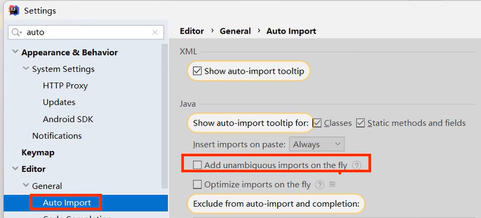

#### 2.3 调用其他包下程序的注意事项

1.同一个包下的类可以互相直接调用。

2.若当前程序中需要调用其他包下的程序，则必须在当前程序中导包。

+ 导包格式：`import 包名.类名;`

3.`java.lang`包下的程序无需导包即可调用。

4.若当前程序中需要调用多个不同包下的程序，而这些程序名恰好一样，则此时默认只能导入一个程序，另一个程序必须带包访问。示例如下：

+ 先创建两个包`package1`和`package2`，在两个包里面创建一个名字相同的类`Demo`。

  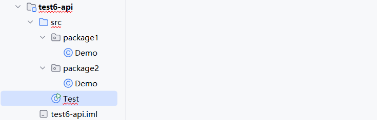

+ `package1`中的`Demo`类：

  ```java
  package package1;
  
  public class Demo {
      public void print() {
          System.out.println("this class locates in package1");
      }
  }
  ```

+ `package2`中的`Demo`类：

  ```java
  package package2;
  
  public class Demo {
      public void print() {
          System.out.println("this class locates in package2");
      }
  }
  ```

+ 此时若尝试在`Test`类中同时导入这两个名字相同的类，则一定会报错。因为系统无法识别`main`方法中`new`出来的`Demo`类具体是哪一个。

  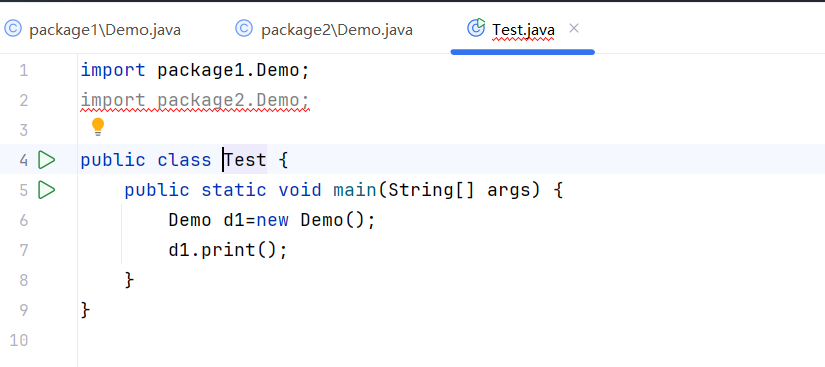

+ 正确做法为带包访问，如下：

  ```java
  import package1.Demo;
  
  public class Test {
      public static void main(String[] args) {
          Demo d1 = new Demo();
          d1.print();
          package2.Demo d2 = new package2.Demo();//带包访问
          d2.print();
      }
  }
  ```

+ **控制台**：

  ```
  this class locates in package1
  this class locates in package2
  ```

  

### 3.`Scanner`

+ **作用**：接收用户键盘输入的数据。

+ **代码示例**：输出用户输入的年龄和名字。

  ```java
  import java.util.Scanner;
  
  public class Test {
      public static void main(String[] args) {
          Scanner sc = new Scanner(System.in);
  
          System.out.println("请输入您的年龄：");
          int age = sc.nextInt();
          System.out.println("您的年龄是：" + age);
  
          System.out.println("请输入您的名字：");
          String name = sc.next();
          System.out.println("您的名字是：" + name);
      }
  }
  ```
  
+ **控制台**：

  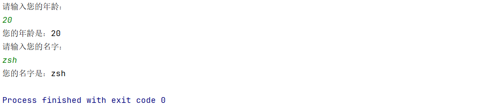


### 4.`Random`

+ **作用**：生成随机数。

+ **代码示例**：生成$[0,bound)$内的一个随机数。

  ```java
  import java.util.Random;
  import java.util.Scanner;
  
  public class Test {
      public static void main(String[] args) {
          Scanner sc = new Scanner(System.in);
          Random r = new Random();
  
          System.out.println("请输入bound：");
          int bound = sc.nextInt();
          int number = r.nextInt(bound);
          System.out.println("生成了[0," + bound + ")内的一个随机数：" + number);
      }
  }
  ```
  
+ **控制台**：

  


---


### 5.`String`

#### 5.1 `String`创建对象封装字符串数据的方式

方式一：Java程序中的所有字符串（例如“abc”）都为`String`类的对象。

```java
String name="black";
String schoolName="HIT";
```

方式二：调用`String`类的构造器来初始化字符串对象。

| 序号 | 构造器                           | 说明                                     |
| :--- | :------------------------------- | :--------------------------------------- |
| 01   | `public String()`                | 创建一个空字符串对象，不含任何内容。     |
| 02   | `public String(String original)` | 根据传入的字符串内容来创建字符串对象。   |
| 03   | `public String(char[] chars)`    | 根据**字符**数组的内容来创建字符串对象。 |
| 04   | `public String(byte[] bytes)`    | 根据**字节**数组的内容来创建字符串对象。 |


#### 5.2 `String`的常用方法

| 序号 | 方法                                                         | 说明                                                         |
| ---- | :----------------------------------------------------------- | :----------------------------------------------------------- |
| 01   | `int length()`                                               | 获取字符串的长度（即字符个数）并返回。                       |
| 02   | `char charAt(int index)`                                     | 获取索引位置处的字符并返回。                                 |
| 03   | `char[] toCharArray()`                                       | 将当前字符串转换成字符数组并返回。                           |
| 04   | `boolean equals(Object anObject)`                            | 判断当前字符串与另一字符串的内容是否一样，若一样则返回`true`。 |
| 05   | `boolean equalsIgnoreCase(String anotherString)`             | 同上，但忽略内容字母的大小写。                               |
| 06   | `String subString(int beginIndex,int endIndex)`              | 根据**起止**索引截取字符串（包前不包后），返回截取后的字符串。 |
| 07   | `String subString(int beginIndex)`                           | 只根据**起始**索引截取字符串，一直截取到字符串末尾，返回截取后的字符串。 |
| 08   | `String Replace(charSequence target,CharSequence replacement)` | 使用新的字符片段替换旧的字符片段，返回新的字符串。           |
| 09   | `boolean contains(Charsequence s)`                           | 判断当前字符串中是否包含了某个字符片段，若是则返回`true`。   |
| 10   | `boolean startsWith(String prefix)`                          | 判断当前字符串是否以某个字符串为开头，若是则返回`true`。     |
| 11   | `String[] spilt(String regex)`                               | 将字符串按照指定的字符串内容进行分割，并返回分割后的字符串数组。 |


#### 5.3 遍历字符串

##### 5.3.1 结合02方法

| 序号 | 方法                     | 说明                         |
| ---- | ------------------------ | ---------------------------- |
| 02   | `char charAt(int index)` | 获取索引位置处的字符并返回。 |

+ 代码示例：

```java
public class StringDemo1 {
    public static void main(String[] args) {
        String s = "ArthurMorgan";
        for (int i = 0; i < s.length(); i++) {
            char ch = s.charAt(i);
            System.out.print(ch + " ");
        }
    }
}
```

+ 控制台输出结果：

```
A r t h u r M o r g a n 
```


##### 5.3.2 结合03方法

| 序号 | 方法                   | 说明                               |
| ---- | ---------------------- | ---------------------------------- |
| 03   | `char[] toCharArray()` | 将当前字符串转换成字符数组并返回。 |

+ 代码示例：

```java
public class StringDemo1 {
    public static void main(String[] args) {
        String s = "ArthurMorgan";
        char[] chars = s.toCharArray();
        for (int i = 0; i < chars.length; i++) {
            System.out.print(chars[i] + " ");
        }
    }
}
```

+ 控制台输出结果：

```
A r t h u r M o r g a n 
```


#### 5.4 比较字符串

+ 错误示例：==直接用双等号比较字符串是最常见的错误。==

```java
String s1=new String("zsh");
String s2=new String("zsh");
System.out.println(s1 == s2);
```

+ 控制台输出结果：

```
false
```

+ 正确方法：使用04方法。

  | 序号 | 方法                              | 说明                                                         |
  | ---- | --------------------------------- | ------------------------------------------------------------ |
  | 04   | `boolean equals(Object anObject)` | 判断当前字符串与另一字符串的内容是否一样，若一样则返回`true`。 |

  + 示例：

    ```java
    String s1=new String("zsh");
    String s2=new String("zsh");
    System.out.println(s1.equals(s2));
    ```

  + 控制台输出结果：

    ```
    true
    ```


#### 5.5 08方法演示

| 序号 | 方法                                                         | 说明                                               |
| ---- | ------------------------------------------------------------ | -------------------------------------------------- |
| 08   | `String Replace(charSequence target,CharSequence replacement)` | 使用新的字符片段替换旧的字符片段，返回新的字符串。 |

+ 代码示例：替换敏感词。

```java
String info = "这个电影简直是个垃圾，垃圾电影！！";
String rs = info.replace("垃圾","**");
System.out.println(rs);
```

+ 控制台输出结果：

```
这个电影简直是个**，**电影！！
```


#### 5.6 注意事项

1.`String`对象的内容不可改变，被称为不可变字符串对象。


每次试图改变`String`对象时，实际上产生了新的`String`对象，旧的`String`对象的内容并没有改变，编译器只是将变量指向的`String`对象由旧对象修改为新对象。


2.只要是以`"..."`（包括`new String("...")`）方式写出的字符串对象，都会存放到堆内存中的字符串常量池，且相同内容的字符串只存储一份（节约内存），即它们的地址是一样的。

若通过`String str = new String("...")`来创建字符串对象，则每`new`一次都会产生一个新的对象存放于堆内存中。


3.编译优化机制：

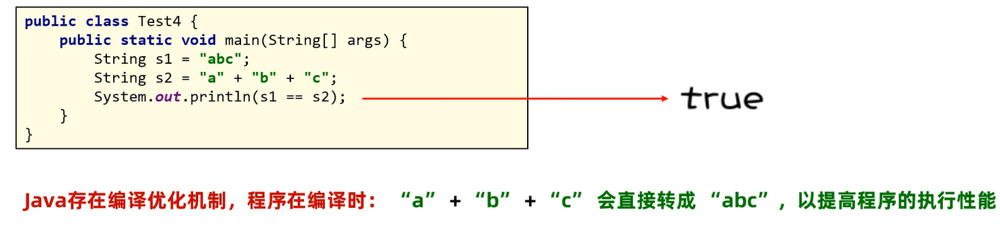


---


### 6.`ArrayList`

#### 6.1 构造器

| 序号 | 构造器                                  | 说明                                                     |
| ---- | --------------------------------------- | -------------------------------------------------------- |
| 01   | `public ArrayList()`                    | 构造一个初始容量为10的空集合，后续会随需求自动扩容。     |
| 02   | `public ArrayList(int initialCapacity)` | 构造一个具有指定初始容量的空集合，后续会随需求自动扩容。 |


#### 6.2 常用方法

| 序号 | 方法                            | 说明                                                         |
| ---- | ------------------------------- | ------------------------------------------------------------ |
| 01   | `boolean add(E e)`              | 将指定元素添加到集合末尾。                                   |
| 02   | `void add(int index,E element)` | 在集合的指定索引处插入指定元素。                             |
| 03   | `E get(int index)`              | 获取集合指定索引处的元素并返回。                             |
| 04   | `int size()`                    | 获取集合的元素个数并返回。                                   |
| 05   | `E remove(int index)`           | 删除集合指定索引处的元素，返回被删除的元素。                 |
| 06   | `boolean remove(Object o)`      | 删除集合的指定元素（默认删除第一次出现的元素），若删除成功则返回`true`。 |
| 07   | `E set(int index,E element)`    | 修改集合指定索引处的元素，返回**被修改前**的元素。           |


#### 6.3 典型易错案例

##### 6.3.1 概述

**需求**：假如购物车中存储了如下商品：Java入门、宁夏枸杞、黑枸杞、人字拖、特级枸杞、枸杞子。现在用户不想买枸杞了，选择了批量删除含有“枸杞”二字的商品，请完成该需求。

**分析**：

1. 使用`ArrayList`集合表示购物车，并存储以上商品。
2. 遍历集合中的所有元素，若某元素包含“枸杞”二字则删除它。
3. 打印集合到控制台以判断需求是否完成。


##### 6.3.2 原代码分析

```java
import java.util.ArrayList;

public class Test {
    public static void main(String[] args) {
        ArrayList<String> list = new ArrayList<>();
        list.add("Java入门");
        list.add("宁夏枸杞");
        list.add("黑枸杞");
        list.add("人字拖");
        list.add("特级枸杞");
        list.add("枸杞子");
        System.out.println("原购物车：" + list);

        for (int i = 0; i < list.size(); i++) {
            String good = list.get(i);
            if (good.contains("枸杞")) {
                list.remove(good);
            }
        }
        System.out.println("删除枸杞后的购物车：" + list);
    }
}
```

控制台输出结果：

```
原购物车：[Java入门, 宁夏枸杞, 黑枸杞, 人字拖, 特级枸杞, 枸杞子]
删除枸杞后的购物车：[Java入门, 黑枸杞, 人字拖, 枸杞子]
```

观察发现，我们的代码出现了bug，“黑枸杞”和“枸杞子”这两个商品并没有删除掉，具体分析如下：

```
i=0时，list[i]为"Java入门"，不含"枸杞"
购物车仍为：[Java入门, 宁夏枸杞, 黑枸杞, 人字拖, 特级枸杞, 枸杞子]
-------------------------------------------------------------
i=1时，list[i]为"宁夏枸杞"，含有"枸杞"，故从集合中删除掉
购物车变为：[Java入门, 黑枸杞, 人字拖, 特级枸杞, 枸杞子]
注意：此时"Java入门"后面的元素往前移动了一格，索引也随之减少了1，这就是bug的产生原因。
-------------------------------------------------------------
i=2时，list[i]为"人字拖"，不含"枸杞"
购物车仍为：[Java入门, 黑枸杞, 人字拖, 特级枸杞, 枸杞子]
注意："黑枸杞"这个元素由于索引变化而被我们的程序忽略了，由此产生了bug。
-------------------------------------------------------------
i=3时，list[i]为"特级枸杞"，含有"枸杞"，故从集合中删除掉
购物车变为：[Java入门, 黑枸杞, 人字拖, 枸杞子]
-------------------------------------------------------------
i=4时，list.size()已经缩减为4，二者相等，循环结束。
```


##### 6.3.3 debug

###### 方式一：每删除一个元素则索引减1

```java
for (int i = 0; i < list.size(); i++) {
    String good = list.get(i);
    if (good.contains("枸杞")) {
        list.remove(good);
        i--;
    }
}
```

###### 方式二：倒序遍历并删除

```java
for (int i = list.size()-1; i >= 0; i--) {
    String good = list.get(i);
    if (good.contains("枸杞")) {
        list.remove(good);
    }
}
```


---


### 7.`Object`

#### 7.1 概述

`Object`类是Java中所有类的祖宗类，因此Java中所有类的对象都可以直接使用`Object`类中提供的一些方法。


#### 7.2 常用方法

| 序号 | 方法                              | 说明                                                         |
| ---- | --------------------------------- | ------------------------------------------------------------ |
| 01   | `public String toString()`        | 返回对象的字符串表示形式，实际开发中主要交给子类重写，以便打印出对象的具体内容而非地址。 |
| 02   | `public boolean equals(Object o)` | 比较两个对象是否相等（默认比较地址），实际开发中主要交给子类重写，以便子类自定义比较规则。 |
| 03   | `protected Object clone()`        | 克隆对象。由于`protected`，该方法只能在`Object`类所处包下的其他类中使用，子类若想使用则必须重写该方法。 |

**注意**：以上3个方法重写都可以通过IDEA快捷生成。


#### 7.3 03方法讲解

##### 7.3.1 注意事项

**Tip1**：若想使用该方法，则这个类**必须重写该方法**并且实现`Cloneable`接口，否则报错。

`Cloneable`接口源码：


可以发现，该接口中什么内容都没有，这种接口称为**标记接口**，只有这样Java虚拟机才能识别并赋予这个类克隆对象的能力。

**Tip2**：此外还必须在`main`方法开头抛出`CloneNotSupportedException`异常，否则依旧报错。

```java
public class Test {
    public static void main(String[] args) throws CloneNotSupportedException {
        Student s1 = new Student("zsh", 20);
        Student s2 = (Student) s1.clone();//记得进行类型转换
    }
}
```


##### 7.3.2 浅拷贝与深拷贝

> [!Tip]
>
> 也叫浅克隆与深克隆。

+ **浅拷贝**：拷贝出的对象与原对象中的数据一模一样（引用类型数据拷贝的只是地址）。

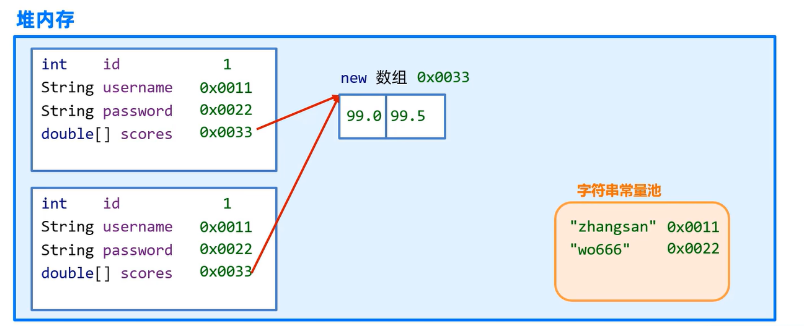

+ **深拷贝**：
  + 对象中的基本类型数据直接拷贝。
  + 对象中的字符串数据拷贝的还是地址。
  + 对象中的其他引用类型数据不会拷贝地址，而会创建新对象。


---


### 8.`Objects`

#### 8.1 概述

`Objects`类是一个工具类，提供了很多操作对象的静态方法给我们使用，可以直接用`Objects.类名`的方式调用。


#### 8.2 常用方法

| 序号 | 方法                                       | 说明                                   |
| ---- | ------------------------------------------ | -------------------------------------- |
| 01   | `static boolean equals(Object a,Object b)` | 先做非空判断，再比较两个对象是否相等。 |
| 02   | `static boolean isNull(Object obj)`        | 判断对象是否为空，是返回`true`。       |
| 03   | `static boolean nonNull(Object obj)`       | 判断对象是否为非空，是返回`true`。     |


#### 8.3 01方法讲解

思考：`String`已经提供了`equals`方法用于比较两个对象是否相等，为什么官方更推荐使用`Objects.equals`方法呢？

来看下面的例子：

```java
import java.util.Objects;

public class Test {
    public static void main(String[] args) {
        String s1 = null;
        String s2 = "itheima";

        System.out.println(s1.equals(s2));
    }
}
```

控制台输出结果：


可以发现，代码产生了`NullPointerException`，即空指针异常。

---

现在，我们将代码第10行修改为`System.out.println(Objects.equals(s1, s2));`，再来看控制台输出结果：

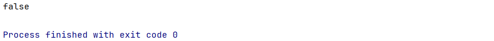

可以发现，控制台能够正常输出，说明代码已经没有bug了。

debug原因参见源码：

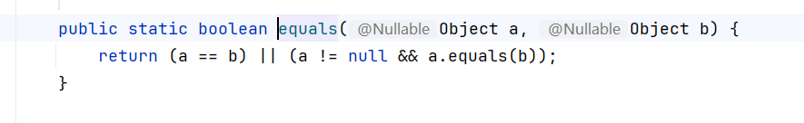

**总结**：使用`Objects.equals`方法能够避免入参中有`null`而产生空指针异常的问题，程序健壮性更好。


---


### 9.包装类

#### 9.1 概述

包装类用于把基本数据类型包装成对象，从而实现Java“万物皆对象”的理念，同时也能更好地支持泛型。


#### 9.2 基本数据类型对应的包装类

| 基本数据类型 | 对应的包装类（引用数据类型） |
| :----------: | :--------------------------: |
|    `byte`    |            `Byte`            |
|   `short`    |           `Short`            |
|    `int`     |          `Integer`           |
|    `long`    |            `Long`            |
|    `char`    |         `Character`          |
|   `float`    |           `Float`            |
|   `double`   |           `Double`           |
|  `boolean`   |          `Boolean`           |


#### 9.3 `Integer`

##### 9.3.1 包装方法

| 方法                            | 说明                                   |
| ------------------------------- | -------------------------------------- |
| `static Integer valueOf(int i)` | 将`int`类型的数据转换成`Integer`对象。 |

示例：`Integer a = Integer.valueOf(12);`

##### 9.3.2 自动装箱与自动拆箱机制

+ 自动装箱：可以自动把基本数据类型转换成对应的包装类对象。

  + 示例：`Integer a1 = 12;`

+ 自动拆箱：可以自动把包装类对象转换成对应的基本数据类型。

  + 示例：

    ```java
    Integer a2 = 12;
    int a3 = a2;//自动拆箱
    ```


#### 9.4 包装类的常见操作（以`Integer`为例）

+ 可以把基本数据类型转换成字符串类型：
  + `public static String toString(double d)`
  + `public String toString()`
+ 可以把字符串类型的**数值**转换成数值本身对应的数据类型：
  + `public static int parseInt(String s)`
  + `public static Integer valueOf(String s)`


---


### 10A.`StringBuilder`与`StringBuffer`

#### 10A.1 概述

+ `StringBuilder`代表可变字符串对象，相当于一个容器，里面装的字符串是可以改变的。
+ `StringBuilder`就是用来操作字符串的。
+ 优点：`StringBuilder`比`String`更适合做字符串的修改操作，效率更高，代码更简洁。


#### 10A.2 构造器

| 序号 | 构造器                            | 说明                                                       |
| ---- | --------------------------------- | ---------------------------------------------------------- |
| 01   | `public StringBuilder()`          | 创建一个初始容量为16个字符的可变字符串对象，不含任何字符。 |
| 02   | `public StringBuiler(String str)` | 创建一个初始含有指定字符串内容的可变字符串对象。           |


#### 10A.3 常用方法

| 序号 | 方法                             | 说明                                                  |
| ---- | -------------------------------- | ----------------------------------------------------- |
| 01   | `StringBuilder append(任意类型)` | 添加数据并返回`StringBuilder`对象本身，支持链式编程。 |
| 02   | `StringBuilder reverse()`        | 反转对象内容。                                        |
| 03   | `int length()`                   | 返回对象内容长度（字符数）。                          |
| 04   | `String toString()`              | 将`StringBuilder`转换成`String`。                     |


#### 10A.4 使用`StringBuilder`操作字符串的优势

##### P1 原代码

```java
public class Test2 {
    public static void main(String[] args) {
        String rs = "";
        for (int i = 0; i < 1000000; i++) {
            rs += "abc";
        }
        System.out.println(rs);
    }
}
```

运行此代码后，控制台迟迟未输出结果，只能手动终止，证明以上代码运行效率极低。


##### P2 使用`StringBuilder`优化后的代码

```java
public class Test2 {
    public static void main(String[] args) {
        StringBuilder stringBuilder=new StringBuilder();
        for (int i = 0; i < 1000000; i++) {
            stringBuilder.append("abc");
        }
        System.out.println(stringBuilder);
    }
}
```

运行此代码后，控制台只用了1~2秒便输出结果，效率大大提高。


##### P3 分析及启示

+ **分析**：参见[5.6 注意事项](####5.6 注意事项)。
  + `String`是不可变字符串对象，也就是说它一旦被赋值就不可改变。每次试图改变`String`对象时，实际上产生了新的`String`对象，旧的`String`对象的内容并没有改变，编译器只是将变量指向的`String`对象由旧对象修改为新对象，因此原代码在`for`循环中每运行一次就会创建一个新的`String`对象，这大大增加了内存开销，导致运行效率极低。
  + 而`StringBuilder`是可变字符串对象，这意味着在`for`循环中无论运行多少次，变量指向的都是最初的`StringBuilder`对象，内存开销减少，效率自然就上来了。
+ **启示**：
  + 如果需要频繁拼接或修改字符串，建议使用`StringBuilder`，效率会更高！
  + 如果对字符串操作较少，或者不需要操作字符串，只是为了定义字符串变量，则建议使用`String`。


#### 10A.5 `StringBuffer`

+ `StringBuffer`和`StringBuilder`的用法完全一致。
+ **区别**：`StringBuffer`是线程安全的，`StringBuilder`是线程不安全的。


#### 10A.6 综合案例

+ **需求**：设计一个方法，将一个整型数组的内容输出为指定格式的字符串，形如`[11, 22, 33]`。

+ **代码**：

  ```java
  public class Test3 {
      public static void main(String[] args) {
          System.out.println(transferArrayToFormattedString(new int[]{11, 22, 33}));
      }
  
      public static String transferArrayToFormattedString(int[] array) {
          // 1.非空校验
          if (array == null) {
              return null;
          }
  
          // 2.若array非空，则使用StringBuilder将其内容输出为指定格式的字符串
          StringBuilder stringBuilder = new StringBuilder();
          stringBuilder.append("[");
          // 遍历到倒数第二个元素即可，否则最后一个元素末尾也会拼接", "
          for (int i = 0; i < array.length - 1; i++) {
              stringBuilder.append(array[i]).append(", ");
          }
          stringBuilder.append(array[array.length-1]).append("]");
  
          // 3.将StringBuilder对象转换为String对象再返回
          return stringBuilder.toString();
      }
  }
  ```

+ **控制台**：

  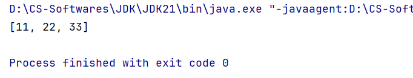


---


### 10B.`StringJoiner`

#### 10B.1 概述

+ `JDK8`开始才推出的新`API`，和`StringBuilder`一样也是用来操作字符串的，也可以看作是一个容器，创建之后内容可变。
+ **优势**：不仅能提高字符串的操作效率，而且在某些场景下使用它操作字符串，==代码会更简洁==，参见[11.4](####11.4 使用`StringJoiner`重新实现综合案例[10.6](####10.6 综合案例))


#### 10B.2 构造器

| 序号 | 构造器                                        | 说明                                                         |
| ---- | --------------------------------------------- | ------------------------------------------------------------ |
| 01   | `public StringJoiner(间隔符)`                 | 创建一个`StringJoiner`对象，指定拼接时的间隔符。             |
| 02   | `public StringJoiner(间隔符, 开始符, 结束符)` | 创建一个`StringJoiner`对象，指定拼接时的间隔符、开始符和结束符。 |


#### 10B.3 常用方法

| 序号 | 常用方法                                    | 说明                           |
| ---- | ------------------------------------------- | ------------------------------ |
| 01   | `StringJoiner add(CharSequence newElement)` | 拼接字符序列，并返回对象本身。 |
| 02   | `int length()`                              | 返回对象内容长度（字符数）。   |
| 03   | `String toString()`                         | 返回拼接之后的字符串。         |


#### 10B.4 使用`StringJoiner`重新实现综合案例[10.6](####10.6 综合案例)

+ **代码**：

  ```java
  import java.util.StringJoiner;
  
  public class Test3 {
      public static void main(String[] args) {
          System.out.println(transferArrayToFormattedString(new int[]{11, 22, 33}));
      }
  
      public static String transferArrayToFormattedString(int[] array){
          // 1.非空校验
          if (array == null) {
              return null;
          }
  
          // 2.若array非空，则使用StringJoiner将其内容输出为指定格式的字符串
          StringJoiner stringJoiner=new StringJoiner(", ", "[", "]");
          for (int i = 0; i < array.length; i++) {
              stringJoiner.add(String.valueOf(array[i]));
          }
  
          // 3.将StringJoiner对象转换为String对象再返回
          return stringJoiner.toString();
      }
  }
  ```

+ **控制台**：

  


---


### 11.`Math`

> 数学类，是一个工具类，里面提供的都是对数据进行操作的一些静态方法。

#### 常用方法

| 序号 | 方法                                    | 说明                                                  |
| ---- | --------------------------------------- | ----------------------------------------------------- |
| 01   | `static int abs(int a)`                 | 返回a的绝对值                                         |
| 02   | `static double ceil(double a)`          | 对a向上取整                                           |
| 03   | `static double floor(double a)`         | 对a向下取整                                           |
| 04   | `static int round(float a)`             | 对a四舍五入                                           |
| 05   | `static int max(int a, int b)`          | 返回a和b中的较大值                                    |
| 06   | `static double pow(double a, double b)` | 返回$a^b$                                             |
| 07   | `static double random()`                | 返回一个`double`类型的**伪随机数**，范围是$[0.0,1.0)$ |


---


### 12.`System`

> 代表程序所在的系统，也是一个工具类。

#### 常用方法

| 序号 | 方法                              | 说明                                                         |
| ---- | --------------------------------- | ------------------------------------------------------------ |
| 01   | `static void exit(int status)`    | 退出当前运行的JVM，`status`取0时表示正常退出，取其它值表示异常退出。 |
| 02   | `static long currentTimeMillis()` | 以毫秒形式返回当前系统时间戳。                               |


---


### 13.`Runtime`

#### 13.1 概述

+ `Runtime`指代程序所在的运行环境，分析源码可知它是一个单例类。

  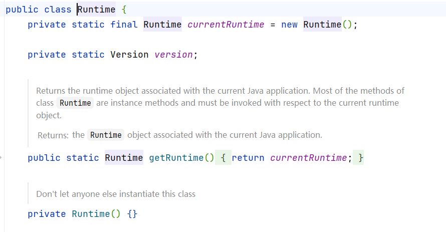

#### 13.2 常用方法

| 序号 | 方法                           | 说明                                     |
| ---- | ------------------------------ | ---------------------------------------- |
| 01   | `static Runtime getRuntime()`  | 返回与当前Java应用程序关联的运行时对象。 |
| 02   | `void exit(int status)`        | 退出当前运行的JVM。                      |
| 03   | `int availableProcessors()`    | 返回JVM可用的处理器数量。                |
| 04   | `long totalMemory()`           | 返回JVM中的内存总量（单位：字节）。      |
| 05   | `long freeMemory()`            | 返回JVM中的可用内存量（单位：字节）。    |
| 06   | `Process exec(String command)` | 执行某个进程，并返回代表该进程的对象。   |


---


### 14.`BigDecimal`

#### 14.1 引入背景

`BigDecimal`是为了解决浮点数运算时结果失真的问题。

首先编写以下测试代码：

```java
public class Test1 {
    public static void main(String[] args) {
        double a = 0.1;
        double b = 0.2;
        System.out.println(a + "+" + b + "=" + (a + b));
    }
}
```

代码运行后控制台输出结果与我们的常识不符：


这是由于浮点数精度是有限的，因为0.1和0.2是二进制下的无限循环小数，所以它们转换成IEEE754双精度浮点数后势必丢失精度，因此结果转换回十进制会不精确。


#### 14.2 底层原理：为什么`BigDecimal`是精确的？

`BigDecimal`根本不把数字存储为二进制小数。它直接存储十进制数字的每一位（作为整数），并记录小数点位置。所有的计算都是基于整数运算完成的，因此可以精确表示像 0.1和0.2这样的数。


#### 14.3 构造器

| 序号 | 构造器                          | 说明                                                         |
| ---- | ------------------------------- | ------------------------------------------------------------ |
| 01   | `public BigDecimal(double val)` | 将`double`类型变量转换为`BigDecimal`类型变量，==不推荐使用==。 |
| 02   | `public BigDecimal(String val)` | 将`String`类型变量转换为`BigDecimal`类型变量。               |


#### 14.4 常用方法

| 序号 | 方法                                                  | 说明                                                         |
| ---- | ----------------------------------------------------- | ------------------------------------------------------------ |
| 01   | `staic BigDecimal valueOf(double val)`                | 将`double`类型变量转换为`BigDecimal`类型变量，==推荐使用==。 |
| 02   | `BigDecimal add(BigDecimal b)`                        | 加                                                           |
| 03   | `BigDecimal subtract(BigDecimal b)`                   | 减                                                           |
| 04   | `BigDecimal multiply(BigDecimal b)`                   | 乘                                                           |
| 05   | `BigDecimal divide(BigDecimal b)`                     | 除                                                           |
| 06   | `BigDecimal divide(BigDecimal b, 精确几位, 舍入模式)` | 除，可以控制精确到小数点后几位和采用何种舍入模式。           |
| 07   | `double doubleValue()`                                | 将`BigDecimal`类型变量转换为`double`类型变量。               |


#### 14.5 使用`BigDecimal`重构测试代码

+ **代码**：

  ```Java
  public class Test1 {
      public static void main(String[] args) {
          double a = 0.1;
          double b = 0.2;
          BigDecimal a1 = BigDecimal.valueOf(a);
          BigDecimal b1 = BigDecimal.valueOf(b);
          System.out.println(a + "+" + b + "=" + a1.add(b1));
      }
  }
  ```

+ **控制台**：输出了正确结果，没有发生精度丢失。

  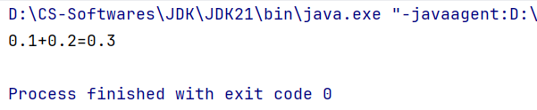


---


### 15.日期与时间

#### 15.1 `JDK8`之前传统的日期与时间（不推荐，仅用于老项目维护）

##### 15.1.1 `Date`

> 代表日期和时间。

###### P1 构造器

| 序号 | 构造器                   | 说明                                               |
| ---- | ------------------------ | -------------------------------------------------- |
| 01   | `public Date()`          | 创建一个`Date`对象，代表系统此时此刻的日期和时间。 |
| 02   | `public Date(long time)` | 把当前时间的毫秒值转换成`Date`对象。               |

###### P2 常用方法

| 序号 | 方法                      | 说明                             |
| ---- | ------------------------- | -------------------------------- |
| 01   | `long getTime()`          | 返回当前时间戳的毫秒值。         |
| 02   | `void setTime(long time)` | 将`Date`对象的时间设置为`time`。 |


##### 15.1.2 `SimpleDateFormat`

> 代表简单日期格式化，可以将`Date`对象或时间戳格式化成指定形式。

###### P0 日期时间格式

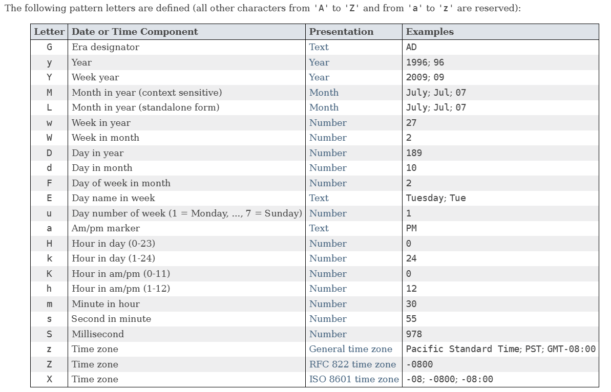


###### P1 构造器

| 序号 | 构造器                                    | 说明                                                         |
| ---- | ----------------------------------------- | ------------------------------------------------------------ |
| 01   | `public SimpleDateFormat(String pattern)` | 创建一个`SimpleDateFormat`对象，并封装我们指定的日期时间格式。 |

###### P2 常用方法

| 序号 | 方法                               | 说明                                                         |
| ---- | ---------------------------------- | ------------------------------------------------------------ |
| 01   | `final String format(Date date)`   | 将`Date`对象格式化成日期时间字符串。                         |
| 02   | `final String format(Object time)` | 将时间戳格式化成日期时间字符串。                             |
| 03   | `Date parse(Stirng source)`        | 将日期时间字符串解析成`Date`对象。<br />**注意**：创建的`SimpleDateFormat`对象的日期时间格式必须与`source`的日期格式保持一致，否则报错。 |


##### 15.1.3 练习：秒杀活动

###### P1 需求


###### P2 代码实现+控制台输出

```java
import java.text.ParseException;
import java.text.SimpleDateFormat;

public class FlashSale {
    private static final String START_TIME = "2023年11月11日 0:00:00";
    private static final String END_TIME = "2023年11月11日 0:10:00";
    private static final String XIAO_JIA_PAY_TIME = "2023年11月11日 0:01:18";
    private static final String XIAO_PI_PAY_TIME = "2023年11月11日 0:10:51";

    public static void main(String[] args) throws ParseException {

        long startTime = parseDateToTime(START_TIME);
        long endTime = parseDateToTime(END_TIME);
        long xiaoJiaPayTime = parseDateToTime(XIAO_JIA_PAY_TIME);
        long xiaoPiPayTime = parseDateToTime(XIAO_PI_PAY_TIME);

        if (getQuality(xiaoJiaPayTime, startTime, endTime)) {
            System.out.println("小贾参加了秒杀活动");
        } else {
            System.out.println("小贾没有参加秒杀活动");
        }

        if (getQuality(xiaoPiPayTime, startTime, endTime)) {
            System.out.println("小皮参加了秒杀活动");
        } else {
            System.out.println("小皮没有参加秒杀活动");
        }
    }

    private static long parseDateToTime(String dateString) throws ParseException {
        SimpleDateFormat dateFormat = new SimpleDateFormat("yyyy年MM月dd日 H:mm:ss");
        return dateFormat.parse(dateString).getTime();
    }

    private static boolean getQuality(long payTime, long startTime, long endTime) {
        if (payTime >= startTime && payTime <= endTime) {
            return true;
        } else {
            return false;
        }
    }
}
```

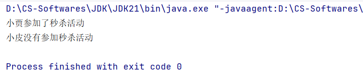


##### 15.1.4 `Calendar`

> 代表此时此刻对应的日历，通过`Calendar`可以单独获取和修改`Date`对象中的年、月、日、时、分、秒等等，

###### 常用方法

| 序号 | 方法                              | 说明                                                       |
| ---- | --------------------------------- | ---------------------------------------------------------- |
| 01   | `static Calendar getInstance()`   | 获取当前日历对象。                                         |
| 02   | `int get(int field)`              | 获取日历中的某个信息。                                     |
| 03   | `final Date getTime()`            | 获取`Date`对象，                                           |
| 04   | `long getTimeMillis()`            | 获取时间戳。                                               |
| 05   | `void set(int field, int value)`  | 修改日历的某个信息。                                       |
| 06   | `void add(int field, int amount)` | 为某个信息增加指定的值。（也可以减少，`amount`取负值即可） |


---


#### 15.2 `JDK8`开始新增的日期与时间（推荐）

##### 15.2.1 为什么要学习新增的日期与时间？

+ **传统日期与时间的局限性**：
  + 设计不合理，使用不方便，大多数被淘汰了。
  + 都是==可变==对象，修改后会丢失最开始的日期时间信息。
  + 线程不安全。
  + 只能精确到毫秒级。
+ **新增日期与时间的优势**：
  + 设计更合理，使用更方便，功能丰富。
  + 都是==不可变==对象，修改后会返回新的时间对象，不会丢失最开始的日期时间信息。
  + 线程安全。
  + 能精确到纳秒级。


##### 15.2.2 代替`Calendar`--`Local`家族

> [!Warning]
>
> 以下行文中，LocalXxx指代`LocalDate/LocalTime/LocalDateTime`，
>
> Yyy指代`Year/MonthValue/DayOfMonth/DayOfYear/Hour/Minute/Second/Nano`（即下文所述的“某个信息”）。

###### P1 分类

+ `LocalDate`：本地日期（年、月、日、星期）。
+ `LocalTime`：本地时间（时、分、秒、纳秒）。
+ `LocalDateTime`：本地日期时间（年、月、日、星期、时、分、秒、纳秒）。


###### P2 获取对象的方法

| 序号 | 方法                                      | 说明                                   |
| ---- | ----------------------------------------- | -------------------------------------- |
| 01   | `static LocalXxx now()`                   | 获取系统当前时间对应的`LocalXxx`对象。 |
| 02   | `static LocalXxx of(param1, param2, ...)` | 获取指定时间的`LocalXxx`对象。         |


###### P3 三者通用方法

| 序号 | 方法                                      | 说明                                                         |
| ---- | ----------------------------------------- | ------------------------------------------------------------ |
| 01   | `int getYyy()`                            | 获取某个信息（年/月/日/时/分/秒/纳秒...）                    |
| 02   | `DayOfWeek getDayOfWeek()`                | 获取今天是当周第几日。<br />获取星期几：`int dayOfWeek = localDate.getDayOfWeek().getValue()` |
| 03   | `LocalXxx withYyy()`                      | 直接修改某个信息。                                           |
| 04   | `LocalXxx plusYyy(long toAdd)`            | 为某个信息增加指定的值。                                     |
| 05   | `LocalXxx minusYyy(long toSubstract)`     | 为某个信息减少指定的值。                                     |
| 06   | `boolean equals(LocalXxx anotherLocal)`   | 判断该`LocalXxx`对象是否等于另一个`LocalXxx`对象。           |
| 07   | `boolean isBefore(LocalXxx anotherLocal)` | 判断该`LocalXxx`对象是否早于另一个`LocalXxx`对象。           |
| 08   | `boolean isAfter(LocalXxx anotherLocal)`  | 判断该`LocalXxx`对象是否晚于另一个`LocalXxx`对象。           |


###### P4 三者转换方法

| 序号 | 方法                                                      | 说明                                                         |
| ---- | --------------------------------------------------------- | ------------------------------------------------------------ |
| 01   | `LocalDate toLocalDate()`                                 | 把`LocalDateTime`对象转换成`LocalDate`对象。                 |
| 02   | `LocalTime toLocalTime()`                                 | 把`LocalDateTime`对象转换成`LocalTime`对象。                 |
| 03   | `static LocalDateTime of(LocalDate date, LocalTime time)` | 把`LocalDate`对象和`LocalTime`对象合并成`LocalDateTime`对象。 |


---


##### 15.2.3 代替`Calender`--`Zone`家族

###### P1 `ZoneId`：时区ID

| 序号 | 静态方法                                   | 说明                             |
| ---- | ------------------------------------------ | -------------------------------- |
| 01   | `static ZoneId systemDefault()`            | 获取系统默认时区ID。             |
| 02   | `static Set<String> fetAvailableZoneIds()` | 获取Java支持的全部时区ID。       |
| 03   | `static ZoneId of(String zoneId)`          | 把某个时区ID封装成`ZoneId`对象。 |


###### P2 `ZoneDateTime`：带时区的时间

> [!Tip]
>
> 同样支持`Local`家族的通用方法，参见[三者通用方法](######P3 三者通用方法)。

| 序号 | 静态方法                                     | 说明                                   |
| ---- | -------------------------------------------- | -------------------------------------- |
| 01   | `static ZoneDateTime now(ZoneId zoneId)`     | 获取某个时区的`ZoneDateTime`对象。     |
| 02   | `static ZoneDateTime now(Clock.systemUTC())` | 获取世界标准时间UTC。                  |
| 03   | `static ZoneDateTime now()`                  | 获取系统默认时区的`ZoneDateTime`对象。 |


---


##### 15.2.4 代替`Date`--`Instant`

###### P1 概述

+ `Instant`代表时间线上的某个时刻，也叫时间戳。
+ 通过获取`Instant`对象可以拿到当前时刻，该时刻由**两部分**组成：
  + 从1970-01-01 00:00:00（*<u>计算机元年</u>*）开始走到该时刻经历的**总秒数**。
  + 剩余的**不足1秒的纳秒数**。
+ **作用**：
  1. 记录代码执行时间，进行代码性能分析；
  2. 记录用户操作某个事件的时间点。


###### P2 常用方法

| 序号 | 方法                                                      | 说明                                                       |
| ---- | --------------------------------------------------------- | ---------------------------------------------------------- |
| 01   | `static Instant now()`                                    | 获取当前时刻的`Instant`对象（UTC）。                       |
| 02   | `long getEpochSecond()`                                   | 获取从计算机元年开始走到该时刻经历的总秒数。               |
| 03   | `int getNano()`                                           | 获取剩余的不足1秒的纳秒数。                                |
| 04   | `Instant plusSeconds/Millis/Nanos(long toAdd)`            | 为某个信息增加指定的值。                                   |
| 05   | `Instant minusSeconds/Millis/Nanos(long toSubstract)`     | 为某个信息减少指定的值。                                   |
| 06   | `boolean equals/isBefore/isAfter(Instant anotherInstant)` | 判断该`Instant`对象是否等于/早于/晚于另一个`Instant`对象。 |


---


##### 15.2.5 代替`SimpleDateFormat`--`DateTimeFormatter`

> 日期时间格式化器，用于日期时间的格式化和解析。

###### P1 `DateTimeFormatter`提供的常用方法

| 序号 | 方法                                               | 说明                 |
| ---- | -------------------------------------------------- | -------------------- |
| 01   | `static DateTimeFormatter ofPattern(日期时间格式)` | 获取格式化器对象。   |
| 02   | `String format(日期时间对象)`                      | 正向格式化日期时间。 |


###### P2 `LocalDateTime`提供的格式化和解析日期时间的方法

| 序号 | 方法                                                         | 说明                 |
| ---- | ------------------------------------------------------------ | -------------------- |
| 01   | `String format(DateTimeForamtter formatter)`                 | 反向格式化日期时间。 |
| 02   | `static LocalDateTime parse(CharSequence text, DateTimeFormatter formatter)` | 解析时间。           |


###### P3 代码示例+控制台输出

```java
import java.time.LocalDateTime;
import java.time.format.DateTimeFormatter;

public class DateTimeFormatterTest {
    public static void main(String[] args) {
        DateTimeFormatter formatter = DateTimeFormatter.ofPattern("yyyy/MM/dd HH:mm:ss");

        LocalDateTime now = LocalDateTime.now();
        System.out.println(now);

        String rs1 = formatter.format(now);// 正向格式化
        System.out.println("rs1: " + rs1);

        String rs2 = now.format(formatter);// 反向格式化
        System.out.println("rs2: " + rs2);

        String dateTimeStr = "2026/01/01 00:00:00";
        LocalDateTime localDateTime = LocalDateTime.parse(dateTimeStr, formatter);
        System.out.println(localDateTime);
    }
}
```

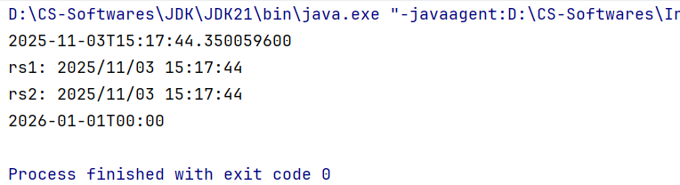


---


##### 15.2.6 其它

###### P1 `Period`

> [!Warning]
>
> 可以且只能用于计算两个`LocalDate`对象相差的年数、月数、日数。
>
> 示例：2020-01-01与2026-02-08间隔6年、<u>1月、7日</u>。

| 序号 | 常用方法                                                | 说明                                        |
| ---- | ------------------------------------------------------- | ------------------------------------------- |
| 01   | `static Period between(LocalDate start, LocalDate end)` | 传入两个`LocalDate`对象，得到`Period`对象。 |
| 02   | `int getYears/Months/Days()`                            | 计算并返回间隔的年数/月数/日数。            |


###### P2 `Duration`

> [!Caution]
>
> 可以用于计算两个日期时间对象（包括`LocalTime, LocalDateTime, Instant`）相差的日数、小时数、分钟数、秒数、毫秒数、纳秒数。
>
> 示例：2026-01-01 00:00:00与2026-02-08 12:30:30间隔38日、924小时、55470分钟、3328230秒。

| 序号 | 常用方法                                                     | 说明                                                    |
| ---- | ------------------------------------------------------------ | ------------------------------------------------------- |
| 01   | `static Duration between(日期时间对象 start, 日期时间对象 end)` | 传入两个日期时间对象对象，得到`Duration`对象。          |
| 02   | `long toDays/Hours/Minutes/Seconds/Millis/Nanos()`           | 计算并返回间隔的日数/小时数/分钟数/秒数/毫秒数/纳秒数。 |


---


### 16A.`Arrays`

> 用来操作数组的一个工具类。
>

#### 16A.1 常用方法

| 序号 | 方法                                                         | 说明                                                         |
| ---- | ------------------------------------------------------------ | ------------------------------------------------------------ |
| 01   | `static String toString(类型[] arr)`                         | 返回数组内容。                                               |
| 02   | `static int[] copyOfRange(类型[] arr, int startIndex, int endIndex)` | 按指定范围将原数组拷贝到新数组，包前不包后。                 |
| 03   | `static copyOf(类型[] arr, int newLength)`                   | 将原数组拷贝到新数组  ，同时可指定新数组的长度，即数组扩容。 |
| 04   | `static setAll(double[] arr, IntToDoubleFunction generator)` | 把数组中的原数据修改为新数据。                               |
| 05   | `static void sort(类型[] arr)`                               | 对数组进行排序（默认升序）。                                 |


#### 16A.2 04方法演示

##### P1 需求

把一个数组`prices`存储的所有价格数据都打8折，然后存回去。

##### P2 代码实现+控制台输出

**注意**：实际上04方法`static setAll(double[] arr, IntToDoubleFunction generator)`的第2个形参是要我们传入一个临时新建的匿名内部类。

```java
import java.util.Arrays;
import java.util.function.IntToDoubleFunction;

public class Test1 {
    public static void main(String[] args) {
        double[] prices = {99.8, 128, 100};
        System.out.println("原价：" + Arrays.toString(prices));
        
        Arrays.setAll(prices, new IntToDoubleFunction() {
            @Override
            public double applyAsDouble(int value) {// value即数组索引
                return prices[value] * 0.8;
            }
        });
        System.out.println("折后价：" + Arrays.toString(prices));
    }
}

```


##### P3 结合`Lambda`表达式简化代码实现

```java
import java.util.Arrays;
import java.util.function.IntToDoubleFunction;

public class Test1 {
    public static void main(String[] args) {
        double[] prices = {99.8, 128, 100};
        System.out.println("原价：" + Arrays.toString(prices));

        Arrays.setAll(prices, (value) -> {
            return prices[value] * 0.8;
        });
        System.out.println("折后价：" + Arrays.toString(prices));
    }
}
```


---


### 16B.`Comparable`与`Comparator`

#### 16B.1 引入背景

如果数组中存储的是对象，我们应该如何排序？

新建一个实体类(`JavaBean`)--`Student`类：

```java
package arrays;

public class Student {
    private String name;
    private double height;
    private int age;
    
    public Student(String name, double height, int age) {
        this.name = name;
        this.height = height;
        this.age = age;
    }

    // 省略getter&setter
}
```

然后在`Test`类中尝试使用`Arrays`的05排序方法对一个`Student`数组进行排序，参见[17.1 常用方法](####17.1 常用方法)。

```java
package arrays;

import java.util.Arrays;

public class Test {
    public static void main(String[] args) {
        Student[] students = new Student[4];
        students[0] = new Student("Zsh", 173.5, 20);
        students[1] = new Student("Zjl", 178.0, 19);
        students[2] = new Student("Zxj", 161.5, 15);
        students[3] = new Student("Czb", 188.8, 15);

        Arrays.sort(students);
    }
}
```

运行上述代码后，控制台输出如下：


可以看到代码直接报错，说明这种方法不能直接对存储了对象的数组进行排序，原因是没有指定具体的排序规则，Java不知道如何进行排序，因此我们引入了`Comparable`与`Comparator`，用于自定义排序规则。


---


#### 16B.2 `Comparable`

> [!Tip]
>
> 让实体类实现`Comparable<T>`这个泛型接口，然后重写`compareTo`方法，自定义比较规则。这时候再用`Arrays`的05排序方法即可以成功对`Student`数组进行排序了。

##### P0 `compareTo`方法使用指南

+ **入门**：

```java
/**
 * @param o the object to be compared.
 *
 * 自定义比较规则：this 和 T o 进行比较
 * 升序情况下：
 * 若想要 this>o ，则返回正整数；
 * 若想要 this<o ，则返回负整数；
 * 若想要 this=o ，则返回0。
 *
 * 降序情况下：
 * 若想要 this>o ，则返回负整数；
 * 若想要 this<o ，则返回整整数；
 * 若想要 this=o ，则返回0。
 */
@Override
public int compareTo(T o) {
    if(this.param > o.param){
        return ...;
    } else if(this.param < o.param){
        return ...;
    } else{
        return 0;
    }
}
```

+ **进阶**（开发中更推荐，但要注意只适用于`param`是`int`类型的情况，其他情况下仍然按照入门指南编码，防止bug）：

```java
/**
 * @param o the object to be compared.
 *
 * 自定义比较规则：this 和 T o 进行比较
 * 升序情况下：return this.param - o.param;
 * 降序情况下：return o.param - this.param;
 * 简记：升序this在前，降序this在后
 */
@Override
public int compareTo(T o) {
    return this.param - o.param;// 升序
}
```


##### P1 修改`Student`实体类

```java
package arrays;

public class Student implements Comparable<Student> {
    private String name;
    private double height;
    private int age;

    public Student(String name, double height, int age) {
        this.name = name;
        this.height = height;
        this.age = age;
    }

    @Override
    public int compareTo(Student o) {
        return this.age - o.age;// 按年龄升序
    }

    @Override
    public String toString() {
        return "name: "+name+", height: "+height+", age: "+age+";";
    }
    
    // 省略getter&setter   
}
```


##### P2 修改`Test`类

```java
package arrays;

import java.util.Arrays;
import java.util.StringJoiner;

public class Test {
    public static void main(String[] args) {
        Student[] students = new Student[4];
        students[0] = new Student("Zsh", 173.5, 20);
        students[1] = new Student("Zjl", 178.0, 19);
        students[2] = new Student("Zxj", 161.5, 15);
        students[3] = new Student("Czb", 188.8, 15);

        Arrays.sort(students);
        String[] sortedStudents=Arrays.toString(students).split(";");
        for (String sortedStudent : sortedStudents) {
            System.out.println(sortedStudent);
        }
    }
}
```


##### P3 控制台（按年龄升序）

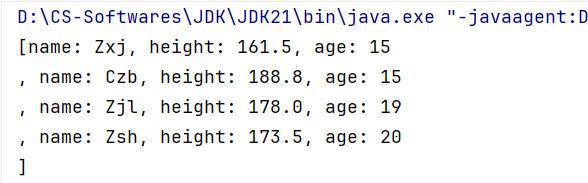


---


#### 16B.3 `Comparator`

> [!Tip]
>
> 使用`Arrays`类提供的重载方法`static <T> void sort(T[] arr, Comparator<? super T> comparator)`，传入待排序数组和一个`Comparator`接口的匿名内部类对象，然后自定义比较规则。

##### P1 修改`Test`类

```java
package arrays;

import java.util.Arrays;
import java.util.Comparator;
import java.util.StringJoiner;

public class Test {
    public static void main(String[] args) {
        Student[] students = new Student[4];
        students[0] = new Student("Zsh", 173.5, 20);
        students[1] = new Student("Zjl", 178.0, 19);
        students[2] = new Student("Zxj", 161.5, 15);
        students[3] = new Student("Czb", 188.8, 15);

        // 可用Lambda表达式简化，此处为了增强可读性不使用
        Arrays.sort(students, new Comparator<Student>() {// 按身高升序，遵照入门指南
            @Override
            public int compare(Student o1, Student o2) {
                if (o1.getHeight() > o2.getHeight()) {
                    return 1;
                } else if (o1.getHeight() < o2.getHeight()) {
                    return -1;
                } else {
                    return 0;
                }
            }
        });
        
        String[] sortedStudents = Arrays.toString(students).split(";");
        for (String sortedStudent : sortedStudents) {
            System.out.println(sortedStudent);
        }
    }
}
```

##### P2 控制台（按身高升序）


##### P3 使用`Double`包装类提供的`compare`方法简化上述代码

```java
Arrays.sort(students, new Comparator<Student>() {
    @Override
    public int compare(Student o1, Student o2) {
        return Double.compare(o1.getHeight(), o2.getHeight());
    }
});
```


