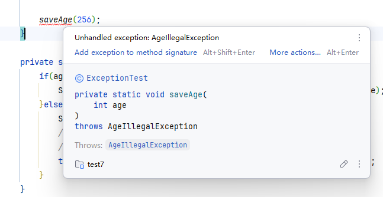
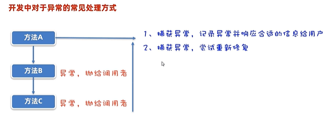
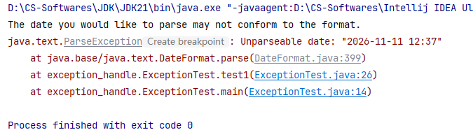
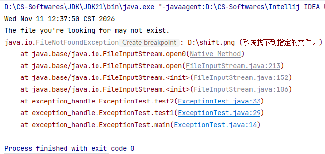

# 异常

> 鸣谢：黑马程序员
>
> 


### 一、异常概述

#### 1.1 异常的体系


+ `Error`：系统级别的错误，属于严重问题。
+ `Exception`（异常）：即程序可能出现的问题。我们通常使用`Exception`及其子类来封装程序可能出现的问题。
  + `RuntimeException`（运行时异常）：编译阶段不会出现错误提醒，只有执行程序时才会报错。比如：数组索引越界异常。
  + 其他异常（也叫编译时异常）：编译阶段就会出现错误提醒。比如：日期时间解析异常。


#### 1.2 异常的作用

+ 是检索代码bug的关键参考信息。
+ 可以作为方法内部的一种特殊返回值，以便通知上层调用者代码底层的执行情况。


#### 1.3 捕获与抛出异常

##### P1 捕获异常

+ **针对性捕获**：

  ```java
  try{
      // 监视可能出现异常的代码
  } catch(XxxException e1){
      // 处理异常1
  } catch(YyyException e2){
      // 处理异常2
  }
  ```

+ **全部捕获**：

  ```java
  try{
      // 监视可能出现异常的代码
  } catch(Exception e){
      // 处理全部异常
  }
  ```

##### P2 抛出异常，交给上层调用者处理

+ **针对性抛出**：

  ```java
  方法 throws XxxException, YyyException, ...{
      ...
  }
  ```

+ **全部抛出**：

  ```java
  方法 throws Exception{
      ...
  }
  ```


---


### 二、自定义异常

#### 2.0 引入背景

```java
public class ExceptionTest {
    public static void main(String[] args) {
        // 需求：保存一个合法的年龄
        try{
            saveAge(160);
            System.out.println("Method saveAge executes successfully.");
        }catch (Exception e){
            e.printStackTrace();
            System.out.println("Method saveAge has bug.");
        }
    }

    private static void saveAge(int age) throws AgeIllegalException{
        if(age>0 && age<150){
            System.out.println("your age is legal and successfully saved: "+age);
        }else{
            System.out.println("Your age is illegal!");
            //Todo: 用一个自定义异常对象来封装“输入年龄非法”这个问题，
            //      便于后续调试代码时快速定位问题并给出相应的解决方案
            throw new 自定义异常类("/age is illegal, your age is "+age);
        }
    }
}
```

#### 2.1 自定义运行时异常

> [!TIP]
>
> 问题不是很严重，不想在程序员编码时打扰他们时使用。

##### P1 步骤

1. 定义一个异常类，继承`RuntimeException`。
2. 重写构造器。
3. 通过`throw new 异常类(xxx)`来创建自定义异常对象并抛出给上层调用者。***（最上层调用者是JVM）***

##### P2 代码

```java
public class AgeIllegalRuntimeException extends RuntimeException{
    public AgeIllegalRuntimeException() {
    }

    public AgeIllegalRuntimeException(String message) {
        super(message);
    }
}
```

##### P3 控制台输出


#### 2.2 自定义编译时异常

> [!Tip]
>
> 问题比较严重，想要强烈提醒程序员时使用。

##### P1 步骤

1. 定义一个异常类，继承`Exception`。
2. 重写构造器。
3. 通过`throw new 异常类(xxx)`来创建自定义异常对象并抛出给上层调用者。

##### P2 代码

```java
public class AgeIllegalException extends Exception{
    public AgeIllegalException() {
    }

    public AgeIllegalException(String message) {
        super(message);
    }
}
```

##### P3 效果




---


### 三、异常的处理



#### 3.1 捕获异常后，记录异常并响应合适的信息给用户

##### P1 示例代码

```java
import java.io.FileInputStream;
import java.io.FileNotFoundException;
import java.io.InputStream;
import java.text.ParseException;
import java.text.SimpleDateFormat;
import java.util.Date;

public class ExceptionTest {
    public static void main(String[] args) {
        // 最上层调用者统一处理异常
        try {
            test1();
        } catch (ParseException e) {
            System.out.println("The date you would like to parse may not conform to the format.");
            e.printStackTrace();
        } catch (FileNotFoundException e) {
            System.out.println("The file you're looking for may not exist.");
            e.printStackTrace();
        }
    }

    private static void test1() throws ParseException, FileNotFoundException {
        SimpleDateFormat format = new SimpleDateFormat("yyyy-MM-dd HH:mm:ss");
        Date date = format.parse("2026-11-11 12:37");
        System.out.println(date);

        test2();
    }

    private static void test2() throws FileNotFoundException {
        InputStream inputStream = new FileInputStream("D:/shift.png");
    }
}
```

##### P2 控制台输出



示例代码中，2026-11-11 12:37不符合格式，所以代码执行到此处就报出异常，不会再继续往下执行。

##### P3 修改为正确日期时间后控制台输出

将示例代码第24行的日期时间改为2026-11-11 12:37:50后，再次运行代码，控制台输出如下：



##### P4 写法优化

实际开发中，不建议抛出具体的异常，而是直接抛出`Exception`这个父类即可。

```java
import java.io.FileInputStream;
import java.io.InputStream;
import java.text.SimpleDateFormat;
import java.util.Date;

public class ExceptionTest2 {
    public static void main(String[] args) {
        // 最上层调用者统一处理异常
        try {
            test1();
        } catch (Exception e) {
            System.out.println("Your operation has problems.");
            e.printStackTrace();
        }
    }

    private static void test1() throws Exception {
        SimpleDateFormat format = new SimpleDateFormat("yyyy-MM-dd HH:mm:ss");
        Date date = format.parse("2026-11-11 12:37:50");
        System.out.println(date);

        test2();
    }

    private static void test2() throws Exception {
        InputStream inputStream = new FileInputStream("D:/shift.png");
    }
}
```


#### 3.2 捕获异常后，尝试重新修复

##### P1 示例代码

```java
import java.util.Scanner;

public class ExceptionTest3 {
    public static void main(String[] args) {
        // 需求：调用一个方法，让用户输入一个价格，直到价格合适为止
        while (true) {
            try {
                System.out.println(getPrice());
                break;
            } catch (Exception e) {
                System.out.println("Please input a number!");
            }
        }
    }

    private static double getPrice() {
        Scanner sc = new Scanner(System.in);
        while (true) {
            System.out.println("Please input a proper price: ");
            double price = sc.nextDouble();

            if (price >= 0) {
                return price;
            } else {
                System.out.println("The price you input is not proper!");
            }
        }
    }
}
```

##### P2 控制台输出


可以看到，代码具有良好的健壮性。


