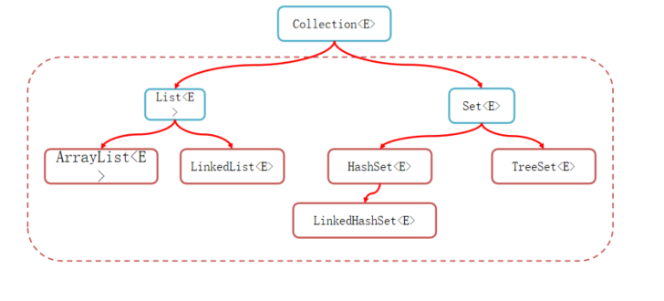
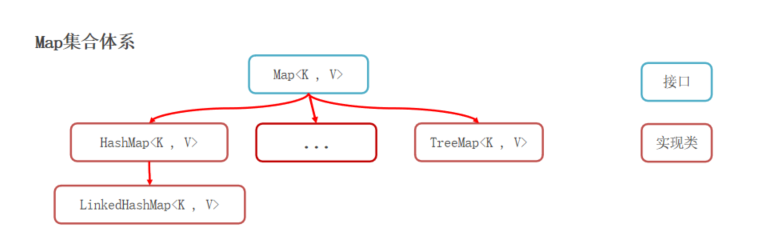
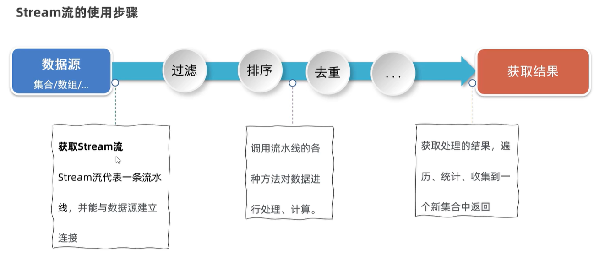
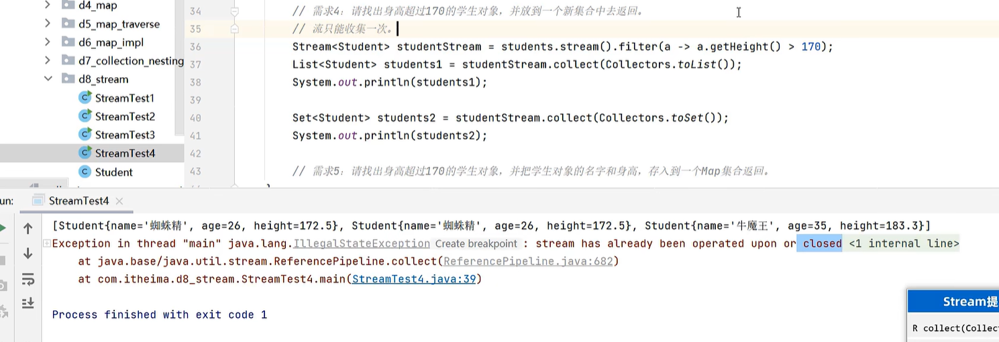
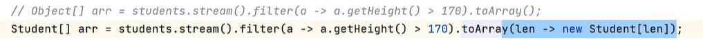

# 集合框架

> 鸣谢：黑马程序员
>
> 


### PartA--Collection

#### 一、`Collection`：单列集合

###### 1.简介：

`Collection`是单列集合的祖宗，每个元素（数据）只包含一个值

###### 2.体系结构：



###### 3.常用方法：所有单列集合都会继承

(1)`boolean add(E e)`

​	将指定对象添加到当前集合中

(2)`void clear()`

​	清空集合中的所有元素

(3)`boolean remove(E e)`

​	将指定对象在当前集合中删除

(4)`boolean contains(Object obj)`

​	判断当前集合中是否包含指定对象

(5)`boolean isEmpty()`

​	判断当前集合是否为空

(6)`int size()`

​	返回当前集合中的元素个数

(7)`Object[] toArray()`

​	将集合中的所有元素存储到数组中


------


###### 4.遍历方式：

*a*.迭代器

+ **概述**：迭代器是遍历集合的专用方式（数组没有迭代器），在`Java`中迭代器的代表是`Iterator`

+ **`Collection`获取迭代器的方式**：

​		`Iterator<E> iterator()`     返回集合中的迭代器对象，该迭代器对象默认指向当前集合的**第一个元素**

+ **`Iterator`迭代器中的常用方法**：

  + `boolean hasNext()`     询问**当前位置**是否有存在，若存在则返回`true`，否则返回 `false`
  + `E next()`     获取**当前位置**的元素，同时将迭代器对象指向**下一个元素**

+ **遍历代码演示**：

  ```java
  //1.创建一个Collection集合lists
  Collection<String> lists=new ArrayList<>();
  lists.add("zsh");
  lists.add("zjl");
  lists.add("zxj");
  
  //2.使用迭代器进行遍历
  Iterator<String> it=lists.iterator();
  while(it.hasNext()){
      String element=it.next();
      System.out.println(element);
  }
  ```

  

*b*.增强`for`循环

+ **格式**：

  ```java
  for(元素的数据类型 变量名 : 数组/集合){
      ...
  }
  ```

+ **遍历代码演示**：

  ```java
  //1.创建一个Collection集合lists
  Collection<String> lists=new ArrayList<>();
  lists.add("zsh");
  lists.add("zjl");
  lists.add("zxj");
  
  //2.使用增强for循环进行遍历
  for(String str : lists){
      System.out.println(str);
  }
  ```


*c*.`Lambda`表达式(After `JDK1.8`)

+ **方法**：

  `default void forEach(Consumer<? super T> action)`

+ **原代码**：

  ```java
  //1.创建一个Collection集合lists
  Collection<String> lists=new ArrayList<>();
  lists.add("zsh");
  lists.add("zjl");
  lists.add("zxj");
  
  //2.使用forEach方法进行遍历
  lists.forEach(new Consumer<String>(){
      @Override
      public void accept(String str){
          System.out.println(str);
      }
  });
  ```

+ **优化后代码**：

  ```java
  //1.创建一个Collection集合lists
  Collection<String> lists=new ArrayList<>();
  lists.add("zsh");
  lists.add("zjl");
  lists.add("zxj");
  
  //2.结合Lambda表达式，使用forEach方法进行遍历
  lists.forEach(str -> {
      System.out.println(str);
  })
  ```

  

------

------


#### 二、`List`：添加的元素有序、可重复、有索引

###### 1.`List`集合的特有方法：

`List`集合由于支持索引，所以多了很多与索引相关的方法，当然`Collection`集合的各种功能`List`也都一一继承了

注意`List`集合支持使用`for`循环进行遍历（因为`List`集合有索引）

+ `void add(int index,E element)`

  在集合中的指定位置插入指定元素

+ `E remove(int index)`

  删除指定位置的元素，并返回被删除的元素的内存地址

+ `E set(int index,E element)`

  修改指定位置的元素，并返回被修改的元素的内存地址

+ `E get(int index)`

  返回指定位置的元素的内存地址


------


###### 2.`ArrayList`：基于数组实现

*a*.**特点**：

+ 查询速度快（注意：是根据索引查询数据快）：查询数据通过地址和索引进行定位，查询任意数据耗时相同
+ 删除效率低：每删除**完**一个数据，都要将后面的数据依次前移
+ 插入效率低：每插入一个数据，都要**先**将后面的数据依次后移；有时候可能还需要对数组进行扩容

*b*.**底层原理**：

（1）利用无参构造器创建一个`ArrayList`集合时，会在底层创建一个默认长度为0的数组

（2）添加第一个元素后，底层会创建一个新的长度为10的数组

（3）存满后，数组会扩容1.5倍

（4）若一次性添加多个元素，1.5倍还存放不下，则新建数组的长度以实际为准

*c*.**应用场景**：

+ 适合：
  + 根据索引查询数据，比如根据随机索引查询数据（高效）
  + 数据量不大
+ 不适合：
  + 数据量大的同时，又要频繁进行增删操作


------


###### 3.`LinkedList`：基于双链表实现

*a*.**特点**：

+ 查询效率低：无论查询哪个数据，都要从头结点开始找
+ 增删效率高
+ 对首尾元素进行`CRUD`(`Create&Read&Update&Delete`)即**增删改查**的效率极高

*b*.**首尾操作的特有方法**：

+ `void addFirst(E e)`
+ `void addLast(E e)`
+ `E getFirst()`
+ `E getLast()`
+ `E removeFirst()`
+ `E removeLast()`

*c*.**应用场景**：可以用来设计队列/栈


------

------


#### 三、`Set`：添加的元素无序、不重复、无索引

###### 1.`HashSet`:无序、不重复、无索引

*a*.**前置知识**：

`I`.**哈希值**：

+ 哈希值是一个`int`类型的数值，`Java`中每个对象都有一个哈希值
+ `Java`中的所有对象都可以调用`Object`类提供的`int hashCode()`方法，返回该对象的哈希值
+ 同一个对象多次调用`int hashCode()`方法，返回的哈希值都是相同的
+ 不同对象的哈希值一般不相同，但也有一定几率会相同（哈希碰撞）

`II`.**哈希表**：

+ 哈希表是一种`CRUD`各方面性能都较好的**数据结构**
+ `JDK1.8`之前：`哈希表=数组+链表`
+ `JDK1.8`之后：`哈希表=数组+链表+红黑树`


*b*.**底层原理**：基于**哈希表**实现

（1）创建一个默认长度为16的数组，默认加载因子为0.75

（2）使用元素的哈希值对数组的长度求余，从而计算出该元素应存入的数组索引位置

（3）判断该索引位置是否为`null`，若是则直接存入

（4）若该索引位置不为`null`，说明该位置已有元素，则调用`equals()`方法进行比较

+ 若新元素与已有元素的值相等，则放弃存入
+ 若不相等，则将新元素存入数组
  + `JDK 1.8之前`：新元素取代已有元素的位置，已有元素转而挂在新元素的下方
  + `JDK 1.8之后`：新元素直接挂在已有元素的下方

（5）`JDK 1.8`开始，当链表长度超过8且数组长度>=64时，链表会自动转化成红黑树


*c*.**深入理解`HashSet`集合的去重机制**：

+ `HashSet`默认不能对内容一样的两个不同对象进行去重操作
+ **解决方法**：重写对象的`hashCode()`和`equals()`方法（右键-->`Generate`-->`Override Methods`）


------


###### 2.`LinkedHashSet`:有序、不重复、无索引

**底层原理**：

仍然是基于**哈希表**实现，但是它的每个元素都额外多了一个**双链表**的机制，用来记录该元素的前后元素的位置，从而实现**有序**


------


###### 3.`TreeSet`:不重复、无索引、可排序（默认升序，按照元素从小到大排序）

*a*.**底层原理**：基于**红黑树**实现**排序**

*b*.**默认排序规则**：

+ 对于数值类型（`Integer`,`Double`）：默认按照数值本身的大小进行升序排序
+ 对于字符串类型（`String`）：默认按照字典顺序进行升序排序（A~Z）
+ 对于自定义类型（如`Student`对象）：**无法直接排序**

*c*.**自定义排序规则**：

`I`.`TreeSet`存储自定义类型的元素时，必须指定排序规则，有以下2种方式来指定排序规则：

（1）让自定义的类实现`Comparable`接口，重写里面的`compareTo()`方法来指定排序规则

（2）通过调用`TreeSet`的有参构造器，可以设置`Comparator`对象，用于指定排序规则

​		 `public TreeSet(Comparator<? super E> comparator)`

`II`.以上2种方式中，关于返回值的规则如下：

+ 若认为元素1>元素2，返回正整数
+ 若认为元素1<元素2，返回负整数
+ 若认为元素1=元素2，返回0，此时`TreeSet`认为这两个元素重复，只会保留其中一个元素

`III`.**注意**：若类本身有实现`Comparable`接口，`TreeSet`同时也自带比较器，**默认使用后者**


*d*.**代码演示**：

方式一：

```java
package Collection;

import java.util.Objects;

public class Student implements Comparable<Student>{//必须实现Comparable接口
    private String name;
    private int age;
    private double height;

    public Student() {

    }

    public Student(String name, int age, double height) {
        this.name = name;
        this.age = age;
        this.height = height;
    }

    //重写compareTo方法
    @Override
    public int compareTo(Student o) {
        //按照年龄进行升序排序
        return this.age-o.age;
    }

    public String getName() {
        return name;
    }

    public void setName(String name) {
        this.name = name;
    }

    public int getAge() {
        return age;
    }

    public void setAge(int age) {
        this.age = age;
    }

    public double getHeight() {
        return height;
    }

    public void setHeight(double height) {
        this.height = height;
    }

    @Override
    public String toString() {
        return "Student{" +
                "name='" + name + '\'' +
                ", age=" + age +
                ", height=" + height +
                '}';
    }
}
```


方式二：

```java
package Collection;

import java.util.Comparator;
import java.util.Set;
import java.util.TreeSet;

public class Test {
    public static void main(String[] args) {
        Set<Student> students=new TreeSet<>(new Comparator<Student>() {
            @Override
            public int compare(Student o1, Student o2) {
                //按照身高进行升序排序
                //注意小数作差后的结果并不是一个整数，所以我们要调用Double类的compare方法
                return Double.compare(o1.getHeight(),o2.getHeight());
            }
        });
    }
}
```

使用`Lambda`表达式优化上述代码：

```java
package Collection;

import java.util.Comparator;
import java.util.Set;
import java.util.TreeSet;

public class Test {
    public static void main(String[] args) {
        Set<Student> students=new TreeSet<>((o1,o2) ->{
            return Double.compare(o1.getHeight(),o2.getHeight());
        });
    }
}
```


---


### PartB--Map

#### 一、`Map`：双列集合

###### 1.简介：

+ `Map`是双列集合的祖宗，每个元素包含一个键值对，因此也称为键值对集合
+ 格式：`{key1=value1,key2=value2,...}`
+ `Map`的键不允许重复，但值允许重复
+ 键和值一一对应，每个键只能找到自己对应的值

###### 2.体系结构：



###### 3.常用方法：

（1）`V put(K key,V value)`     添加键值对

（2）`int size()`     获取`Map`集合的大小

（3）`void clear()`     清空`Map`集合

（4）`boolean isEmpty()`     判断`Map`集合是否为空

（5）`V get(Object key)`     根据键获取对应的值

（6）`V remove(Object key)`     根据键删除对应的值

（7）`boolean containsKey(Object key)`	判断`Map`集合是否包含某个键

（8）`boolean containsValue(Object value)`	判断`Map`集合是否包含某个值

（9）`Set<K> keySet()`	获取全部键组成的`Set`集合

（10）`Collection<V> values()`	获取全部值组成的`Collection`集合


------


###### 4.遍历方式

先准备一个`Map`集合：

```java
Map<String,Double> map=new HashMap<>();
map.put("zsh",173.5);
map.put("zjl",179.3);
map.put("zxj",165.2);
map.put("ym",235.0);
//map = {ym=235.0, zjl=179.3, zxj=165.2, zsh=173.5}
```


`I`.键找值：先获取集合全部键，再通过遍历键来获取全部值

```java
Set<String> keys=map.keySet();
for (String key : keys) {
    double value=map.get(key);
    System.out.println(key+"-->"+value);
}
```


`II`.键值对：把键值对看作一个整体，进行遍历

```java
Set<Map.Entry<String,Double>> entries=map.entrySet();
for (Map.Entry<String, Double> entry : entries) {
    String key=entry.getKey();
    double value=entry.getValue();
    System.out.println(key+"-->"+value);
}
```


`III`.`Lambda`表达式：(**最方便，推荐使用！**)

```java
map.forEach((key,value) -> {
    System.out.println(key+"-->"+value);
});
```


------

------


#### 二、`HashMap`：由键决定特点--无序、不重复、无索引

###### 1.底层原理：

与`HashSet`底层原理一样，都是基于**哈希表**实现

实际上，之前学习的`Set`系列集合的底层都是基于`Map`实现，`Set`实际上就是特殊的`Map`，只不过少了键所对应的值而已

```java
//HashSet的无参构造器
public HashSet(){
    map=new HashMap<>();
}
```

###### 2.特点：

+ `HashMap`的键依赖`hashCode()`和`equals()`方法来保证**键的唯一**

+ 若键存储的是自定义类型的对象，则可以通过重写`hashCode()`和`equals()`方法来实现**不重复**原则


------

------


#### 三、`LinkedHashMap`：由键决定特点--有序、不重复、无索引

###### 底层原理：

与`LinkedHashSet`底层原理一样，都是基于**哈希表**和**双链表**实现


------

------


#### 四、`TreeMap`：由键决定特点--按照大小默认升序排序、不重复、无索引

###### 1.底层原理：

与`TreeSet`底层原理一样，都是基于**红黑树**实现的排序

###### 2.排序规则：

同样也支持2种方式来指定排序规则：

+ 让自定义的类实现`Comparable`接口，重写排序规则
+ `TreeMap`有一个有参构造器，支持创建`Comparator`比较器对象，用于指定排序规则


---


### PartC--Stream(`JDK8`+)

> [!Important]
>
> 也叫`Stream`流，是`JDK8`起新增的一套API(java.util.stream)，用于操作集合或数组的数据。
>
> **优势**：大量结合了`Lambda`的语法风格来编程，提供了一种更加强大、简单的方式来操作集合或数组的数据，代码简洁且可读性强。

#### 1.案例

##### 1.1 需求

有以下代码：

```java
List<String> names = new ArrayList<>();
Collections.addAll(names, "张无忌", "周芷若", "赵敏", "张强", "张三丰");
```

现要求把集合中所有以“张”为开头，且长度为3的元素存储到一个新的集合中。


##### 1.2 传统解决方案

```java
List<String> newNames = new ArrayList<>();
for (String name : names) {
    if (name.startsWith("张") && name.length() == 3) {
        newNames.add(name);
    }
}
```


##### 1.3 使用`Stream`流的解决方案

```java
List<String> newNames=
        names.stream().filter((name) -> {
            return name.startsWith("张") && name.length() == 3;
        }).collect(Collectors.toList());
```

以上代码还可以继续简化：

```java
List<String> newNames = names.stream().filter(name -> name.startsWith("张") && name.length() == 3)
    					.collect(Collectors.toList());
```


---


#### 2.使用步骤



##### 2.1 获取`Stream`流

###### P1 获取集合的`Stream`流：

| `Collection`提供的方法       | 说明                           |
| ---------------------------- | ------------------------------ |
| `default Stream<E> stream()` | 获取当前集合对象的`Stream`流。 |

至于`Map`双列集合，可以先获取它的键/值/键值对集合，然后获取键/值/键值对集合的`Stream`流，这样就可以处理键/值/键值对数据了。

```java
// Type=Integer/Double/String/...
Set<Type> keys = map.keySet();
Stream<Type> streamOfKeys = keys.stream();

Collection<Type> values = map.values();
Stream<Type> streamOfValues = values.stream();

Set<Map.Entry<Type1, Type2>> entries = map.entrySet();
Stream<Map.Entry<Type1, Type2>> streamOfEntries = entries.stream();
```


###### P2 获取数组的`Stream`流：

+ | `Arrays`提供的方法                              | 说明                       |
  | ----------------------------------------------- | -------------------------- |
  | `public static <T> Stream<T> stream(T[] array)` | 获取当前数组的`Stream`流。 |

+ | `Stream`提供的方法                            | 说明                           |
  | --------------------------------------------- | ------------------------------ |
  | `public static <T> Stream<T> of(T... values)` | 获取当前接收数据的`Stream`流。 |

​		

---


##### 2.2 调用`Stream`流常见的中间方法（支持链式编程）

> [!Tip]
>
> 中间方法：调用完成后，会返回新的`Stream`流，可以继续使用，支持链式编程。

| 序号 | 方法                                                         | 说明                               |
| ---- | ------------------------------------------------------------ | ---------------------------------- |
| 01   | `Stream<T> filter(Predicate<? super T> predicate)`           | 对流中的元素进行过滤。             |
| 02   | `Stream<T> sorted()`                                         | 对元素按升序排序。                 |
| 03   | `Stream<T> sorted(Comparator<? super T> comparator)`         | 对元素按制定规则排序。             |
| 04   | `Stream<T> limit(long maxSize)`                              | 获取前几个元素。                   |
| 05   | `Stream<T> skip(long n)`                                     | 跳过前几个元素。                   |
| 06   | `Stream<T> distinct()`                                       | 去除流中重复的元素。               |
| 07   | `<R> Stream<R> map(Function<? super T, ? extends R> mapper)` | 对元素进行加工，并返回对应的新流。 |
| 08   | `static <T> Stream<T> concat(Stream a, Stream b)`            | 将a、b两个流合并为一个流。         |


###### 2.2.1 07方法演示

**需求**：找出学生集合`students`中身高超过168的学生叫什么名字，同时要求去掉重复的名字再输出。身高、名字均是`Student`类中的属性。

**代码**：

```java
students.stream().filter(s -> s.getHeight() > 168)
    .map(s -> s.getName()).distinct()
    .forEach(s -> System.out.println(s));
```


###### 2.2.2 08方法演示

+ 相同元素类型的流合并，合并后的流元素类型不变：

  ```java
  Stream<String> st1 = Stream.of("zsh", "zjl", "zxj");
  Stream<String> st2 = Stream.of("food", "water");
  Stream<String> st  = Stream.concat(st1, st2);
  ```

+ 不同元素类型的流合并，合并后的流元素类型只能为`Object`：

  ```java
  Stream<String> st1 = Stream.of("zsh", "zjl", "zxj");
  Stream<Double> st2 = Stream.of(6.6, 9.99);
  Stream<Object> st  = Stream.concat(st1, st2);
  ```

  

---


##### 2.3 调用`Stream`流常见的终结方法

> [!Tip]
>
> 终结方法：调用完成后，不会再返回新的`Stream`流。
>
> 收集`Stream`流：把`Stream`流操作后的结果转换成集合或数组。

| 序号 | 方法                                                | 说明                           |
| ---- | --------------------------------------------------- | ------------------------------ |
| 01   | `void forEach(Consumer action)`                     | 对最终流的元素进行遍历。       |
| 02   | `long count()`                                      | 获取最终流的元素个数。         |
| 03   | `Optional<T> max(Comparator<? super T> comparator)` | 获取最终流的最大值元素。       |
| 04   | `Optional<T> min(Comparator<? super T> comparator)` | 获取最终流的最小值元素。       |
| 05   | `R collect(Collector collector)`                    | 将最终流收集到一个指定集合中。 |
| 06   | `Object[] toArray()`                                | 将最终流收集到一个数组中。     |


###### 2.3.1 03方法演示

**需求**：找出身高最高的学生对象。

**代码**：

```java
// 注意：调用完max方法后返回的并非学生对象，还要再调用get方法以获取学生对象
Student student = studnets.stream().max((o1, o2) -> Double.compare(o1.getHeight(), o2.getHeight())).get();
```


###### 2.3.2 05方法演示

**需求1**：找出身高超过170的学生对象，收集到一个新单列集合中并返回。

**代码**：

```java
List<Student> newList = students.stream().filter(s -> s.getHeight() > 170).collect(Collectors.toList());
Set<Student> newSet = students.stream().filter(s -> s.getHeight() > 170).collect(Collectors.toSet());
```

**注意事项**：流只能收集一次，第一次收集完后这个流就关闭了！若重复收集会报如下错误：



---

**需求2**：找出身高超过170的学生对象，把他们的名字和身高，收集到一个新`Map`集合中并返回。

**代码**：

```java
Map<String, Double> newMap = 
    students.stream().filter(s -> s.getHeight() > 170).distinct().// 手动去掉重复的学生对象，否则会因为键重复而报错
    collect(Collectors.toMap(s -> s.getName(), s -> s.getHeight()));
```


###### 2.3.3 06方法拓展




