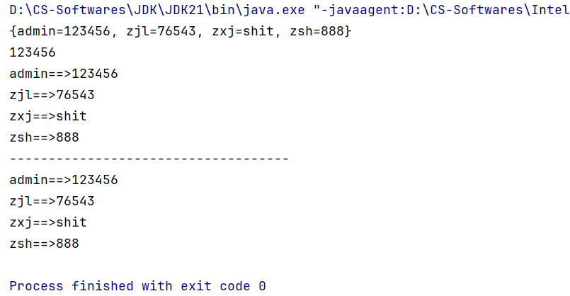
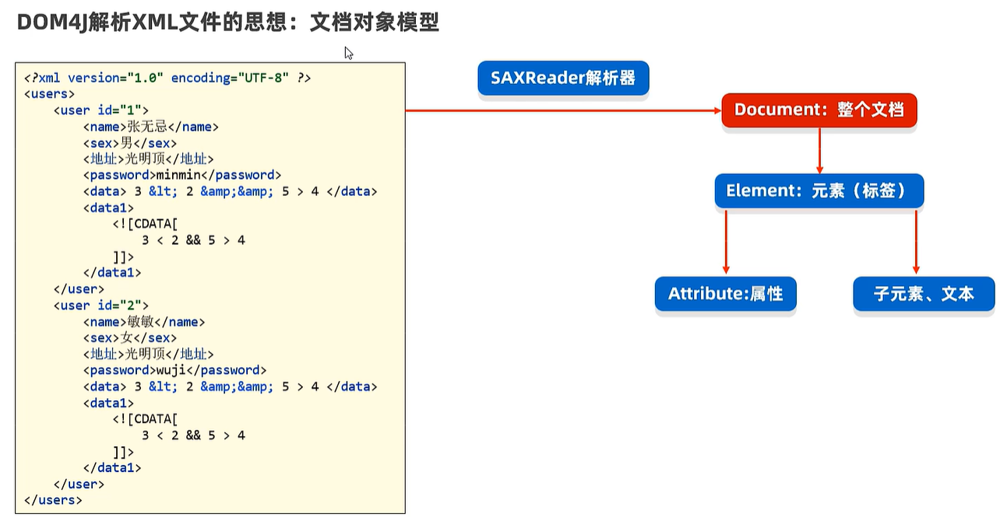
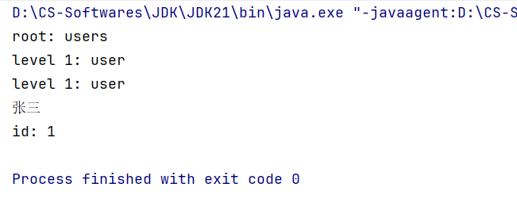

# 特殊文件与日志技术

> 鸣谢：黑马程序员
>
> 


## 一、特殊文件

### 1.分类

+ properties属性文件：

  ```properties
  name=张三
  password=123456
  address=北京
  sex=男
  ...
  ```

+ xml文件：

  ```xml
  <?xml version="1.0" encoding="UTF-8" ?>
  <users>
      <user id="1">
      	<name>张三</name>
          <password>123456</password>
          <address>北京</address>
          <sex>男</sex>
      </user>
      
      <user id="2">
      	<name>陈叶</name>
          <password>888888</password>
          <address>上海</address>
          <sex>女</sex>
      </user>
      
      ...
  </users>
  ```

+ **适用场景**：

  + 属性文件适用于存储单用户数据，简单方便；
  + xml文件适用于存储多用户数据，结构清晰。


---


### 2.properties属性文件

#### 2.1 特点

+ 只能存储键值对数据，且键不能重复。
+ 文件后缀一般是.properties。


#### 2.2 `Properties`

+ `Properties`是一个`Map`集合，但是我们一般不会把它当做集合来使用，它是用来代表属性文件的。

+ **常用方法**：

  | 序号 | 方法                                           | 说明                                                         |
  | ---- | ---------------------------------------------- | ------------------------------------------------------------ |
  | 01   | `void load(InputStream is)`                    | 通过字节输入流，读取属性文件里的键值对数据。                 |
  | 02   | `void load(Reader reader)`                     | 通过字符输入流，读取属性文件里的键值对数据。                 |
  | 03   | `String getProperty(String key)`               | 根据键获取值。                                               |
  | 04   | `Set<String> stringPropertyNames()`            | 获取全部键的集合。                                           |
  | 05   | `Object setProperty(String key, String value)` | 将键值对数据保存到`Properties`对象中。                       |
  | 06   | `void store(OutputStream os, String comments)` | 通过字节输出流，将键值对数据保存到属性文件里，`comments`表示附带注释。 |
  | 07   | `void store(Writer writer, String comments)`   | 通过字符输出流，将键值对数据保存到属性文件里。               |


#### 2.3 读取数据

+ `users.properties`：

  ```properties
  # 以下内容都是用户名和密码
  admin=123456
  zsh=888
  zjl=76543
  zxj=shit
  ```

+ `Test1`:

  ```java
  import java.io.FileReader;
  import java.util.Properties;
  
  public class Test1 {
      public static void main(String[] args) throws Exception {
          Properties properties = new Properties();
          properties.load(new FileReader("test9\\src\\users.properties"));
          System.out.println(properties);
          System.out.println(properties.getProperty("admin"));
          for (String name : properties.stringPropertyNames()) {
              System.out.println(name + "==>" + properties.getProperty(name));
          }
          System.out.println("------------------------------------");
  
          // forEach
          properties.forEach((name, password) -> {
              System.out.println(name + "==>" + password);
          });
  
      }
  }
  ```

+ 控制台输出：

  


#### 2.4 存储数据

+ `Test2`:

  ```java
  import java.io.FileWriter;
  import java.util.Properties;
  
  public class Test2 {
      public static void main(String[] args) throws Exception {
          Properties properties = new Properties();
          properties.setProperty("lily", "love");
          properties.setProperty("ghost", "hidden");
          properties.setProperty("arthur", "goddamn_man");
  
          properties.store(new FileWriter("test9/src/users2.properties"), "save 3 users' information");
      }
  }
  ```

+ 执行后查看users2.properties文件的内容：

  ```properties
  #save 3 users' information
  #Sat Nov 15 00:13:01 CST 2025
  arthur=goddamn_man
  ghost=hidden
  lily=love
  ```


---


### 3.xml文件

> [!Important]
>
> XML: Extensible Markup Language，意思是可扩展标记性语言。
>
> 它本质上是一种特殊数据格式，可以用来存储复杂的数据结构和数据关系。
>
> **应用场景**：经常用来作为系统的配置文件；或者作为一种特殊数据结构，在网络中进行传输。

#### 3.1 特点

+ xml的“<label>”称为一个标签或一个元素，一般成对出现，标签名可自定义（这就是为什么叫做“可扩展”），但必须要正确嵌套。
+ xml只能有一个根标签。
+ xml的标签可以有属性，比如<user id="1">。
+ 文件后缀一般是.xml。


#### 3.2 语法规则

+ xml文件的第一行必须是如下文档抬头：

  <?xml version="1.0" encoding="UTF-8" ?>

+ xml中书写“<”、“&”等特殊符号时，可能会出现冲突导致报错，此时可以用下面的特殊字符替代：

  | 冲突字符 | 替代字符（必须+分号） |
  | :------: | :-------------------: |
  |    <     |         \&lt;         |
  |    >     |         \&gt;         |
  |    &     |        \&amp;         |
  |    \'    |        \&apos;        |
  |   \''    |        \&quot;        |

+ xml中可以写一个叫作CDATA的数据区：<![CDATA[内容]]>，里面的内容可以随便写。


---


#### 3.3 读取数据（解析xml文件）

##### P1 `dom4j`


`dom4j`是用于解析xml的最知名的第三方开源框架，十分便捷。


##### P2 `IDEA`中使用`dom4j`

1. 从官网下载`dom4j`框架。
2. 在项目中创建一个`lib`文件夹。
3. 将`dom4j-x.y.z.jar`复制到`lib`文件夹下。
4. 右键此`jar`文件，选择`Add as Library`，在弹出的对话框中点击OK。
5. 在类中导包使用。


##### P3 `dom4j`解析xml的核心思想：DOM（文档对象模型）



+ `SAXReader`：`dom4j`提供的解析器，可以认为它代表了整个框架。

  | 构造器/方法                     | 说明                          |
  | ------------------------------- | ----------------------------- |
  | `public SAXReader()`            | 创建`dom4j`的解析器对象。     |
  | `Document read(String url)`     | 将xml文件读取成文档对象。     |
  | `Document read(InputStream is)` | 通过字节输入流，读取xml文件。 |

+ `Document`：

  | 方法                       | 说明             |
  | -------------------------- | ---------------- |
  | `Element getRootElement()` | 获得根元素对象。 |

+ `Element`:

  | 方法                                          | 说明                                                       |
  | --------------------------------------------- | ---------------------------------------------------------- |
  | `String getName()`                            | 获取元素名字。                                             |
  | `List<Element> elements()`                    | 获取当前元素下的所有一级子元素。                           |
  | `List<Element> elements(String name)`         | 获取当前元素下指定名字的所有一级子元素。                   |
  | `Element element(String name)`                | 获取当前元素下指定名字的一级子元素，若有多个则返回第一个。 |
  | `String attributeValue(String name)`          | 通过属性名获取属性值。                                     |
  | `String elementText(String childElementName)` | 获取指定名字的一级子元素的文本。                           |
  | `String getText()`                            | 获取元素文本。                                             |

  

##### P4 代码演示

+ `users.xml`:

  ```xml
  <?xml version="1.0" encoding="UTF-8" ?>
  <users>
      <user id="1">
          <name>张三</name>
          <password>123456</password>
          <address>北京</address>
          <sex>男</sex>
      </user>
  
      <user id="2">
          <name>陈叶</name>
          <password>888888</password>
          <address>上海</address>
          <sex>女</sex>
      </user>
  
  </users>
  ```

+ `Dom4jTest1`:

  ```java
  import org.dom4j.*;
  import org.dom4j.io.SAXReader;
  
  import java.util.List;
  
  public class Dom4jTest1 {
      public static void main(String[] args) throws Exception {
          SAXReader saxReader = new SAXReader();
          Document document = saxReader.read("test9/src/users.xml");
          Element root = document.getRootElement();
          System.out.println("root: " + root.getName());
  
          List<Element> elements = root.elements();
          for (Element element : elements) {
              System.out.println("level 1: " + element.getName());
          }
  
          Element user1 = root.element("user");
          System.out.println("user1's name: " + user1.elementText("name"));
  
          System.out.println("id: " + user1.attributeValue("id"));
      }
  }
  ```

+ 控制台输出：

  


---


#### 3.4 存储数据


---


## 二、日志技术

> [!Important]
>
> 把程序运行的信息存储到文件中，方便程序员定位bug，并了解程序的执行情况等。


