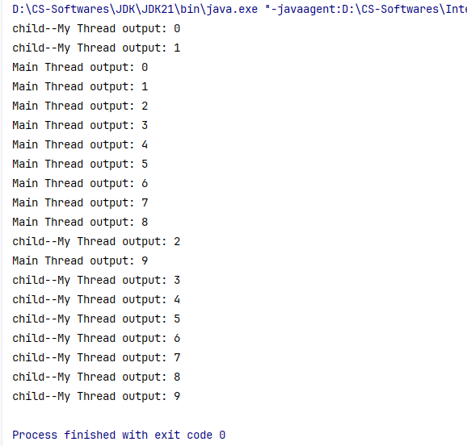
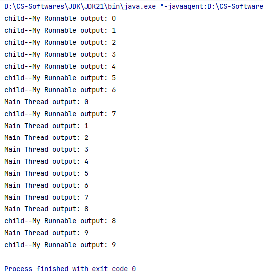
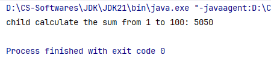
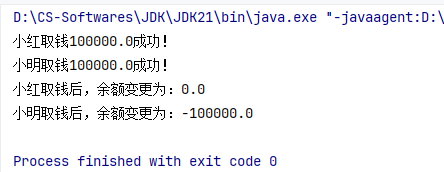
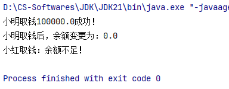
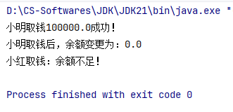
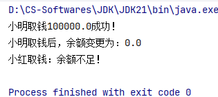
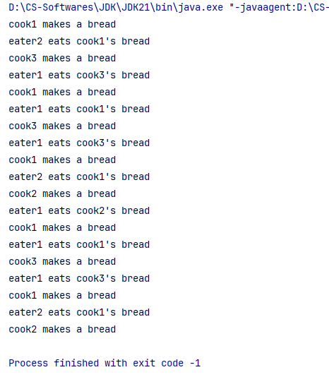

# 多线程

> 鸣谢：黑马程序员
>
> 


## 一、概述

+ **线程(Thread)**：是一个程序内部的一条执行流程。
+ **单线程程序**：如果一个程序内部只有一条执行流程，则称这个程序是一个单线程程序。
+ **多线程**：是指从软硬件上实现的多条执行流程的技术（多条线程由CPU负责调度执行）。 


---


## 二、创建多线程

> [!IMPORTANT]
>
> `java.lang.Thread`类代表线程。

### 2.0 注意事项

+ 启动线程必须调用`start`方法，而非`run`方法。
  + 直接调用`run`方法会被当成普通方法执行，此时相当于还是单线程程序。
  + 只有调用`start`方法才是启动一个新的线程执行。
+ 不要把主线程任务放在启动子线程之前，否则会导致主线程任务执行完毕后才启动子线程，失去了多线程的意义。


---


### 2.1 创建方式1：继承`Thread`类

#### P1 步骤

1. 创建一个子类`MyThread`并继承`Thread`类；
2. 重写`run()`方法；
3. 创建子类的实例对象；
4. 调用线程对象的`start()`方法启动线程，`start()`方法内部会去调用子类重写的`run()`方法。


#### P2 代码演示

+ `ThreadTest1`类：

  ```java
  package create_thread;
  
  public class ThreadTest1 {
      // main方法是由主线程负责执行的
      public static void main(String[] args) {
  
          Thread t = new MyThread();
          // 启动后，实现了多线程：主线程 + t线程
          t.start();// start会去调用子类重写的run方法
  
          for (int i = 0; i < 10; i++) {
              System.out.println("Main Thread output: " + i);
          }
      }
  }
  ```

+ `MyThread`类：

  ```java
  public class MyThread extends Thread {
      @Override
      public void run() {
          for (int i = 0; i < 10; i++) {
              System.out.println("child--My Thread output: " + i);
          }
      }
  }
  ```
  
+ 控制台输出（每次输出结果都不同，仅截取其中某一次）：

  


#### P3 优缺点

+ **优点**：编码简单。
+ **缺点**：子线程类已经继承了`Thread`类，无法再继承其他类，不利于后续功能扩展。


---


### 2.2 创建方式2：实现`Runnable`接口

#### P1 步骤

1. 创建一个线程任务类`MyRunnable`并实现`Runnable`接口；
2. 重写`run()`方法；
3. 把`MyRunnable`线程任务对象作为参数传递给`Thread`的一个有参构造器，从而生成一个线程对象；
4. 调用该线程对象的`start()`方法启动线程。


#### P2 代码演示

+ `ThreadTest2`类：

  ```java
  public class ThreadTest2 {
      public static void main(String[] args) {
          Runnable target = new MyRunnable();
          new Thread(target).start();
  
          for (int i = 0; i < 10; i++) {
              System.out.println("Main Thread output: " + i);
          }
      }
  }
  ```

+ `MyRunnable`类：

  ```java
  public class MyRunnable implements Runnable {
      @Override
      public void run() {
          for (int i = 0; i < 10; i++) {
              System.out.println("child--My Runnable output: " + i);
          }
      }
  }
  ```

+ 控制台输出（每次输出结果都不同，仅截取其中某一次）：

  


#### P3 优缺点

+ **优点**：线程任务类只是实现接口，可以继续继承其它类，实现其它接口，扩展性强。
+ **缺点**：需要额外创建一个`Runnable`对象。


#### P4 使用匿名内部类简化上述代码

```java
public class ThreadTest2_2 {
    public static void main(String[] args) {
        // Lambda表达式
        Runnable target = (() -> {
            for (int i = 0; i < 10; i++) {
                System.out.println("child output: " + i);
            }
        });
        new Thread(target).start();
    }
}
```


---


### 2.3 创建方式3：利用`Callable`接口和`FutureTask`类

#### P0 引入背景

前两种创建方式都存在一个问题：假如线程执行完毕后有一些数据需要返回，由于`run()`方法的返回值为空，所以均不能直接返回结果。

因此，`JDK5.0`提供了`Callable`接口和`FutureTask`类来解决这个问题。


#### P1 步骤

1. 创建一个类`MyCallable`并实现`Callable`接口；
2. 重写`call`方法，封装线程任务和要返回的数据；
3. 把`Callable`对象封装成`FutureTask`对象（线程任务对象）。
4. 把该线程任务对象作为参数传递给`Thread`的一个有参构造器，从而生成一个线程对象；
5. 调用该线程对象的`start()`方法启动线程；
6. 线程执行完毕后，可以通过`FutureTask`对象的`get()`方法去获取线程任务的执行结果。

> [!TIP]
>
> 可以采用匿名内部类简化步骤。


#### P2 代码演示

+ `ThreadTest3`类：

  ```java
  import java.util.concurrent.Callable;
  import java.util.concurrent.FutureTask;
  
  public class ThreadTest3 {
      private static int n = 100;
  
      public static void main(String[] args) throws Exception {
  
          Callable<String> myCallable = (() -> {
              int sum = 0;
              for (int i = 1; i <= n; i++) {
                  sum += i;
              }
              return "child calculate the sum from 1 to " + n + ": " + sum;
          });
  
          FutureTask<String> futureTask = new FutureTask<>(myCallable);
          new Thread(futureTask).start();
  
          String result = futureTask.get();
          System.out.println(result);
      }
  }
  ```

+ 控制台输出：

  

  

#### P3 优缺点

+ **优点**：
  + 线程任务类只是实现接口，可以继续继承其它类，实现其它接口，扩展性强。
  + 可以在线程执行完毕后获取到线程的执行结果。
+ **缺点**：编码相对复杂一些。


---


## 三、`Thread`类的常用API

### 3.1 常用构造器

| 序号 | 构造器                                        | 说明                                               |
| ---- | --------------------------------------------- | -------------------------------------------------- |
| 01   | `public Thread(String name)`                  | 创建一个指定名称的线程对象。                       |
| 02   | `public Thread(Runnable target)`              | 封装`Runnable`对象成为线程对象。                   |
| 03   | `public Thread(Runnable target, String name)` | 封装`Runnable`对象成为线程对象，同时指定线程名称。 |

### 3.2 常用方法

| 序号 | 方法                            | 说明                                                         |
| ---- | ------------------------------- | ------------------------------------------------------------ |
| 01   | `void run()`                    | 线程的任务方法。                                             |
| 02   | `void start()`                  | 启动线程。                                                   |
| 03   | `String getName()`              | 获取当前线程名称，默认是`Thread-索引`。                      |
| 04   | `void setName(String name)`     | 为线程设置名称，建议在启动线程之前。                         |
| 05   | `static Thread currentThread()` | 获取当前执行的线程对象。                                     |
| 06   | `static void sleep(long time)`  | 让当前执行的线程休眠一定毫秒数后，再继续执行。               |
| 07   | `final void join()`             | 调用此方法的线程会优先执行完毕，合理使用此方法可以安排线程执行顺序。 |


---


## 四、线程安全

### 4.1 线程安全问题

+ 多个线程同时访问并修改同一个共享资源时，可能会出现业务安全问题。
+ 比如A、B线程同时使用打印机，会导致打印出的内容混杂错乱。


### 4.2 用程序模拟线程安全问题

#### P1 需求

小明和小红是一对夫妻，他们有一个共同银行账户Account1，余额是10万元，现在模拟二人同时取出10万元的操作。

#### P2 代码演示

+ `Account`:

  ```java
  /**
   * 账户类，代表小明和小红的共同银行账户
   * 单例模式
   */
  public class Account {
      private double money;// 账户余额
  
      private static Account account = new Account(100000);
      private Account(double money) {
          this.money = money;
      }
      public static Account getAccount() {
          return account;
      }
  
      public void drawMoney(double moneyToDraw) {
          String threadName = Thread.currentThread().getName();
          if (money >= moneyToDraw) {
              System.out.println(threadName + moneyToDraw + "成功！");
              money -= moneyToDraw;
              System.out.println(threadName + "后，余额变更为：" + money);
          } else {
              System.out.println(threadName + "：余额不足！");
          }
      }
  
      public double getMoney() {
          return money;
      }
      public void setMoney(double money) {
          this.money = money;
      }
  }
  ```

+ `CashWithdrawalThread`:

  ```java
  /**
   * 取钱线程类
   */
  public class CashWithdrawalThread extends Thread {
      private Account account;
  
      public CashWithdrawalThread(String name, Account account) {
          super(name);
          this.account = account;
      }
  
      @Override
      public void run() {
          // 取钱
          account.drawMoney(100000);
      }
  }
  ```

+ `Test`:

  ```java
  public class Test {
      public static void main(String[] args) {
          Account account = Account.getAccount();
          Thread xiaoMing = new CashWithdrawalThread("小明取钱", account);
          Thread xiaoHong = new CashWithdrawalThread("小红取钱", account);
          xiaoMing.start();
          xiaoHong.start();
      }
  }
  ```

#### P3 控制台输出（每次输出结果都不同，仅截取其中某一次）




---


## 五、线程同步

### 5.1 线程同步思想

+ 让多个线程实现按顺序访问同一个共享资源，这样就解决了线程安全问题。


### 5.2 线程同步的常见方案

> [!IMPORTANT]
>
> **加锁与解锁**：每次只允许一个线程加锁，加锁后才能访问共享资源，访问完毕后自动解锁，然后其它线程才能再加锁进来。
>
> **参考案例**：[<u>4.2 用程序模拟线程安全问题</u>](###4.2 用程序模拟线程安全问题)。

#### 5.2.1 同步代码块

##### P1 概述

+ **格式**：

  ```java
  synchronized(同步锁){
      // 访问共享资源的核心代码
  }
  ```

+ **作用**：将访问共享资源的核心代码块加锁，从而保证线程安全。

+ **原理**：每次只允许一个线程加锁后进入，执行完毕后自动解锁，其它线程才可以再次加锁后进入。

+ **同步锁的注意事项**：对于当前同时执行的线程来说，同步锁必须是同一把（同一个对象），否则会出bug。

##### P2 重构`Account`类

```java
/**
 * 账户类，代表小明和小红的共同银行账户
 * 单例模式
 */
public class Account {
    private double money;// 账户余额

    private static Account account = new Account(100000);
    private Account(double money) {
        this.money = money;
    }
    public static Account getAccount() {
        return account;
    }

    public void drawMoney(double moneyToDraw) {
        String threadName = Thread.currentThread().getName();
        
        // 同步代码块
        synchronized ("Zsh") {// 由于"Zsh"在程序中只有一份，因此可以作为同一把锁
            if (money >= moneyToDraw) {
                System.out.println(threadName + moneyToDraw + "成功！");
                money -= moneyToDraw;
                System.out.println(threadName + "后，余额变更为：" + money);
            } else {
                System.out.println(threadName + "：余额不足！");
            }
        }
    }

    public double getMoney() {
        return money;
    }
    public void setMoney(double money) {
        this.money = money;
    }
}
```

##### P3 控制台输出



##### P4 上述代码存在的问题

假如有了新需求：小黑和小白是零一对夫妻，他们也有一个共同银行账户Account2，余额是10万元，现在同样想要模拟二人同时取出10万元的操作。

这时候，以下代码就暴露出了问题：  

```java
public void drawMoney(double moneyToDraw) {
	String threadName = Thread.currentThread().getName();  

    synchronized ("Zsh") {
        if (money >= moneyToDraw) {
            System.out.println(threadName + moneyToDraw + "成功！");
            money -= moneyToDraw;
            System.out.println(threadName + "后，余额变更为：" + money);
        } else {
            System.out.println(threadName + "：余额不足！");
        }
    }
}
```

小明对Account1执行取钱操作时，他加了锁，但不光锁住了小红对Account1的访问权限，也锁住了小黑和小白对Account2的访问权限，这在逻辑上是不合理的！

**根本原因**：“Zsh”这个锁的范围过大。

##### P5 更正P2代码，将锁对象改为`this`

`this`代表账户对象，对于小明、小红来说`this`是account1，对于小黑、小白来说`this`是account2。

```java
public void drawMoney(double moneyToDraw) {
    String threadName = Thread.currentThread().getName();

    synchronized (this) {
        if (money >= moneyToDraw) {
            System.out.println(threadName + moneyToDraw + "成功！");
            money -= moneyToDraw;
            System.out.println(threadName + "后，余额变更为：" + money);
        } else {
            System.out.println(threadName + "：余额不足！");
        }
    }
}
```

##### P6 补充知识

对于静态方法来说，建议使用`类名.class`作为锁对象，因为它只有一份，即：

```java
synchronized(Xxx.class){
    
}
```


---


#### 5.2.2 同步方法

##### P1 概述

+ **格式**：

  ```java
  权限修饰符 synchronized 返回值类型 方法名(形参列表){
      // 访问共享资源的核心代码
  }
  ```

+ **作用**：将访问共享资源的核心方法加锁，从而保证线程安全。

+ **原理**：

  + 每次只允许一个线程加锁后进入，执行完毕后自动解锁，其它线程才可以再次加锁后进入。
  + 被`synchronized`修饰的==实例==方法，隐含了一把锁，锁对象默认是`this`。
  + 被`synchronized`修饰的==静态==方法，隐含了一把锁，锁对象默认是`类名.class`。

##### P2 重构`Account`类

```java
/**
 * 账户类，代表小明和小红的共同银行账户
 * 单例模式
 */
public class Account {
    private double money;// 账户余额

    private static Account account = new Account(100000);
    private Account(double money) {
        this.money = money;
    }
    public static Account getAccount() {
        return account;
    }

    // 同步方法，加上synchronized关键字
    public synchronized void drawMoney(double moneyToDraw) {
        String threadName = Thread.currentThread().getName();

        if (money >= moneyToDraw) {
            System.out.println(threadName + moneyToDraw + "成功！");
            money -= moneyToDraw;
            System.out.println(threadName + "后，余额变更为：" + money);
        } else {
            System.out.println(threadName + "：余额不足！");
        }

    }

    public double getMoney() {
        return money;
    }
    public void setMoney(double money) {
        this.money = money;
    }
}
```

##### P3 控制台输出



##### P4 同步代码块 VS 同步方法

|        | 同步代码块 | 同步方法 |
| :----: | :--------: | :------: |
|  范围  |    较小    |   较大   |
|  性能  |    较高    |   较低   |
| 可读性 |    较差    |   较好   |

**注**：锁的范围越小，则代码性能越高，因为一个方法内部并非所有代码都是需要互斥访问的临界资源，如果无脑全部锁住，就会导致其他线程无法提前加载那些非临界资源，导致性能下降。


---


#### 5.2.3 `Lock`锁

##### P1 概述

+ `Lock`锁是`JDK5`开始提供的一个新的锁操作，通过它可以创建出锁对象，进行手动加锁和解锁，更加灵活、方便和强大。
+ `Lock`是一个接口，不能直接实例化，我们可以用它的其中一个实现类`ReentrantLock`来创建锁对象。

##### P2 重构`Account`类

```java
import java.util.concurrent.locks.Lock;
import java.util.concurrent.locks.ReentrantLock;

/**
 * 账户类，代表小明和小红的共同银行账户
 * 单例模式
 */
public class Account {
    private double money;// 账户余额
    private final Lock accountLock = new ReentrantLock();// Lock锁对象，一个账户对象一把锁

    private static Account account = new Account(100000);
    private Account(double money) {
        this.money = money;
    }
    public static Account getAccount() {
        return account;
    }

    public void drawMoney(double moneyToDraw) {
        String threadName = Thread.currentThread().getName();

        accountLock.lock();// 加锁
        if (money >= moneyToDraw) {
            System.out.println(threadName + moneyToDraw + "成功！");
            money -= moneyToDraw;
            System.out.println(threadName + "后，余额变更为：" + money);
        } else {
            System.out.println(threadName + "：余额不足！");
        }
        accountLock.unlock();// 解锁

    }

    public double getMoney() {
        return money;
    }
    public void setMoney(double money) {
        this.money = money;
    }
}
```

##### P3 控制台输出



##### P4 上述代码存在的问题

`drawMoney`方法内部，若加锁后，执行访问共享资源的核心代码过程中出现了异常，会使线程异常终止，无法进行解锁操作，从而导致其他线程也无法加锁，程序卡死。

##### P5 更正P2代码，使用`try-catch-finally`包裹核心代码

```java
public void drawMoney(double moneyToDraw) {
    String threadName = Thread.currentThread().getName();

    accountLock.lock();// 加锁
    try {
        if (money >= moneyToDraw) {
            System.out.println(threadName + moneyToDraw + "成功！");
            money -= moneyToDraw;
            System.out.println(threadName + "后，余额变更为：" + money);
        } else {
            System.out.println(threadName + "：余额不足！");
        }
    } catch (Exception e) {
        e.printStackTrace();
    } finally {
        accountLock.unlock();// 解锁
    }  
}
```


---


## 六、线程通信

### 6.1 概述

+ 当多个线程同时访问同一个共享资源时，线程之间可以通过某种方式互相告知自己的状态以相互协调，避免无效的资源争夺。

### 6.2 线程通信的常见模型——生产者与消费者模型

+ 生产者线程负责生产数据。
+ 消费者线程负责消费生产者线程生产出来的数据。
+ 生产者生产完数据后应该通知消费者消费，然后等待自己（不继续生产）；消费者消费完数据后也应该通知生产者生产，然后等待自己（不继续消费）。
+ **先唤醒别人，再等待自己**，否则无法唤醒。

### 6.3 用程序模拟生产者与消费者模型

#### P1 需求

+ 创建3个生产者线程，负责生产包子，每个线程每次只能生产1个包子放在桌子上；
+ 创建2个消费者线程，负责吃包子，每个线程每次只能从桌子上拿1个包子吃。

#### P2 `Object`类提供的等待和唤醒方法

> [!WARNING]
>
> 以下方法应该使用当前同步锁对象进行调用。

| 方法               | 说明                                                         |
| ------------------ | ------------------------------------------------------------ |
| `void wait()`      | 让当前线程等待并释放占用的锁，直到另一个线程调用`notify()`或`notifyAll()`方法。 |
| `void notify()`    | 唤醒正在等待的某个线程。                                     |
| `void notifyAll()` | 唤醒正在等待的所有线程。                                     |

#### P3 代码演示

+ `Desk`:

  ```java
  import java.util.ArrayList;
  import java.util.List;
  
  public class Desk {
      private List<String> list = new ArrayList<>();
  
      // 放1个包子：cook1 cook2 cook3
      public synchronized void put() {
          String name = Thread.currentThread().getName();
          try {
              if (list.size() == 0) {
                  list.add(name + "'s bread");
                  System.out.println(name + " makes a bread");
                  Thread.sleep(1000);
  
                  // 先唤醒别人，再等待自己，否则无法唤醒
                  this.notifyAll();
                  this.wait();
              } else {
                  // 有包子了，不做了
                  // 先唤醒别人，再等待自己，否则无法唤醒
                  this.notifyAll();
                  this.wait();
              }
          } catch (Exception e) {
              e.printStackTrace();
          }
      }
  
      // 取1个包子：eater1 eater2
      public synchronized void get() {
          String name = Thread.currentThread().getName();
          try {
              if (list.size() == 1) {
                  System.out.println(name + " eats " + list.get(0));
                  list.clear();
                  Thread.sleep(1000);
  
                  this.notifyAll();
                  this.wait();
              } else {
                  this.notifyAll();
                  this.wait();
              }
          } catch (Exception e) {
              e.printStackTrace();
          }
      }
  }
  ```

+ `Cook`:

  ```java
  public class Cook implements Runnable {
      private Desk desk;
  
      public Cook(Desk desk) {
          this.desk = desk;
      }
  
      @Override
      public void run() {
          while (true) {
              desk.put();
          }
      }
  }
  ```

+ `Eater`:

  ```java
  public class Eater implements Runnable {
      private Desk desk;
  
      public Eater(Desk desk) {
          this.desk = desk;
      }
  
      @Override
      public void run() {
          while (true) {
              desk.get();
          }
      }
  }
  ```

+ `Test`:

  ```java
  public class Test {
      public static void main(String[] args) {
          Desk desk = new Desk();
  
          // 创建3个生产者线程
          new Thread(new Cook(desk), "cook1").start();
          new Thread(new Cook(desk), "cook2").start();
          new Thread(new Cook(desk), "cook3").start();
  
          // 创建2个消费者线程
          new Thread(new Eater(desk), "eater1").start();
          new Thread(new Eater(desk), "eater2").start();
      }
  }
  ```

#### P4 控制台输出（每次输出结果都不同，仅截取其中某一次）




---


## 七、线程池


