# 09-Network Communication(网络通信)

> 鸣谢：黑马程序员
>
> 

> [!TIP]
>
> Previous Chapter(上一章)：08-Multithreading(多线程)
>
> + [Markdown](../08-Multithreading(多线程)/08-Multithreading(多线程).md)
> + [PDF](../08-Multithreading(多线程)/08-Multithreading(多线程).pdf)
> + [HTML](../08-Multithreading(多线程)/08-Multithreading(多线程).html)
>
> Next Chapter(下一章)：10-Reflection(反射)
>
> + [Markdown](../10-Reflection(反射)/10-Reflection(反射).md)
> + [PDF](../10-Reflection(反射)/10-Reflection(反射).pdf)
> + [HTML](../10-Reflection(反射)/10-Reflection(反射).html)


[TOC]

## 一、概述

+ 网络编程可以让设备中的程序和网络上其他设备中的程序进行网络通信，实现数据交互。
+ `java.net`包下提供了网络编程的解决方案。


## 二、前置知识

### 1.基本通信架构

+ **CS架构**：Client-Server（客户端-服务器）
+ **BS架构**：Browser-Server（浏览器-服务器）


### 2.网络通信三要素

#### 2.1 IP地址：设备在网络中的唯一标识	

##### P1 IP地址的两种形式

+ **IPv4**：32bits(4B)，一般采用点分十进制表示。如192.168.1.66。
+ **IPv6**：
  + 128bits(16B)，一般采用冒分十六进制表示法，即分成8段表示，每段有16bits，其中每4bits转成一个十六进制数表示，段之间用冒号隔开。如2001:0DB8:0000:0000:0008:0800:200C:417A。
  + 为了书写方便，IPv6还提供了压缩格式，具体压缩规则为：每组中的前导0都可以省略。因此上述地址可写为：2001:0DB8:0:0:8:800:200C:417A
  + 如果存在连续两个及以上均为0的段，可以用双冒号来代替，因此上述地址可进一步简写为：2001:0D88::8:800:200C:417A。
  + 需要注意的是，在一个IPv6地址中只能使用一次双冒号， 否则当计算机将压缩地址恢复成完整地址时，无法确定每个双冒号表示几个0。

##### P2 域名(Domain Name)

IP地址是数字形式，可读性差且难以记忆，因此人们发明了可读性较高且容易记忆的域名。

当用户想要访问某个网站时，他在计算机设备上输入域名，本地**DNS(Domain Name System)**服务器就会将域名解析成对应的IP地址并返回给设备，此时设备就能通过网站的IP地址访问网站。（注：此处没有考虑DNS缓存不命中的情况）

##### P3 公网和内网IP

+ **公网IP**：可以连接互联网的IP地址。
+ **内网IP**：也叫局域网IP，只能在组织或机构内部使用。192.168.开头的IP是常见的局域网IP。

##### P4 特殊IP

+ 127.0.0.1，别名`localhost`，代表本机IP，只会寻找当前所在的主机。

##### P5 常用的终端IP命令

+ 查看本机IP地址：`ipconfig(Windows)/ifconfig(Linux)`。
+ 检查本机与目标IP之间的网络是否连通：`ping 目标IP`。


---


#### 2.2 端口号：应用程序在设备中的唯一标识

16bits，表示范围是0~65535。

##### P1 端口分类

+ **周知端口**：0~1023，被预先定义的知名应用所占用，比如HTTP占用80端口，FTP占用21端口。
+ **注册端口**：1024~49151，分配给用户进程或某些应用程序，比如MySQL默认占用3306端口，Tomcat默认占用8080端口。
+ **动态端口**：49152~65535，一般不固定分配给某种进程，而是采取动态分配的策略。

##### P2 注意事项

我们自己开发的程序一般使用注册端口，且同一设备中不能出现两个端口号相同的程序，否则会出错。


---


#### 2.3 通信协议：设备连接和数据在网络中传输的规则

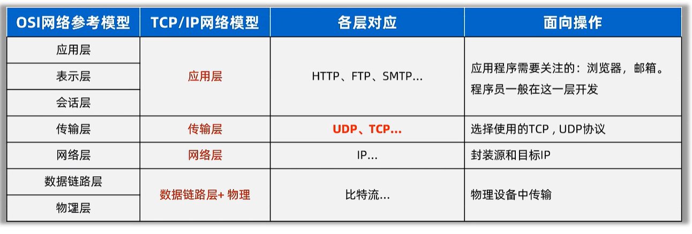

##### P1 UDP协议

> [!Important]
>
> UDP(User Datagram Protocol)：用户数据报协议。

+ **特点**：无连接、不可靠传输。
  + 不事先建立连接，数据以“包”为单位进行传输，“包”的数据部分一般包含：源IP、源程序端口号、目的IP、目的程序端口号、传输数据（64KB以内）等。
  + 发送方发送前不会确认接收方是否在线，数据在传输过程中丢失也不管，接收方收到数据后也不返回确认包ACK，因此传输不可靠。
+ 但是UDP**通信效率高**，适用于语音通话、视频直播等对通信可靠性要求不高的场景。


##### P2 TCP协议

> [!Important]
>
> TCP(Transmission Control Protocol)：传输控制协议。

+ **特点**：面向连接、可靠传输。
+ 但是TCP通信效率相对不高。
+ TCP采用三个步骤实现可靠传输：
  1. 通过**三次握手**建立可靠连接；
  2. 传输数据后进行确认，如果客户端没有收到服务器的确认或确认信息有误，则客户端必须重发；
  3. 通过**四次挥手**断开连接。

##### P1 通过三次握手建立可靠连接

> [!Tip]
>
> 可靠连接：通信双方收发信息正常无问题（全双工通信）。
>
> SYN(Synchronize Sequence Numbers)：同步序列号，是TCP协议头部的一个控制标志位，用于发起连接请求并同步初始序列号。
>
> + 当SYN=1且ACK=0时，表示纯连接请求；
>
> + 当SYN=1且ACK=1时，表示对连接请求的确认。

**第一次握手**：客户端向服务器发送`SYN=1, ACK=0`的报文，携带随机生成的初始序列号ISN，请求与服务器建立连接。

**第二次握手**：服务器收到客户端发来的连接请求报文后，回复`SYN=1, ACK=1`的报文，确认客户端的连接请求并发送自己的ISN。

**第三次握手**：客户端收到服务器发来的确认报文后，回复`SYN=0, ACK=1`的报文，确认服务器的ISN，连接建立完毕。

| 确认事项           | 第一次握手后，服务器得知 | 第二次握手后，客户端得知 | 第三次握手后，服务器得知 |
| ------------------ | ------------------------ | ------------------------ | ------------------------ |
| 客户端发送能力正常 | ✓                        |                          |                          |
| 服务器接收能力正常 |                          | ✓                        |                          |
| 服务器发送能力正常 |                          | ✓                        |                          |
| 客户端接收能力正常 |                          |                          | ✓                        |


##### P2 通过四次挥手断开连接

**第一次挥手**：主动关闭方向被动关闭方发送断开连接请求。

**第二次挥手**：被动关闭方返回一个响应：稍等。

**第三次挥手**：被动关闭方完成剩余数据传输后，返回一个响应：确认断开连接。

**第四次挥手**：主动关闭方向被动关闭方发送报文：收到剩余数据，正式确认断开连接。


---


## 三、网络编程

> [!Warning]
>
> `try-with-resources`是一把双刃剑：
>
> + 优点是代码更简洁和健壮，同时防止资源泄露；
>
> + 缺点是可能导致底层资源被意外关闭，不适用于需要长期保持连接的资源，如网络通信中的 `Socket` 流！
>
> 由于我编码时没有意识到这个缺点，故而以下代码均采用了这种方式自动关闭资源，请各位不要效仿！

### 1.`InetAddress`类：代表IP地址

| 序号 | 方法                                        | 说明                                                         |
| ---- | ------------------------------------------- | ------------------------------------------------------------ |
| 01   | `static InetAddress getLocalHost()`         | 将本机IP封装成一个`InetAddress`对象并返回。                  |
| 02   | `static InetAddress getByName(String host)` | 根据IP或域名，返回一个`InetAddress`对象。                    |
| 03   | `String getHostName()`                      | 获取该`InetAddress`对象的主机名（一般是域名）。              |
| 04   | `String getHostAddress()`                   | 获取该`InetAddress`对象的IP地址信息。                        |
| 05   | `boolean isReachable(int timeout)`          | 在指定时间（单位：毫秒）内，判断主机与该IP对应的主机之间是否连通。 |


---


### 2.UDP通信

#### 2.1 `DatagramSocket`类：创建客户端和服务端

##### P1 构造器

| 构造器                            | 说明                                                         |
| --------------------------------- | ------------------------------------------------------------ |
| `public DatagramSocket()`         | 创建**客户端**的`Socket`对象，系统会为其随机分配一个端口号。 |
| `public DatagramSocket(int port)` | 创建**服务端**的`Socket`对象，并指定端口号。                 |

##### P2 常用方法

| 方法                              | 说明                 |
| --------------------------------- | -------------------- |
| `void send(DatagramPacket dp)`    | 发送数据包。         |
| `void receive(DatagramPacket dp)` | 使用数据包接收数据。 |


#### 2.2 `DatagramPacket`：创建数据包

##### P1 构造器

| 构造器                                                       | 说明                                                     |
| ------------------------------------------------------------ | -------------------------------------------------------- |
| `public DatagramPacket(byte[] buf, int length, InetAddress, int port)` | 创建用于发送数据的数据包对象，必须指定服务端IP和端口号。 |
| `public Datagram(byte[] buf, int length)`                    | 创建用于接收数据的数据包对象。                           |

##### P2 常用方法

| 方法                       | 说明                                     |
| -------------------------- | ---------------------------------------- |
| `int getLength()`          | 获取当前数据包实际接收到的字节数。       |
| `InetAddress getAddress()` | 获取发送当前数据包的客户端的IP地址对象。 |
| `int getPort()`            | 获取发送当前数据包的客户端端口。         |


---


#### 2.3 一发一收

> [!Caution]
>
> 用完`Socket`后记得关闭资源。

+ `Server`:

  ```java
  package udp;
  
  import java.io.IOException;
  import java.net.DatagramPacket;
  import java.net.DatagramSocket;
  import java.net.InetAddress;
  import java.net.UnknownHostException;
  
  public class Server {
      public static final InetAddress IP;
      public static final int PORT = 6666;
      public static final int LENGTH = 1024 * 64;// 64KB
  
      static {
          try {
              IP = InetAddress.getLocalHost();
          } catch (UnknownHostException e) {
              throw new RuntimeException(e);
          }
      }
  
      public static void main(String[] args) {
          System.out.println("Server starts");
          try (
                  DatagramSocket socket = new DatagramSocket(PORT);// 用完后自动关闭资源
          ) {
              byte[] buf = new byte[LENGTH];
              DatagramPacket packet = new DatagramPacket(buf, LENGTH);
  
              socket.receive(packet);
              System.out.println("Server receives a packet from Client, the contents are as follows:");
              System.out.println("Client IP: " + packet.getAddress().getHostAddress());
              System.out.println("Client Port: " + packet.getPort());
              int length = packet.getLength();
              System.out.println(new String(buf, 0, length));// 接收多少，就倒出多少
          } catch (IOException e) {
              throw new RuntimeException(e);
          }
      }
  }
  ```

+ `Client`:

  ```java
  package udp;
  
  import java.io.IOException;
  import java.net.*;
  
  public class Client {
      public static void main(String[] args) {
  
          try (
                  DatagramSocket socket = new DatagramSocket();// 用完后自动关闭资源
          ) {
              byte[] buf = "Hello Server, I'm Client".getBytes();
              DatagramPacket packet = new DatagramPacket(
                      buf, buf.length, Server.IP, Server.PORT);
  
              socket.send(packet);
              System.out.println("Client finishes sending data");
          } catch (IOException e) {
              throw new RuntimeException();
          }
      }
  }
  ```

+ 先启动服务端，再启动客户端，控制台输出如下：

  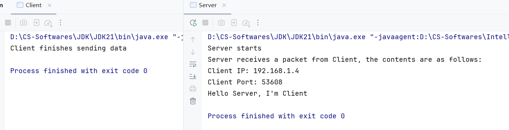


---


#### 2.4 多发多收

##### P1 IDEA中允许客户端多开的设置步骤

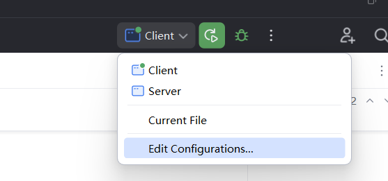

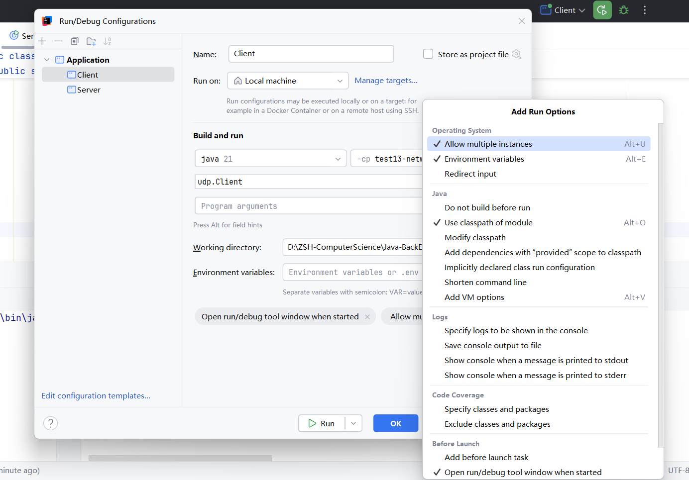

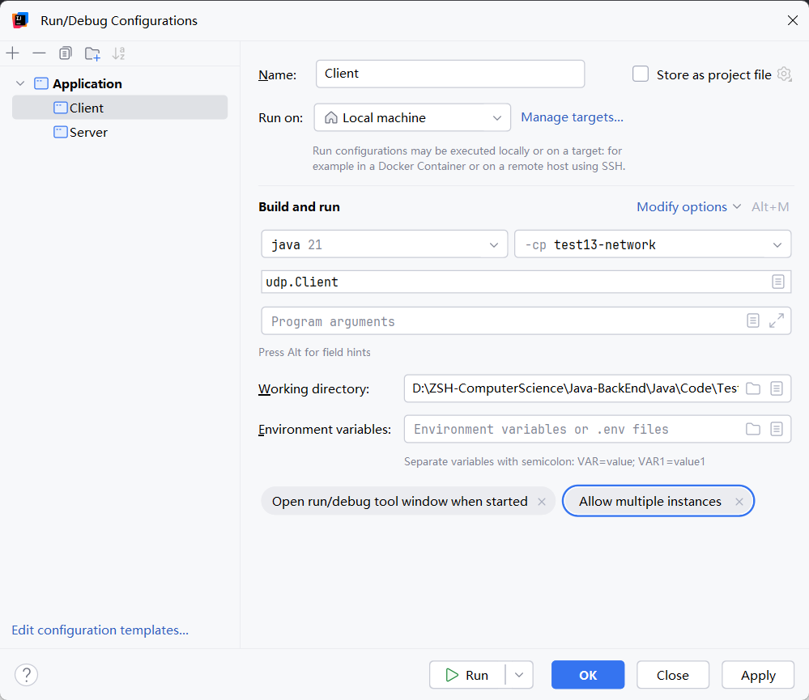

最后点击Apply或OK即可。


##### P2 代码实现

+ `Server`:

  ```java
  package udp;
  
  import java.io.IOException;
  import java.net.DatagramPacket;
  import java.net.DatagramSocket;
  import java.net.InetAddress;
  import java.net.UnknownHostException;
  
  public class Server {
      public static final InetAddress IP;
      public static final int PORT = 6666;
      public static final int LENGTH = 1024 * 64;// 64KB
  
      static {
          try {
              IP = InetAddress.getLocalHost();
          } catch (UnknownHostException e) {
              throw new RuntimeException(e);
          }
      }
  
      public static void main(String[] args) {
          System.out.println("Server starts");
          try (
                  DatagramSocket socket = new DatagramSocket(PORT);
          ) {
              byte[] buf = new byte[LENGTH];
              DatagramPacket packet = new DatagramPacket(buf, LENGTH);
  
              int count = 1;
              while (true) {
                  socket.receive(packet);
                  System.out.println("=====Packet " + (count++) + "=====");
                  System.out.println("Client IP: " + packet.getAddress().getHostAddress());
                  System.out.println("Client Port: " + packet.getPort());
                  int length = packet.getLength();
                  System.out.println("Contents: " + new String(buf, 0, length));// 接收多少，就倒出多少
                  System.out.println("---------------------------------------------");
              }
          } catch (IOException e) {
              throw new RuntimeException(e);
          }
      }
  }
  ```

+ `Client`:

  ```java
  package udp;
  
  import java.io.IOException;
  import java.net.*;
  import java.util.Scanner;
  
  public class Client {
      public static void main(String[] args) {
  
          try (
                  DatagramSocket socket = new DatagramSocket();
          ) {
              Scanner sc = new Scanner(System.in);
              while (true) {
                  System.out.println("please input a message:");
                  String msg = sc.nextLine();
                  if (msg.equals("exit")) {
                      System.out.println("Client exits successfully");
                      break;
                  }
  
                  byte[] buf = msg.getBytes();
                  DatagramPacket packet = new DatagramPacket(
                          buf, buf.length, Server.IP, Server.PORT);
                  socket.send(packet);
              }
          } catch (IOException e) {
              throw new RuntimeException();
          }
      }
  }
  ```

+ 先启动服务端，再分别启动3个客户端，控制台输出如下：

  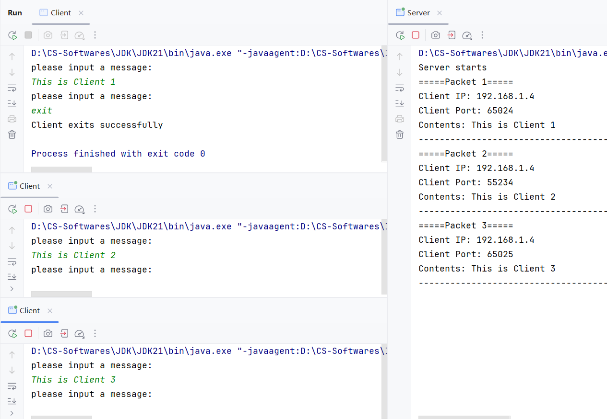


---


### 3A.单客户端TCP通信

#### 3A.1 原理图

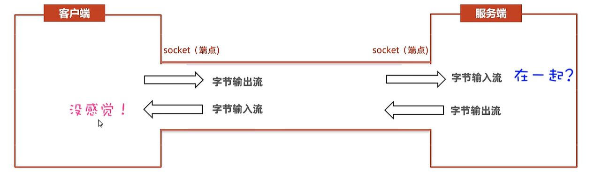

#### 3A.2 `Socket`类：开发客户端

##### P1 构造器

| 构造器                                 | 说明                                                         |
| -------------------------------------- | ------------------------------------------------------------ |
| `public Socket(String host, int port)` | 根据服务端IP和端口号，请求与服务端建立连接，连接成功后返回客户端`Socket`对象。 |

##### P2 常用方法

| 方法                             | 说明                 |
| -------------------------------- | -------------------- |
| `OutputStream getOutputStream()` | 获取字节输出流对象。 |
| `InputStream getInputStream()`   | 获取字节输入流对象。 |


#### 3A.3 `ServerSocket`类：开发服务端

##### P1 构造器

| 构造器                          | 说明                   |
| ------------------------------- | ---------------------- |
| `public ServerSocket(int port)` | 为服务端程序注册端口。 |

##### P2 常用方法

| 方法              | 说明                                                         |
| ----------------- | ------------------------------------------------------------ |
| `Socket accept()` | 阻塞等待客户端的连接请求，一旦与某个客户端连接成功，就返回服务端`Socket`对象。 |


#### 3A.4 代码演示（一发一收）

+ `Server`:

  ```java
  package tcp;
  
  import java.io.DataInputStream;
  import java.io.IOException;
  import java.net.InetAddress;
  import java.net.ServerSocket;
  import java.net.Socket;
  import java.net.UnknownHostException;
  
  public class Server {
      public static final String IP;
      public static final int PORT = 6666;
  
      static {
          try {
              IP = InetAddress.getLocalHost().getHostAddress();
          } catch (UnknownHostException e) {
              throw new RuntimeException(e);
          }
      }
  
      public static void main(String[] args) {
          try (
                  ServerSocket serverSocket = new ServerSocket(PORT);
                  Socket socket = serverSocket.accept();
                  DataInputStream dis = new DataInputStream(socket.getInputStream());
          ) {
              System.out.println("Client Address: " + socket.getRemoteSocketAddress());
              System.out.println("Contents: " + dis.readUTF());
  
          } catch (IOException e) {
              throw new RuntimeException(e);
          }
      }
  }
  ```

+ `Client`:

  ```java
  package tcp;
  
  import java.io.DataOutputStream;
  import java.io.IOException;
  import java.net.Socket;
  import java.net.UnknownHostException;
  
  public class Client {
      public static void main(String[] args) {
          try (
                  Socket socket = new Socket(Server.IP, Server.PORT);
                  DataOutputStream dos = new DataOutputStream(socket.getOutputStream());// 把低级流包装成高级流
          ) {
  
              dos.writeUTF("Can we be together?");
  
          } catch (UnknownHostException e) {
              throw new RuntimeException(e);
          } catch (IOException e) {
              throw new RuntimeException(e);
          }
      }
  }
  ```

+ 先启动服务端，再启动客户端，控制台输出如下：

  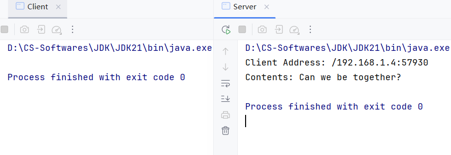


#### 3A.5 单客户端多发多收注意事项

1.客户端每写一次数据，就要刷新一下。

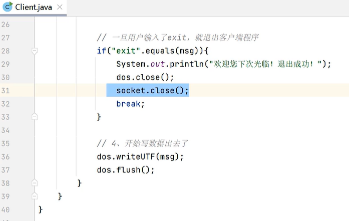

2.若客户端突然离线，则服务端必须处理异常，关闭相关资源。

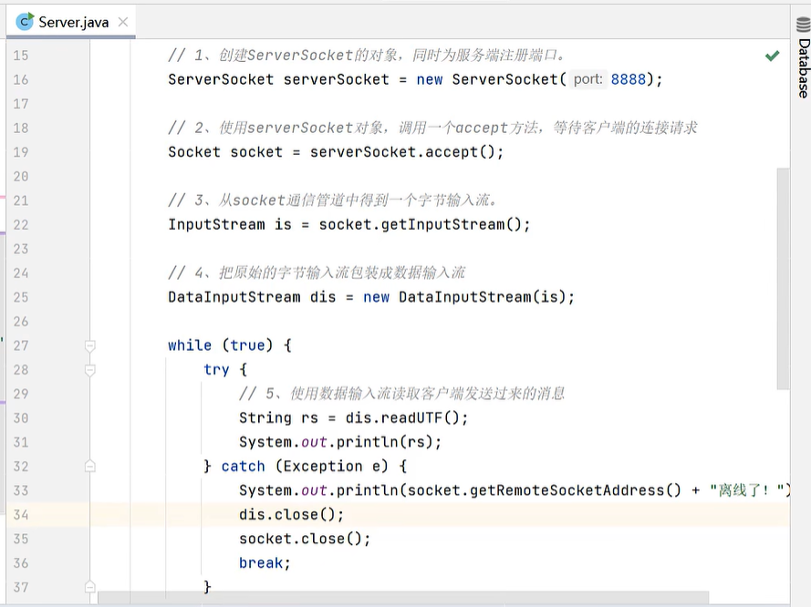


---


### 3B.多客户端TCP通信

#### 3B.1 3A代码的局限性

3A代码无法支持多客户端与服务端的TCP通信，根本原因是服务端目前只有一个主线程，只能处理一个客户端的信息。


#### 3B.2 重构思路：引入多线程

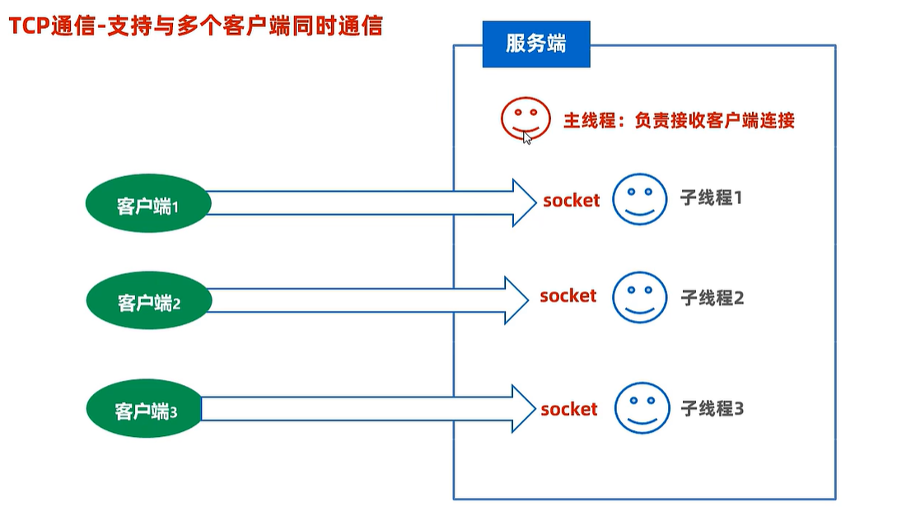


#### 3B.3 代码实现

+ `ServerReaderThread`:

  ```java
  package tcp;
  
  import java.io.DataInputStream;
  import java.io.IOException;
  import java.net.Socket;
  
  public class ServerReaderThread extends Thread {
      private Socket socket;
  
      public ServerReaderThread(Socket socket) {
          this.socket = socket;
      }
  
      @Override
      public void run() {
          try (
                  DataInputStream dis = new DataInputStream(socket.getInputStream());
          ) {
              while (true) {
                  try {
                      System.out.println(
                              "Client Address: " + socket.getRemoteSocketAddress() +
                                      "\nContents: " + dis.readUTF() + "\n");
                  } catch (IOException e) {
                      System.out.println(socket.getRemoteSocketAddress() + " terminals");
                      dis.close();
                      socket.close();
                      break;
                  }
              }
          } catch (IOException e) {
              throw new RuntimeException(e);
          }
      }
  }
  ```

+ `Server`:

  ```java
  package tcp;
  
  import java.io.IOException;
  import java.net.InetAddress;
  import java.net.ServerSocket;
  import java.net.Socket;
  import java.net.UnknownHostException;
  
  public class Server {
      public static final String IP;
      public static final int PORT = 6666;
  
      static {
          try {
              IP = InetAddress.getLocalHost().getHostAddress();
          } catch (UnknownHostException e) {
              throw new RuntimeException(e);
          }
      }
  
      public static void main(String[] args) throws IOException {
          System.out.println("Server starts.");
          ServerSocket serverSocket = new ServerSocket(PORT);
  
          while (true) {
              Socket socket = serverSocket.accept();
              new ServerReaderThread(socket).start();
          }
      }
  }
  ```

+ `Client`:

  ```java
  package tcp;
  
  import java.io.DataOutputStream;
  import java.io.IOException;
  import java.net.Socket;
  import java.net.UnknownHostException;
  import java.util.Scanner;
  
  public class Client {
      public static void main(String[] args) {
          Scanner sc = new Scanner(System.in);
          try (
                  Socket socket = new Socket(Server.IP, Server.PORT);
                  DataOutputStream dos = new DataOutputStream(socket.getOutputStream());// 把低级流包装成高级流
          ) {
              while (true) {
                  System.out.println("Please input a message:");
                  String msg = sc.nextLine();
                  if (msg.equals("exit")) {
                      System.out.println("Client exits successfully!");
                      break;
                  }
                  dos.writeUTF(msg);
                  dos.flush();
              }
          } catch (IOException e) {
              throw new RuntimeException(e);
          }
      }
  }
  ```

+ 先启动服务端，再分别启动3个客户端，控制台输出如下：

  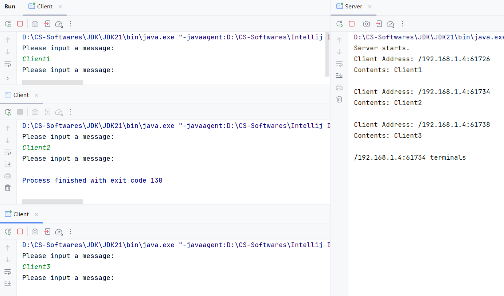


---


### 4.TCP通信综合案例

#### 4.1 即时通信群聊

##### P1 原理图

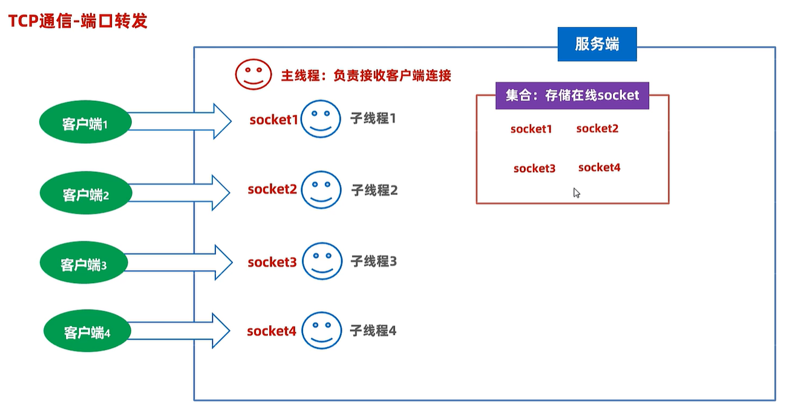

##### P2 代码实现

具体代码参见项目：[wechat](TCP/src/wechat)


---


#### 4.2 简易版BS架构

##### P1 需求

从浏览器中访问服务器，并立即让服务器响应一个简单网页渲染到浏览器上，网页内容是“黑马程序员666”。

##### P2 原理图

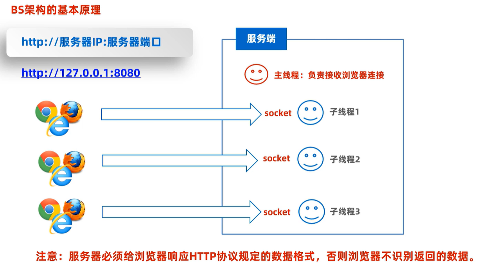

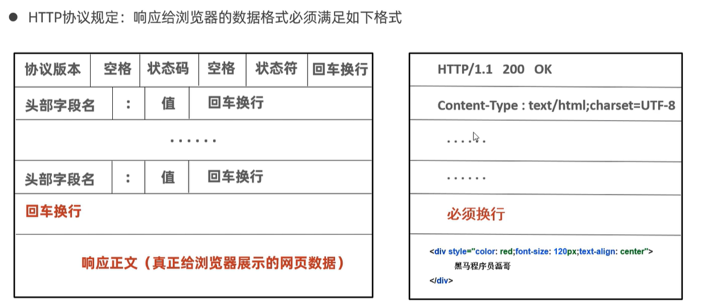

##### P3 代码实现

具体代码参见项目：[simpleBS](TCP/src/simpleBS)

Chrome浏览器访问localhost:8888，网页展示如下：

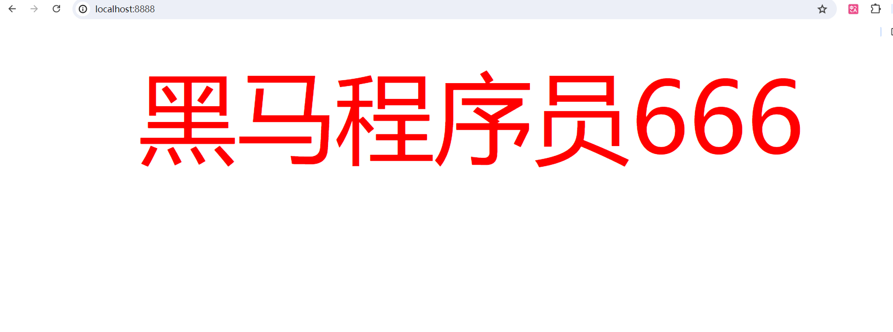


---


### 5.拓展

Q：每次网络请求都开一个新线程，到底好不好？

A：高并发时，容易宕机！

**解决方案**：使用线程池进行优化。

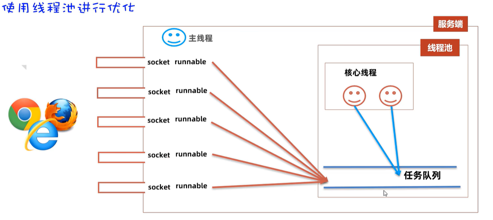

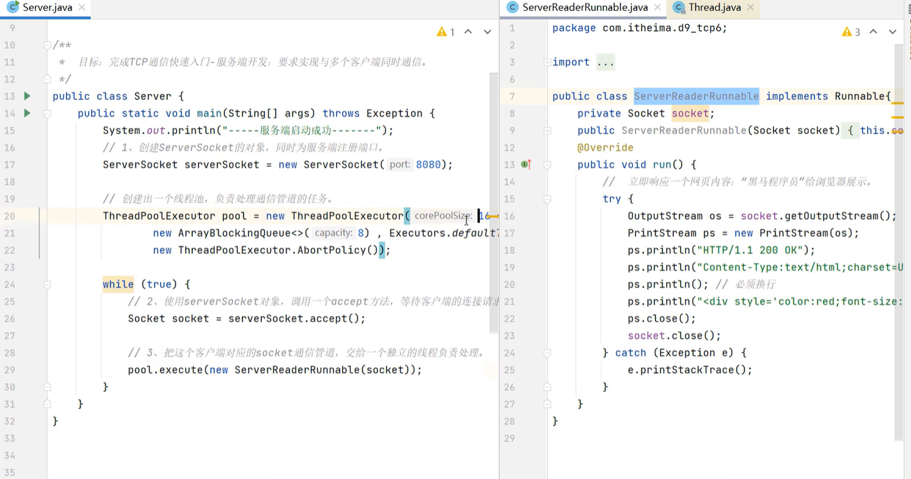


