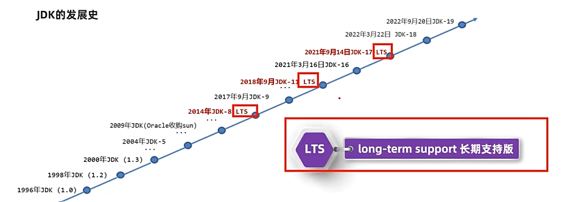
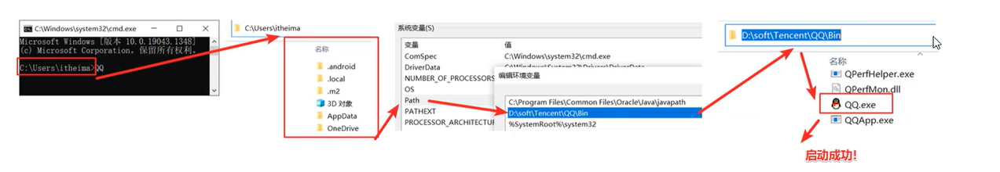

# Java入门

### 一、Java背景知识

+ Java是美国SUN(Standard University Network)公司在1995年推出的一门计算机高级编程语言。
+ Java早期称为Oak（橡树），但由于商标被占用，后改名为Java。
+ Java之父：James Gosling（詹姆斯·高斯林）。
+ 2009年，SUN公司被Oracle（甲骨文）公司收购。


### 二、Java应用途径

+ 桌面应用开发：各种税务管理软件，IDEA。
+ 企业级应用开发：微服务，大型互联网应用。
+ 移动应用开发：Android，医疗设备。
+ 服务器系统：应用的后台。
+ 大数据开发：hadoop。
+ 游戏开发：我的世界Minecraft。


### 三、Java技术体系

|                 技术体系                 |             说明             |
| :--------------------------------------: | :--------------------------: |
|  Java SE(Java Standard Edition)：标准版  |     Java技术的核心和基础     |
| Java EE(Java Enterprise Edition)：企业版 | 企业级应用开发的一套解决方案 |
|   Java ME(Java Micro Edition)：小型版    |  针对移动设备应用的解决方案  |


### 四、搭建Java开发环境

#### 1.JDK

Java的产品叫作JDK(Java Development Kit：Java开发者工具包)，必须安装JDK才能使用Java。



#### 2.验证JDK是否安装成功

1. win+R输入cmd打开命令提示符；
2. 输入`java`后，若有显示大段文字，证明`java.exe`可用，同理输入`javac`；
3. 输入`java -version`以查看版本是否正确，同理输入`javac -version`。

#### 3.JDK中的`java.exe`和`javac.exe`的基本作用

`java.exe`是执行工具，`javac.exe`是编译工具。

我们写好的Java程序都是高级语言，计算机底层是硬件无法识别这些语言，必须先通过`javac.exe`进行编译，再通过`java.exe`执行才可以驱动机器干活。


### 五、Java程序开发的三个步骤

开发Java程序的三个步骤是：编写代码，编译代码，运行代码。


#### Step1：编写源代码文件`HelloWorld.java`

```java
public class HelloWorld{
	public static void main(String[] args){
		System.out.println("Hello World");
	}
}
```


#### Step2：在命令提示符编译源代码文件

打开命令提示符，先通过cd命令进入源代码文件所在的文件夹，再执行命令`javac HelloWorld.java`。


执行完该命令后，可以发现源代码文件所在的文件夹中新增了一个字节码文件`HelloWorld.class`。


#### Step3：在命令提示符运行编译后的字节码文件`HelloWorld.class`

执行命令`java HelloWorld`。


可以看到在命令的下一行成功打印出了"Hello World"。


---


### 六、JDK的组成

JDK的组成如下：

+ JRE(Java Runtime Environment)：Java的运行环境。

  + JVM(Java Virtual Machine)：Java虚拟机，是真正运行Java程序的地方。

  + 核心类库：Java自己写好的程序，提供给程序员调用，避免“重复造轮子”。


+ 开发工具：java、javac...


### 七、安装JDK后的环境变量配置

> 在电脑下方搜索栏中搜索“高级系统设置”，打开后点击上方的“高级”选项，然后点击“环境变量”即可进行环境变量配置。
>
> 用户变量配置只针对当前登录的用户有效，系统变量配置则对该电脑的所有用户有效。

#### 1.Path环境变量

Path环境变量用于记住程序路径，便于在命令提示符的任意目录下启动程序，免去了cd操作。

原理如下：先去找当前目录下有无该程序，若找不到则再去Path环境变量中找。



**注意**：目前较新版本的JDK在安装时会自动配置java和javac程序的路径到Path环境变量中去，因此它们可以直接使用。但老版本的JDK在安装时是不会自动配置Path环境变量的，我们要记得手动配置，配置完还必须在命令提示符输入`java -version`和`javac -version`来检测配置是否成功。

#### 2.HOME环境变量

`JAVA_HOME`环境变量用于告诉操作系统JDK的安装目录（将来其他技术还要通过它来找JDK）。


**注意**：较新版本的JDK只是自动配置了Path，并没有自动配置`JAVA_HOME`。

**推荐**：配置完`JAVA_HOME`后，Path环境变量就可以不用将JDK的bin包地址以硬编码的形式配置，而改为：`%JAVA_HOME%\bin`，这样能解耦合，即便之后JDK的安装目录变了，也只需更改`JAVA_HOME`的变量值，而无需更改Path环境变量。


### 八、IDEA常用快捷键

|        快捷键        |        功能        |
| :------------------: | :----------------: |
| main/psvm、sout、……  |  快速键入相关代码  |
|        Ctrl+D        | 复制当前行到下一行 |
|        Ctrl+Y        |     删除当前行     |
|      Ctrl+Alt+L      |     格式化代码     |
|    Alt+Shift+↑/↓     |   上下移动当前行   |
| Ctrl+/、Ctrl+Shift+/ |   对代码进行注释   |

