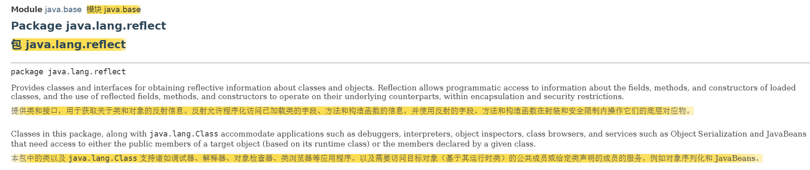
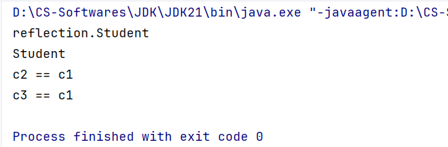
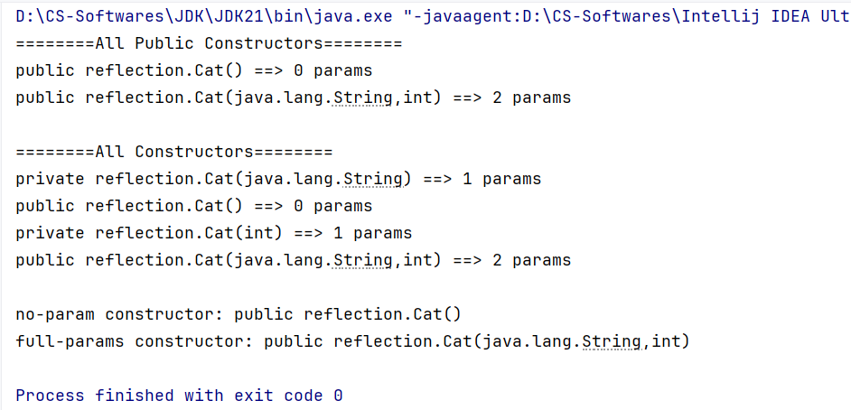
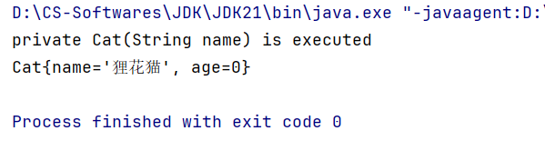
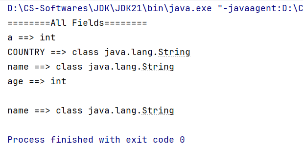
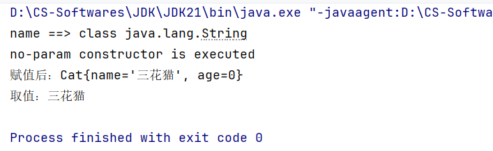

# 反射

> 鸣谢：黑马程序员
>
> 


## 一、概述




---


## 二、操作步骤

### 1.加载类，获取类的字节码：`Class`对象

#### 1.1 获取`Class`对象的3种方式

+ `Class c1 = 目标类名.class`

+ 调用`Class`类提供的静态方法：`public static Class forName(String package)`

  + `Class c2 = Class.forName(目标类的完整类名，即包括所在包名)`

+ 调用`Object`类提供的方法：`public Class getClass()`

  + `Class c3 = 目标类的实例对象.getClass()`

    

#### 1.2 代码演示

首先在模块下新建一个包`reflection`，然后创建一个学生类`Student`和一个测试类`Test1`。

+ `Student`:

```java
package reflection;

import java.util.Objects;

public class Student {
    private String name;
    private int age;
    private double height;

    public Student() {
    }

    public Student(String name, int age, double height) {
        this.name = name;
        this.age = age;
        this.height = height;
    }

    // 省略getter&setter
}
```

+ `Test1`:

```java
package reflection;

public class Test1 {
    public static void main(String[] args) throws Exception {
        Class c1 = Student.class;
        System.out.println(c1.getName());// 完整类名，包括前面的包名
        System.out.println(c1.getSimpleName());// 简名：Student

        Class c2 = Class.forName("reflection.Student");
        if (c2.equals(c1)) {
            System.out.println("c2 == c1");
        }

        Student s = new Student();
        Class c3 = s.getClass();
        if (c3.equals(c1)) {
            System.out.println("c3 == c1");
        }
    }
}
```

+ 控制台输出：

  


---


### 2.获取类的构造器：`Constructor`对象

#### 2.1 常用方法 

##### P1 `Class`类提供的方法

| 序号 | 方法                                                         | 说明                     |
| ---- | ------------------------------------------------------------ | ------------------------ |
| 01   | `Constructor<?>[] getConstructors()`                         | 获取全部`public`构造器。 |
| 02   | `Constructor<?>[] getDeclaredConstructors()`                 | 获取全部构造器。         |
| 03   | `Constructor<?>[] getConstructor(Class<?>... parameterTypes)` | 获取某个`public`构造器。 |
| 04   | `Constructor<?>[] getDeclaredConstructor(Class<?>... parameterTypes)` | 获取某个构造器。         |

##### P2 `Constructor`类提供的方法

| 序号 | 方法                                     | 说明                                                         |
| ---- | ---------------------------------------- | ------------------------------------------------------------ |
| 01   | `Object newInstance(Object... initargs)` | 调用此构造器对象表示的构造器，传入参数，完成对象的初始化并返回。 |
| 02   | `void setAccessible(boolean flag)`       | 当`flag`设置为`true`时，表示禁止编译器检查访问权限，即**暴力反射**。 |


---


#### 2.2 代码演示

在包`reflection`下继续创建一个猫类`Cat`和一个测试类`Test2`。

+ `Cat`:

  ```java
  package reflection;
  
  public class Cat {
      private String name;
      private int age;
  
      public Cat() {
          System.out.println("no-param constructor is executed");
      }
  
      private Cat(String name) {
          this.name = name;
          System.out.println("private Cat(String name) is executed");
      }
  
      private Cat(int age) {
          System.out.println("private Cat(int age) is executed");
          this.age = age;
      }
  
      public Cat(String name, int age) {
          this.name = name;
          this.age = age;
          System.out.println("full-params constructor is executed");
      }
      
      @Override
      public String toString() {
          return "Cat{" +
                  "name='" + name + '\'' +
                  ", age=" + age +
                  '}';
      }
      
      // 省略getter&setter
  }
  ```

+ `Test2`:

  ```java
  package reflection;
  
  import java.lang.reflect.Constructor;
  import java.util.Arrays;
  
  public class Test2 {
      public static void main(String[] args) throws Exception {
          Class c = Cat.class;
  
          System.out.println("========All Public Constructors========");
          Arrays.stream(c.getConstructors()).forEach(constructor -> {
              System.out.println(constructor.toString() + " ==> " + constructor.getParameterCount() + " params");
          });
          System.out.println();
  
          System.out.println("========All Constructors========");
          Arrays.stream(c.getDeclaredConstructors()).forEach(constructor -> {
              System.out.println(constructor.toString() + " ==> " + constructor.getParameterCount() + " params");
          });
          System.out.println();
  
          Constructor noParamConstructor = c.getConstructor();
          System.out.println("no-param constructor: " + noParamConstructor);
          Constructor fullParamsConstructor = c.getDeclaredConstructor(String.class, int.class);
          System.out.println("full-params constructor: " + fullParamsConstructor);
      }
  }
  ```

+ 控制台输出：

  


---


#### 2.3 获取构造器的作用：初始化对象并返回

```java
package reflection;

import java.lang.reflect.Constructor;
import java.util.Arrays;

public class Test2 {
    public static void main(String[] args) throws Exception {
        Class c = Cat.class;

        Constructor constructor = c.getDeclaredConstructor(String.class);
        constructor.setAccessible(true);// 允许访问私有构造器，会破坏封装性
        Cat cat = (Cat) constructor.newInstance("狸花猫");
        System.out.println(cat);
    }
}
```

控制台输出：




---


### 3.获取类的成员变量：`Field`对象

#### 3.1 常用方法

##### P1 `Class`类提供的方法

| 序号 | 方法                                  | 说明                       |
| ---- | ------------------------------------- | -------------------------- |
| 01   | `Field[] getFields()`                 | 获取全部`public`成员变量。 |
| 02   | `Field[] getDeclaredFields()`         | 获取全部成员变量。         |
| 03   | `Field getField(String name)`         | 获取某个`public`成员变量。 |
| 04   | `Field getDeclaredField(String name)` | 获取某个成员变量。         |

##### P2 `Field`类提供的方法

| 序号 | 方法                                 | 说明                                                         |
| ---- | ------------------------------------ | ------------------------------------------------------------ |
| 01   | `void set(Object obj, Object value)` | 赋值。                                                       |
| 02   | `Object get(Object obj)`             | 取值。                                                       |
| 03   | `void setAccessible(boolean flag)`   | 当`flag`设置为`true`时，表示禁止编译器检查访问权限，即**暴力反射**。 |


---


#### 3.2 代码演示

+ `Cat`:

  ```java
  package reflection;
  
  public class Cat {
      public static int a;
      public static final String COUNTRY = "CHINA";
      private String name;
      private int age;
  
      public Cat() {
          System.out.println("no-param constructor is executed");
      }
  
      private Cat(String name) {
          this.name = name;
          System.out.println("private Cat(String name) is executed");
      }
  
      private Cat(int age) {
          System.out.println("private Cat(int age) is executed");
          this.age = age;
      }
  
      public Cat(String name, int age) {
          this.name = name;
          this.age = age;
          System.out.println("full-params constructor is executed");
      }
  
      @Override
      public String toString() {
          return "Cat{" +
                  "name='" + name + '\'' +
                  ", age=" + age +
                  '}';
      }
  
      // 省略getter&setter
  }
  ```

+ `Test3`:

  ```java
  package reflection;
  
  import java.lang.reflect.Field;
  import java.util.Arrays;
  
  public class Test3 {
      public static void main(String[] args) throws Exception {
          Class c = Cat.class;
  
          System.out.println("========All Fields========");
          Arrays.stream(c.getDeclaredFields()).forEach(f -> {
              System.out.println(f.getName() + " ==> " + f.getType());
          });
          System.out.println();
  
          Field fName = c.getDeclaredField("name");
          System.out.println(fName.getName() + " ==> " + fName.getType());
      }
  }
  ```

+ 控制台输出：

  


---


#### 3.3 获取成员变量的作用：赋值与取值

```java
package reflection;

import java.lang.reflect.Field;

public class Test3 {
    public static void main(String[] args) throws Exception {
        Class c = Cat.class;

        Field fName = c.getDeclaredField("name");
        System.out.println(fName.getName() + " ==> " + fName.getType());
        fName.setAccessible(true);
        Cat cat = new Cat();

        fName.set(cat, "三花猫");
        System.out.println("赋值后：" + cat);
        String name = (String) fName.get(cat);// 强转
        System.out.println("取值：" + name);

    }
}
```

控制台输出：




---


### 4.获取类的成员方法：`Method`对象

#### 4.1 常用方法

##### P1 `Class`类提供的方法


##### P2 `Method`类提供的方法

| 序号 | 方法                               | 说明                                                         |
| ---- | ---------------------------------- | ------------------------------------------------------------ |
| 01   |                                    |                                                              |
| 02   |                                    |                                                              |
| 03   | `void setAccessible(boolean flag)` | 当`flag`设置为`true`时，表示禁止编译器检查访问权限，即**暴力反射**。 |


---


#### 4.2 代码演示


---


#### 4.3 获取成员方法的作用：


---


## 三、作用


