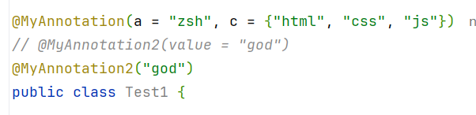
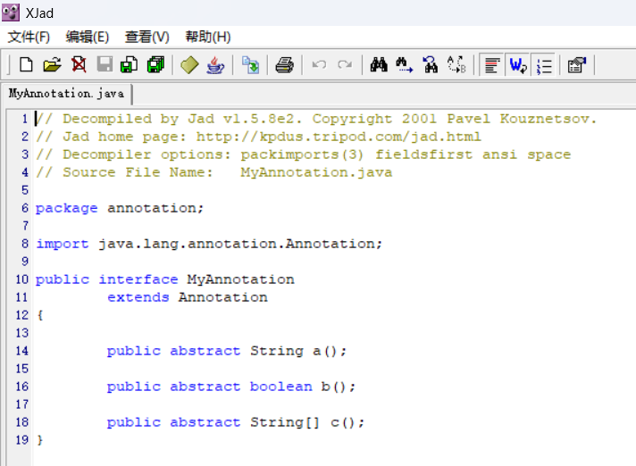
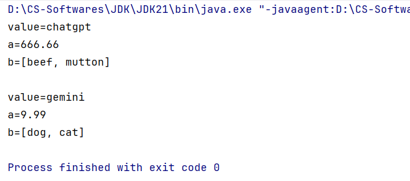
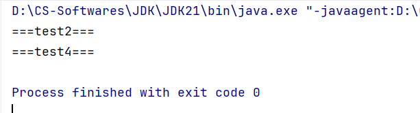

# 11-Annotation(注解)

> 鸣谢：黑马程序员
>
> 

> [!TIP]
>
> Previous Chapter(上一章)：10-Reflection(反射)
>
> + [Markdown](../10-Reflection(反射)/10-Reflection(反射).md)
> + [PDF](../10-Reflection(反射)/10-Reflection(反射).pdf)
> + [HTML](../10-Reflection(反射)/10-Reflection(反射).html)
>
> Next Chapter(下一章)：12-Dynamic Proxy(动态代理)
>
> + [Markdown](../12-Dynamic Proxy(动态代理)/12-Dynamic Proxy(动态代理).md)
> + [PDF](../12-Dynamic Proxy(动态代理)/12-Dynamic Proxy(动态代理).pdf)
> + [HTML](../12-Dynamic Proxy(动态代理)/12-Dynamic Proxy(动态代理).html)


[TOC]

## 一、概述

注解(`Annotation`)是Java代码里的特殊标记，比如`@Override`、`@Test`，它们的作用是让其他程序根据注解信息来决定如何执行该程序。

注解可以用于类、接口、构造器、成员变量、方法、参数等位置处。


---


## 二、自定义注解

### 1.格式

```java
public @interface 注解名 {
    public 属性类型 属性名() default 默认值;
}
```

代码示例如下：

+ `MyAnnotation`:

  ```java
  public @interface MyAnnotation {
      String a();
      boolean b() default true;
      String[] c();
  }
  ```

+ `Test1`:

  ```java
  package annotation;
  
  @MyAnnotation(a = "zsh", c = {"html", "css", "js"})
  public class Test1 {
  
      @MyAnnotation(a = "zjl", b = false, c = {"Java", "Python"})
      public void test1() {
  
      }
      
      public static void main(String[] args) {
          
      }
  }
  ```


### 2.特殊属性：`value`

如果注解中只有一个`value`属性或者其他属性都有默认值，那么使用注解时，`value`字段名可以省略。

代码示例如下：

+ `MyAnnotation2`：

  ```java
  public @interface MyAnnotation2 {
      String value();// 特殊属性
  }
  ```

+ `Test1`:

  


### 3.注解的原理

我们执行一下`Test1`的`main`方法，然后使用`XJad`反编译工具对`MyAnnotation.class`字节码文件进行反编译并查看内容：



分析反编译后的字节码文件，可知注解本质上是一个继承了`Annotation`这个注解接口的接口。

而我们在主程序中使用注解，其实相当于创建了注解的一个实现类对象。


---


## 三、元注解

> [!Important]
>
> 元注解就是修饰注解的注解。

### 1.`@Target`

**作用**：声明被修饰的注解只能在哪些位置被使用。

**格式**：`@Target(ElementType.???, ElementType,???, ...)`

| ???              | 说明     |
| ---------------- | -------- |
| `TYPE`           | 类和接口 |
| `FIELD`          | 成员变量 |
| `METHOD`         | 成员方法 |
| `PARAMETER`      | 方法参数 |
| `CONSTRUCTOR`    | 构造器   |
| `LOCAL_VARIABLE` | 局部变量 |


### 2.`@Retention`

**作用**：声明注解的保留周期。

**格式**：`@Retention(RetentionPolicy.???, RetentionPolicy.???, ...)`

| ???                   | 说明                                       |
| --------------------- | ------------------------------------------ |
| `SOURCE`              | 只作用在源码阶段，编译为字节码文件后消失。 |
| `CLASS`（默认值）     | 编译为字节码文件后继续存在，运行阶段消失。 |
| `RUNTIME`（开发常用） | 一直保留到运行阶段。                       |


---


## 四、注解的解析

> [!Important]
>
> 判断类、接口、构造器、成员变量、方法、参数等位置处是否存在注解，若存在则把注解里的内容解析出来。

### 1.步骤

**指导思想：**要解析谁上面的注解，就应该先拿到谁。

`Class`、`Constructor`、`Field`、`Method`都实现了`AnnotatedElement`接口，它们都拥有解析注解的能力。

| 序号 | `AnnotatedElement`接口提供的解析注解的方法                   | 说明                             |
| ---- | ------------------------------------------------------------ | -------------------------------- |
| 01   | `Annotation[] getDeclaredAnnotations()`                      | 获取当前对象上的注解。           |
| 02   | `T getDeclaredAnnotation(Class<T> annotationClass)`          | 获取指定的注解对象。             |
| 03   | `boolean isAnnotationPresent(Class<Annotation> annotationClass)` | 判断当前对象上是否存在某个注解。 |


### 2.代码演示

#### 2.1 需求

1. 定义注解`MyAnnotation3`，要求：

   + 包含属性：`String value()`, `double a() default 100`, `String[] b`。

   + 限制注解只能使用在类和成员方法上。

   + 注解一直保留到运行阶段。

2. 定义一个类`Demo`，在类中定义一个`test`方法，并在该类和其方法上使用`MyAnnotation3`注解。

3. 定义测试类`AnnotationParser`，用于解析`Demo`类中的全部注解。


#### 2.2 代码实现

+ `MyAnnotation`:

  ```java
  import java.lang.annotation.ElementType;
  import java.lang.annotation.Retention;
  import java.lang.annotation.RetentionPolicy;
  import java.lang.annotation.Target;
  
  @Target({ElementType.TYPE, ElementType.METHOD})
  @Retention(RetentionPolicy.RUNTIME)
  public @interface MyAnnotation3 {
      String value();
      double a() default 100;
      String[] b();
  }
  ```

+ `Demo`:

  ```java
  @MyAnnotation3(value = "chatgpt", a = 666.66, b = {"beef", "mutton"})
  public class Demo {
  
      @MyAnnotation3(value = "gemini", a = 9.99, b = {"dog", "cat"})
      public static void test() {
  
      }
  }
  ```

+ `AnnotationParser`:

  ```java
  import java.lang.annotation.Annotation;
  import java.lang.reflect.Method;
  import java.util.Arrays;
  
  public class AnnotationParser {
      public static void main(String[] args) throws NoSuchMethodException {
          parseClass();
          System.out.println();
          parseMethod();
      }
  
      public static void parseClass() {
          Class demo = Demo.class;
          if (demo.isAnnotationPresent(MyAnnotation3.class)) {
              MyAnnotation3 annotation = (MyAnnotation3) demo.getDeclaredAnnotation(MyAnnotation3.class);
              System.out.println("value=" + annotation.value());
              System.out.println("a=" + annotation.a());
              System.out.println("b=" + Arrays.toString(annotation.b()));
          }
      }
  
      public static void parseMethod() throws NoSuchMethodException {
          Method test1 = Demo.class.getDeclaredMethod("test");
          if (test1.isAnnotationPresent(MyAnnotation3.class)) {
              MyAnnotation3 annotation = (MyAnnotation3) test1.getDeclaredAnnotation(MyAnnotation3.class);
              System.out.println("value=" + annotation.value());
              System.out.println("a=" + annotation.a());
              System.out.println("b=" + Arrays.toString(annotation.b()));
          }
  
      }
  }
  ```

+ 控制台输出：

  


---


## 五、注解的应用场景——案例：模拟`JUnit`框架

### 1.需求分析

**需求**：定义几个方法，只要加了`@MyTest`注解，就会触发该方法执行。

**分析**：

1. 自定义注解`@MyTest`，只能注解方法，一直存活。
2. 定义几个方法，一部分加上`@MyTest`注解修饰，另一部分不加。
3. 模拟一个`junit`程序，所有加了`@MyTest`注解的方法都会被触发执行（使用暴力反射）。


### 2.代码实现

+ `MyTest`:

  ```java
  package my_junit;
  
  import java.lang.annotation.ElementType;
  import java.lang.annotation.Retention;
  import java.lang.annotation.RetentionPolicy;
  import java.lang.annotation.Target;
  
  @Target(ElementType.METHOD)
  @Retention(RetentionPolicy.RUNTIME)
  public @interface MyTest {
  }
  ```

+ `MyJunit`:

  ```java
  package my_junit;
  
  import java.lang.reflect.InvocationTargetException;
  import java.util.Arrays;
  
  public class MyJunit {
  
      public static void main(String[] args) {
  
          MyJunit myJunit = new MyJunit();
          Class c = MyJunit.class;
  
          Arrays.stream(c.getDeclaredMethods()).forEach(method -> {
              if (method.isAnnotationPresent(MyTest.class)) {
                  try {
                		method.setAccessible(true);
                      method.invoke(myJunit);
                  } catch (IllegalAccessException e) {
                      throw new RuntimeException(e);
                  } catch (InvocationTargetException e) {
                      throw new RuntimeException(e);
                  }
              }
          });
      }
  
      public void test1() {
          System.out.println("===test1===");
      }
  
      @MyTest
      public void test2() {
          System.out.println("===test2===");
      }
  
      public void test3() {
          System.out.println("===test3===");
      }
  
      @MyTest
      public void test4() {
          System.out.println("===test4===");
      }
  }
  ```

+ 控制台输出：

  


