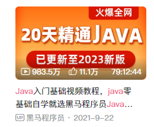
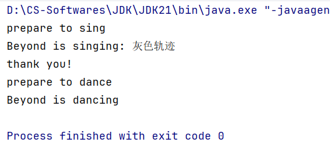

# 12-Dynamic Proxy(动态代理)

> 鸣谢：黑马程序员
>
> 

> [!TIP]
>
> Previous Chapter(上一章)：11-Annotation(注解)
>
> + [Markdown](../11-Annotation(注解)/11-Annotation(注解).md)
> + [PDF](../11-Annotation(注解)/11-Annotation(注解).pdf)
> + [HTML](../11-Annotation(注解)/11-Annotation(注解).html)
>


[TOC]

## 一、概述

+ 如果某个对象的职责过多，可以通过代理来转移部分职责。
+ 代理必须具备对象委托其代理的方法。比如对象有`run()`方法想委托给代理处理，那么代理也必须具备`run()`方法。
  + Java中规定对象和代理都必须实现特定接口，以此保证这条原则的落实。


---


## 二、代码演示

### 1.需求

一位明星唱歌和跳舞时需要处理的业务有三个阶段：

+ 准备阶段。
+ 唱歌/跳舞阶段（核心业务）。
+ 收尾阶段（可以回应观众，也可以什么都不做）。

但是对于这位明星来说，他最关心的是核心业务，而如果每次想要唱歌/跳舞时都要亲自处理这三个阶段的业务，就会导致职责过多。

这时候，我们可以考虑将明星的准备阶段和收尾阶段交由经纪人实现，也就是代理。


### 2.创建代理对象

`java.lang.reflet.Proxy`类提供了为对象生成代理对象的方法：

```java
public static Object newProxyInstance(
    ClassLoader loader,    // 指定使用哪个类加载器去加载生成的代理类
    Class<?>[] interfaces, // 指定接口，这些接口用于指定生成的代理具有什么方法
    InvocationHandler h    // 指定生成的代理对象要处理的业务
) 
```


---


### 3.代码实现

#### 3.1 定义`Star`接口和`SuperStar`实现类

+ `Star`接口：

  ```java
  package proxy;
  
  public interface Star {
      String sing(String song);
  
      void dance();
  }
  ```

+ `SuperStar`实现类：

  ```java
  package proxy;
  
  // 明星类
  public class SuperStar implements Star {
      private String name;
  
      public SuperStar(String name) {
          this.name = name;
      }
  
      @Override
      public String sing(String song) {
          System.out.println(name + " is singing: " + song);
          return "thank you!";
      }
  
      @Override
      public void dance() {
          System.out.println(name + " is dancing");
      }
  
  }
  ```


#### 3.2 定义代理工具类`ProxyUtil`

> [!WARNING]
>
> 此处使用的`Proxy`类是`java.lang.reflect`这个包下的，注意不要错选成其他包下的。

```java
package proxy;

import java.lang.reflect.InvocationHandler;
import java.lang.reflect.Method;
import java.lang.reflect.Proxy;

public class ProxyUtil {
    public static Star createProxy(SuperStar superStar) {
        Star starProxy = (Star) Proxy.newProxyInstance(
                ProxyUtil.class.getClassLoader(),// 指定使用哪个类加载器去加载生成的代理类
                new Class[]{Star.class},         // 指定接口，这些接口用于指定生成的代理具有什么方法
                new InvocationHandler() {        // 指定生成的代理对象要处理的业务
                    @Override
                    public Object invoke(Object proxy, Method method, Object[] args) throws Throwable {
                        if (method.getName().equals("sing")) {
                            System.out.println("prepare to sing");
                        } else if (method.getName().equals("dance")) {
                            System.out.println("prepare to dance");
                        }
                        return method.invoke(superStar, args);// 核心业务交由对象处理
                    }
                }
        );
        return starProxy;
    }
}
```


#### 3.3 编写测试类`Test`

```java
package proxy;

public class Test {
    public static void main(String[] args) {
        SuperStar superStar = new SuperStar("Beyond");
        Star starProxy = ProxyUtil.createProxy(superStar);

        String reply = starProxy.sing("灰色轨迹");
        System.out.println(reply);

        starProxy.dance();
    }
}
```


#### 3.4 控制台输出




