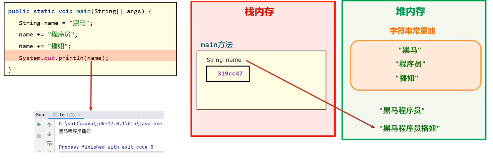
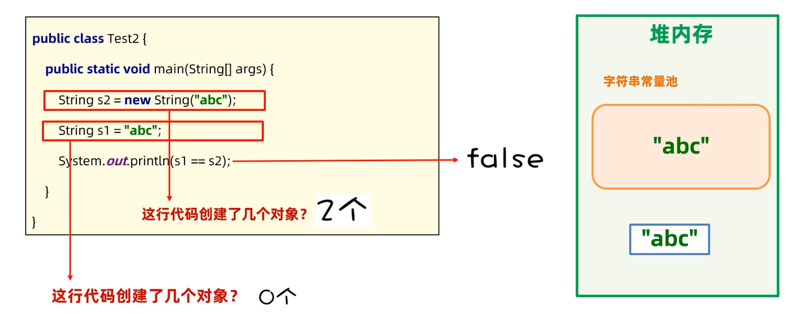
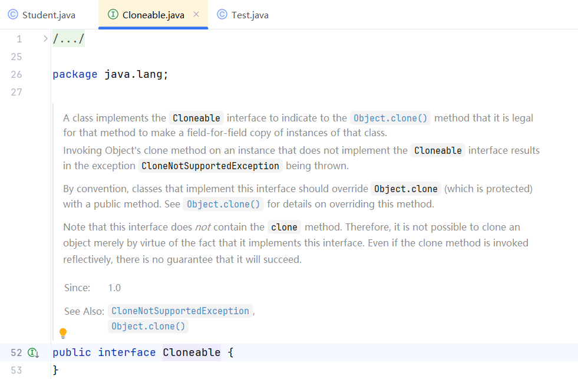
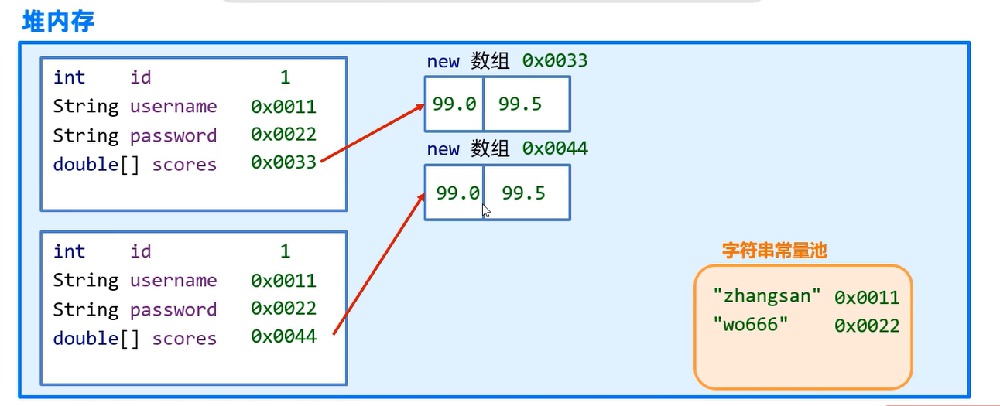
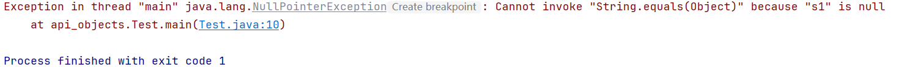

# 常用API

> API：Application Programming Interface，应用程序编程接口。

### 1.API文档

+ [JDK21-Docs](D:\ZSH-ComputerScience\Java-BackEnd\Java\JDK21-Docs\jdk-21.0.6_doc-all\docs\index.html)
+ [JDK17-Docs](C:\Users\asus\Desktop\JDK-Docs\JDK17-Docs(Chinese).url)
+ [JDK11-Docs](C:\Users\asus\Desktop\JDK-Docs\JDK11-Docs(Chinese).url)


### 2.包

#### 2.1 概述

+ 包是用来分门别类地管理各种不同程序的，类似于文件夹。
+ 建包有利于程序的管理和维护。

#### 2.2 IDEA中设置自动导包


#### 2.3 调用其他包下程序的注意事项

1.同一个包下的类可以互相直接调用。

2.若当前程序中需要调用其他包下的程序，则必须在当前程序中导包。

+ 导包格式：`import 包名.类名;`

3.`java.lang`包下的程序无需导包即可调用。

4.若当前程序中需要调用多个不同包下的程序，而这些程序名恰好一样，则此时默认只能导入一个程序，另一个程序必须带包访问。示例如下：

+ 先创建两个包`package1`和`package2`，在两个包里面创建一个名字相同的类`Demo`。

  

+ `package1`中的`Demo`类：

  ```java
  package package1;
  
  public class Demo {
      public void print() {
          System.out.println("this class locates in package1");
      }
  }
  ```

+ `package2`中的`Demo`类：

  ```java
  package package2;
  
  public class Demo {
      public void print() {
          System.out.println("this class locates in package2");
      }
  }
  ```

+ 此时若尝试在`Test`类中同时导入这两个名字相同的类，则一定会报错。因为系统无法识别`main`方法中`new`出来的`Demo`类具体是哪一个。

  

+ 正确做法为带包访问，如下：

  ```java
  import package1.Demo;
  
  public class Test {
      public static void main(String[] args) {
          Demo d1 = new Demo();
          d1.print();
          package2.Demo d2 = new package2.Demo();//带包访问
          d2.print();
      }
  }
  ```

+ 控制台输出结果：

  ```
  this class locates in package1
  this class locates in package2
  ```

  

### 3.`Scanner`

+ 作用：接收用户键盘输入的数据。

+ 代码示例：输出用户输入的年龄和名字。

  ```java
  package com.zsh.scanner;
  
  import java.util.Scanner;
  
  public class Test {
      public static void main(String[] args) {
          Scanner sc = new Scanner(System.in);
  
          System.out.println("请输入您的年龄：");
          int age = sc.nextInt();
          System.out.println("您的年龄是：" + age);
  
          System.out.println("请输入您的名字：");
          String name = sc.next();
          System.out.println("您的名字是：" + name);
      }
  }
  ```

+ 控制台输出结果：

  


### 4.`Random`

+ 作用：生成随机数。

+ 代码示例：生成$[0,bound)$内的一个随机数。

  ```java
  package com.zsh.random;
  
  import java.util.Random;
  import java.util.Scanner;
  
  public class Test {
      public static void main(String[] args) {
          Scanner sc = new Scanner(System.in);
          Random r = new Random();
  
          System.out.println("请输入bound：");
          int bound = sc.nextInt();
          int number = r.nextInt(bound);
          System.out.println("生成了[0," + bound + ")内的一个随机数：" + number);
      }
  }
  ```

+ 控制台输出结果：

  


---


### 5.`String`

#### 5.1 `String`创建对象封装字符串数据的方式

方式一：Java程序中的所有字符串（例如“abc”）都为`String`类的对象。

```java
String name="black";
String schoolName="HIT";
```

方式二：调用`String`类的构造器来初始化字符串对象。

| 序号 | 构造器                           | 说明                                     |
| :--- | :------------------------------- | :--------------------------------------- |
| 01   | `public String()`                | 创建一个空字符串对象，不含任何内容。     |
| 02   | `public String(String original)` | 根据传入的字符串内容来创建字符串对象。   |
| 03   | `public String(char[] chars)`    | 根据**字符**数组的内容来创建字符串对象。 |
| 04   | `public String(byte[] bytes)`    | 根据**字节**数组的内容来创建字符串对象。 |


#### 5.2 `String`的常用方法

| 序号 | 方法                                                         | 说明                                                         |
| ---- | :----------------------------------------------------------- | :----------------------------------------------------------- |
| 01   | `int length()`                                               | 获取字符串的长度（即字符个数）并返回。                       |
| 02   | `char charAt(int index)`                                     | 获取索引位置处的字符并返回。                                 |
| 03   | `char[] toCharArray()`                                       | 将当前字符串转换成字符数组并返回。                           |
| 04   | `boolean equals(Object anObject)`                            | 判断当前字符串与另一字符串的内容是否一样，若一样则返回`true`。 |
| 05   | `boolean equalsIgnoreCase(String anotherString)`             | 同上，但忽略内容字母的大小写。                               |
| 06   | `String subString(int beginIndex,int endIndex)`              | 根据**起止**索引截取字符串（包前不包后），返回截取后的字符串。 |
| 07   | `String subString(int beginIndex)`                           | 只根据**起始**索引截取字符串，一直截取到字符串末尾，返回截取后的字符串。 |
| 08   | `String Replace(charSequence target,CharSequence replacement)` | 使用新的字符片段替换旧的字符片段，返回新的字符串。           |
| 09   | `boolean contains(Charsequence s)`                           | 判断当前字符串中是否包含了某个字符片段，若是则返回`true`。   |
| 10   | `boolean startsWith(String prefix)`                          | 判断当前字符串是否以某个字符串为开头，若是则返回`true`。     |
| 11   | `String[] spilt(String regex)`                               | 将字符串按照指定的字符串内容进行分割，并返回分割后的字符串数组。 |


#### 5.3 遍历字符串

##### 5.3.1 结合02方法

| 序号 | 方法                     | 说明                         |
| ---- | ------------------------ | ---------------------------- |
| 02   | `char charAt(int index)` | 获取索引位置处的字符并返回。 |

+ 代码示例：

```java
package string;

public class StringDemo1 {
    public static void main(String[] args) {
        String s = "ArthurMorgan";
        for (int i = 0; i < s.length(); i++) {
            char ch = s.charAt(i);
            System.out.print(ch + " ");
        }
    }
}
```

+ 控制台输出结果：

```
A r t h u r M o r g a n 
```


##### 5.3.2 结合03方法

| 序号 | 方法                   | 说明                               |
| ---- | ---------------------- | ---------------------------------- |
| 03   | `char[] toCharArray()` | 将当前字符串转换成字符数组并返回。 |

+ 代码示例：

```java
package string;

public class StringDemo1 {
    public static void main(String[] args) {
        String s = "ArthurMorgan";
        char[] chars = s.toCharArray();
        for (int i = 0; i < chars.length; i++) {
            System.out.print(chars[i] + " ");
        }
    }
}
```

+ 控制台输出结果：

```
A r t h u r M o r g a n 
```


#### 5.4 比较字符串

+ 错误示例：==直接用双等号比较字符串是最常见的错误。==

```java
String s1=new String("zsh");
String s2=new String("zsh");
System.out.println(s1 == s2);
```

+ 控制台输出结果：

```
false
```

+ 正确方法：使用04方法。

  | 序号 | 方法                              | 说明                                                         |
  | ---- | --------------------------------- | ------------------------------------------------------------ |
  | 04   | `boolean equals(Object anObject)` | 判断当前字符串与另一字符串的内容是否一样，若一样则返回`true`。 |

  + 示例：

    ```java
    String s1=new String("zsh");
    String s2=new String("zsh");
    System.out.println(s1.equals(s2));
    ```

  + 控制台输出结果：

    ```
    true
    ```


#### 5.5 08方法演示

| 序号 | 方法                                                         | 说明                                               |
| ---- | ------------------------------------------------------------ | -------------------------------------------------- |
| 08   | `String Replace(charSequence target,CharSequence replacement)` | 使用新的字符片段替换旧的字符片段，返回新的字符串。 |

+ 代码示例：替换敏感词。

```java
String info = "这个电影简直是个垃圾，垃圾电影！！";
String rs = info.replace("垃圾","**");
System.out.println(rs);
```

+ 控制台输出结果：

```
这个电影简直是个**，**电影！！
```


#### 5.6 注意事项

1.`String`对象的内容不可改变，被称为不可变字符串对象。



每次试图改变字符串对象时，实际上产生了新的字符串对象，变量每次都是指向了新的字符串对象，旧的字符串对象的内容并没有改变，因此说`String`是不可变字符串对象。


2.只要是以`"..."`（包括`new String("...")`）方式写出的字符串对象，都会存放到堆内存中的字符串常量池，且相同内容的字符串只存储一份（节约内存），即它们的地址是一样的。

若通过`String str = new String("...")`来创建字符串对象，则每`new`一次都会产生一个新的对象存放于堆内存中。




3.编译优化机制：


---


### 6.`ArrayList`

#### 6.1 构造器

| 序号 | 构造器                                  | 说明                                                     |
| ---- | --------------------------------------- | -------------------------------------------------------- |
| 01   | `public ArrayList()`                    | 构造一个初始容量为10的空集合，后续会随需求自动扩容。     |
| 02   | `public ArrayList(int initialCapacity)` | 构造一个具有指定初始容量的空集合，后续会随需求自动扩容。 |


#### 6.2 常用方法

| 序号 | 方法                            | 说明                                                         |
| ---- | ------------------------------- | ------------------------------------------------------------ |
| 01   | `boolean add(E e)`              | 将指定元素添加到集合末尾。                                   |
| 02   | `void add(int index,E element)` | 在集合的指定索引处插入指定元素。                             |
| 03   | `E get(int index)`              | 获取集合指定索引处的元素并返回。                             |
| 04   | `int size()`                    | 获取集合的元素个数并返回。                                   |
| 05   | `E remove(int index)`           | 删除集合指定索引处的元素，返回被删除的元素。                 |
| 06   | `boolean remove(Object o)`      | 删除集合的指定元素（默认删除第一次出现的元素），若删除成功则返回`true`。 |
| 07   | `E set(int index,E element)`    | 修改集合指定索引处的元素，返回**被修改前**的元素。           |


#### 6.3 典型易错案例

##### 6.3.1 概述

**需求**：假如购物车中存储了如下商品：Java入门、宁夏枸杞、黑枸杞、人字拖、特级枸杞、枸杞子。现在用户不想买枸杞了，选择了批量删除含有“枸杞”二字的商品，请完成该需求。

**分析**：

1. 使用`ArrayList`集合表示购物车，并存储以上商品。
2. 遍历集合中的所有元素，若某元素包含“枸杞”二字则删除它。
3. 打印集合到控制台以判断需求是否完成。


##### 6.3.2 原代码分析

```java
package arraylist;

import java.util.ArrayList;

public class Test {
    public static void main(String[] args) {
        ArrayList<String> list = new ArrayList<>();
        list.add("Java入门");
        list.add("宁夏枸杞");
        list.add("黑枸杞");
        list.add("人字拖");
        list.add("特级枸杞");
        list.add("枸杞子");
        System.out.println("原购物车：" + list);

        for (int i = 0; i < list.size(); i++) {
            String good = list.get(i);
            if (good.contains("枸杞")) {
                list.remove(good);
            }
        }
        System.out.println("删除枸杞后的购物车：" + list);
    }
}
```

控制台输出结果：

```
原购物车：[Java入门, 宁夏枸杞, 黑枸杞, 人字拖, 特级枸杞, 枸杞子]
删除枸杞后的购物车：[Java入门, 黑枸杞, 人字拖, 枸杞子]
```

观察发现，我们的代码出现了bug，“黑枸杞”和“枸杞子”这两个商品并没有删除掉，具体分析如下：

```
i=0时，list[i]为"Java入门"，不含"枸杞"
购物车仍为：[Java入门, 宁夏枸杞, 黑枸杞, 人字拖, 特级枸杞, 枸杞子]
-------------------------------------------------------------
i=1时，list[i]为"宁夏枸杞"，含有"枸杞"，故从集合中删除掉
购物车变为：[Java入门, 黑枸杞, 人字拖, 特级枸杞, 枸杞子]
注意：此时"Java入门"后面的元素往前移动了一格，索引也随之减少了1，这就是bug的产生原因。
-------------------------------------------------------------
i=2时，list[i]为"人字拖"，不含"枸杞"
购物车仍为：[Java入门, 黑枸杞, 人字拖, 特级枸杞, 枸杞子]
注意："黑枸杞"这个元素由于索引变化而被我们的程序忽略了，由此产生了bug。
-------------------------------------------------------------
i=3时，list[i]为"特级枸杞"，含有"枸杞"，故从集合中删除掉
购物车变为：[Java入门, 黑枸杞, 人字拖, 枸杞子]
-------------------------------------------------------------
i=4时，list.size()已经缩减为4，二者相等，循环结束。
```


##### 6.3.3 debug

###### 方式一：每删除一个元素则索引减1

```java
for (int i = 0; i < list.size(); i++) {
    String good = list.get(i);
    if (good.contains("枸杞")) {
        list.remove(good);
        i--;
    }
}
```

###### 方式二：倒序遍历并删除

```java
for (int i = list.size()-1; i >= 0; i--) {
    String good = list.get(i);
    if (good.contains("枸杞")) {
        list.remove(good);
    }
}
```


---


### 7.`Object`

#### 7.1 概述

`Object`类是Java中所有类的祖宗类，因此Java中所有类的对象都可以直接使用`Object`类中提供的一些方法。


#### 7.2 常用方法

| 序号 | 方法                              | 说明                                                         |
| ---- | --------------------------------- | ------------------------------------------------------------ |
| 01   | `public String toString()`        | 返回对象的字符串表示形式，实际开发中主要交给子类重写，以便打印出对象的具体内容而非地址。 |
| 02   | `public boolean equals(Object o)` | 比较两个对象是否相等（默认比较地址），实际开发中主要交给子类重写，以便子类自定义比较规则。 |
| 03   | `protected Object clone()`        | 克隆对象。由于`protected`，该方法只能在`Object`类所处包下的其他类中使用，子类若想使用则必须重写该方法。 |

**注意**：以上3个方法重写都可以通过IDEA快捷生成。


#### 7.3 03方法讲解

##### 7.3.1 注意事项

**Tip1**：若想使用该方法，则这个类**必须重写该方法**并且实现`Cloneable`接口，否则报错。

`Cloneable`接口源码：



可以发现，该接口中什么内容都没有，这种接口称为**标记接口**，只有这样Java虚拟机才能识别并赋予这个类克隆对象的能力。

**Tip2**：此外还必须在`main`方法开头抛出`CloneNotSupportedException`异常，否则依旧报错。

```java
package api_object;

public class Test {
    public static void main(String[] args) throws CloneNotSupportedException {
        Student s1 = new Student("zsh", 20);
        Student s2 = (Student) s1.clone();//记得进行类型转换
    }
}
```


##### 7.3.2 浅拷贝与深拷贝

> 也叫浅克隆与深克隆。

+ 浅拷贝：拷贝出的对象与原对象中的数据一模一样（引用类型数据拷贝的只是地址）。


+ 深拷贝：
  + 对象中的基本类型数据直接拷贝。
  + 对象中的字符串数据拷贝的还是地址。
  + 对象中的其他引用类型数据不会拷贝地址，而会创建新对象。




---


### 8.`Objects`

#### 8.1 概述

`Objects`类是一个工具类，提供了很多操作对象的静态方法给我们使用，可以直接用`Objects.类名`的方式调用。


#### 8.2 常用方法

| 序号 | 方法                                       | 说明                                   |
| ---- | ------------------------------------------ | -------------------------------------- |
| 01   | `static boolean equals(Object a,Object b)` | 先做非空判断，再比较两个对象是否相等。 |
| 02   | `static boolean isNull(Object obj)`        | 判断对象是否为空，是返回`true`。       |
| 03   | `static boolean nonNull(Object obj)`       | 判断对象是否为非空，是返回`true`。     |


#### 8.3 01方法讲解

思考：`String`已经提供了`equals`方法用于比较两个对象是否相等，为什么官方更推荐使用`Objects.equals`方法呢？

来看下面的例子：

```java
package api_objects;

import java.util.Objects;

public class Test {
    public static void main(String[] args) {
        String s1 = null;
        String s2 = "itheima";

        System.out.println(s1.equals(s2));
    }
}
```

控制台输出结果：



可以发现，代码产生了`NullPointerException`，即空指针异常。

---

现在，我们将代码第10行修改为`System.out.println(Objects.equals(s1, s2));`，再来看控制台输出结果：


可以发现，控制台能够正常输出，说明代码已经没有bug了。

debug原因参见源码：


**总结**：使用`Objects.equals`方法能够避免入参中有`null`而产生空指针异常的问题，程序健壮性更好。


---


### 9.包装类

#### 9.1 概述

包装类用于把基本数据类型包装成对象，从而实现Java“万物皆对象”的理念，同时也能更好地支持泛型。


#### 9.2 基本数据类型对应的包装类

| 基本数据类型 | 对应的包装类（引用数据类型） |
| :----------: | :--------------------------: |
|    `byte`    |            `Byte`            |
|   `short`    |           `Short`            |
|    `int`     |          `Integer`           |
|    `long`    |            `Long`            |
|    `char`    |         `Character`          |
|   `float`    |           `Float`            |
|   `double`   |           `Double`           |
|  `boolean`   |          `Boolean`           |


#### 9.3 `Integer`

##### 9.3.1 包装方法

| 方法                            | 说明                                   |
| ------------------------------- | -------------------------------------- |
| `static Integer valueOf(int i)` | 将`int`类型的数据转换成`Integer`对象。 |

示例：`Integer a = Integer.valueOf(12);`

##### 9.3.2 自动装箱与自动拆箱机制

+ 自动装箱：可以自动把基本数据类型转换成对应的包装类对象。

  + 示例：`Integer a1 = 12;`

+ 自动拆箱：可以自动把包装类对象转换成对应的基本数据类型。

  + 示例：

    ```java
    Integer a2 = 12;
    int a3 = a2;//自动拆箱
    ```


#### 9.4 包装类的常见操作（以`Integer`为例）

+ 可以把基本数据类型转换成字符串类型：
  + `public static String toString(double d)`
  + `public String toString()`
+ 可以把字符串类型的**数值**转换成数值本身对应的数据类型：
  + `public static int parseInt(String s)`
  + `public static Integer valueOf(String s)`


---


### 10.`StringBuilder`

#### 10.1 概述

+ `StringBuilder`代表可变字符串对象，相当于一个容器，里面装的字符串是可以改变的。
+ `StringBuilder`就是用来操作字符串的。
+ 优点：`StringBuilder`比`String`更适合做字符串的修改操作，效率更高，代码更简洁。


#### 10.2 构造器

| 序号 | 构造器                            | 说明                                                       |
| ---- | --------------------------------- | ---------------------------------------------------------- |
| 01   | `public StringBuilder()`          | 创建一个初始容量为16个字符的可变字符串对象，不含任何字符。 |
| 02   | `public StringBuiler(String str)` | 创建一个初始含有指定字符串内容的可变字符串对象。           |


#### 10.3 常用方法

| 序号 | 方法                             | 说明                                    |
| ---- | -------------------------------- | --------------------------------------- |
| 01   | `StringBuilder append(任意类型)` | 添加数据并返回`StringBuilder`对象本身。 |
| 02   | `StringBuilder reverse()`        | 反转对象内容。                          |
| 03   | `int length()`                   | 返回对象内容长度。                      |
| 04   | `String toString()`              | 将`StringBuilder`转换成`String`。       |


