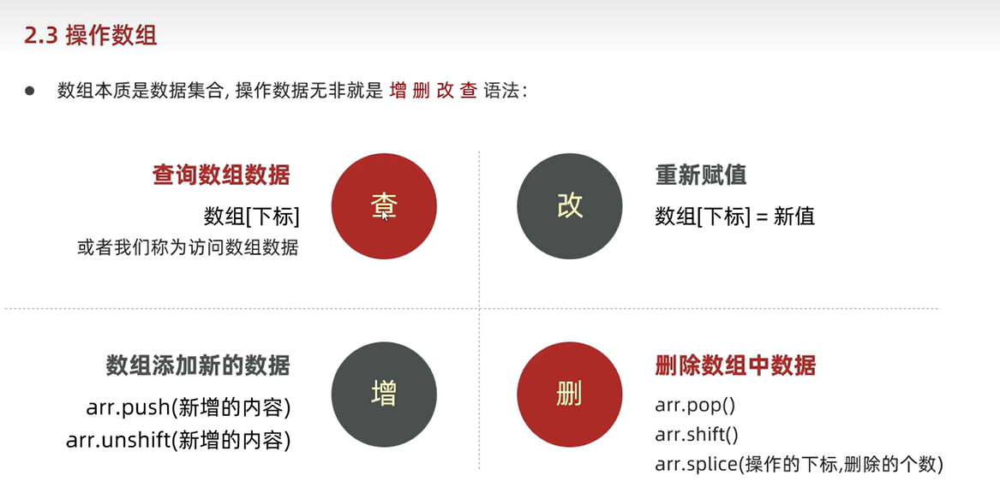

# JavaScript

## JavaScript基础

### 一、JS入门

#### 1.JS书写位置

##### 1.1 内部js

直接写在html文件里，用script标签包住。

+ 规范：script标签写在`</body>`上面。

+ 拓展：`alert("hello js")`可使页面弹出警告对话框。

##### 1.2 内联js

js代码写在html标签内部。

```html
<body>
    <button onclick="alert("hello js")">xxx</button>
</body>
```

##### 1.3 外部js

代码写在以.js结尾的文件里。

语法：通过script标签引入到html页面中。

```html
<body>
    <script src="test.js"></script>
</body>
```


#### 2.JS的输入与输出

##### 2.1 输入

+ 语法：`prompt("xxx")`。
+ 作用：显示一个对话框，对话框中包含一条文字信息，用于提示用户输入文字。

##### 2.2 输出

**语法1**：`document.write("xxx")`

+ 作用：向body内输出内容。

+ 注意：若输出内容写的是标签，则会被解析成网页元素。

**语法2**：`alert("xxx")`

+ 作用：页面弹出警告对话框。

**语法3**：`console.log("xxx")`

+ 作用：控制台打印，供程序员调试使用。

##### 2.3 js代码执行顺序

+ 按html文档流顺序执行js代码。
+ `alert()`和`prompt()`会跳过页面渲染先被执行。


#### 3.JS的组成

##### Part1：ECMAScript

它规定了js的基础语法和核心知识，比如变量、分支语句、循环语句、对象等等。

##### Part2：Web APIs

+ DOM：操作文档，比如对页面元素进行移动、设置大小、添加删除等操作。
+ BOM：操作浏览器，比如页面弹窗、检测窗口宽度、存储数据到浏览器等等。


---


### 二、变量与常量

#### 1.变量

##### 1.1 声明变量

语法：`let 变量名`。

##### 1.2 变量命名规则与规范

**规则**：

+ 不能用关键字。
+ 只能用下划线、字母、数字、\$组成，且不能以数字开头。
+ 字母严格区分大小写。

**规范**：

+ 起名要有意义，禁用拼音。
+ 遵循小驼峰命名法：第一个单词首字母小写，后面每个单词首字母大写。
  + 示例：`userName`。

##### 1.3 let和var的区别

在较旧版本的js，使用关键字var来声明变量。

var声明变量的特点：

+ 可以先使用后声明（不合理）。
+ var声明过的变量可以重复声明（不合理）。

总结：var是一个被时代淘汰的产物，以后声明变量统一使用let。


#### 2.常量

+ 语法：`const 常量名`。
+ 使用场景：当某个变量的值永远不变时，可以将其声明为常量。
+ 命名规则与规范：同变量一致。
+ 注意：常量不允许重新赋值，声明的时候必须初始化。
+ 对于引用数据类型，const声明的变量里面存的不是值，而是地址。
+ const和let的使用场景：
  + 声明变量优先使用const，如果后面发现它是要被修改的，再将其用let声明。
  + **建议数组和对象使用const来声明**，因为它们都是引用类型，里面存储的是地址，只要地址不变就不会报错。
  + 若基本数据类型的值或引用类型的地址发生变化时，就需要用let声明。
    + 例如：一个变量进行加减运算、for循环中的i++。


#### 3.数组

语法：

+ `let 数组名 = [元素1,元素2,...,元素n]`。
+ `let 数组名 = new Array(元素1,元素2,...,元素n)`。

操作数组的方法：




---


### 三、数据类型

#### 1.分类

+ 基本数据类型：
  + number 数字型
  + string 字符串型
  + boolean 布尔型
  + undefined 未定义型
  + null 空类型
+ 引用数据类型：
  + object 对象


#### 2.数字型

##### 2.1 简介

js中的整数和浮点数统称为数字型。

**注意**：js是弱数据类型，变量只有赋值后才能确定属于什么类型。

##### 2.2 NaN

NaN代表一个计算错误，它是一个不正确的或一个未定义的数学操作所得到的结果。

NaN是粘性的，任何对NaN的操作都会返回NaN。


#### 3.字符串型

##### 3.1 简介

通过单引号、双引号或反引号（``）包裹的数据都叫字符串。

**注意**：

+ 单引号、双引号可以互相嵌套，但是不可以自己嵌套自己。（外双内单，或者外单内双）
+ 必要时可以使用转义字符\，从而输出单引号或双引号。

##### 3.2 字符串拼接

+运算符可以实现字符串的拼接。

```js
document.write("hello"+"js")
```

##### 3.3 模板字符串

模板字符串适用于较多字符串和变量混合拼接的场景。

语法：最外层用反引号包裹，拼接变量时用\${}包住变量。

```js
document.write(`hello,my name is ${name},I am ${age} years old.`)
```


#### 4.检测数据类型

使用`typeof`关键字。它支持2种语法形式：

+ 作为运算符（常用）：`typeof 变量名`。
+ 作为函数：`typeof(变量名)`。


#### 5.数据类型转换

##### 5.1 隐式转换

某些运算符被执行时，系统内部自动将数据类型进行转换，称为隐式转换。

规则：

+ +号两边只要有一个是字符串，就会把另一个自动转换成字符串。因此任何数据和字符串相加结果都是字符串。
+ +号可以作为正号将字符串转换成数字型。
+ 除了+号以外的其他算术运算符，都会把数据自动转换成数字型。

##### 5.2 显式转换

编程时过度依赖系统内部的隐式转换是不严谨的，为了避免隐式转换可能产生的问题，通常需要对数据进行显式转换。

转换为数字型有3种方法：

+ `Number()`：若字符串内有非数字，则转换结果为NaN。
+ `parseInt()`：只保留整数部分。
+ `parseFloat()`：可以保留小数部分。


---


## Web APIs

