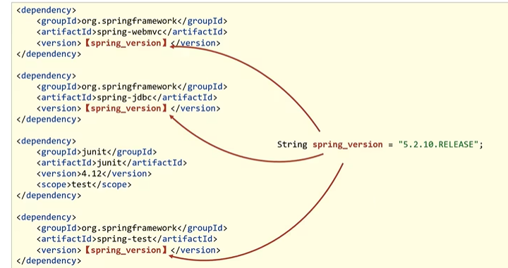
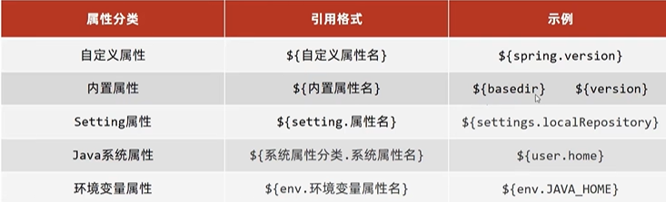
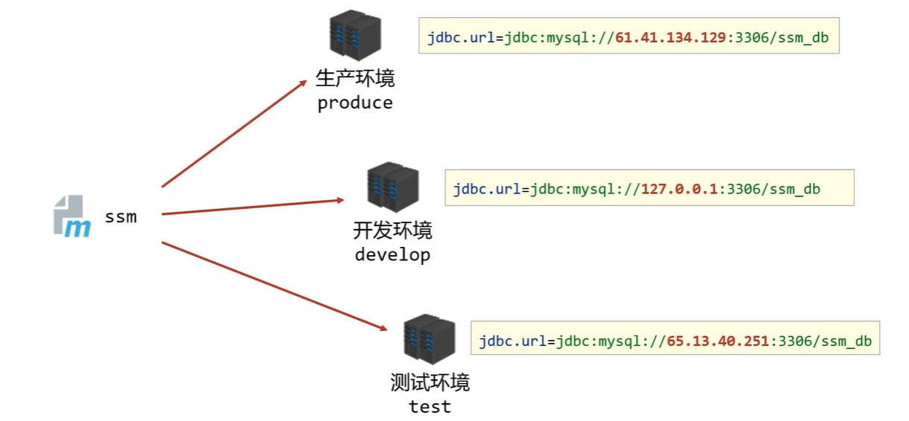
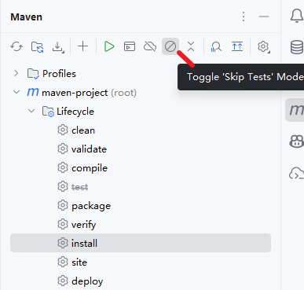
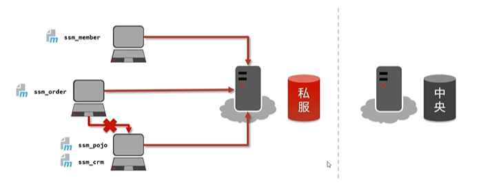
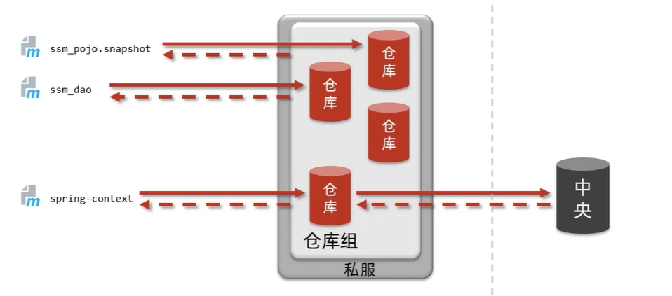
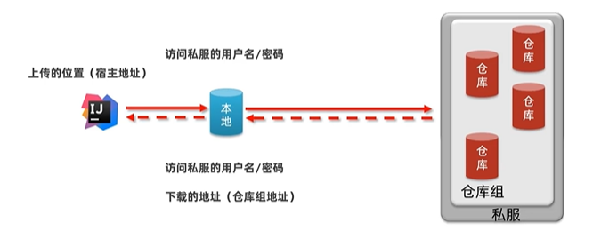
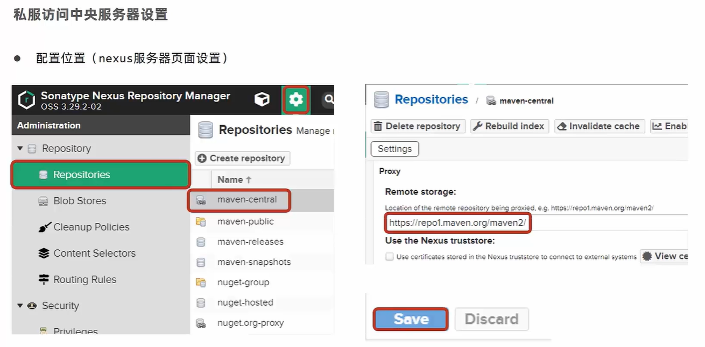

# Maven

> 鸣谢：**黑马程序员**。（视频链接：【黑马程序员SSM框架教程_Spring+SpringMVC+Maven高级+SpringBoot+MyBatisPlus企业实用开发技术】https://www.bilibili.com/video/BV1Fi4y1S7ix?p=78&vd_source=b7f14ba5e783353d06a99352d23ebca9）


[TOC]


## 1.分模块开发与设计

### 1.1 意义

将原始模块按照功能拆分成若干个子模块，可以方便模块间的相互调用和接口共享。


### 1.2 步骤

1. 创建一个新的Maven模块a。

2. 书写模块a代码。

3. 通过Maven-Lifecycle-install命令将模块a安装到本地仓库。（团队内部开发需要将模块安装到团队内部课共享的仓库中，即**私服**）

   

4. 假设模块b需要依赖模块a才能运行，则在模块b的`pom.xml`文件中引入模块a坐标。

   ```xml
   <dependencies>
       <dependency>
           <groupId>com.zsh</groupId>
           <artifactId>模块a</artifactId>
           <version>1.0-SNAPSHOT</version>
       </dependency>
   </dependencies>
   ```


---


## 2.依赖管理

### 2.1 依赖传递

#### P1 依赖具有传递性

+ **直接依赖**：在当前项目中通过依赖配置建立的依赖关系。
+ **间接依赖**：被依赖的资源如果也依赖其他资源，则当前项目间接依赖其他资源。

 

#### P2 依赖冲突问题

+ **路径优先**：当依赖中出现相同资源时，层级越深，优先级越低。
+ **声明优先**：当相同资源在相同层级的不同`pom.xml`文件中被依赖时，配置顺序靠前的覆盖靠后的。
+ **特殊优先**：当同一个`pom.xml`文件中配置了相同资源的不同版本，后配置的覆盖先配置的。

#### P3 IDEA中查看项目的依赖关系图


### 2.2 可选依赖

> [!Tip]
>
> 我的东西被别人用。

可选依赖会对外隐藏当前项目所依赖的资源，使其不透明。

```xml
<dependency>
    <groupId>com.zsh</groupId>
    <artifactId>模块xxx</artifactId>
    <version>1.0-SNAPSHOT</version>
    <!--可选依赖会隐藏当前模块所依赖的资源，隐藏后对应资源将不具有依赖传递性-->
    <optional>true</optional>
</dependency>
```


### 2.3 排除依赖

> [!Tip]
>
> 我用别人的东西。

排除依赖会主动断开与被排除的资源之间的依赖关系，被排除的资源无需指定版本。

```xml
<dependency>
    <groupId>com.zsh</groupId>
    <artifactId>模块xxx</artifactId>
    <version>1.0-SNAPSHOT</version>
    <!--排除依赖会主动断开与被排除的资源之间的依赖关系-->
    <exclusions>
        <exclusion>
            <groupId>log4j</groupId>
            <artifactId>log4j</artifactId>
        </exclusion>
        <exclusion>
        	<groupId>org.mybatis</groupId>
            <artifactId>mybatis</artifactId>
        </exclusion>
    </exclusions>
</dependency>
```


---


## 3.聚合与继承

### 3.1 聚合

#### 3.1.1 概述

+ **聚合**：将多个模块组织成一个整体，同时进行项目构建的过程。
+ **聚合工程**：通常是一个不具有业务功能，有且只有一个`pom.xml`的“空”工程。
+ **作用**：
  + 使用聚合工程可以将多个模块编组，通过构建聚合工程实现对其包含的模块的同步构建。
  + 当聚合工程中某个模块发生变化时，使用聚合工程可以保证工程中与该变化模块相关联的模块的同步变化，从而解决批量模块同步构建的问题。


#### 3.1.2 聚合工程开发步骤

##### P1 创建一个新的Maven模块（即聚合工程），设置打包类型为`pom`

```xml
<packaging>pom</packaging>
```

##### P2 设置当前聚合工程所包含的子模块相对路径

> [!CAUTION]
>
> + 聚合工程中所包含的模块在进行构建时，会根据模块间的依赖关系设置构建顺序，与聚合工程中模块的配置书写顺序无关。
> + 参与聚合的工程无法向上感知是否聚合，只能向下配置哪些模块参与本工程的聚合。

```xml
<modules>
	<module>../maven_a</module>
    <module>../maven_b</module>
    <module>../maven_c</module>
</modules>
```


---


### 3.2 继承

#### 3.2.1 概述

+ 继承描述的是两个工程间的关系，子工程可以继承父工程的配置信息，常用于依赖关系的继承。
+ **作用**：简化配置，减少版本冲突。


#### 3.2.2 步骤

##### P1 创建一个新的Maven模块作为父工程，设置打包类型为`pom`

```xml
<packaging>pom</packaging>
```

##### P2 在父工程的`pom.xml`中配置依赖关系，子工程将沿用父工程中的依赖关系

```xml
<dependencies>
    <dependency>
        <groupId>org.springframework</groupId>
        <artifactId>spring-webmvc</artifactId>
        <version>5.2.10.RELEASE</version>
    </dependency>
    ...
</dependencies>
```

##### P3 在父工程的`pom.xml`中配置子工程可选的依赖关系（与`<dependencies>`标签同级）

```xml
<!--定义依赖管理-->
<dependencyManagement>
    <dependencies>
        <dependency>
            <groupId>junit</groupId>
            <artifactId>junit</artifactId>
            <version>4.12</version>
            <scope>test</scope>
        </dependency>
        ...
    </dependencies>
</dependencyManagement>
```

##### P4 在子工程中配置当前工程所继承的父工程

```xml
<!--配置当前模块继承自parent工程-->
<parent>
    <groupId>com.zsh</groupId>
    <artifactId>父工程</artifactId>
    <version>1.0-SNAPSHOT</version>
    <!--填写父工程pom.xml的相对路径-->
    <relativePath>../pom.xml</relativePath>
</parent>
```

##### P5 在子工程中配置父工程中可选依赖的坐标，无需指定版本，版本由父工程统一提供以避免版本冲突

```xml
<dependency>
    <groupId>junit</groupId>
    <artifactId>junit</artifactId>
    <scope>test</scope>
</dependency>
```


---


### 3.3 聚合与继承的区别

- **作用**：
  - 聚合用于快速构建项目。
  - 继承用于快速配置。
- **相同点**：
  - 聚合与继承的`pom.xml`打包方式均为`pom`，可以将两种关系制作到同一个`pom.xml`中。
  - 聚合与继承均属于设计型模块，并无实际的模块内容。
- **不同点**：
  - 聚合是在当前模块中配置关系，可以感知到参与聚合的模块有哪些。
  - 继承是在子模块中配置关系，父模块无法感知哪些子模块继承了自己


---


## 4.属性管理

### 4.1 属性配置与使用



#### P1 定义属性

```xml
<!--定义属性-->
<properties>
    <spring.version>5.2.10.RELEASE</spring.version>
</properties>
```

#### P2 引用属性

```xml
<dependencies>
    <dependency>
        <groupId>org.springframework</groupId>
        <artifactId>spring-webmvc</artifactId>
        <version>${spring.version}</version>
    </dependency>
    <dependency>
        <groupId>org.springframework</groupId>
        <artifactId>spring-jdbc</artifactId>
        <version>${spring.version}</version>
    </dependency>
    <dependency>
        <groupId>org.springframework</groupId>
        <artifactId>spring-test</artifactId>
        <version>${spring.version}</version>
    </dependency>
   	...
</dependencies>
```


### 4.2 资源文件引用`pom.xml`的自定义属性

#### P1 定义属性

```xml
<!--定义属性-->
<properties>
    <jdbc.url>jdbc:mysql://localhost:3306/ssm_db</jdbc.url>
</properties>
```

#### P2 配置文件中引用自定义属性

```properties
jdbc.driver=com.mysql.cj.jdbc.Driver
jdbc.url=${jdbc.url}
jdbc.username=root
jdbc.password=123456
```

#### P3 在`pom.xml`中开启资源文件目录加载属性的过滤器

```xml
<build>
    <resources>
        <resource>
            <directory>${project.basedir}/src/main/resources</directory><!--相对路径-->
            <filtering>true</filtering>
        </resource>
    </resources>
</build>
```


### 4.3 其他属性




### 4.4 版本管理

- 工程版本：
  - SNAPSHOT（快照版本）：项目开发过程中临时输出的版本，随着开发的进展不断更新。
  - RELEASE（发布版本）：项目开发到进入阶段里程碑后，向团队外部发布较为稳定的版本，称为发布版本。这种版本所对应的构建文件是稳定的，即便进行功能的后续开发，也不会改变当前发布版本内容。
- 发布版本：
  - alpha版
  - beta版
  - 纯数字版


---


## 5.多环境配置与应用

### 5.1 多环境开发



#### P1 定义多环境

```xml
<!--配置多环境-->
<profiles>
    <!--开发环境-->
    <profile>
        <id>env_development</id>
        <!--定义属性-->
        <properties>
            <spring.version>5.2.10.RELEASE</spring.version>
            <jdbc.url>jdbc:mysql://127.1.1.1:3306/ssm_db</jdbc.url>
        </properties>
        <activation>
            <!--设置为默认环境-->
            <activeByDefault>true</activeByDefault>
        </activation>
    </profile>

    <!--生产环境-->
    <profile>
        <id>env_produce</id>
        <properties>
            <spring.version>5.2.10.RELEASE</spring.version>
            <jdbc.url>jdbc:mysql://127.2.2.2:3306/ssm_db</jdbc.url>
        </properties>
    </profile>

    <!--测试环境-->
    <profile>
        <id>env_test</id>
        <properties>
            <spring.version>5.2.10.RELEASE</spring.version>
            <junit.version>4.12</junit.version>
            <jdbc.url>jdbc:mysql://127.3.3.3:3306/ssm_db</jdbc.url>
        </properties>
    </profile>
</profiles>
```

#### P2 使用多环境

+ **格式**：`mvn 指令 -P 环境id`

+ **示例**：`mvn install -P env_produce`


### 5.2 跳过测试

#### P1 应用场景

+ 功能正在更新中，还没有开发完毕。
+ 快速打包。

#### P2 跳过测试的方式

方式一：



方式二：

```xml
<build>
    <plugins>
        <!--跳过测试-->
        <plugin>
            <groupId>org.apache.maven.plugins</groupId>
            <artifactId>maven-surefire-plugin</artifactId>
            <version>3.2.5</version>
            <configuration>
                <skipTests>false</skipTests>
                <!--排除掉不参与测试的内容-->
                <excludes>
                    <exclude>**/BookServiceTest.java</exclude>
                </excludes>
            </configuration>
        </plugin>
    </plugins>
</build>
```

方式三：

`mvn 指令 -D skipTests`


---


## 6.私服

### 6.1 概述



+ 私服是一台独立的服务器，用于解决团队内部的maven资源共享与同步问题。
+ Nexus是Sonatype公司的一款maven私服产品，默认端口是8081。


### 6.2 私服资源操作流程




### 6.3 私服仓库分类

| 仓库类型 | 英文名称 |                      功能                      | 关联操作 |
| :------: | :------: | :--------------------------------------------: | :------: |
| 宿主仓库 |  hosted  | 保存自主开发的资源和中央仓库都没有的第三方资源 |   上传   |
| 代理仓库 |  proxy   |                代理连接中央仓库                |   下载   |
|  仓库组  |  group   |            为仓库编组，简化下载操作            |   下载   |


### 6.4 本地仓库与私服仓库的交互



#### 6.4.1 本地仓库访问私服仓库的相关配置

在私服中新建2个宿主仓库：`zsh-snapshot`和`zsh-release`，然后打开maven安装目录下的`conf/settings.xml`新增如下配置：

```xml
  <!-- servers
   | This is a list of authentication profiles, keyed by the server-id used within the system.
   | Authentication profiles can be used whenever maven must make a connection to a remote server.
   |-->
  <servers>
    <!-- 配置本地仓库访问私服仓库的权限 -->
    <server>
      <id>zsh-snapshot</id>
      <username>admin</username>
      <password>0208</password>
    </server>
    <server>
      <id>zsh-release</id>
      <username>admin</username>
      <password>0208</password>
    </server>
  </servers>

  <!-- mirrors
   | This is a list of mirrors to be used in downloading artifacts from remote repositories.
   |
   | It works like this: a POM may declare a repository to use in resolving certain artifacts.
   | However, this repository may have problems with heavy traffic at times, so people have mirrored
   | it to several places.
   |
   | That repository definition will have a unique id, so we can create a mirror reference for that
   | repository, to be used as an alternate download site. The mirror site will be the preferred
   | server for that repository.
   |-->
  <mirrors>
    <!-- 配置私服仓库的访问路径 -->
    <mirror>
      <id>maven-public</id>
      <mirrorOf>*</mirrorOf>
      <url>http://localhost:8081/repository/maven-public/</url>
    </mirror>
  </mirrors>
```


#### 6.4.2 配置当前项目保存在私服仓库的具体位置（`pom.xml`）

```xml
<!--配置当前项目保存在私服仓库中的具体位置-->
<distributionManagement>
    <repository>
        <id>zsh-release</id>
        <url>http://localhost:8081/repository/zsh-release/</url>
    </repository>
    <snapshotRepository>
        <id>zsh-snapshot</id>
        <url>http://localhost:8081/repository/zsh-snapshot/</url>
    </snapshotRepository>
</distributionManagement>
```


#### 6.4.3 资源上传与下载

通过命令`mvn deploy`。




