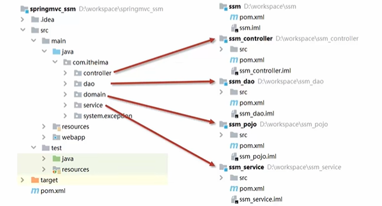
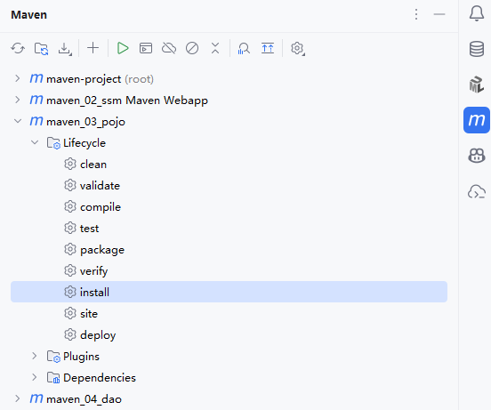
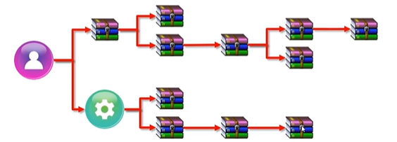
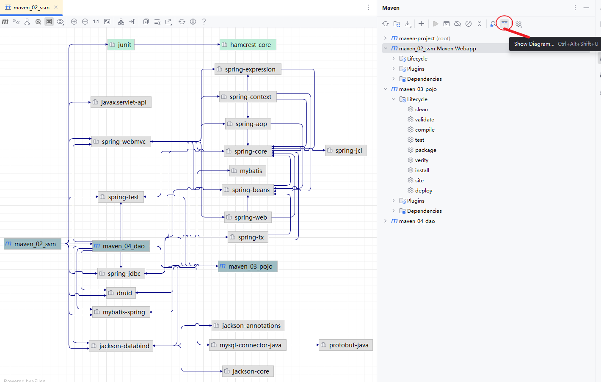

# Maven

> 鸣谢：**黑马程序员**。（视频链接：【黑马程序员SSM框架教程_Spring+SpringMVC+Maven高级+SpringBoot+MyBatisPlus企业实用开发技术】https://www.bilibili.com/video/BV1Fi4y1S7ix?p=78&vd_source=b7f14ba5e783353d06a99352d23ebca9）


## 1.分模块开发与设计

### 1.1 意义

将原始模块按照功能拆分成若干个子模块，可以方便模块间的相互调用和接口共享。




### 1.2 步骤

1. 创建一个新的Maven模块a。

2. 书写模块a代码。

3. 通过Maven-Lifecycle-install命令将模块a安装到本地仓库。（团队内部开发需要将模块安装到团队内部课共享的仓库中，即**私服**）

   

4. 假设模块b需要依赖模块a才能运行，则在模块b的`pom.xml`文件中引入模块a坐标。

   ```xml
   <dependencies>
       <dependency>
           <groupId>com.zsh</groupId>
           <artifactId>模块a</artifactId>
           <version>1.0-SNAPSHOT</version>
       </dependency>
   </dependencies>
   ```


---


## 2.依赖管理

### 2.1 依赖传递

#### P1 依赖具有传递性

+ **直接依赖**：在当前项目中通过依赖配置建立的依赖关系。
+ **间接依赖**：被依赖的资源如果也依赖其他资源，则当前项目间接依赖其他资源。

 

#### P2 依赖冲突问题

+ **路径优先**：当依赖中出现相同资源时，层级越深，优先级越低。
+ **声明优先**：当相同资源在相同层级的不同`pom.xml`文件中被依赖时，配置顺序靠前的覆盖靠后的。
+ **特殊优先**：当同一个`pom.xml`文件中配置了相同资源的不同版本，后配置的覆盖先配置的。

#### P3 IDEA中查看项目的依赖关系图




### 2.2 可选依赖

> [!Tip]
>
> 我的东西被别人用。

可选依赖会对外隐藏当前项目所依赖的资源，使其不透明。

```xml
<dependency>
    <groupId>com.zsh</groupId>
    <artifactId>模块xxx</artifactId>
    <version>1.0-SNAPSHOT</version>
    <!--可选依赖会隐藏当前模块所依赖的资源，隐藏后对应资源将不具有依赖传递性-->
    <optional>true</optional>
</dependency>
```


### 2.3 排除依赖

> [!Tip]
>
> 我用别人的东西。

排除依赖会主动断开与被排除的资源之间的依赖关系，被排除的资源无需指定版本。

```xml
<dependency>
    <groupId>com.zsh</groupId>
    <artifactId>模块xxx</artifactId>
    <version>1.0-SNAPSHOT</version>
    <!--排除依赖会主动断开与被排除的资源之间的依赖关系-->
    <exclusions>
        <exclusion>
            <groupId>log4j</groupId>
            <artifactId>log4j</artifactId>
        </exclusion>
        <exclusion>
        	<groupId>org.mybatis</groupId>
            <artifactId>mybatis</artifactId>
        </exclusion>
    </exclusions>
</dependency>
```


---


## 3.聚合与继承

### 3.1 聚合

#### 3.1.1 概述

+ **聚合**：将多个模块组织成一个整体，同时进行项目构建的过程。
+ **聚合工程**：通常是一个不具有业务功能，有且只有一个`pom.xml`的“空”工程。
+ **作用**：
  + 使用聚合工程可以将多个模块编组，通过构建聚合工程实现对其包含的模块的同步构建。
  + 当聚合工程中某个模块发生变化时，使用聚合工程可以保证工程中与该变化模块相关联的模块的同步变化，从而解决批量模块同步构建的问题。


#### 3.1.2 聚合工程开发步骤

##### P1 创建一个新的Maven模块（即聚合工程），设置打包类型为`pom`

```xml
<packaging>pom</packaging>
```

##### P2 设置当前聚合工程所包含的子模块相对路径

> [!CAUTION]
>
> + 聚合工程中所包含的模块在进行构建时，会根据模块间的依赖关系设置构建顺序，与聚合工程中模块的配置书写顺序无关。
> + 参与聚合的工程无法向上感知是否聚合，只能向下配置哪些模块参与本工程的聚合。

```xml
<modules>
	<module>../maven_a</module>
    <module>../maven_b</module>
    <module>../maven_c</module>
</modules>
```


---


### 3.2 继承

#### 3.2.1 概述

+ 继承描述的是两个工程间的关系，子工程可以继承父工程的配置信息，常用于依赖关系的继承。
+ **作用**：简化配置，减少版本冲突。


#### 3.2.2 步骤

##### P1 创建一个新的Maven模块作为父工程，设置打包类型为`pom`

```xml
<packaging>pom</packaging>
```

##### P2 在父工程的`pom.xml`中配置依赖关系，子工程将沿用父工程中的依赖关系

```xml
<dependencies>
    <dependency>
        <groupId>org.springframework</groupId>
        <artifactId>spring-webmvc</artifactId>
        <version>5.2.10.RELEASE</version>
    </dependency>
    ...
</dependencies>
```

##### P3 在父工程的`pom.xml`中配置子工程可选的依赖关系

```xml
<!--定义依赖管理-->
<dependencyManagement>
    <dependencies>
        <dependency>
            <groupId>junit</groupId>
            <artifactId>junit</artifactId>
            <version>4.12</version>
            <scope>test</scope>
        </dependency>
        ...
    </dependencies>
</dependencyManagement>
```

##### P4 在子工程中配置当前工程所继承的父工程

```xml
<!--配置当前模块继承自parent工程-->
<parent>
    <groupId>com.zsh</groupId>
    <artifactId>父工程</artifactId>
    <version>1.0-SNAPSHOT</version>
    <!--填写父工程pom.xml的相对路径-->
    <relativePath>../pom.xml</relativePath>
</parent>
```

##### P5 在子工程中配置父工程中可选依赖的坐标，无需指定版本，版本由父工程统一提供以避免版本冲突

```xml
<dependency>
    <groupId>junit</groupId>
    <artifactId>junit</artifactId>
    <scope>test</scope>
</dependency>
```


---


### 3.3 聚合与继承的区别

- **作用**：
  - 聚合用于快速构建项目。
  - 继承用于快速配置。
- **相同点**：
  - 聚合与继承的`pom.xml`打包方式均为`pom`，可以将两种关系制作到同一个`pom.xml`中。
  - 聚合与继承均属于设计型模块，并无实际的模块内容。
- **不同点**：
  - 聚合是在当前模块中配置关系，可以感知到参与聚合的模块有哪些。
  - 继承是在子模块中配置关系，父模块无法感知哪些子模块继承了自己


---


## 4.属性管理


---


## 5.多环境配置与应用


---


## 6.私服


