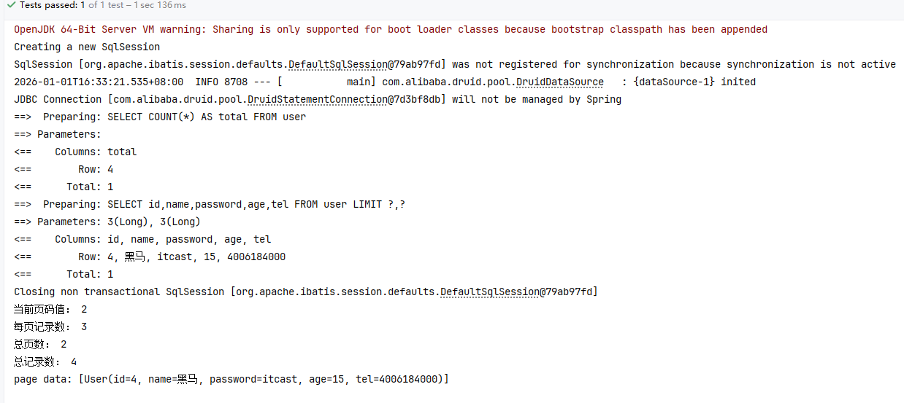
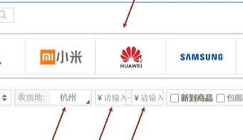
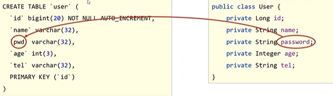
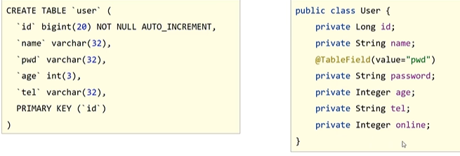
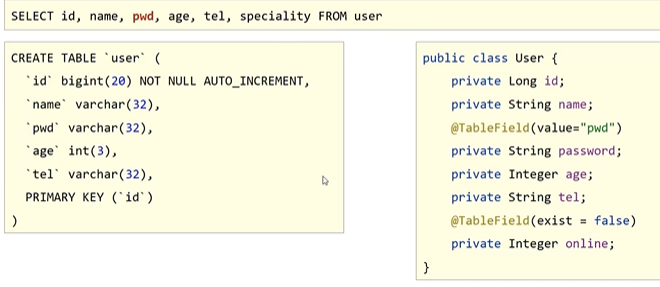
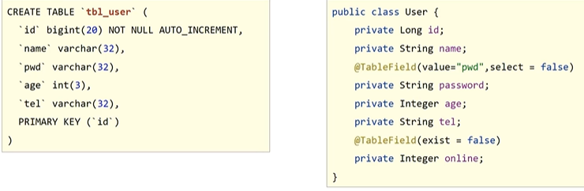

# MyBatisPlus(MP)

> 鸣谢：黑马程序员。（视频链接：【黑马程序员SSM框架教程_Spring+SpringMVC+Maven高级+SpringBoot+MyBatisPlus企业实用开发技术】https://www.bilibili.com/video/BV1Fi4y1S7ix?vd_source=b7f14ba5e783353d06a99352d23ebca9）
>
> 


[TOC]


## 一、入门

### 1.入门案例

1. 创建新模块，选择SpringBoot，并配置模块相关基础信息。

2. 选择当前模块需要使用的技术栈，仅勾选`MySQL Driver`。

3. 手动添加MP和Druid的起步依赖：

   ```xml
   <dependency>
       <groupId>com.baomidou</groupId>
       <artifactId>mybatis-plus-spring-boot3-starter</artifactId>
       <!-- 使用与SpringBoot3.5.9版本兼容的MP版本 -->
       <version>3.5.11</version> <!-- 示例版本 -->
   </dependency>
   <dependency>
       <groupId>com.baomidou</groupId>
       <artifactId>mybatis-plus-jsqlparser</artifactId>
       <version>3.5.11</version> <!-- 必须与上面的版本保持一致 -->
   </dependency>
   <dependency>
       <groupId>com.alibaba</groupId>
       <artifactId>druid</artifactId>
       <version>1.2.23</version> <!-- 确保支持Spring3.5.9 -->
   </dependency>
   ```

4. 在`application.yml`文件中设置数据源：

   ```yml
   spring:
     datasource:
       type: com.alibaba.druid.pool.DruidDataSource
       driver-class-name: com.mysql.cj.jdbc.Driver
       url: jdbc:mysql://localhost:3306/mybatis_plus_db
       username: root
       password: 123456
   ```

5. 根据数据库中要操作的表结构制作实体类`User`：类名与表名对应，属性名与字段名对应。

6. 定义dao接口，继承`BaseMapper<User>`：

   ```java
   @Mapper
   public interface UserDao extends BaseMapper<User> {
   }
   ```

7. 在测试类中注入dao接口，测试功能：

   ```java
   @SpringBootTest
   class ApplicationTests {
   
       @Autowired
       private UserDao userDao;
   
       @Test
       void testGetAll() {
           List<User> users = userDao.selectList(null);
           System.out.println(users);
       }
   }
   ```


### 2.概述

+ MyBatisPlus（简称MP）是基于MyBatis框架开发的增强型工具，旨在简化开发、提高效率。
+ 官网：https://baomidou.com或https://mybatis.plus

+ **特性**：
  + **无侵入**：只做增强不做修改，不会对原有工程产生影响。
  + **损耗小**：启动即会自动注入基本CRUD，性能基本无损耗，直接面向对象操作。
  + **强大的CRUD操作**：内置通用Mapper和通用Service，只需少量手动配置即可实现单表大部分CRUD操作。
  + **支持Lambda**：编写查询条件时，无需担心字段写错。
  + 支持主键自动生成。
  + 内置分页插件。
  + ……


---

---


## 二、标准数据层开发

### 1.标准CRUD开发

#### 1.1 MP接口

|    功能    |                     MP接口                     |
| :--------: | :--------------------------------------------: |
|    新增    |               `int insert(T t)`                |
|    删除    |       `int deleteById(Serializable id)`        |
|    修改    |             `int updateById(T t)`              |
| 根据id查询 |        `T selectById(Serializable id)`         |
|  查询全部  |             `List<T> selectList()`             |
|  分页查询  |      `IPage<T> selectPage(IPage<T> page)`      |
|  条件查询  | `IPage<T> selectPage(Wrapper<T> queryWrapper)` |

#### 1.2 代码示例

```java
@SpringBootTest
class Mp01QuickstartApplicationTests {

    @Autowired
    private UserDao userDao;

    @Test
    void testInsert() {
        User user = new User("zsh", "666999", 18, "842951084");
        userDao.insert(user);
    }

    @Test
    void testDelete() {
        userDao.deleteById(2006633799126016002L);
    }

    @Test
    void testUpdate() {
        User user = new User();
        user.setId(1L);
        user.setName("Tommy");

        // 提供哪些字段的新值，MP就只会修改这些字段
        userDao.updateById(user);
    }

    @Test
    void testGetById() {
        User user = userDao.selectById(2L);
        System.out.println(user);
    }

    @Test
    void testGetAll() {
        List<User> users = userDao.selectList(null);
        System.out.println(users);
    }

}
```


---


### 2.分页功能

#### 2.1 配置MP拦截器类，添加MP的分页拦截器

```java
package com.zsh.config;

import com.baomidou.mybatisplus.extension.plugins.MybatisPlusInterceptor;
import com.baomidou.mybatisplus.extension.plugins.inner.PaginationInnerInterceptor;
import org.springframework.context.annotation.Bean;
import org.springframework.context.annotation.Configuration;

// 配置MP的拦截器
@Configuration
public class MpConfig {

    @Bean
    public MybatisPlusInterceptor mpInterceptor() {
        MybatisPlusInterceptor mpInterceptor = new MybatisPlusInterceptor();
        // 添加MP的分页拦截器
        mpInterceptor.addInnerInterceptor(new PaginationInnerInterceptor());
        return mpInterceptor;
    }
}
```

#### 2.2 在`application.yml`中开启MP的控制台日志

```yml
# 开启MP的控制台日志
mybatis-plus:
  configuration:
    log-impl: org.apache.ibatis.logging.stdout.StdOutImpl
```

#### 2.3 执行分页查询

```java
@Test
void testGetByPage() {
    // 首先要配置好MP的分页拦截器——config/MpConfig
    IPage page = new Page(2, 3);// 查第2页，每页显示3条记录
    userDao.selectPage(page, null);
    System.out.println("当前页码值： " + page.getCurrent());
    System.out.println("每页记录数： " + page.getSize());
    System.out.println("总页数： " + page.getPages());
    System.out.println("总记录数： " + page.getTotal());
    System.out.println("page data: " + page.getRecords());
}
```

#### 2.4 运行结果




---

---


## 三、条件查询

### 1.条件查询方式

#### 1.1 单条件查询

```java
@SpringBootTest
class Mp02ConditionQueryApplicationTests {

    @Autowired
    private UserDao userDao;

    @Test
    void test1() {
        // 方式一：按条件查询
        QueryWrapper qw = new QueryWrapper();
        qw.lt("age", 18);
        List<User> users = userDao.selectList(qw);
        System.out.println(users);
    }

    @Test
    void test2() {
        // 方式二：Lambda格式的按条件查询，可以防止字段名写错
        QueryWrapper<User> qw = new QueryWrapper<>();
        qw.lambda().lt(User::getAge, 10);
        List<User> users = userDao.selectList(qw);
        System.out.println(users);
    }

    @Test
    void test3() {
        // 方式三：Lambda格式的按条件查询——简化版
        LambdaQueryWrapper<User> lqw = new LambdaQueryWrapper<>();
        lqw.ge(User::getAge, 25);
        List<User> users = userDao.selectList(lqw);
        System.out.println(users);
    }

}
```


#### 1.2 多条件查询（支持链式编程）

```java
@Test
void test4() {
    LambdaQueryWrapper<User> lqw = new LambdaQueryWrapper<>();

    // age>18 && age<22
    // lqw.gt(User::getAge,18).lt(User::getAge,22);
    // age<10 || age>30
    lqw.lt(User::getAge, 10).or().gt(User::getAge, 30);

    List<User> users = userDao.selectList(lqw);
    System.out.println(users);
}
```


#### 1.3 NULL值处理

为什么要处理null值？来看下面的业务案例：



前端页面提示用户输入目标商品的下限价格和上限价格，但有些情况下用户可能只输入下限值或上限值或两个都不输入，这样就会导致前端传到后端的上限值或下限值为null，这时候就需要对这些null值做处理。

```java
@Test
void test5() {
    // 模拟前端页面传递过来的查询数据
    UserQuery userQuery = new UserQuery();
    userQuery.setAge(18);
    userQuery.setMaxAge(22);

    // null值处理
    LambdaQueryWrapper<User> lqw = new LambdaQueryWrapper<>();
    /*
        先判断第一个入参是否为true，如果为true就连接当前条件
        等价于：
        if (userQuery.getAge() != null) {
            lqw.gt(User::getAge, userQuery.getMaxAge());
        }
     */
    lqw.gt(userQuery.getAge() != null, User::getAge, userQuery.getAge());
    lqw.lt(userQuery.getMaxAge() != null, User::getAge, userQuery.getMaxAge());

    List<User> users = userDao.selectList(lqw);
    System.out.println(users);
}
```


---


### 2.查询投影

> [!Tip]
>
> 从查询结果中筛选并展示指定列（字段）的过程。

#### 2.1 查询结果包含实体类中部分属性

```java
@Test
// 查询投影
void test6(){
    LambdaQueryWrapper<User> lqw = new LambdaQueryWrapper<>();
    lqw.select(User::getId,User::getName, User::getAge);
    List<User> users = userDao.selectList(lqw);
    System.out.println(users);
}
```


#### 2.2 查询结果包含聚合函数

```java
@Test
void test7(){
    QueryWrapper<User> lqw = new QueryWrapper<>();
    lqw.select("count(*) as count, tel");
    lqw.groupBy("tel");
    List<Map<String, Object>> users=userDao.selectMaps(lqw);
    System.out.println(users);
}
```


#### 2.3 假如2.2不用MP，而用MyBatis+原生SQL

首先在`UserDao`接口中编写`getTelGroup()`这个接口方法：

```java
@Mapper
public interface UserDao extends BaseMapper<User> {

    @Select("select count(*) as count, tel from user group by tel")
    List<Map<String, User>> getTelGroup();
}
```

其次在测试类中编写测试方法：

```java
@Test
void test7Plus(){
    List<Map<String, User>> telGroup = userDao.getTelGroup();
    System.out.println(telGroup);
}
```

可以看到，对于复杂、固定的查询，尤其涉及多表连接和复杂聚合时，使用MyBatis编写原生SQL可能是更好的选择。


---


### 3.查询条件设定

| 函数名                                        | 作用                             | 等效SQL片段                  |
| --------------------------------------------- | -------------------------------- | ---------------------------- |
| `eq(R column, Object val)`                    | 等于（=）                        | `id = 10`                    |
| `ne(R column, Object val)`                    | 不等于（<>）                     | `name <> '张三'`             |
| `gt(R column, Object val)`                    | 大于（>）                        | `age > 18`                   |
| `ge(R column, Object val)`                    | 大于等于（>=）                   | `age >= 18`                  |
| `lt(R column, Object val)`                    | 小于（<）                        | `age < 30`                   |
| `le(R column, Object val)`                    | 小于等于（<=）                   | `age <= 30`                  |
| `between(R column, Object val1, Object val2)` | 区间匹配                         | `age between 18 and 30`      |
| `like(R column, Object val)`                  | 模糊匹配                         | `name like '%张%'`           |
| `likeLeft(R column, Object val)`              | 左模糊匹配                       | `name like '%三'`            |
| `likeRight(R column, Object val)`             | 右模糊匹配                       | `name like '张%'`            |
| `isNull(R column)`                            | 字段为空                         | `email is null`              |
| `isNotNull(R column)`                         | 字段不为空                       | `email IS not nu;;`          |
| `orderByAsc(R... columns)`                    | 升序排序（ORDER BY column ASC）  | `order by age ASC, id ASC`   |
| `orderByDesc(R... columns)`                   | 降序排序（ORDER BY column DESC） | `order by age DESC, id DESC` |
| ...                                           | ...                              | ...                          |


---


### 4.字段映射与表名映射——`@TableField`+`@TableName`

##### 4.1 表字段与实体类属性设计不同步



解决方案：使用`@TableField`注解将实体类属性与表字段关联起来。

```java
public class User {
    @TableField(value="pwd")
    private String password;
}
```


#### 4.2 实体类中添加了表中未定义的字段



解决方案：使用`@TableField`注解表明该属性在表中没有对应字段。

```java
public class User {
    @TableField(exist=false)
    private Integer online;
}
```

**注意**：`exist`无法与`value`同时使用。


#### 4.3 采用`select *`查询开放了过多的字段查看权限，存在安全隐患



解决方案：使用`@TableField`注解设置某个表字段不可查询。

```java
public class User {
    @TableField(value="pwd", select=false)
    private String password;
}
```


#### 4.4 表名与实体类名设计不同步



解决方案：使用`@TableName`注解将实体类与表关联起来。

```java
@TableName("tbl_user")
public class User {
    ...
}
```


+++

+++


## 四、DML控制


+++

+++


## 五、快速开发


