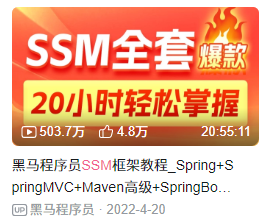

# MyBatisPlus(MP)

> 鸣谢：黑马程序员。（视频链接：【黑马程序员SSM框架教程_Spring+SpringMVC+Maven高级+SpringBoot+MyBatisPlus企业实用开发技术】https://www.bilibili.com/video/BV1Fi4y1S7ix?vd_source=b7f14ba5e783353d06a99352d23ebca9）
>
> 

[TOC]

## 一、入门

MyBatisPlus（简称MP）是基于MyBatis框架开发的增强型工具，旨在简化开发、提高效率。

---

---

## 二、标准数据层开发

---

---

## 三、DQL控制

+++

+++

## 四、DML控制

+++

+++

## 五、快速开发

