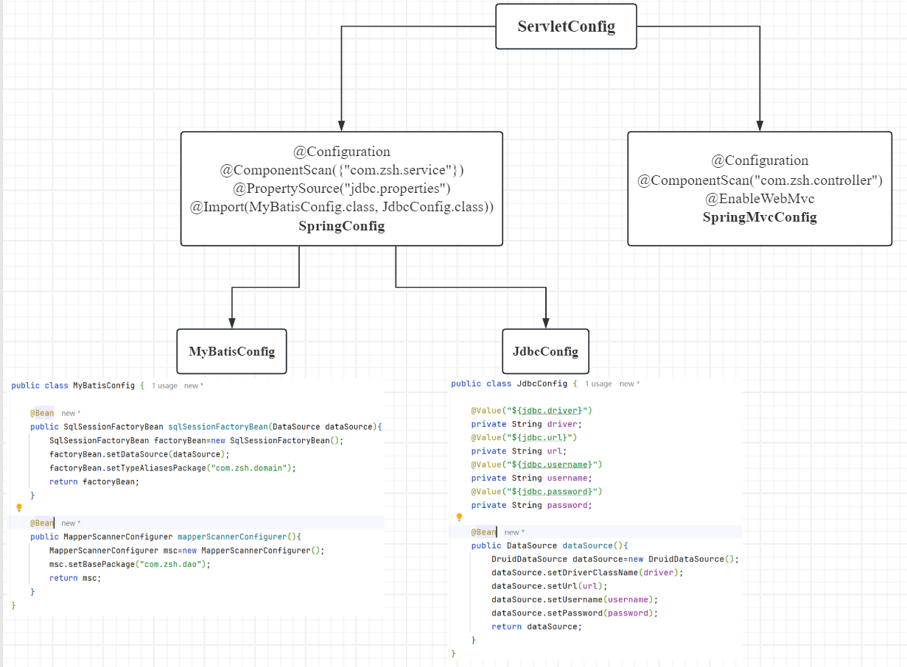

# SSM整合

> 鸣谢：黑马程序员
>
> 


## 一、SSM整合流程

1. 创建工程
2. SSM整合配置：
   + Spring：`SpringConfig`
   + SpringMVC：
     + `ServletConfig`
     + `SpringMvcConfig`
   + MyBatis：
     + `MyBatisConfig`
     + `JdbcConfig`
     + `jdbc.properties`

3. 功能模块开发：
   + 表与实体类
   + dao（接口+自动代理）
   + service（接口+实现类）：业务层接口测试（整合`JUnit`）
   + controller：表现层接口测试（`Postman`）


---


## 二、`config`包——配置类



### 1.`jdbc.properties`+`JdbcConfig`

+ `jdbc.properties`:

  ```properties
  jdbc.driver=com.mysql.cj.jdbc.Driver
  jdbc.url=jdbc:mysql://localhost:3306/ssm_db
  jdbc.username=root
  jdbc.password=123456
  ```

+ `JdbcConfig`:

  ```java
  package com.zsh.config;
  
  import com.alibaba.druid.pool.DruidDataSource;
  import org.springframework.beans.factory.annotation.Value;
  import org.springframework.context.annotation.Bean;
  
  import javax.sql.DataSource;
  
  public class JdbcConfig {
  
      @Value("${jdbc.driver}")
      private String driver;
      @Value("${jdbc.url}")
      private String url;
      @Value("${jdbc.username}")
      private String username;
      @Value("${jdbc.password}")
      private String password;
  
      @Bean
      public DataSource dataSource(){
          DruidDataSource dataSource=new DruidDataSource();
          dataSource.setDriverClassName(driver);
          dataSource.setUrl(url);
          dataSource.setUsername(username);
          dataSource.setPassword(password);
          return dataSource;
      }
  }
  ```


### 2.`MyBatisConfig`

```java
package com.zsh.config;

import org.mybatis.spring.SqlSessionFactoryBean;
import org.mybatis.spring.mapper.MapperScannerConfigurer;
import org.springframework.context.annotation.Bean;

import javax.sql.DataSource;

public class MyBatisConfig {

    @Bean
    public SqlSessionFactoryBean sqlSessionFactoryBean(DataSource dataSource){
        SqlSessionFactoryBean factoryBean=new SqlSessionFactoryBean();
        factoryBean.setDataSource(dataSource);
        factoryBean.setTypeAliasesPackage("com.zsh.domain");
        return factoryBean;
    }

    @Bean
    public MapperScannerConfigurer mapperScannerConfigurer(){
        MapperScannerConfigurer msc=new MapperScannerConfigurer();
        msc.setBasePackage("com.zsh.dao");
        return msc;
    }
}
```


### 3.`SpringConfig`

```java
package com.zsh.config;

import org.springframework.context.annotation.ComponentScan;
import org.springframework.context.annotation.Configuration;
import org.springframework.context.annotation.Import;
import org.springframework.context.annotation.PropertySource;

@Configuration
@ComponentScan({"com.zsh.service"})
@PropertySource("jdbc.properties")
@Import({MyBatisConfig.class, JdbcConfig.class})
public class SpringConfig {
}
```


### 4.`SpringMvcConfig`

```java
package com.zsh.config;

import org.springframework.context.annotation.ComponentScan;
import org.springframework.context.annotation.Configuration;
import org.springframework.web.servlet.config.annotation.EnableWebMvc;

@Configuration
@ComponentScan("com.zsh.controller")
@EnableWebMvc
public class SpringMvcConfig {
}
```


### 5.`ServletConfig`

```java
package com.zsh.config;

import org.springframework.web.filter.CharacterEncodingFilter;
import org.springframework.web.servlet.support.AbstractAnnotationConfigDispatcherServletInitializer;

import javax.servlet.Filter;

public class ServletConfig extends AbstractAnnotationConfigDispatcherServletInitializer {
    @Override
    protected Class<?>[] getRootConfigClasses() {
        return new Class[]{SpringConfig.class};
    }

    @Override
    protected Class<?>[] getServletConfigClasses() {
        return new Class[]{SpringMvcConfig.class};
    }

    @Override
    protected String[] getServletMappings() {
        return new String[]{"/"};
    }

    // POST请求中文乱码处理：设置过滤器
    @Override
    protected Filter[] getServletFilters() {
        CharacterEncodingFilter filter=new CharacterEncodingFilter();
        filter.setEncoding("UTF-8");
        return new Filter[]{filter};
    }
}
```


---


