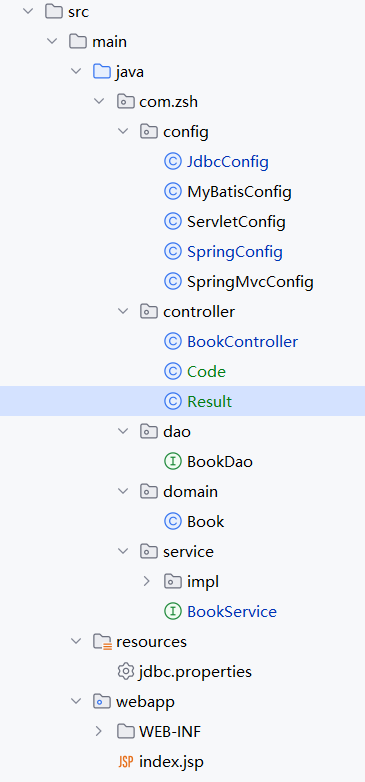
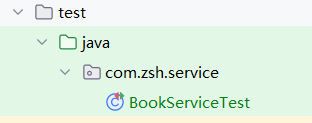
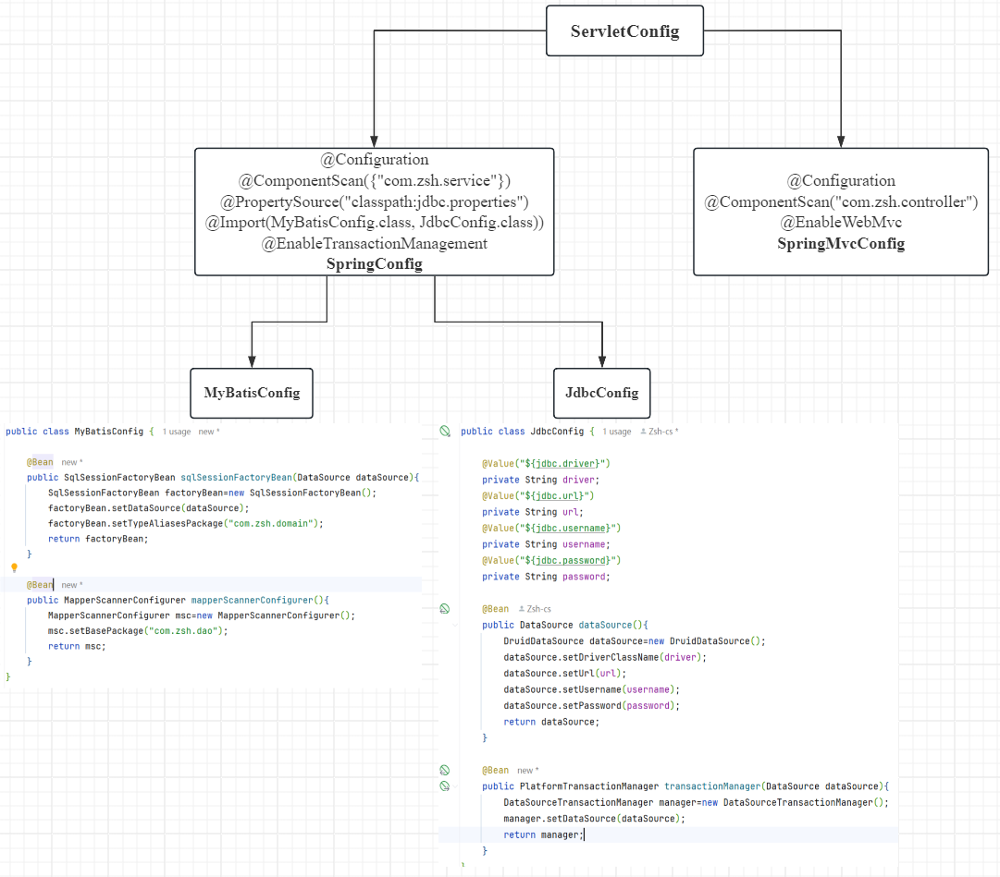

# SSM整合

> 鸣谢：黑马程序员
>
> 


**项目结构**：

```bash
src
├─main
│  ├─java
│  │  └─com
│  │      └─zsh
│  │          ├─config
│  │          │      JdbcConfig.java
│  │          │      MyBatisConfig.java
│  │          │      ServletConfig.java
│  │          │      SpringConfig.java
│  │          │      SpringMvcConfig.java
│  │          │
│  │          ├─controller
│  │          │      BookController.java
│  │          │      Code.java
│  │          │      Result.java
│  │          │
│  │          ├─dao
│  │          │      BookDao.java
│  │          │
│  │          ├─domain
│  │          │      Book.java
│  │          │
│  │          └─service
│  │              │  BookService.java
│  │              │
│  │              └─impl
│  │                      BookServiceImpl.java
│  │
│  ├─resources
│  │      jdbc.properties
│  │
│  └─webapp
│      │  index.jsp
│      │
│      └─WEB-INF
│              web.xml
│
└─test
    └─java
        └─com
            └─zsh
                └─service
                        BookServiceTest.java
```






---


## PartⅠ 后端开发

### 一、SSM整合流程

1. 创建工程
2. SSM整合配置：
   + Spring：`SpringConfig`
   + SpringMVC：
     + `ServletConfig`
     + `SpringMvcConfig`
   + MyBatis：
     + `MyBatisConfig`
     + `JdbcConfig`
     + `jdbc.properties`

3. 功能模块开发：
   + 表与实体类
   + dao（接口+自动代理）
   + service（接口+实现类）：业务层接口测试（整合`JUnit`）
   + controller：表现层接口测试（`Postman`）


---


### 二、`config`包—核心配置类



#### 1.`jdbc.properties`+`JdbcConfig`

+ `jdbc.properties`:

  ```properties
  jdbc.driver=com.mysql.cj.jdbc.Driver
  jdbc.url=jdbc:mysql://localhost:3306/ssm_db
  jdbc.username=root
  jdbc.password=123456
  ```

+ `JdbcConfig`:

  ```java
  package com.zsh.config;
  
  import com.alibaba.druid.pool.DruidDataSource;
  import org.springframework.beans.factory.annotation.Value;
  import org.springframework.context.annotation.Bean;
  
  import javax.sql.DataSource;
  
  public class JdbcConfig {
  
      @Value("${jdbc.driver}")
      private String driver;
      @Value("${jdbc.url}")
      private String url;
      @Value("${jdbc.username}")
      private String username;
      @Value("${jdbc.password}")
      private String password;
  
      @Bean
      public DataSource dataSource(){
          DruidDataSource dataSource=new DruidDataSource();
          dataSource.setDriverClassName(driver);
          dataSource.setUrl(url);
          dataSource.setUsername(username);
          dataSource.setPassword(password);
          return dataSource;
      }
      
      @Bean
      public PlatformTransactionManager transactionManager(DataSource dataSource){
          DataSourceTransactionManager manager=new DataSourceTransactionManager();
          manager.setDataSource(dataSource);
          return manager;
      }
  }
  ```


#### 2.`MyBatisConfig`

```java
package com.zsh.config;

import org.mybatis.spring.SqlSessionFactoryBean;
import org.mybatis.spring.mapper.MapperScannerConfigurer;
import org.springframework.context.annotation.Bean;

import javax.sql.DataSource;

public class MyBatisConfig {

    @Bean
    public SqlSessionFactoryBean sqlSessionFactoryBean(DataSource dataSource){
        SqlSessionFactoryBean factoryBean=new SqlSessionFactoryBean();
        factoryBean.setDataSource(dataSource);
        factoryBean.setTypeAliasesPackage("com.zsh.domain");
        return factoryBean;
    }

    @Bean
    public MapperScannerConfigurer mapperScannerConfigurer(){
        MapperScannerConfigurer msc=new MapperScannerConfigurer();
        msc.setBasePackage("com.zsh.dao");
        return msc;
    }
}
```


#### 3.`SpringConfig`

```java
package com.zsh.config;

import org.springframework.context.annotation.ComponentScan;
import org.springframework.context.annotation.Configuration;
import org.springframework.context.annotation.Import;
import org.springframework.context.annotation.PropertySource;

@Configuration
@ComponentScan({"com.zsh.service"})
@PropertySource("classpath:jdbc.properties")
@Import({MyBatisConfig.class, JdbcConfig.class})
@EnableTransactionManagement
public class SpringConfig {
}
```


#### 4.`SpringMvcConfig`

```java
package com.zsh.config;

import org.springframework.context.annotation.ComponentScan;
import org.springframework.context.annotation.Configuration;
import org.springframework.web.servlet.config.annotation.EnableWebMvc;

@Configuration
@ComponentScan("com.zsh.controller")
@EnableWebMvc
public class SpringMvcConfig {
}
```


#### 5.`ServletConfig`

```java
package com.zsh.config;

import org.springframework.web.filter.CharacterEncodingFilter;
import org.springframework.web.servlet.support.AbstractAnnotationConfigDispatcherServletInitializer;

import javax.servlet.Filter;

public class ServletConfig extends AbstractAnnotationConfigDispatcherServletInitializer {
    @Override
    protected Class<?>[] getRootConfigClasses() {
        return new Class[]{SpringConfig.class};
    }

    @Override
    protected Class<?>[] getServletConfigClasses() {
        return new Class[]{SpringMvcConfig.class};
    }

    @Override
    protected String[] getServletMappings() {
        return new String[]{"/"};
    }

    // POST请求中文乱码处理：设置过滤器
    @Override
    protected Filter[] getServletFilters() {
        CharacterEncodingFilter filter=new CharacterEncodingFilter();
        filter.setEncoding("UTF-8");
        return new Filter[]{filter};
    }
}
```


---


### 三、功能模块开发

#### 1.`Book`

```java
package com.zsh.domain;

public class Book {
    private Integer id;
    private String type;
    private String name;
    private String description;

    public Book(){}

    public Book(Integer id, String type, String name, String description) {
        this.id = id;
        this.type = type;
        this.name = name;
        this.description = description;
    }

    @Override
    public String toString() {
        return "Book{" +
                "id=" + id +
                ", type='" + type + '\'' +
                ", name='" + name + '\'' +
                ", description='" + description + '\'' +
                '}';
    }
    
    // 省略getter&setter

}
```


#### 2.`BookDao`

```java
package com.zsh.dao;

import com.zsh.domain.Book;
import org.apache.ibatis.annotations.*;
import org.springframework.stereotype.Repository;

import java.util.List;

@Repository
public interface BookDao {

    @Insert("insert into books (type, name, description) value (#{type},#{name},#{description})")
    void save(Book book);

    @Delete("delete from books where id=#{id}")
    void delete(Integer id);

    @Update("update books set type=#{type},name=#{name},description=#{description} where id=#{id}")
    void update(Book book);

    @Select("select * from books where id=#{id}")
    Book getById(Integer id);

    @Select("select * from books")
    List<Book> getAll();
}
```


#### 3.`BookService`+`BookServiceImpl`+`BookServiceTest`

+ `BookService`:

  ```java
  package com.zsh.service;
  
  import com.zsh.domain.Book;
  import org.springframework.transaction.annotation.Transactional;
  
  import java.util.List;
  
  @Transactional
  public interface BookService {
      boolean save(Book book);
      boolean delete(Integer id);
      boolean update(Book book);
      Book getById(Integer id);
      List<Book> getAll();
  }
  ```

+ `BookServiceImpl`:

  ```java
  package com.zsh.service.impl;
  
  import com.zsh.dao.BookDao;
  import com.zsh.domain.Book;
  import com.zsh.service.BookService;
  import org.springframework.beans.factory.annotation.Autowired;
  import org.springframework.stereotype.Service;
  
  import java.util.List;
  
  @Service
  public class BookServiceImpl implements BookService {
  
      @Autowired
      private BookDao bookDao;
  
      @Override
      public boolean save(Book book) {
          bookDao.save(book);
          return true;
      }
  
      @Override
      public boolean delete(Integer id) {
          bookDao.delete(id);
          return true;
      }
  
      @Override
      public boolean update(Book book) {
          bookDao.update(book);
          return true;
      }
  
      @Override
      public Book getById(Integer id) {
          return bookDao.getById(id);
      }
  
      @Override
      public List<Book> getAll() {
          return bookDao.getAll();
      }
  }
  ```

+ `BookServiceTest`:

  ```java
  package com.zsh.service;
  
  import com.zsh.config.SpringConfig;
  import com.zsh.domain.Book;
  import org.junit.Test;
  import org.junit.runner.RunWith;
  import org.springframework.beans.factory.annotation.Autowired;
  import org.springframework.test.context.ContextConfiguration;
  import org.springframework.test.context.junit4.SpringJUnit4ClassRunner;
  
  import java.util.List;
  
  @RunWith(SpringJUnit4ClassRunner.class)
  @ContextConfiguration(classes = SpringConfig.class)
  public class BookServiceTest {
  
      @Autowired
      private BookService bookService;
  
      @Test
      public void testGetById(){
          Book book = bookService.getById(1);
          System.out.println(book);
      }
  
      @Test
      public void testGetAll(){
          List<Book> books=bookService.getAll();
          System.out.println(books);
      }
  }
  ```


#### 4.`BookController`

```java
package com.zsh.controller;

import com.zsh.domain.Book;
import com.zsh.service.BookService;
import org.springframework.beans.factory.annotation.Autowired;
import org.springframework.web.bind.annotation.*;

import java.util.List;

@RestController
@RequestMapping("/books")
public class BookController {

    @Autowired
    private BookService bookService;

    @PostMapping
    public boolean save(@RequestBody Book book) {
        return bookService.save(book);
    }

    @DeleteMapping("/{id}")
    public boolean delete(@PathVariable Integer id) {
        return bookService.delete(id);
    }

    @PutMapping
    public boolean update(@RequestBody Book book) {
        return bookService.update(book);
    }

    @GetMapping("/{id}")
    public Book getById(@PathVariable Integer id) {
        return bookService.getById(id);
    }

    @GetMapping
    public List<Book> getAll() {
        return bookService.getAll();
    }

}
```


---

---


## PartⅡ 表现层与前端数据交互

### 一、设置统一的数据返回结果类`Result`

> [!Tip]
>
> `Result`类中的字段并不是固定的，可以根据需要自行增减，同时要提供若干个构造方法，方便操作。

```java
package com.zsh.controller;

public class Result {
    private Integer code;// 状态码
    private Object data;// 数据
    private String msg;// 响应消息

    public Result() {

    }

    public Result(Integer code, Object data) {
        this.code = code;
        this.data = data;
    }

    public Result(Integer code, Object data, String msg) {
        this.code = code;
        this.data = data;
        this.msg = msg;
    }

    // 省略getter&setter
}
```


### 二、设置统一的数据返回结果状态码类`Code`

```java
package com.zsh.controller;

public class Code {
    // 结尾1代表成功，0代表失败

    public static final Integer SAVE_OK = 20011;
    public static final Integer DELETE_OK = 20021;
    public static final Integer UPDATE_OK = 20031;
    public static final Integer GET_OK = 20041;

    public static final Integer SAVE_ERR = 20010;
    public static final Integer DELETE_ERR = 20020;
    public static final Integer UPDATE_ERR = 20030;
    public static final Integer GET_ERR = 20040;
}
```


### 三、重构`BookController`

```java
package com.zsh.controller;

import com.zsh.domain.Book;
import com.zsh.service.BookService;
import org.springframework.beans.factory.annotation.Autowired;
import org.springframework.web.bind.annotation.*;

import java.util.List;

@RestController
@RequestMapping("/books")
public class BookController {

    @Autowired
    private BookService bookService;

    @PostMapping
    public Result save(@RequestBody Book book) {
        boolean flag = bookService.save(book);
        return new Result(flag ? Code.SAVE_OK : Code.SAVE_ERR, flag);
    }

    @DeleteMapping("/{id}")
    public Result delete(@PathVariable Integer id) {
        boolean flag = bookService.delete(id);
        return new Result(flag ? Code.DELETE_OK : Code.DELETE_ERR, flag);
    }

    @PutMapping
    public Result update(@RequestBody Book book) {
        boolean flag = bookService.update(book);
        return new Result(flag ? Code.UPDATE_OK : Code.UPDATE_ERR, flag);
    }

    @GetMapping("/{id}")
    public Result getById(@PathVariable Integer id) {
        Book book = bookService.getById(id);
        Integer code = book != null ? Code.GET_OK : Code.GET_ERR;
        String msg = book != null ? "数据查询成功" : "数据查询失败，请重试";
        return new Result(code, book, msg);
    }

    @GetMapping
    public Result getAll() {
        List<Book> books = bookService.getAll();
        Integer code = books != null ? Code.GET_OK : Code.GET_ERR;
        String msg = books != null ? "数据查询成功" : "数据查询失败，请重试";
        return new Result(code, books, msg);
    }

}
```


---

---


## PartⅢ 项目异常处理


---

---


## PartⅣ 前后端协议联调


