# SpringMVC

> 鸣谢：黑马程序员
>
> 


[TOC]


## 一、MVC

### 1.概述

+ MVC(Model-View-Controller)是一种广泛使用的软件架构模式，用于组织应用程序的代码结构，使其更加模块化，增强软件系统的可维护性和可扩展性。
+ MVC将应用程序分为3个主要组件：Model（模型）、View（视图）和Controller（控制器）。


### 2.组件职能

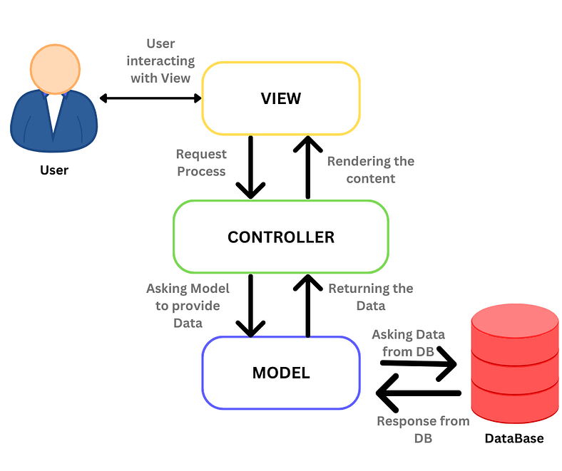

*图源：https://medium.com/@sadikarahmantanisha/the-mvc-architecture-97d47e071eb2*

#### 2.1 模型

+ 模型是MVC架构中的**核心**。
+ 主要负责数据和业务逻辑：
  + 与数据库或其他数据源交互，处理数据的CRUD操作。
+ 模型与视图和控制器相互独立，不直接与用户界面相关联。
+ 模型的变化通常由控制器触发，并最终反映到视图中。

#### 2.2 视图

+ 视图是MVC架构中的**表现层**。
+ 主要负责将模型中的数据以用户可见的形式展示到用户界面：
  + 接收控制器传递的数据，进行展示和简单格式化。
+ 视图通常是静态的，不包含业务逻辑。

#### 2.3 控制器

+ 控制器是模型和视图的**中介**。
+ 主要负责处理用户请求：
  + 接收用户请求（如点击、表单提交），并调用相应的模型方法处理数据，根据处理结果选择合适的视图，并将数据传递给视图进行展示。


---

---


## 二、SpringMVC入门

> [!Tip]
>
> SpringMVC技术与Servlet技术等同，均属于Web层（别名：表现层、接口层）开发技术，前者明显优于后者。

### 1.概述

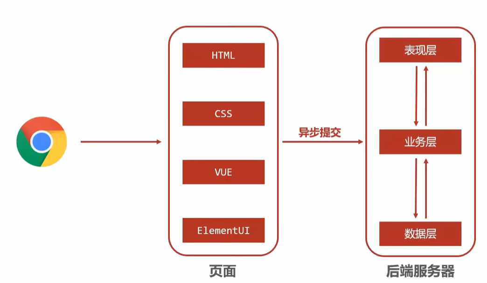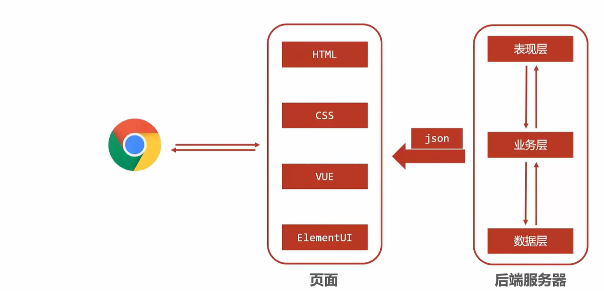


+ SpringMVC是一种基于Java实现MVC软件架构模型的轻量级**Web框架（别名：表现层框架、接口层框架）**。

+ 优点：使用简单，开发便捷，灵活性强。


---


### 2.入门案例

#### 2.1 使用SpringMVC技术需要先导入SpringMVC坐标与Servlet坐标

```xml
<!--1.导入SpringMVC与Servlet的坐标-->
<dependency>
  <groupId>javax.servlet</groupId>
  <artifactId>javax.servlet-api</artifactId>
  <version>版本</version>
  <scope>provided</scope>
</dependency>
<dependency>
  <groupId>org.springframework</groupId>
  <artifactId>spring-webmvc</artifactId>
  <version>版本</version>
</dependency>
```

#### 2.2 创建SpringMVC控制器类

```java
// 2.定义controller
@Controller// 使用@Controller来定义bean
public class UserController {

    @RequestMapping("/save")// 设置当前操作的访问路径
    @ResponseBody// 将方法返回值设置为当前操作的响应体
    public String save(){
        System.out.println("user save ...");
        return "{'module':'springmvc'}";
    }
}
```

#### 2.3 初始化SpringMVC环境，让SpringMVC加载对应的`bean`

```java
// 3.创建SpringMVC的配置文件，加载Controller对应的bean
@Configuration
@ComponentScan("com.zsh.controller")
public class SpringMvcConfig {
}
```

#### 2.4 初始化Servlet容器，加载SpringMVC环境，并设置SpringMVC要处理的请求

```java
// 4.定义一个Servlet容器启动的配置类，在里面加载SpringMVC的配置
public class ServletContainerInitConfig extends AbstractDispatcherServletInitializer{
    @Override
    // 加载SpringMVC容器配置
    protected WebApplicationContext createServletApplicationContext() {
        AnnotationConfigWebApplicationContext context=new AnnotationConfigWebApplicationContext();// 注意类名不要写错，有个Web 
        context.register(SpringMvcConfig.class);
        return context;
    }

    @Override
    // 设置哪些请求交由SpringMVC处理
    protected String[] getServletMappings() {
        return new String[]{"/"};
    }

    @Override
    // 加载Spring容器配置
    protected WebApplicationContext createRootApplicationContext() {
        return null;
    }
}
```


---


### 3.入门案例的工作流程

#### 3.1 启动服务器并初始化


1. 服务器启动，执行`ServletContainerInitConfig`类，初始化Web容器。
2. 执行`ServletContainerInitConfig`类中的`createServletApplicationContext()`方法，创建一个`WebApplicationContext`对象。
3. 加载`SpringMvcConfig`类。
4. 通过`SpringMvcConfig`类中的`@ComponentScan`注解加载对应的`bean`。
5. 加载`UserController`类，每个`@RequestMapping`的名称对应一个具体方法。
6. 执行`ServletContainerInitConfig`类中的`getServletMappings()`方法，设置所有请求都交由SpringMVC处理。

#### 3.2 单次请求

1. 发送请求`localhost:8082/save`。（8082是我设置的`Tomcat`端口，可以自定义修改）
2. Web容器将所有请求都交由SpringMVC处理。
3. 解析请求路径`/save`。
4. `/save`映射到对应方法`save()`。
5. 执行`save()`方法。
6. 检测到`save()`方法带有`@ResponseBody`注解，直接将`save()`方法的返回值作为响应体返回给请求方。


---


### 4.同时加载Spring和SpringMVC

#### 4.1 重构`ServletContainerInitConfig`类

```java
public class ServletContainerInitConfig extends AbstractDispatcherServletInitializer{
    @Override
    protected WebApplicationContext createRootApplicationContext() {// Root
        AnnotationConfigWebApplicationContext context=new AnnotationConfigWebApplicationContext();
        context.register(SpringConfig.class);// 加载Spring
        return context;
    }
    
    @Override
    protected WebApplicationContext createServletApplicationContext() {// Servlet
        AnnotationConfigWebApplicationContext context=new AnnotationConfigWebApplicationContext();
        context.register(SpringMvcConfig.class);// 加载SpringMVC
        return context;
    }
    
    @Override
    protected String[] getServletMappings() {
        return new String[]{"/"};
    }
}
```


#### 4.2 `Controller`与业务`Bean`的加载控制

+ SpringMVC加载的`bean`均在`com.zsh.controller`包内。

+ 如何避免Spring错误加载SpringMVC控制的`bean`？

  + **方式一（推荐）**：Spring加载的`bean`设定扫描范围为精确范围。如`@ComponentScan({"com.zsh.service", "com.zsh.dao"})`。

  + **方式二**：Spring加载的`bean`设定扫描范围为`com.zsh`，同时排除掉`controller`包内的`bean`。

    ```java
    // @Configuration这个注解必须去掉，否则过滤无效
    @ComponentScan("com.zsh.controller")
    public class SpringMvcConfig {
    }
    ```

    ```java
    @Configuration
    @Component(value = "com.zsh", 
    	excludeFilters = @ComponentScan.Filter(
    		type = FilterType.ANNOTATION,// 按注解过滤
    		classes = Controller.class// 过滤掉带@Controller注解的bean
    	)
    )
    public class SpringConfig {
    }
    ```

  + **方式三**：不区分Spring与SpringMVC的环境，加载到同一环境中。

    

 

#### 4.3 简化4.1代码

```java
public class ServletContainerInitConfig extends AbstractAnnotationConfigDispatcherServletInitializer{
    
   	@Override
    protected Class<?>[] getRootConfigClasses() {
        return new Class[]{SpringConfig.class};
    }
    
    @Override
    protected Class<?>[] getServletConfigClasses() {
        return new Class[]{SpringMvcConfig.class};
    }

    @Override
    protected String[] getServletMappings() {
        return new String[]{"/"};
    }
}
```


---

---


## 三、请求与响应

### 1.请求映射路径：`@RequestMapping`

`@RequestMapping`注解既可用于方法上，也可用于整个类上，这时候的作用是统一设置当前类的方法的请求映射路径前缀。示例如下：

```java
@Controller
@RequestMapping("/user")// 请求路径前缀
public class UserController {

    @RequestMapping("/save")
    @ResponseBody
    public String save(){
        System.out.println("user save ...");
        return "{'module':'user save'}";
    }

    @RequestMapping("/delete")
    @ResponseBody
    public String delete(){
        System.out.println("user delete ...");
        return "{'module':'user delete'}";
    }
}
```


---


### 2.GET请求传参

#### 2.1 普通参数

##### P1 概述

**传参方式**：url地址直接传参，地址参数名与形参名一致，在方法签名里定义形参即可接收参数。

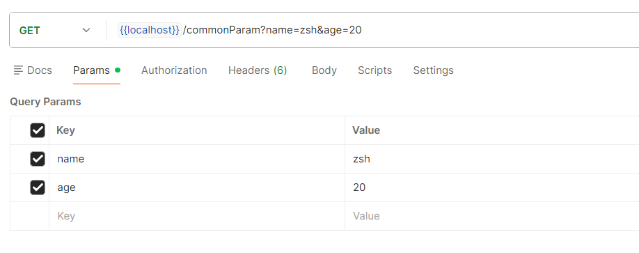

```java
@Controller
public class UserController {
    // 普通参数
    @RequestMapping("/commonParam")
    @ResponseBody
    public String commonParam(String name, int age){
        System.out.println("common param: name ==> "+name);
        System.out.println("common param: age ==> "+age);
        return "{'module':'common param'}";
    }
}
```


##### P2 请求参数名与形参名不一致的情况：`@RequestParam`

```java
@Controller
public class UserController {
    // 普通参数：请求参数名与形参名不一致的情况
    @RequestMapping("/commonParamDifferentName")
    @ResponseBody
    public String commonParamDifferentName(@RequestParam("name") String userName, int age){
        System.out.println("common param: name ==> "+userName);
        System.out.println("common param: age ==> "+age);
        return "{'module':'common param different name'}";
    }
}
```


---


#### 2.2 POJO参数

> [!Tip]
>
> POJO(Plain Ordinary Java Object)：简单的Java对象，实际上就是普通的JavaBean，只是为了避免和EJB混淆所创造的简称。

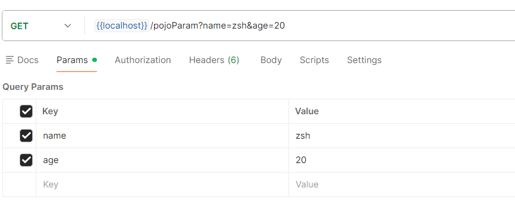

```java
@Controller
public class UserController {
    // POJO参数
    @RequestMapping("/pojoParam")
    @ResponseBody
    public String pojoParam(User user){
        System.out.println("pojo param: user ==> "+user);
        return "{'module':'pojo param'}";
    }
}
```


---


#### 2.3 嵌套POJO参数

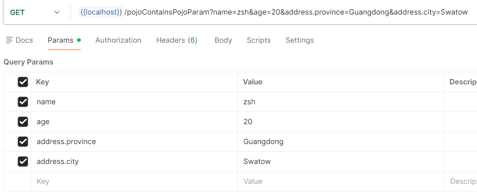

```java
@Controller
public class UserController {
    // 嵌套POJO参数
    @RequestMapping("/pojoContainsPojoParam")
    @ResponseBody
    public String pojoContainsPojoParam(User user){
        System.out.println("pojo param: user ==> "+user);
        return "{'module':'pojo contains pojo param'}";
    }
}
```


---


#### 2.4 数组参数

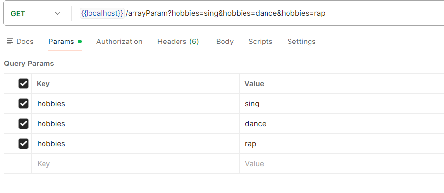

```java
@Controller
public class UserController {
    // 数组参数
    @RequestMapping("/arrayParam")
    @ResponseBody
    public String arrayParam(String[] hobbies){
        System.out.println("array param: hobbies ==> "+ Arrays.toString(hobbies));
        return "{'module':'array param'}";
    }
}
```


---


#### 2.5 集合参数：`@RequestParam`

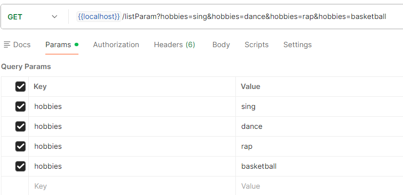

```java
@Controller
public class UserController {
    // 集合参数
    @RequestMapping("/listParam")
    @ResponseBody
    public String listParam(@RequestParam List<String> hobbies){// 此处必须加@RequestParam注解来绑定参数关系，否则报错
        System.out.println("list param: hobbies ==> "+ hobbies);
        return "{'module':'list param'}";
    }
}
```


---


#### 2.6 通过json格式传参：`@RequestBody`

##### P0 准备工作

首先要导入json坐标，才能进行接下来的步骤！

```xml
<dependencies>
    <dependency>
        <groupId>com.fasterxml.jackson.core</groupId>
        <artifactId>jackson-databind</artifactId>
        <version>版本</version>
    </dependency>
</dependencies>
```

其次要在`SpringMvcConfig`中新增注解`@EnableWebMvc`！

```java
@Configuration
@ComponentScan("com.zsh.controller")
@EnableWebMvc// 其中一个功能：对json数据进行自动类型转换
public class SpringMvcConfig {
}
```


##### P1 集合参数

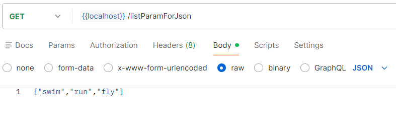

```java
@Controller
public class UserController {   
    // 集合参数：json
    @RequestMapping("/listParamForJson")
    @ResponseBody
    public String listParamForJson(@RequestBody List<String> hobbies){// 此处必须加@RequestBody注解来绑定参数关系
        System.out.println("list param json: hobbies ==> " + hobbies);
        return "{'module':'list param for json'}";
    }
}
```


##### P2 POJO参数

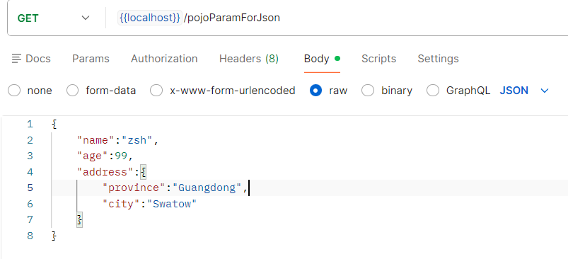

```java
@Controller
public class UserController {
    // POJO参数：json
    @RequestMapping("/pojoParamForJson")
    @ResponseBody
    public String pojoParamForJson(@RequestBody User user){// 此处必须加@RequestBody注解来绑定参数关系
        System.out.println("pojo param json: user ==> " + user);
        return "{'module':'pojo param for json'}";
    }
}
```


##### P3 POJO集合参数

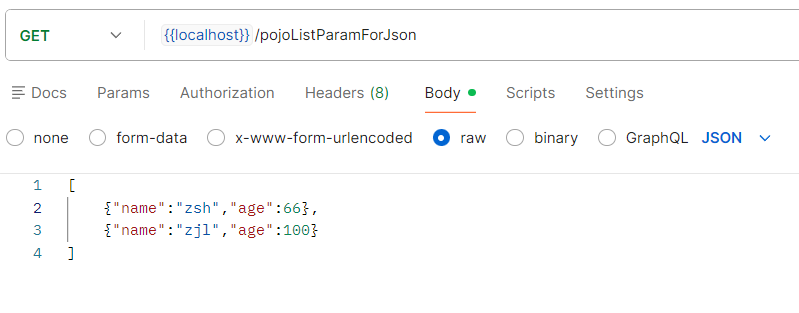

```java
@Controller
public class UserController {
    // POJO集合参数：json
    @RequestMapping("/pojoListParamForJson")
    @ResponseBody
    public String pojoListParamForJson(@RequestBody List<User> users){// 此处必须加@RequestBody注解来绑定参数关系
        System.out.println("pojo list param json: users ==> " + users);
        return "{'module':'pojo list param for json'}";
    }
}
```


---


#### 2.7 日期参数

> [!Tip]
>
> Spring默认的标准日期格式是`yyyy/MM/dd`。

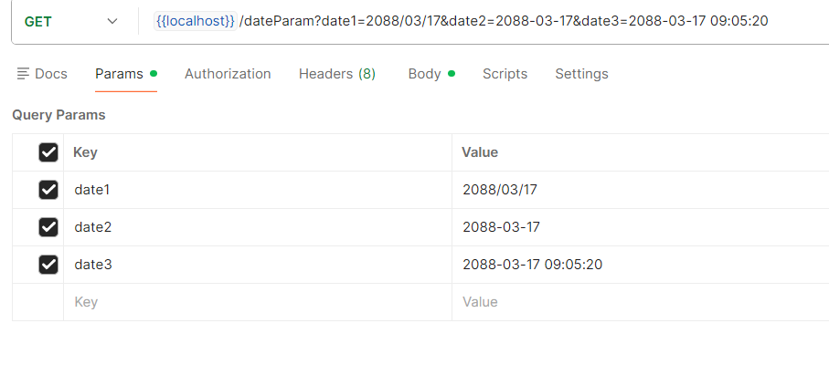

```java
@Controller
public class UserController {
    // 日期参数
    @RequestMapping("/dateParam")
    @ResponseBody
    public String dateParam(
            Date date1,
            @DateTimeFormat(pattern = "yyyy-MM-dd") Date date2,
            @DateTimeFormat(pattern = "yyyy-MM-dd HH:mm:ss") Date date3
    ){
        System.out.println("date param: date1 ==> "+date1);
        System.out.println("date param: date2(yyyy-MM-dd) ==> "+date2);
        System.out.println("date param: date3(yyyy-MM-dd HH:mm:ss) ==> "+date3);
        return "{'module':'date param'}";
    }
}
```


---


### 3.POST请求传参

#### P1 概述

**传参方式**：请求体里通过`x-www-for-urlencoded`表单传参，表单参数名与形参名一致，在方法签名里定义形参即可接收参数。

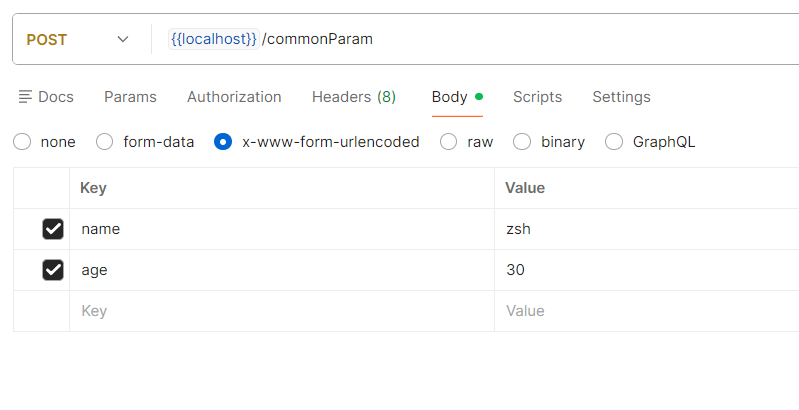

```java
@Controller
public class UserController {

    // 普通参数
    @RequestMapping("/commonParam")
    @ResponseBody
    public String commonParam(String name, int age){
        System.out.println("common param: name ==> "+name);
        System.out.println("common param: age ==> "+age);
        return "{'module':'common param'}";
    }
}
```


#### P2 POST请求中文乱码处理

```java
public class ServletContainerInitConfig extends AbstractAnnotationConfigDispatcherServletInitializer {

    @Override
    protected Class<?>[] getServletConfigClasses() {
        return new Class[]{SpringMvcConfig.class};
    }

    @Override
    protected String[] getServletMappings() {
        return new String[]{"/"};
    }

    @Override
    protected Class<?>[] getRootConfigClasses() {
        return new Class[0];
    }

    // POST请求中文乱码处理：设置过滤器
    @Override
    protected Filter[] getServletFilters() {
        CharacterEncodingFilter filter=new CharacterEncodingFilter();
        filter.setEncoding("UTF-8");
        return new Filter[]{filter};
    }
}
```


---


#### 2.8 类型转换器

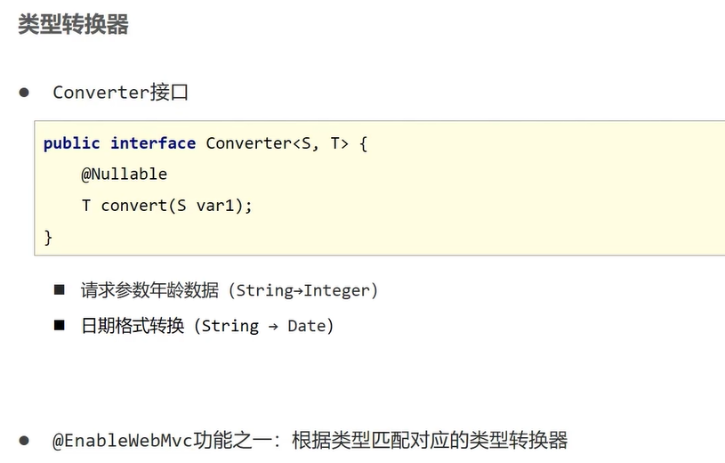


---


### 4.响应json数据

#### 4.0 准备工作

首先要导入json坐标，才能进行接下来的步骤！

```xml
<dependencies>
    <dependency>
        <groupId>com.fasterxml.jackson.core</groupId>
        <artifactId>jackson-databind</artifactId>
        <version>版本</version>
    </dependency>
</dependencies>
```

其次要在`SpringMvcConfig`中新增注解`@EnableWebMvc`！

```java
@Configuration
@ComponentScan("com.zsh.controller")
@EnableWebMvc// 其中一个功能：对json数据进行自动类型转换
public class SpringMvcConfig {
}
```


#### 4.1 代码演示

+ `page.jsp`:

  ```jsp
  <html>
  <body>
  <h2>Hello SpringMVC!</h2>
  </body>
  </html>
  ```

+ `UserController`:

  ```java
  @Controller
  public class UserController {
      // 响应页面/跳转页面
      @RequestMapping("/toJumpPage")
      public String toJumpPage(){
          System.out.println("jump page");
          return "page.jsp";
      }
  
      // 响应文本数据
      @RequestMapping("/toText")
      @ResponseBody
      public String toText(){
          System.out.println("return text");
          return "response text";
      }
  
      // 响应POJO：json
      @RequestMapping("/toJsonPojo")
      @ResponseBody
      public User toJsonPojo(){
          System.out.println("return json pojo");
          User user=new User("zsh",999);
          return user;
      }
  
      // 响应POJO集合：json
      @RequestMapping("/toJsonPojoList")
      @ResponseBody
      public List<User> toJsonPojoList(){
          System.out.println("return json pojo list");
          User user1=new User("aj",6);
          User user2=new User("swift",52);
          List<User> users=new ArrayList<>();
          users.add(user1);
          users.add(user2);
          return users;
      }
  }
  ```


#### 4.2 `@ResponseBody`注解

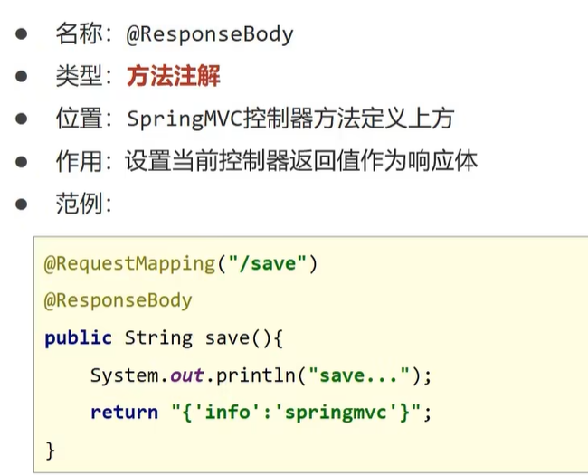


---

---


## 四、REST风格

> [!Tip]
>
> REST(Representational State Transfer)：表征性状态转换。
>
> RESTful：使用REST风格对资源进行访问。

### 1.简介

+ 传统风格 vs REST风格：

  + 传统风格的资源描述形式：
    + http://localhost/user/getById?id=1
    + http://localhost/user/saveUser
  + REST风格的资源描述形式：
    + http://localhost/user/1
    + http://localhost/user

+ REST风格优点：

  + 隐藏资源的访问行为，无法通过url地址得知用户对资源执行何种操作。
  + 简化书写。

+ 常见的REST风格的资源描述形式：

  | url地址                  | 说明               | 行为动作（用于区分） |
  | ------------------------ | ------------------ | -------------------- |
  | http://localhost/users   | 查询全部用户信息。 | GET                  |
  | http://localhost/users/1 | 查询指定用户信息。 | GET                  |
  | http://localhost/users   | 添加用户信息。     | POST                 |
  | http://localhost/users   | 修改用户信息。     | PUT                  |
  | http://localhost/users/1 | 删除指定用户信息。 | DELETE               |

+ **注意事项**：上述行为动作只是约定方式，而非规范，因此称作REST风格而不是REST规范。描述模块的名称通常使用复数，表示此类资源，而非单个资源，例如：users、books、accounts。


---


### 2.RESTful入门案例：`@PathVariable`

#### 2.1 代码演示

```java
@Controller
@RequestMapping("/users")// 请求路径前缀
public class UserController {

    @RequestMapping(method = RequestMethod.POST)
    @ResponseBody
    public String save(@RequestBody User user) {
        System.out.println("user save ... " + user);
        return "{'module':'user save'}";
    }

    // 我已设定了请求路径前缀
    @RequestMapping(value = "/{id}", method = RequestMethod.DELETE)
    @ResponseBody
    public String delete(@PathVariable Integer id) {// @PathVariable表示从url地址中取出id这个变量的值
        System.out.println("user delete ... " + id);
        return "{'module':'user delete'}";
    }

    @RequestMapping(method = RequestMethod.PUT)
    @ResponseBody
    public String update(@RequestBody User user) {
        System.out.println("user update ... " + user);
        return "{'module':'user update'}";
    }

    @RequestMapping(value = "/{id}", method = RequestMethod.GET)
    @ResponseBody
    public String getById(@PathVariable Integer id) {
        System.out.println("user getById ... " + id);
        return "{'module':'user getById'}";
    }

    @RequestMapping(method = RequestMethod.GET)
    @ResponseBody
    public String getAll() {
        System.out.println("user getAll ...");
        return "{'module':'user getAll'}";
    }

}
```


#### 2.2 注解区别

|      注解       |                     作用                     |                        适用场景                         |
| :-------------: | :------------------------------------------: | :-----------------------------------------------------: |
| `@RequestParam` |          接收url地址传参或表单传参           |                  发送非json格式的数据                   |
| `@RequestBody`  |                 接收json传参                 |          发送的请求参数超过1个且以json格式为主          |
| `@PathVariable` | 接收路径参数，使用`{参数名称}`来描述路径参数 | 采用RESTful进行开发，且参数数量较少。通常用于传递id值。 |


---


### 3.RESTful快速开发：`@RestController`、`@XxxMapping`

```java
@RestController// 等价于@Controller + @ResponseBody
@RequestMapping("/books")
public class BookController {

//    @RequestMapping(method = RequestMethod.POST)
    @PostMapping
    public String save(@RequestBody Book book) {
        System.out.println("book save ... " + book);
        return "{'module':'book save'}";
    }

//    @RequestMapping(value = "/{id}", method = RequestMethod.DELETE)
    @DeleteMapping("/{id}")
    public String delete(@PathVariable Integer id) {// @PathVariable表示从url地址中取出id这个变量的值
        System.out.println("book delete ... " + id);
        return "{'module':'book delete'}";
    }

    @PutMapping
    public String update(@RequestBody Book book) {
        System.out.println("book update ... " + book);
        return "{'module':'book update'}";
    }

    @GetMapping("/{id}")
    public String getById(@PathVariable Integer id) {
        System.out.println("book getById ... " + id);
        return "{'module':'book getById'}";
    }

    @GetMapping
    public String getAll() {
        System.out.println("book getAll ...");
        return "{'module':'book getAll'}";
    }
}
```


---


### 4.案例：基于RESTful的页面数据交互

详见：[springmvc\06_REST_case](springmvc\06_REST_case)

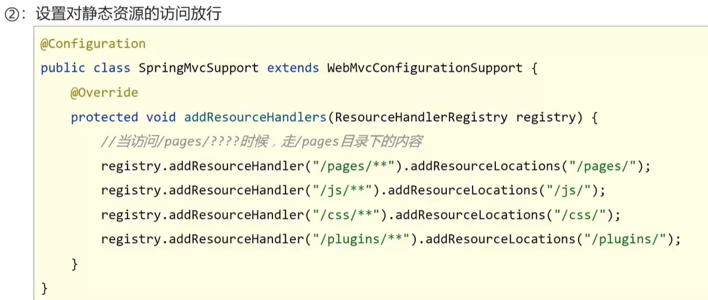


---

---


## 五、SSM整合


