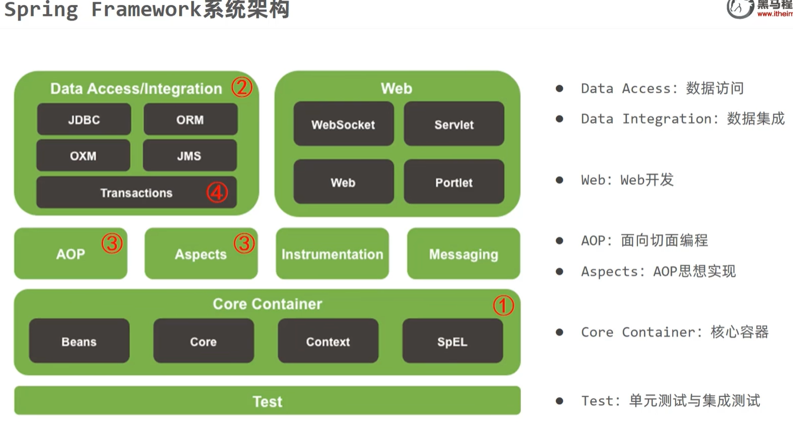
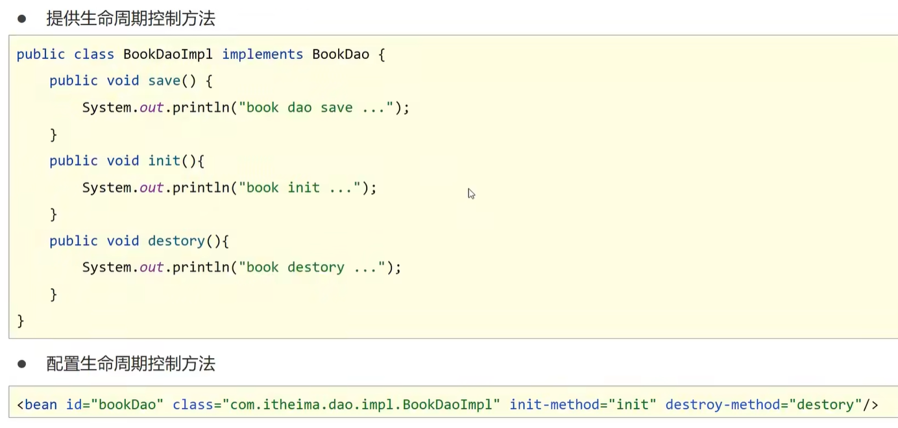
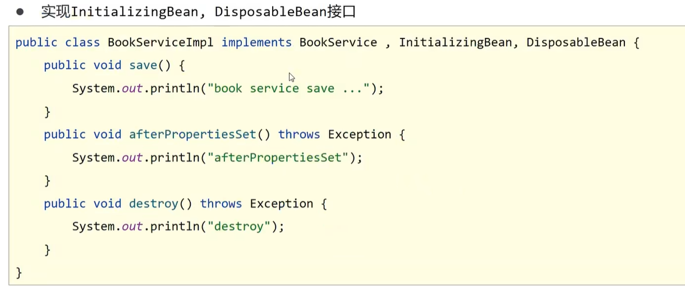
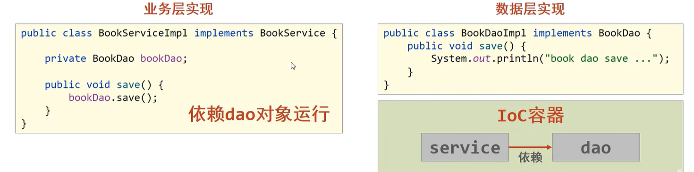

# Spring

> 鸣谢：黑马程序员
>
> 

## 一、核心容器

### 1.`IoC/DI`

#### 1.1 `IoC`

+ `IoC(Inversion of Control)`：控制反转。
+ **核心思想**：将对象的创建控制权由程序内部转移到**外部**。也就是使用对象时，在程序中不要主动使用`new`产生对象，而是转换为由外部提供对象。

#### 1.2 `IoC`容器

+ Spring提供了一个容器用来充当`IoC`思想中的**外部**，称为`IoC`容器。

---

#### 1.3 `Bean`

> [!IMPORTANT]
>
> `IoC`容器负责对象的创建、初始化等一系列工作，被创建或被管理的对象在`IoC`容器中统称为`Bean`。

##### P1 `Bean`的作用范围(`scope`)

+ **默认是单例**。

+ 适合交给容器管理的`Bean`：接口层对象、业务层对象、数据层对象、工具对象；
+ 不适合交给容器管理的`Bean`：封装实体的域对象。

##### P2 实例化`Bean`的方式

+ **常用**：提供无参构造器（`private`也可）。
+ 使用静态工厂。
+ 使用实例工厂。
+ **重点**：使用`FactoryBean`。（方式三的变种）

##### P3 `Bean`的生命周期及控制

+ `Bean`的生命周期：

  + *Step1*：**初始化容器**。
    1. 创建对象（内存分配）
    2. 执行构造器
    3. 执行属性注入（调用`setter`）
    4. 执行`bean`初始化方法

  + *Step2*：**使用`bean`**。

  + *Step3*：**关闭/销毁容器**。

+ `Bean`的生命周期控制：

  + 控制方式一：

    

  + 控制方式二：接口控制

    

##### P4 `Bean`的销毁时机

+ 容器关闭前触发`Bean`的销毁。
+ **关闭容器的方式**：
  + 手动关闭：调用`ConfigurableApplicationContext`接口的`close()`方法。
  + 注册关闭钩子，先关闭容器再退出JVM：调用`ConfigurableApplicationContext`接口的`registerShutdownHook()`方法。

---

#### 1.4 `DI`

##### P1 概述

+ `DI(Dependency Injection)`：依赖注入。

+ **核心思想**：在`IoC`容器中建立`Bean`与`Bean`之间的依赖关系。

  

+ 向一个类中传递的数据类型：
  + 简单类型：基本数据类型+`String`-->`<value>`
  + 引用类型-->`<ref>`

##### P2 依赖注入方式

+ **`setter`注入**：
  + 简单类型
  + 引用类型
+ **构造器注入**：
  + 简单类型
  + 引用类型

##### P3 如何选择依赖注入方式？

+ 具有强制依赖关系的使用构造器注入，因为使用`setter`注入有概率没有进行注入，导致`null`对象出现。
+ 具有可选依赖关系的使用`setter`注入，灵活性强。
+ Spring框架推荐使用构造器注入，第三方框架内部大多采用构造器注入的形式进行数据初始化，相对严谨。
+ 如有必要可以两者同时使用：
  + 使用构造器注入完成强制依赖关系的注入；
  + 使用`setter`注入完成可选依赖关系的注入。
+ 实际开发过程中根据实际情况分析，如果受控对象没有提供`setter`，则必须使用构造器注入。
+ 自己开发的模块**推荐**使用`setter`注入。

##### P4 依赖自动装配

+ **含义**：`IoC`容器根据`bean`所依赖的资源在容器中自动查找并注入到`bean`中。

+ **自动装配方式**：
  + 按类型（**常用**）
  + 按名称
  + 按构造器
  + 不启用自动装配
+ **注意事项**：
  + 自动装配仅用于引用类型的依赖注入，无法对简单类型进行依赖注入。
  + 使用按类型装配(`byType`)时，必须保证容器中相同类型的`bean`只有一个，开发中**推荐**使用这种方式进行自动装配。
  + 使用按名称装配(`byName`)时，必须保证容器中具有指定名称的`bean`（即`setter`方法的名字去掉`set`后的名称），因为变量名与配置高度耦合，故不推荐使用。
  + 自动装配的优先级低于`setter`注入和构造器注入，同时出现时自动装配失效。

##### P5 集合注入

---

### 2.容器基本操作

---

## 二、数据访问与集成

---

## 三、`AOP`

---

## 四、事务

---

## 五、框架整合