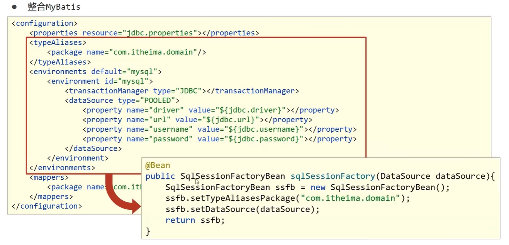
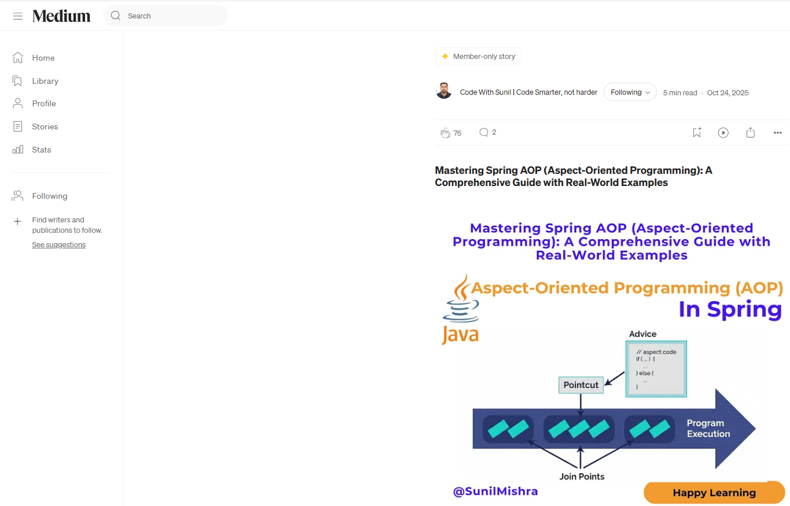
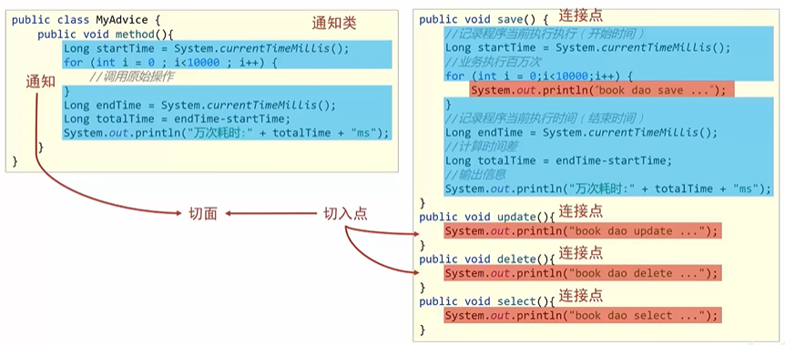
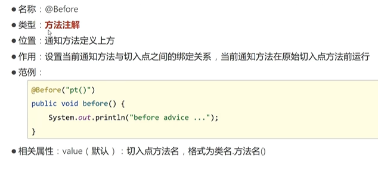
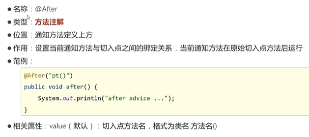
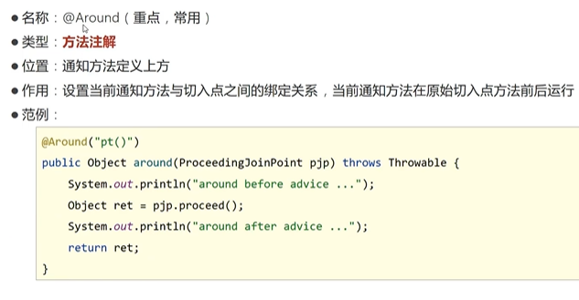
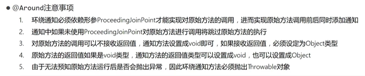
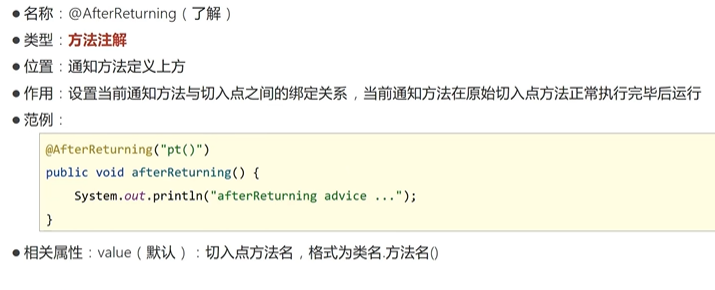
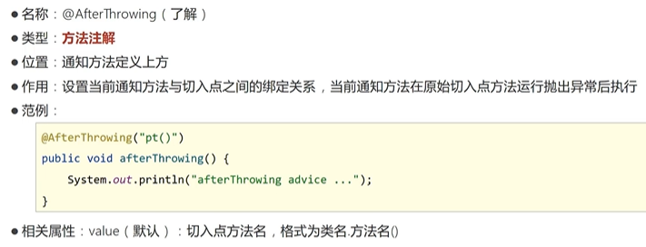

# Spring

> 鸣谢：黑马程序员
>
> 


[TOC]


## 一、核心容器

### 1.`IoC/DI`

#### 1.1 `IoC`

+ `IoC(Inversion of Control)`：控制反转。
+ **核心思想**：将对象的创建控制权由程序内部转移到**外部**。也就是使用对象时，在程序中不要主动使用`new`产生对象，而是转换为由外部提供对象。

#### 1.2 `IoC`容器

+ Spring提供了一个容器用来充当`IoC`思想中的**外部**，称为`IoC`容器。


---


#### 1.3 `Bean`

> [!IMPORTANT]
>
> `IoC`容器负责对象的创建、初始化等一系列工作，被创建或被管理的对象在`IoC`容器中统称为`Bean`。

##### P1 `Bean`的作用范围(`scope`)

+ **默认是单例**。

+ 适合交给容器管理的`Bean`：接口层对象、业务层对象、数据层对象、工具对象；
+ 不适合交给容器管理的`Bean`：封装实体的域对象。

##### P2 实例化`Bean`的方式

+ **常用**：提供无参构造器（`private`也可）。
+ 使用静态工厂。
+ 使用实例工厂。
+ **重点**：使用`FactoryBean`。（方式三的变种）

##### P3 `Bean`的生命周期及控制

+ `Bean`的生命周期：

  + *Step1*：**初始化容器**。
    1. 创建对象（内存分配）
    2. 执行构造器
    3. 执行属性注入（调用`setter`）
    4. 执行`bean`初始化方法

  + *Step2*：**使用`bean`**。

  + *Step3*：**关闭/销毁容器**。

+ `Bean`的生命周期控制：

  + 控制方式一：

    

  + 控制方式二：接口控制

    


##### P4 `Bean`的销毁时机

+ 容器关闭前触发`Bean`的销毁。
+ **关闭容器的方式**：
  + 手动关闭：调用`ConfigurableApplicationContext`接口的`close()`方法。
  + 注册关闭钩子，先关闭容器再退出JVM：调用`ConfigurableApplicationContext`接口的`registerShutdownHook()`方法。


---


#### 1.4 `DI`

##### P1 概述

+ `DI(Dependency Injection)`：依赖注入。

+ **核心思想**：在`IoC`容器中建立`Bean`与`Bean`之间的依赖关系。

  

+ 向一个类中传递的数据类型：
  + 简单类型：基本数据类型+`String`-->`<value>`
  + 引用类型-->`<ref>`


##### P2 依赖注入方式

+ **`setter`注入**：
  + 简单类型
  + 引用类型
+ **构造器注入**：
  + 简单类型
  + 引用类型


##### P3 如何选择依赖注入方式？

+ 具有强制依赖关系的使用构造器注入，因为使用`setter`注入有概率没有进行注入，导致`null`对象出现。
+ 具有可选依赖关系的使用`setter`注入，灵活性强。
+ Spring框架推荐使用构造器注入，第三方框架内部大多采用构造器注入的形式进行数据初始化，相对严谨。
+ 如有必要可以两者同时使用：
  + 使用构造器注入完成强制依赖关系的注入；
  + 使用`setter`注入完成可选依赖关系的注入。
+ 实际开发过程中根据实际情况分析，如果受控对象没有提供`setter`，则必须使用构造器注入。
+ 自己开发的模块**推荐**使用`setter`注入。


##### P4 依赖自动装配

+ **含义**：`IoC`容器根据`bean`所依赖的资源在容器中自动查找并注入到`bean`中。

+ **自动装配方式**：
  + 按类型（**常用**）
  + 按名称
  + 按构造器
  + 不启用自动装配
+ **注意事项**：
  + 自动装配仅用于引用类型的依赖注入，无法对简单类型进行依赖注入。
  + 使用按类型装配(`byType`)时，必须保证容器中相同类型的`bean`只有一个，开发中**推荐**使用这种方式进行自动装配。
  + 使用按名称装配(`byName`)时，必须保证容器中具有指定名称的`bean`（即`setter`方法的名字去掉`set`后的名称），因为变量名与配置高度耦合，故不推荐使用。
  + 自动装配的优先级低于`setter`注入和构造器注入，同时出现时自动装配失效。


##### P5 集合注入

+ `BookDaoImpl`:

```java
package com.zsh.dao.impl;

import com.zsh.dao.BookDao;
import java.util.*;

public class BookDaoImpl implements BookDao {

    private int[] zshArray;
    private List<String> zshList;
    private Set<String> zshSet;
    private Map<String,String> zshMap;
    private Properties zshProperties;

    public void setZshArray(int[] zshArray) {
        this.zshArray = zshArray;
    }
    public void setZshList(List<String> zshList) {
        this.zshList = zshList;
    }
    public void setZshSet(Set<String> zshSet) {
        this.zshSet = zshSet;
    }
    public void setZshMap(Map<String, String> zshMap) {
        this.zshMap = zshMap;
    }
    public void setZshProperties(Properties zshProperties) {
        this.zshProperties = zshProperties;
    }

    @Override
    public void save() {
        System.out.println("book dao save ...");
        System.out.println("traverse Array: "+ Arrays.toString(zshArray));
        System.out.println("traverse List: "+ zshList);
        System.out.println("traverse Set: "+ zshSet);
        System.out.println("traverse Map: "+ zshMap);
        System.out.println("traverse Properties: "+ zshProperties);
    }
}
```

+ `applicationContext.xml`

```xml
<?xml version="1.0" encoding="UTF-8"?>
<beans xmlns="http://www.springframework.org/schema/beans"
       xmlns:xsi="http://www.w3.org/2001/XMLSchema-instance"
       xsi:schemaLocation="http://www.springframework.org/schema/beans http://www.springframework.org/schema/beans/spring-beans.xsd">

    <bean id="bookDao" class="com.zsh.dao.impl.BookDaoImpl">
        <property name="zshArray">
            <array>
                <value>100</value>
                <value>200</value>
                <value>300</value>
            </array>
        </property>

        <property name="zshList">
            <list>
                <value>zsh</value>
                <value>zjl</value>
                <value>zxj</value>
                <value>zxj</value>
            </list>
        </property>

        <property name="zshSet">
            <set>
                <value>apple</value>
                <value>banana</value>
                <value>strawberry</value>
                <value>strawberry</value>
                <!--由于Set元素不可重复，故会自动过滤2个重复的strawberry-->
            </set>
        </property>

        <property name="zshMap">
            <map>
                <entry key="country" value="China"/>
                <entry key="province" value="Guangdong"/>
                <entry key="city" value="Swatow"/>
            </map>
        </property>

        <property name="zshProperties">
            <props>
                <prop key="name">zsh</prop>
                <prop key="sex">male</prop>
                <prop key="height">175</prop>
            </props>
        </property>
    </bean>

</beans>
```


##### P6 加载`properties`文件


---


### 2.容器基本操作

#### 2.1 创建容器

##### P1 加载配置文件的两种方式

+ **通过类路径**：`ApplicationContext context = new ClassPathXmlApplicationContext("???.xml");`
+ **通过文件路径**：`ApplicationContext context = new FileSystemXmlApplicationContext("???.xml的绝对路径或本工程下的相对路径");`

##### P2 加载多个配置文件

`ApplicationContext context = new ClassPathXmlApplicationContext("bean1.xml", "bean2.xml");`


#### 2.2 获取`bean`

+ 使用`bean`名称获取：`BookDao bookDao = (BookDao) context.getBean("bookDao")`
+ 使用`bean`名称获取并指定`bean`类型：`BookDao bookDao = context.getBean("bookDao", BookDao.class)`
+ 使用`bean`类型获取（注意该类型的`bean`在配置文件中必须是唯一的）：`BookDao bookDao = context.getBean(BookDao.class)`


#### 2.3 容器类层次结构


#### 2.4 `BeanFactory`


---


### 3.注解开发

#### 3.1 注解开发定义`bean`

##### P1 步骤

Step1：使用`@Component`定义`bean`。

```java
@Component("bookDao")
public class BookDaoImpl implements BookDao {
}

@Component
public class BookServiceImpl implements BookService {
}
```

Step2：核心配置文件中通过组件扫描加载`bean`。

```xml
<?xml version="1.0" encoding="UTF-8"?>
<beans xmlns="http://www.springframework.org/schema/beans"
       xmlns:context="http://www.springframework.org/schema/context"
       xmlns:xsi="http://www.w3.org/2001/XMLSchema-instance"
       xsi:schemaLocation="
       http://www.springframework.org/schema/beans
       http://www.springframework.org/schema/beans/spring-beans.xsd
       http://www.springframework.org/schema/context
       http://www.springframework.org/schema/context/spring-context.xsd
">
    <context:component-scan base-package="com.zsh"/>

</beans>
```


##### P2 Spring提供的三个衍生注解

> [!Tip]
>
> 功能和`@Component`一模一样，只是增强了可读性。

+ `@Controller`：用于接口层`bean`定义。
+ `@Service`：用于业务层`bean`定义。
+ `@Repository`：用于数据层`bean`定义。


---


#### 3.2 纯注解开发（`Spring3.0+`）

创建一个Java类`SpringConfig`来代替核心配置文件：

```java
package com.zsh.config;

import org.springframework.context.annotation.ComponentScan;
import org.springframework.context.annotation.Configuration;

@Configuration// 代表这是个Spring配置类
@ComponentScan("com.zsh")// 指定扫描路径，此注解只能添加一次，多个数据需用数组形式，如@ComponentScan({"com.zsh.dao", "com.zsh.service"})
public class SpringConfig {
}
```

重新编写测试类：

```java
package com.zsh;

import com.zsh.config.SpringConfig;
import com.zsh.dao.BookDao;
import com.zsh.service.BookService;
import org.springframework.context.annotation.AnnotationConfigApplicationContext;

public class AppByPureAnnotation {
    public static void main(String[] args) {
        ApplicationContext context=new AnnotationConfigApplicationContext(SpringConfig.class);

        BookDao bookDao=(BookDao) context.getBean("bookDao");
        System.out.println(bookDao);
        BookService bookService=context.getBean(BookService.class);
        System.out.println(bookService);
    }
}
```


---


#### 3.3 控制`Bean`的作用范围与生命周期


---


#### 3.4 依赖注入——自动装配

##### P1 使用`@Autowired`注解开启按类型自动装配模式


##### P2 使用`@Qualifier`注解按指定名称装配`bean`


##### P3 使用`@Value`注解注入简单类型数据


##### P4 使用`@PropertySource`注解加载属性文件


---


#### 3.5 管理第三方`bean`

##### P1 使用`@Bean`注解来配置第三方`bean`

+ `SpringConfig`:

  ```java
  package com.zsh.config;
  
  import org.springframework.context.annotation.Configuration;
  import org.springframework.context.annotation.Import;
  
  @Configuration// 代表这是个Spring配置类
  @Import(JdbcConfig.class)// 导入配置
  public class SpringConfig {
  }
  ```

+ `JdbcConfig`:（使用独立的配置类进行解耦合）

  ```java
  package com.zsh.config;
  
  import com.alibaba.druid.pool.DruidDataSource;
  import org.springframework.context.annotation.Bean;
  import javax.sql.DataSource;
  
  public class JdbcConfig {
  
      // 1.定义一个方法来获得要管理的第三方bean
      // 2.添加@Bean表示该方法的返回值是一个bean
      @Bean
      public DataSource getDataSource(){
          DruidDataSource dataSource=new DruidDataSource();
          dataSource.setDriverClassName("com.mysql.jdbc.Driver");
          dataSource.setUrl("jdbc:mysql://localhost:3306/spring_db");
          dataSource.setUsername("root");
          dataSource.setPassword("123456");
          return dataSource;
      }
  }
  ```


##### P2 为第三方`bean`进行依赖注入

+ 简单类型依赖注入：**设置成员变量**。

  ```java
  public class JdbcConfig {
  
      @Value("com.mysql.jdbc.Driver")
      private String driver;
      @Value("jdbc:mysql://localhost:3306/spring_db")
      private String url;
      @Value("root")
      private String username;
      @Value("123456")
      private String password;
  
      @Bean
      public DataSource getDataSource(){
          DruidDataSource dataSource=new DruidDataSource();
          dataSource.setDriverClassName(driver);
          dataSource.setUrl(url);
          dataSource.setUsername(username);
          dataSource.setPassword(password);
          return dataSource;
      }
  }
  ```

+ 引用类型依赖注入：只需要为带有`@Bean`的**方法设置形参**即可，容器会根据类型**自动装配**对象。

  > [!Tip]
  >
  > `BookDaoImpl`这个类记得加上`@Repository`注解，容器才可以自动装配。

  ```java
  public class JdbcConfig {
  
      @Bean
      public DataSource getDataSource(BookDao bookDao){// 容器会自动装配bookDao(byType)
          System.out.println(bookDao);
          DruidDataSource dataSource=new DruidDataSource();
          return dataSource;
      }
  }
  ```


---


#### 3.6 `@Component`和`@Bean`的区别

##### P1 概述

+ `@Component`是类级别注解，表示把这个类交给Spring容器管理。
+ `@Bean`是方法级别注解，表示把这个方法返回的对象交给Spring容器管理。
+ 两者都能创建Spring容器中的`Bean`，但用途完全不同。


##### P2 对比表

| 对比项         | `@Component`                                 | `@Bean`                                        |
| -------------- | -------------------------------------------- | ---------------------------------------------- |
| 注解位置       | 类                                           | 方法（通常在`@Configuration`类中）             |
| `Bean`创建方式 | Spring自动扫描并实例化（反射调用无参构造器） | 方法返回对象由Spring注册                       |
| 依赖注入       | 通过`@Autowired`、`@Value`等注解进行依赖注入 | 方法形参自动依赖注入                           |
| 适用场景       | 自己编写的类，且可被Spring扫描到             | 第三方类、需要定制构造/初始化逻辑的`Bean`      |
| 配置方式       | 需配合`@ComponentScan`扫描包路径             | 不需要组件扫描，只要执行配置类即可             |
| 灵活性         | 相对固定，依赖无参构造器                     | 高度灵活，可在方法中写任意 Java 代码控制实例化 |


---

---


## 二、数据访问与集成

### 1.`Spring`整合`MyBatis`

#### 2.1 `mybatis-config.xml`

```xml
<?xml version="1.0" encoding="UTF-8"?>
<!DOCTYPE configuration
        PUBLIC "-//mybatis.org/DTD Config 3.0//EN"
        "http://mybatis.org/dtd/mybatis-3-config.dtd">
<configuration>
    <!--初始化属性数据-->
    <properties resource="jdbc.properties"></properties>

    <!--初始化类型别名-->
    <typeAliases>
        <package name="com.zsh.domain"/>
    </typeAliases>

    <!--初始化数据源-->
    <environments default="mysql">
        <environment id="mysql">
            <transactionManager type="JDBC"></transactionManager>
            <dataSource type="POOLED">
                <property name="driver" value="${jdbc.driver}"/>
                <property name="url" value="${jdbc.url}"/>
                <property name="username" value="${jdbc.username}"/>
                <property name="password" value="${jdbc.password}"/>
            </dataSource>
        </environment>
    </environments>

    <!--初始化映射配置：随业务而改变-->
    <mappers>
        <package name="com.zsh.dao"/>
    </mappers>
</configuration>
```

分析可知，要想让`Spring`整合`MyBatis`，则要让`Spring`管理`SqlSessionFactory`对象。


#### 2.2 代码重构

+ `SpringConfig`:

  ```java
  package com.zsh.config;
  
  import org.springframework.context.annotation.ComponentScan;
  import org.springframework.context.annotation.Configuration;
  import org.springframework.context.annotation.Import;
  import org.springframework.context.annotation.PropertySource;
  
  @Configuration
  @ComponentScan("com.zsh")
  @PropertySource("classpath:jdbc.properties")
  @Import({JdbcConfig.class, MybatisConfig.class})
  public class SpringConfig {
  }
  ```

+ `JdbcConfig`:

  ```java
  package com.zsh.config;
  
  import com.alibaba.druid.pool.DruidDataSource;
  import org.springframework.beans.factory.annotation.Value;
  import org.springframework.context.annotation.Bean;
  
  import javax.sql.DataSource;
  
  public class JdbcConfig {
      @Value("${jdbc.driver}")
      private String driver;
      @Value("${jdbc.url}")
      private String url;
      @Value("${jdbc.username}")
      private String username;
      @Value("${jdbc.password}")
      private String password;
  
      @Bean
      public DataSource dataSource(){
          DruidDataSource dataSource=new DruidDataSource();
          dataSource.setDriverClassName(driver);
          dataSource.setUrl(url);
          dataSource.setUsername(username);
          dataSource.setPassword(password);
          return dataSource;
      }
  }
  ```

+ `MybatisConfig`:

  

  ```java
  package com.zsh.config;
  
  import org.apache.ibatis.session.SqlSessionFactory;
  import org.mybatis.spring.SqlSessionFactoryBean;
  import org.mybatis.spring.mapper.MapperScannerConfigurer;
  import org.springframework.context.annotation.Bean;
  
  import javax.sql.DataSource;
  
  public class MybatisConfig {
  
      @Bean
      public SqlSessionFactoryBean sqlSessionFactoryBean(DataSource dataSource){
          SqlSessionFactoryBean factoryBean=new SqlSessionFactoryBean();
          factoryBean.setTypeAliasesPackage("com.zsh.domain");
          factoryBean.setDataSource(dataSource);
          return factoryBean;
      }
  
      @Bean
      public MapperScannerConfigurer mapperScannerConfigurer(){
          MapperScannerConfigurer configurer=new MapperScannerConfigurer();
          configurer.setBasePackage("com.zsh.dao");
          return configurer;
      }
  }
  ```


---


### 2.`Spring`整合`JUnit`

+ `AccountServiceTest`:

```java
package service;

import com.zsh.config.SpringConfig;
import com.zsh.service.AccountService;
import org.junit.Test;
import org.junit.runner.RunWith;
import org.springframework.beans.factory.annotation.Autowired;
import org.springframework.test.context.ContextConfiguration;
import org.springframework.test.context.junit4.SpringJUnit4ClassRunner;

@RunWith(SpringJUnit4ClassRunner.class)
@ContextConfiguration(classes = SpringConfig.class)
public class AccountServiceTest {

    @Autowired
    private AccountService accountService;

    @Test
    public void testFindById(){
        System.out.println(accountService.findById(2));
    }
}
```


---

---


## 三、`AOP`

### 1.概述

+ `AOP(Aspect-Oriented Programming)`：面向切面编程。是一种编程范式，指导开发者如何组织程序结构。
+ **作用**：在**不惊动原有设计**的基础上为其进行功能增强（**无侵入式编程**）。


---


### 2.核心概念

> [!Important]
>
> 以下内容参考了Code With Sunil | Code Smarter, not harder在Medium平台发布的文章[Mastering Spring AOP (Aspect-Oriented Programming): A Comprehensive Guide with Real-World Examples](https://medium.com/@sunil17bbmp/mastering-spring-aop-aspect-oriented-programming-a-comprehensive-guide-with-real-world-examples-c5bca188b5df)
>
> 

+ **连接点(Join Point)**：连接点是应用程序执行过程中的任意位置。
  + 在Spring AOP中，连接点可以理解为方法的执行。
+ **切入点(Pointcut)**：切入点是一个匹配连接点的表达式，用于决定某个通知应该运行在哪些连接点上，它告诉Spring应该在何处应用你的切面。
  + 在Spring AOP中，一个切入点可以只描述一个具体方法，也可以匹配多个方法。
    + 一个具体方法：`com.zsh.dao`包下的`BookDao`接口中的`public void save()`方法。
    + 匹配多个方法：所有`save`方法，所有`getXxx`方法，所有`xxxDao`方法，所有带有一个形参的方法……
  + **注意**：切入点范围小于连接点范围，切入点包含于连接点中。
+ **通知(Advice)**：通知是你希望在切入点运行的代码，例如在方法运行之前先记录日志。
  + 在Spring AOP中，通知最终以方法的形式呈现。
+ **通知类(Advice Class)**：专门定义通知的类。
+ **切面(Aspect)**：切面是一个包含了多个类通用功能代码的模块，例如日志记录。它描述了通知与切入点的对应关系。
  + 在Spring AOP中，可以使用`@Aspect`注解或通过`XML`配置的方式来创建切面。




---


### 3.实现步骤

1. 在`pom.xml`中导入`AOP`相关坐标。注意若已经导入了`spring-context`的坐标，就不用再导入`spring-aop`的坐标了，因为后者包含于前者。

   ```xml
   <dependency>
       <groupId>org.aspectj</groupId>
       <artifactId>aspectjweaver</artifactId>
       <version>自己选一个合适的版本号</version>
   </dependency>
   ```

2. 制作连接点方法（原始操作，`Dao`接口与实现类）。

3. 定义通知类，在通知类中编写共性功能，即通知。

4. 定义切入点，切入点依托于一个没有实际意义的方法进行，即无参数、无返回值、方法体无具体逻辑的方法。

   ```java
   public class MyAdvice {
   
       @Pointcut("execution(void com.zsh.dao.BookDao.update())")
       private void pointcutMethod(){}
   
   }
   ```

5. 定义切面，绑定通知与切入点，同时将通知类交由Spring容器进行管理。

   ```java
   @Component
   @Aspect// 用于创建切面
   public class MyAdvice {
   
       @Pointcut("execution(void com.zsh.dao.BookDao.update())")
       private void pointcutMethod(){}
   
       @Before("pointcutMethod()")
       public void before(){
           System.out.println(System.currentTimeMillis());
       }
   }
   ```

6. 在`SpringConfig`中开启Spring对`AOP`注解驱动的支持。

   ```java
   @Configuration
   @ComponentScan("com.zsh")
   @EnableAspectJAutoProxy// 告诉Spring程序中存在用注解开发的AOP
   public class SpringConfig {
   }
   ```


---


### 4.`AOP`工作流程

1. 启动Spring容器。
2. 读取所有绑定了通知的切入点。
3. 初始化`bean`，判定`bean`对应的类中的方法是否匹配到任意切入点。
   + 若匹配失败，则正常创建`bean`对象。
   + 若匹配成功，则创建`bean`对象（称作原始对象或**目标对象**）的**代理对象**。
4. 获取`bean`。
   + 若上一步匹配失败，则正常调用方法并执行，完成操作。
   + 若上一步匹配成功，则根据代理对象的运行模式运行原始方法与增强内容，完成操作。


---


### 5.切入点表达式

#### 5.1 标准格式

`动作关键字(修饰符 返回值 包名.类/接口名.方法名(方法形参类型) 异常名)`，其中修饰符、异常名可省略。

example: `execution(public User com.zsh.service.UserService.findById(int) RuntimeException)`。

动作关键字用于描述切入点的行为动作，`execution`表示执行到指定切入点。

#### 5.2 通配符

使用通配符可以快速描述切入点：

+ `*`：单个任意符号，可以独立出现，也可以作为前缀或后缀匹配符出现。
  + `execution(public * com.zsh.*.UserService.find*(*))`：匹配`com.zsh`包下任意子包中的`UserService`中，所有以`find`为开头的，返回值任意且只有一个形参的方法。
+ `..`：任意符号重复多次，可以独立出现，常用于简化包名与形参的书写。
  + `execution(public User com..UserService.findById(..))`：匹配`com`包下任意子包中的`UserService`中，所有名称为`findById`的方法，形参数量不限。
+ `+`：专门用于匹配子类/实现类类型。
  + `execution(* *..*Service+.*(..))`：匹配任意包下的以`Service`为结尾的类/接口及其子类/实现类中的**所有方法**，即任意业务层接口。

#### 5.3 书写技巧

- 所有代码按照标准规范开发，否则以下技巧全部失效。
- 描述切入点通常描述接口，而不描述实现类，避免紧耦合。
- 针对接口开发，修饰符均采用`public`描述。
- 返回值类型对于**增、删、改**类使用精准类型加速匹配，对于**查询**类使用`*`通配符快速描述。
- 包名书写尽量不使用`..`匹配，效率过低，建议使用`*`做单个包描述匹配，或精准匹配。
- 若接口名/类名名称与模块相关，则采用`*`匹配，例如`UserService`书写成`*Service`，绑定业务层接口名。
- 方法名书写以动词进行精准匹配，名词采用`*`匹配，例如`getById`书写成`getBy*`，`selectAll`书写成`selectAll`。
- 参数规则较为复杂，根据业务方法灵活调整。
- 通常不使用异常作为匹配规则。


---


### 6.通知类型

#### 6.1 前置通知



#### 6.2 后置通知



#### 6.3 环绕通知（重点）





#### 6.4 返回后通知（了解）



#### 6.5 抛出异常后通知（了解）




---


### 7.从通知中获取数据

#### 7.1 获取参数

+ `JoinPoint`：描述了连接点方法的运行状态，可以获取到原始方法的调用参数（通过`getArgs`方法），适用于前置、后置、返回后、抛出异常后通知。
+ `ProceedingJoinPoint`：是`JoinPoint`的子类，适用于环绕通知。

> [!Tip]
>
> 如何通过`ProceedingJoinPoint`修改用户传入的参数？
>
> ```java
> @Around("pct()")
>     public Object around(ProceedingJoinPoint pjp) throws Throwable {
>         // 获取用户传入的参数
>         Object[] args = pjp.getArgs();
>         
>         // 修改参数
>         args[索引] = ...;// 填入具体修改逻辑
> 
>         // 调用ProceedingJoinPoint提供的有参重载方法proceed(Object[] args)，
>         // 传入修改后的参数
>         Object ret=pjp.proceed(args);
>         return ret;
>     }
> ```

#### 7.2 获取返回值

+ 返回后通知：

  ```java
  @AfterReturning(value = "pct()",returning = "ret")// 指定ret用于接收原始方法的返回值
  public void afterReturning(Object ret){
      System.out.println("afterReturning advice ...");
      System.out.println("ret: "+ret);
  }
  ```

+ 环绕通知：

  ```java
  @Around("pct()")
  public Object around(ProceedingJoinPoint pjp) throws Throwable {
      Object ret=pjp.proceed();
      return ret;
  }
  ```

#### 7.3 获取异常

+ 抛出异常后通知：

  ```java
  @AfterThrowing(value = "pct()",throwing = "t")// 指定t用于接收原始方法的异常
  public void afterThrowing(Throwable t){
      System.out.println("afterThrowing advice ...");
      System.out.println("exception: "+t);
  }
  ```

+ 环绕通知：

  ```java
  @Around("pct()")
  public Object around(ProceedingJoinPoint pjp) throws Throwable {
      Object ret = null;
      try {
          ret = pjp.proceed();
      } catch(Throwable t) {
          t.printStackTrace();
      }
      return ret;
  }
  ```


---

---


## 四、事务


