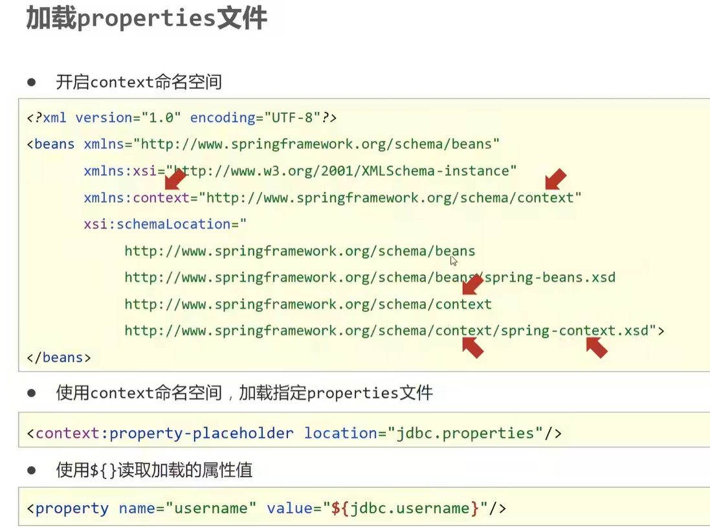
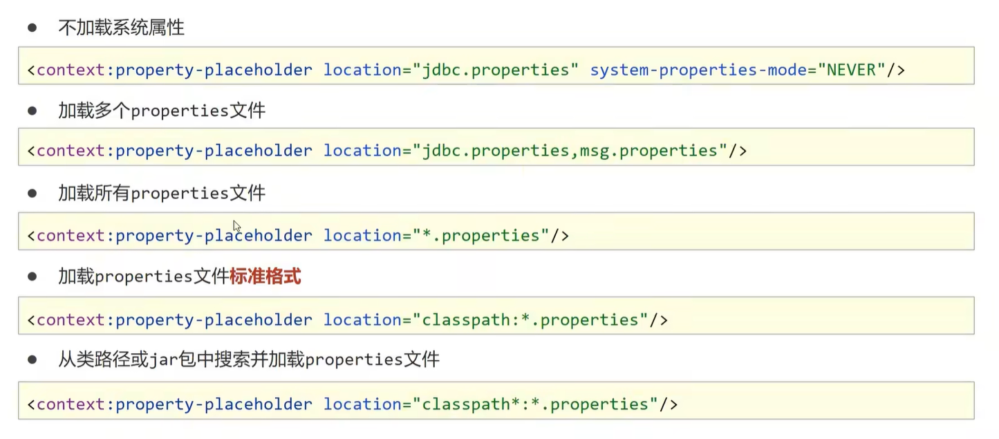
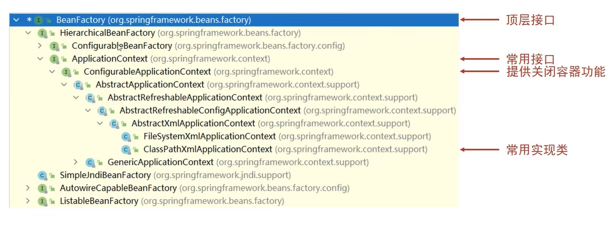
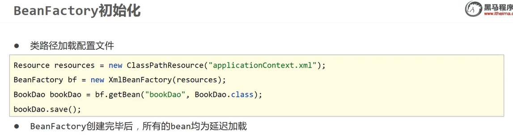
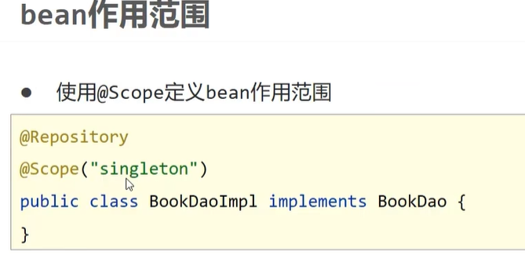
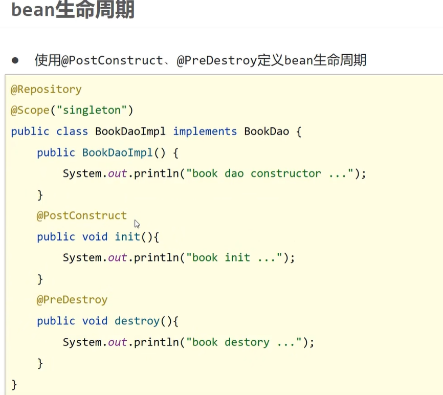
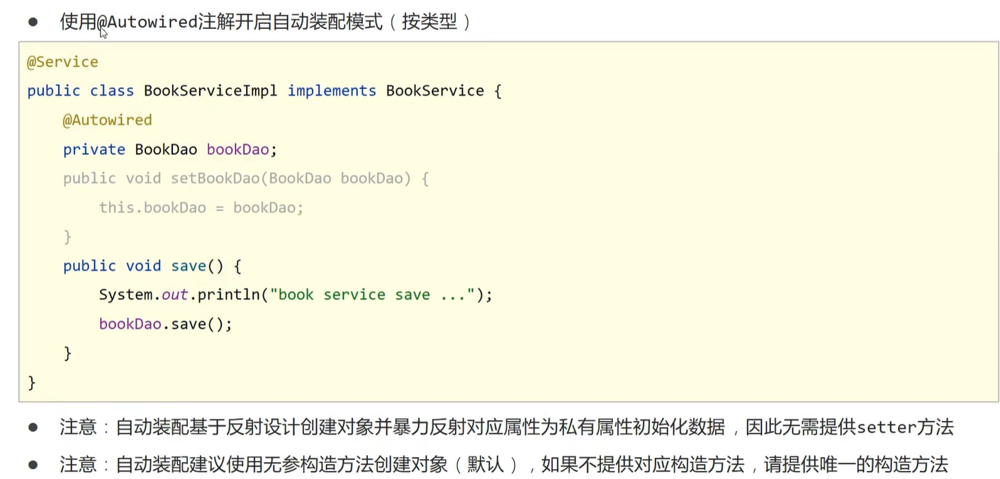
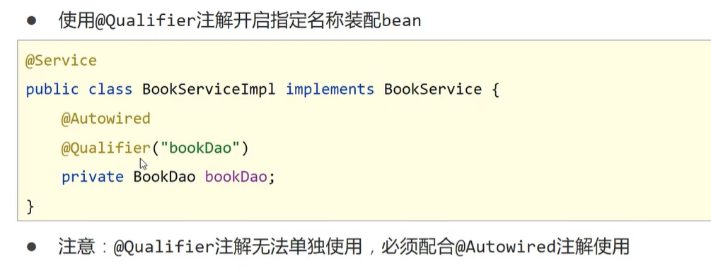
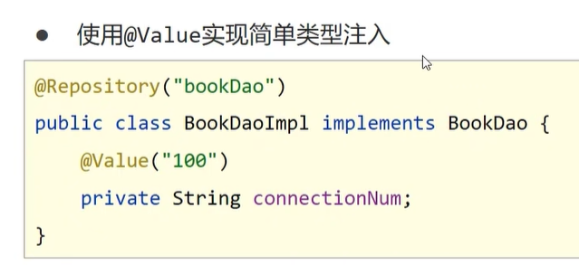
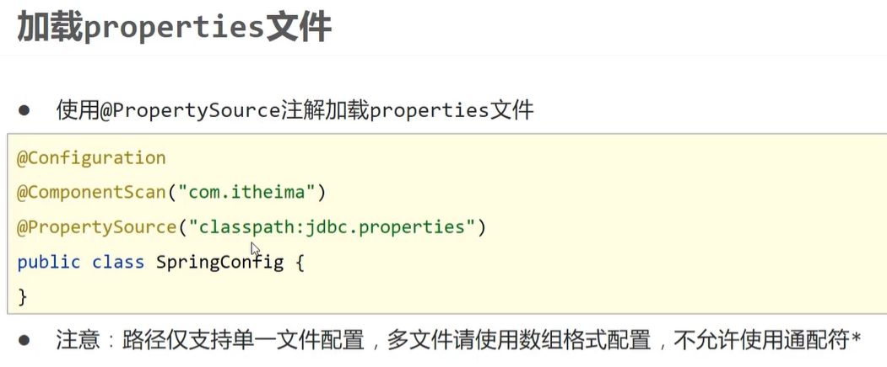

# Spring

> 鸣谢：黑马程序员
>
> 


## 一、核心容器

### 1.`IoC/DI`

#### 1.1 `IoC`

+ `IoC(Inversion of Control)`：控制反转。
+ **核心思想**：将对象的创建控制权由程序内部转移到**外部**。也就是使用对象时，在程序中不要主动使用`new`产生对象，而是转换为由外部提供对象。

#### 1.2 `IoC`容器

+ Spring提供了一个容器用来充当`IoC`思想中的**外部**，称为`IoC`容器。


---


#### 1.3 `Bean`

> [!IMPORTANT]
>
> `IoC`容器负责对象的创建、初始化等一系列工作，被创建或被管理的对象在`IoC`容器中统称为`Bean`。

##### P1 `Bean`的作用范围(`scope`)

+ **默认是单例**。

+ 适合交给容器管理的`Bean`：接口层对象、业务层对象、数据层对象、工具对象；
+ 不适合交给容器管理的`Bean`：封装实体的域对象。

##### P2 实例化`Bean`的方式

+ **常用**：提供无参构造器（`private`也可）。
+ 使用静态工厂。
+ 使用实例工厂。
+ **重点**：使用`FactoryBean`。（方式三的变种）

##### P3 `Bean`的生命周期及控制

+ `Bean`的生命周期：

  + *Step1*：**初始化容器**。
    1. 创建对象（内存分配）
    2. 执行构造器
    3. 执行属性注入（调用`setter`）
    4. 执行`bean`初始化方法

  + *Step2*：**使用`bean`**。

  + *Step3*：**关闭/销毁容器**。

+ `Bean`的生命周期控制：

  + 控制方式一：

    

  + 控制方式二：接口控制

    


##### P4 `Bean`的销毁时机

+ 容器关闭前触发`Bean`的销毁。
+ **关闭容器的方式**：
  + 手动关闭：调用`ConfigurableApplicationContext`接口的`close()`方法。
  + 注册关闭钩子，先关闭容器再退出JVM：调用`ConfigurableApplicationContext`接口的`registerShutdownHook()`方法。


---


#### 1.4 `DI`

##### P1 概述

+ `DI(Dependency Injection)`：依赖注入。

+ **核心思想**：在`IoC`容器中建立`Bean`与`Bean`之间的依赖关系。

  

+ 向一个类中传递的数据类型：
  + 简单类型：基本数据类型+`String`-->`<value>`
  + 引用类型-->`<ref>`


##### P2 依赖注入方式

+ **`setter`注入**：
  + 简单类型
  + 引用类型
+ **构造器注入**：
  + 简单类型
  + 引用类型


##### P3 如何选择依赖注入方式？

+ 具有强制依赖关系的使用构造器注入，因为使用`setter`注入有概率没有进行注入，导致`null`对象出现。
+ 具有可选依赖关系的使用`setter`注入，灵活性强。
+ Spring框架推荐使用构造器注入，第三方框架内部大多采用构造器注入的形式进行数据初始化，相对严谨。
+ 如有必要可以两者同时使用：
  + 使用构造器注入完成强制依赖关系的注入；
  + 使用`setter`注入完成可选依赖关系的注入。
+ 实际开发过程中根据实际情况分析，如果受控对象没有提供`setter`，则必须使用构造器注入。
+ 自己开发的模块**推荐**使用`setter`注入。


##### P4 依赖自动装配

+ **含义**：`IoC`容器根据`bean`所依赖的资源在容器中自动查找并注入到`bean`中。

+ **自动装配方式**：
  + 按类型（**常用**）
  + 按名称
  + 按构造器
  + 不启用自动装配
+ **注意事项**：
  + 自动装配仅用于引用类型的依赖注入，无法对简单类型进行依赖注入。
  + 使用按类型装配(`byType`)时，必须保证容器中相同类型的`bean`只有一个，开发中**推荐**使用这种方式进行自动装配。
  + 使用按名称装配(`byName`)时，必须保证容器中具有指定名称的`bean`（即`setter`方法的名字去掉`set`后的名称），因为变量名与配置高度耦合，故不推荐使用。
  + 自动装配的优先级低于`setter`注入和构造器注入，同时出现时自动装配失效。


##### P5 集合注入

+ `BookDaoImpl`:

```java
package com.zsh.dao.impl;

import com.zsh.dao.BookDao;
import java.util.*;

public class BookDaoImpl implements BookDao {

    private int[] zshArray;
    private List<String> zshList;
    private Set<String> zshSet;
    private Map<String,String> zshMap;
    private Properties zshProperties;

    public void setZshArray(int[] zshArray) {
        this.zshArray = zshArray;
    }
    public void setZshList(List<String> zshList) {
        this.zshList = zshList;
    }
    public void setZshSet(Set<String> zshSet) {
        this.zshSet = zshSet;
    }
    public void setZshMap(Map<String, String> zshMap) {
        this.zshMap = zshMap;
    }
    public void setZshProperties(Properties zshProperties) {
        this.zshProperties = zshProperties;
    }

    @Override
    public void save() {
        System.out.println("book dao save ...");
        System.out.println("traverse Array: "+ Arrays.toString(zshArray));
        System.out.println("traverse List: "+ zshList);
        System.out.println("traverse Set: "+ zshSet);
        System.out.println("traverse Map: "+ zshMap);
        System.out.println("traverse Properties: "+ zshProperties);
    }
}
```

+ `applicationContext.xml`

```xml
<?xml version="1.0" encoding="UTF-8"?>
<beans xmlns="http://www.springframework.org/schema/beans"
       xmlns:xsi="http://www.w3.org/2001/XMLSchema-instance"
       xsi:schemaLocation="http://www.springframework.org/schema/beans http://www.springframework.org/schema/beans/spring-beans.xsd">

    <bean id="bookDao" class="com.zsh.dao.impl.BookDaoImpl">
        <property name="zshArray">
            <array>
                <value>100</value>
                <value>200</value>
                <value>300</value>
            </array>
        </property>

        <property name="zshList">
            <list>
                <value>zsh</value>
                <value>zjl</value>
                <value>zxj</value>
                <value>zxj</value>
            </list>
        </property>

        <property name="zshSet">
            <set>
                <value>apple</value>
                <value>banana</value>
                <value>strawberry</value>
                <value>strawberry</value>
                <!--由于Set元素不可重复，故会自动过滤2个重复的strawberry-->
            </set>
        </property>

        <property name="zshMap">
            <map>
                <entry key="country" value="China"/>
                <entry key="province" value="Guangdong"/>
                <entry key="city" value="Swatow"/>
            </map>
        </property>

        <property name="zshProperties">
            <props>
                <prop key="name">zsh</prop>
                <prop key="sex">male</prop>
                <prop key="height">175</prop>
            </props>
        </property>
    </bean>

</beans>
```


##### P6 加载`properties`文件






---


### 2.容器基本操作

#### 2.1 创建容器

##### P1 加载配置文件的两种方式

+ **通过类路径**：`ApplicationContext context = new ClassPathXmlApplicationContext("???.xml");`
+ **通过文件路径**：`ApplicationContext context = new FileSystemXmlApplicationContext("???.xml的绝对路径或本工程下的相对路径");`

##### P2 加载多个配置文件

`ApplicationContext context = new ClassPathXmlApplicationContext("bean1.xml", "bean2.xml");`


#### 2.2 获取`bean`

+ 使用`bean`名称获取：`BookDao bookDao = (BookDao) context.getBean("bookDao")`
+ 使用`bean`名称获取并指定`bean`类型：`BookDao bookDao = context.getBean("bookDao", BookDao.class)`
+ 使用`bean`类型获取（注意该类型的`bean`在配置文件中必须是唯一的）：`BookDao bookDao = context.getBean(BookDao.class)`


#### 2.3 容器类层次结构




#### 2.4 `BeanFactory`




---


### 3.注解开发

#### 3.1 注解开发定义`bean`

##### P1 步骤

Step1：使用`@Component`定义`bean`。

```java
@Component("bookDao")
public class BookDaoImpl implements BookDao {
}

@Component
public class BookServiceImpl implements BookService {
}
```

Step2：核心配置文件中通过组件扫描加载`bean`。

```xml
<?xml version="1.0" encoding="UTF-8"?>
<beans xmlns="http://www.springframework.org/schema/beans"
       xmlns:context="http://www.springframework.org/schema/context"
       xmlns:xsi="http://www.w3.org/2001/XMLSchema-instance"
       xsi:schemaLocation="
       http://www.springframework.org/schema/beans
       http://www.springframework.org/schema/beans/spring-beans.xsd
       http://www.springframework.org/schema/context
       http://www.springframework.org/schema/context/spring-context.xsd
">
    <context:component-scan base-package="com.zsh"/>

</beans>
```


##### P2 Spring提供的三个衍生注解

> [!Tip]
>
> 功能和`@Component`一模一样，只是增强了可读性。

+ `@Controller`：用于接口层`bean`定义。
+ `@Service`：用于业务层`bean`定义。
+ `@Repository`：用于数据层`bean`定义。


---


#### 3.2 纯注解开发（`Spring3.0+`）

创建一个Java类`SpringConfig`来代替核心配置文件：

```java
package com.zsh.config;

import org.springframework.context.annotation.ComponentScan;
import org.springframework.context.annotation.Configuration;

@Configuration// 代表这是个Spring配置类
@ComponentScan("com.zsh")// 指定扫描路径，此注解只能添加一次，多个数据需用数组形式，如@ComponentScan({"com.zsh.dao", "com.zsh.service"})
public class SpringConfig {
}
```

重新编写测试类：

```java
package com.zsh;

import com.zsh.config.SpringConfig;
import com.zsh.dao.BookDao;
import com.zsh.service.BookService;
import org.springframework.context.annotation.AnnotationConfigApplicationContext;

public class AppByPureAnnotation {
    public static void main(String[] args) {
        ApplicationContext context=new AnnotationConfigApplicationContext(SpringConfig.class);

        BookDao bookDao=(BookDao) context.getBean("bookDao");
        System.out.println(bookDao);
        BookService bookService=context.getBean(BookService.class);
        System.out.println(bookService);
    }
}
```


---


#### 3.3 控制`Bean`的作用范围与生命周期






---


#### 3.4 依赖注入——自动装配

##### P1 使用`@Autowired`注解开启按类型自动装配模式



##### P2 使用`@Qualifier`注解按指定名称装配`bean`



##### P3 使用`@Value`注解注入简单类型数据



##### P4 使用`@PropertySource`注解加载属性文件




---


#### 3.5 管理第三方`bean`


---

---


## 二、数据访问与集成


---

---


## 三、`AOP`


---

---


## 四、事务


---

---


## 五、框架整合


