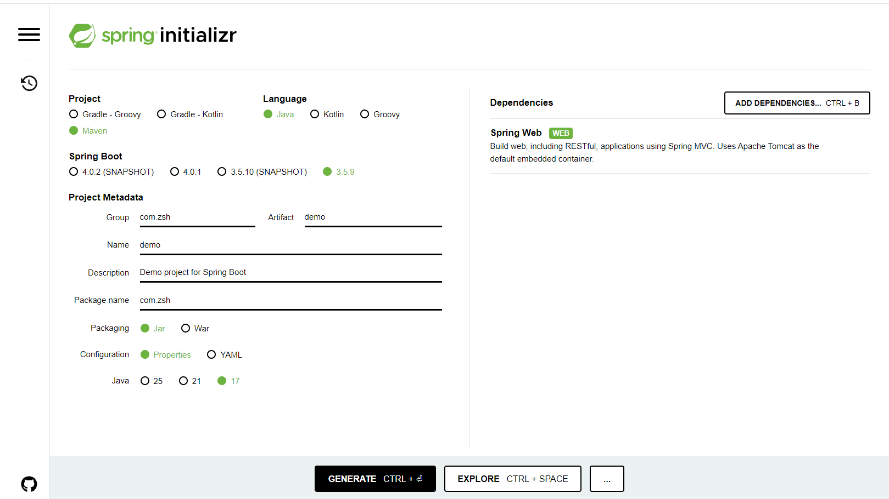
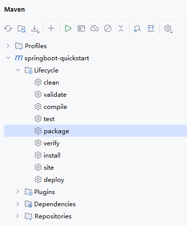
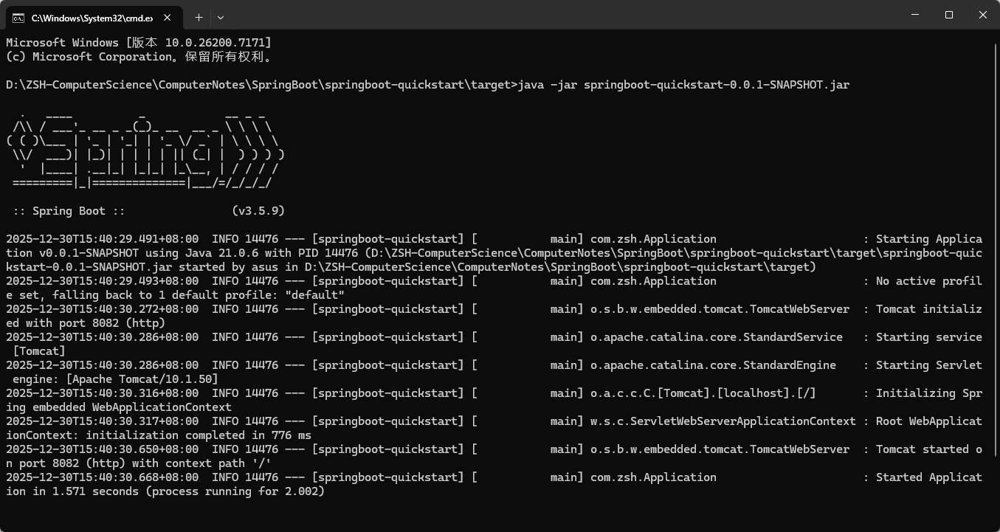
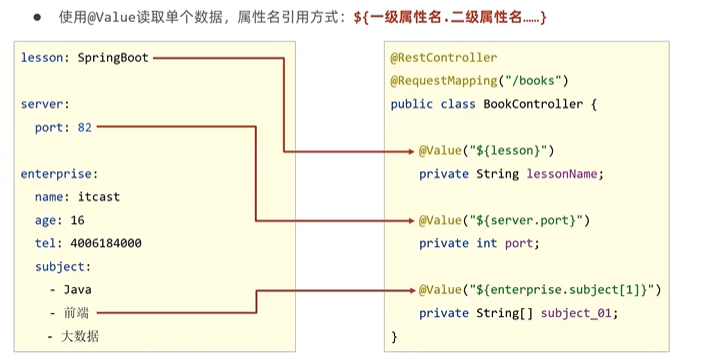
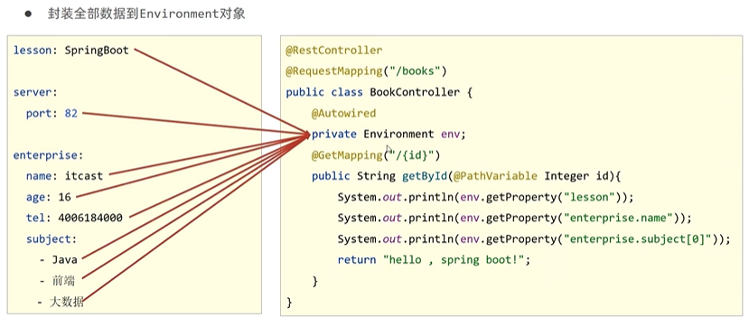
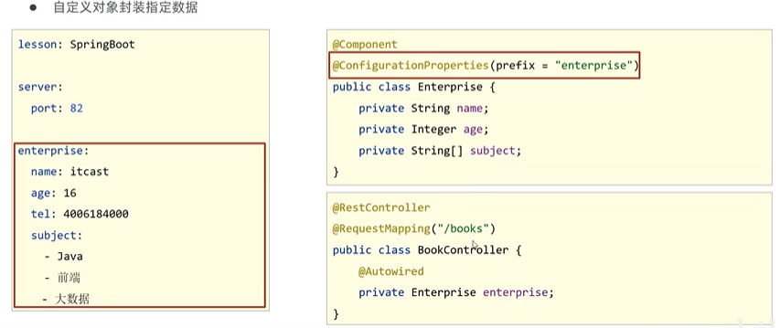
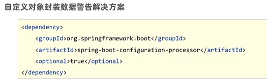

# SpringBoot

> 鸣谢：黑马程序员。（视频链接：【黑马程序员SSM框架教程_Spring+SpringMVC+Maven高级+SpringBoot+MyBatisPlus企业实用开发技术】https://www.bilibili.com/video/BV1Fi4y1S7ix?vd_source=b7f14ba5e783353d06a99352d23ebca9）


[TOC]

## 一、入门

> [!IMPORTANT]
>
> SpringBoot是Pivotal团队开发的全新框架，旨在简化Spring应用的初始搭建及开发过程。

### 1.入门案例

#### 1.1 项目信息

+ 入门案例地址：[springboot-quickstart](springboot-quickstart)

+ Intellij IDEA版本：2024.2.1


#### 1.2 开发步骤

> [!CAUTION]
>
> 基于Intellij IDEA开发SpringBoot程序必须联网，才能加载到程序框架结构。

Step1：创建新工程，在左侧栏目选择`Spring Boot`，右侧指定工程相关基础信息：

+ `Name`和`Location`自定义。
+ `Type`要选择`Maven`。
+ `Package name`修改为`com.zsh`。
+ `Packaging`选择`Jar`即可。


Step2：选择`Spring Boot`版本，勾选项目需要的技术栈，此处为`Dependencies-Web-Spring Web`。


Step3：点击`Create`创建工程，可得如下项目结构。


Step4：在`src/main/java/com.zsh`下新建`controller`包，开发控制器类`BookController`。

```java
package com.zsh.controller;

import org.springframework.web.bind.annotation.*;

@RestController
@RequestMapping("/books")
public class BookController {

    @GetMapping("/{id}")
    public String getById(@PathVariable Integer id) {
        System.out.println("id ==> " + id);
        return "hello springboot";
    }
}
```

Step5：假如8080端口已被占用，则修改`src/main/resources`下的`application.properties`文件，修改`Tomcat`的默认端口，此处我改为8082。

```properties
spring.application.name=springboot-quickstart
server.port=8082
```

Step5：启动系统自动生成的`Application`类，入门案例开发完毕。


---


#### 1.3 最简SpringBoot程序包含的基础文件

+ `pom.xml`:

  ```xml
  <?xml version="1.0" encoding="UTF-8"?>
  <project xmlns="http://maven.apache.org/POM/4.0.0" xmlns:xsi="http://www.w3.org/2001/XMLSchema-instance"
           xsi:schemaLocation="http://maven.apache.org/POM/4.0.0 https://maven.apache.org/xsd/maven-4.0.0.xsd">
      <modelVersion>4.0.0</modelVersion>
      <parent>
          <groupId>org.springframework.boot</groupId>
          <artifactId>spring-boot-starter-parent</artifactId>
          <version>3.5.9</version>
          <relativePath/> <!-- lookup parent from repository -->
      </parent>
      <groupId>com.zsh</groupId>
      <artifactId>springboot-quickstart</artifactId>
      <version>0.0.1-SNAPSHOT</version>
  
      <properties>
          <java.version>17</java.version>
      </properties>
  
      <dependencies>
          <dependency>
              <groupId>org.springframework.boot</groupId>
              <artifactId>spring-boot-starter-web</artifactId>
          </dependency>
          <dependency>
              <groupId>org.springframework.boot</groupId>
              <artifactId>spring-boot-starter-test</artifactId>
              <scope>test</scope>
          </dependency>
      </dependencies>
  
      <build>
          <plugins>
              <plugin>
                  <groupId>org.springframework.boot</groupId>
                  <artifactId>spring-boot-maven-plugin</artifactId>
              </plugin>
          </plugins>
      </build>
  
  </project>
  ```

+ `Application`类:

  ```java
  package com.zsh;
  
  import org.springframework.boot.SpringApplication;
  import org.springframework.boot.autoconfigure.SpringBootApplication;
  
  @SpringBootApplication
  public class Application {
  
      public static void main(String[] args) {
         SpringApplication.run(Application.class, args);
      }
  
  }
  ```


#### 1.4 Spring程序与SpringBoot程序对比

|         类/配置文件         |  Spring  | SpringBoot |
| :-------------------------: | :------: | :--------: |
|    `pom.xml`中的依赖坐标    | 手动添加 |  勾选添加  |
| web3.0配置类`ServletConfig` | 手动开发 |     无     |
|   Spring/SpringMVC配置类    | 手动开发 |     无     |
|           控制器            | 手动开发 |  手动开发  |


#### 1.5 通过Spring官网创建SpringBoot工程

+ [Spring官网-创建SpringBoot工程](https://start.spring.io/)




#### 1.6 SpringBoot程序快速启动

> [!CAUTION]
>
> jar包支持命令行启动需要依赖于maven插件的支持(`pom.xml`)，打包前请确认该插件是否存在：
>
> ```xml
> <build>
>     <plugins>
>         <plugin>
>             <groupId>org.springframework.boot</groupId>
>             <artifactId>spring-boot-maven-plugin</artifactId>
>         </plugin>
>     </plugins>
> </build>
> ```

Step1：通过Maven构建指令`package`，把SpringBoot项目打包成`jar`。



Step2：在项目`jar`包所处目录输入`cmd`，执行启动指令`java -jar xxx.jar`。




---


### 2.简介

#### 2.1 评价

+ Spring程序的**缺点**：
  + 配置繁琐
  + 依赖设置繁琐
+ SpringBoot程序的**优点**：
  + 自动配置
  + 起步依赖（简化依赖配置）
  + 辅助功能（内置`Tomcat`服务器，……）


#### 2.2 起步依赖

- `starter`：SpringBoot中常见依赖名称，定义了当前项目使用的所有依赖坐标，以达到**减少依赖配置**的目的。
- `parent`：所有SpringBoot项目要继承的项目，定义了若干个坐标版本号（依赖管理，而非依赖）, 以达到**减少依赖冲突**的目的。
- 实际开发中：使用任意坐标时，仅书写GAV中的GA, V由SpringBoot提供；如发生坐标错误，再指定V（要小心版本冲突）。


#### 2.3 切换Web服务器

示例：切换成Jetty服务器，比Tomcat服务器更轻量级，可扩展性更强。

```xml
<dependencies>
    <dependency>
        <groupId>org.springframework.boot</groupId>
        <artifactId>spring-boot-starter-web</artifactId>
        <!--排除依赖：Tomcat-->
        <exclusions>
            <exclusion>
                <groupId>org.springframework.boot</groupId>
                <artifactId>spring-boot-starter-tomcat</artifactId>
            </exclusion>
        </exclusions>
    </dependency>

    <dependency>
        <groupId>org.springframework.boot</groupId>
        <artifactId>spring-boot-starter-jetty</artifactId>
    </dependency>

    <dependency>
        <groupId>org.springframework.boot</groupId>
        <artifactId>spring-boot-starter-test</artifactId>
        <scope>test</scope>
    </dependency>
</dependencies>
```


---

---


## 二、基础配置

### 1.配置文件格式

#### 1.1 修改服务器端口

> [!Tip]
>
> yml和yaml是同一个东西，没有本质区别——yml只是yaml的简写。

##### P1 `application.properties`

```properties
server.port=80
```

##### P2 `application.yml`

```yml
server:
	port: 81  #port和81之间必须有空格
```

##### P3 `application.yaml`

```yaml
server:
	port: 82  #port和82之间必须有空格
```

##### P4 配置文件优先级

当以上三种格式的配置文件同时存在时，properties>yml>yaml。


---


### 2.YAML

#### 2.1 概述

+ YAML(YAML Ain’t Markup Language)：递归缩写，强调它不是标记语言，而是一种**人类可读的数据序列化格式**。
+ **优点**：
  + 可读性强
  + 容易与脚本语言交互
  + 以数据为核心，重数据轻格式。
+ YAML文件扩展名：`.yml`（主流）、`.yaml`。


#### 2.2 语法规则

+ 大小写敏感。
+ 属性层级关系使用多行描述，每行结尾使用冒号结束。
+ 使用缩进表示层级关系，同层级左侧对齐，只允许使用空格（空格数无规定），**不允许使用Tab键**。
+ 属性值前面必须添加空格，属性名与属性值之间使用`: `作为分隔。
+ #表示注释。

示例如下：

```yaml
enterprise:
  name: zsh
  age: 18
  tel: 83225361
```

数组形式：

```yaml
hobbies:
  - sing
  - dance
  - rap
```


#### 2.3 YAML数据读取方式

##### P1 使用`@Value`读取单个数据



##### P2 封装全部数据到`Environment`对象



##### P3 创建自定义实体类封装指定数据






---


### 3.多环境启动


---


### 4.配置文件分类


---

---


## 三、整合第三方框架


