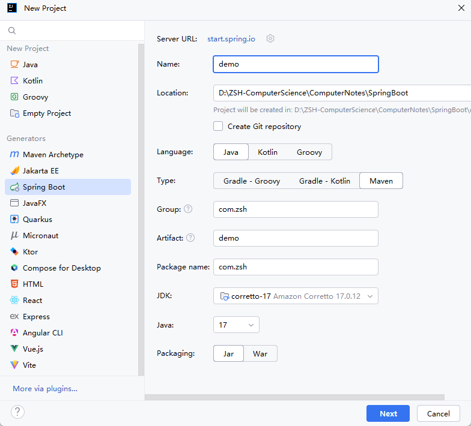
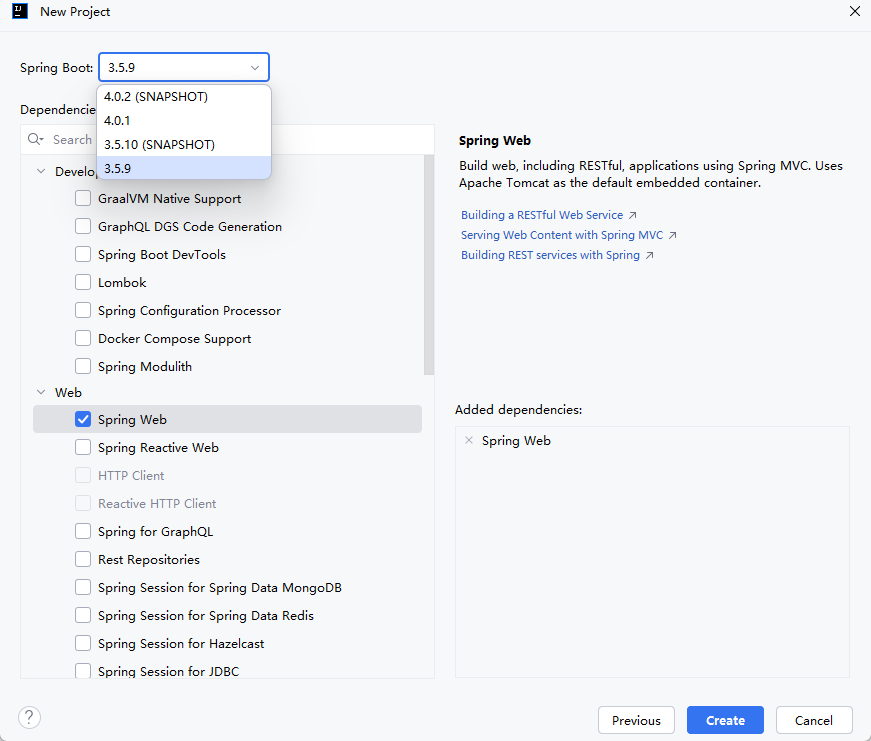
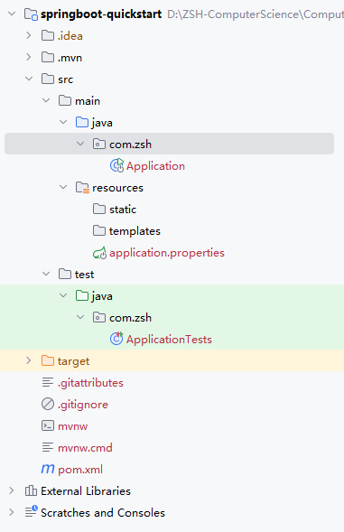
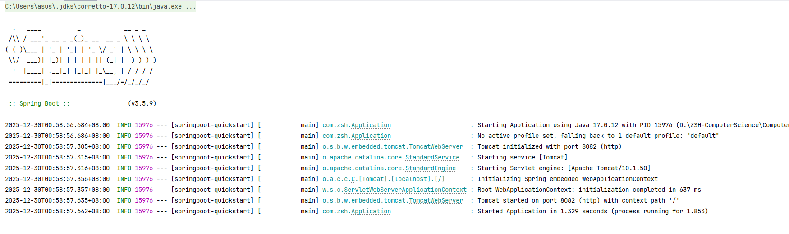

# SpringBoot

> 鸣谢：黑马程序员。（视频链接：【黑马程序员SSM框架教程_Spring+SpringMVC+Maven高级+SpringBoot+MyBatisPlus企业实用开发技术】https://www.bilibili.com/video/BV1Fi4y1S7ix?vd_source=b7f14ba5e783353d06a99352d23ebca9）


[TOC]

## 一、入门

> [!IMPORTANT]
>
> SpringBoot是Pivotal团队开发的全新框架，旨在简化Spring应用的初始搭建及开发过程。

### 1.入门案例

#### 1.1 项目信息

+ 入门案例地址：[springboot-quickstart](springboot-quickstart)

+ Intellij IDEA版本：2024.2.1

#### 1.2 开发步骤

Step1：创建新工程，在左侧栏目选择`Spring Boot`，右侧指定工程相关基础信息：

+ `Name`和`Location`自定义。
+ `Type`要选择`Maven`。
+ `Package name`修改为`com.zsh`。
+ `Packaging`选择`Jar`即可。



Step2：选择`Spring Boot`版本，勾选项目需要的技术栈，此处为`Dependencies-Web-Spring Web`。



Step3：点击`Create`创建工程，可得如下项目结构。



Step4：在`src/main/java/com.zsh`下新建`controller`包，开发控制器类`BookController`。

```java
package com.zsh.controller;

import org.springframework.web.bind.annotation.*;

@RestController
@RequestMapping("/books")
public class BookController {

    @GetMapping("/{id}")
    public String getById(@PathVariable Integer id) {
        System.out.println("id ==> " + id);
        return "hello springboot";
    }
}
```

Step5：假如8080端口已被占用，则修改`src/main/resources`下的`application.properties`文件，修改`Tomcat`的默认端口，此处我改为8082。

```properties
spring.application.name=springboot-quickstart
server.port=8082
```

Step5：启动系统自动生成的`Application`类，入门案例开发完毕。




---

---


## 二、基础配置


---

---


## 三、整合第三方框架
