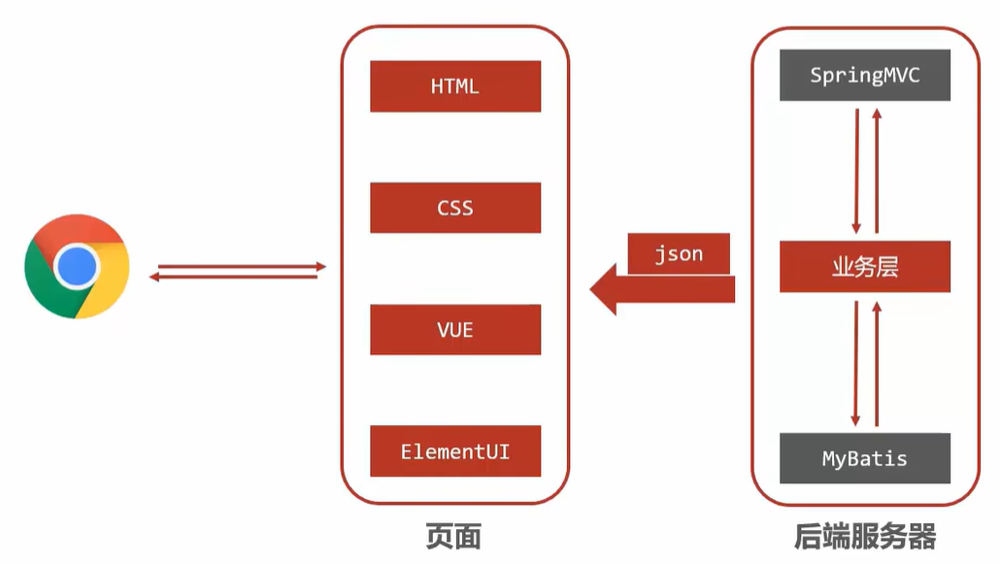
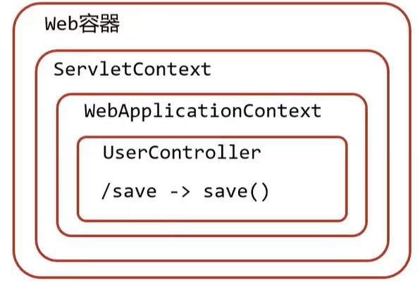

# SpringMVC

> 鸣谢：黑马程序员
>
> 


[TOC]


## 一、MVC

### 1.概述

+ MVC(Model-View-Controller)是一种广泛使用的软件架构模式，用于组织应用程序的代码结构，使其更加模块化，增强软件系统的可维护性和可扩展性。
+ MVC将应用程序分为3个主要组件：Model（模型）、View（视图）和Controller（控制器）。


### 2.组件职能


*图源：https://medium.com/@sadikarahmantanisha/the-mvc-architecture-97d47e071eb2*

#### 2.1 模型

+ 模型是MVC架构中的**核心**。
+ 主要负责数据和业务逻辑：
  + 与数据库或其他数据源交互，处理数据的CRUD操作。
+ 模型与视图和控制器相互独立，不直接与用户界面相关联。
+ 模型的变化通常由控制器触发，并最终反映到视图中。

#### 2.2 视图

+ 视图是MVC架构中的**表现层**。
+ 主要负责将模型中的数据以用户可见的形式展示到用户界面：
  + 接收控制器传递的数据，进行展示和简单格式化。
+ 视图通常是静态的，不包含业务逻辑。

#### 2.3 控制器

+ 控制器是模型和视图的**中介**。
+ 主要负责处理用户请求：
  + 接收用户请求（如点击、表单提交），并调用相应的模型方法处理数据，根据处理结果选择合适的视图，并将数据传递给视图进行展示。


---

---


## 二、SpringMVC入门

> [!Tip]
>
> SpringMVC技术与Servlet技术等同，均属于Web层（别名：表现层、接口层）开发技术，前者明显优于后者。

### 1.概述




+ SpringMVC是一种基于Java实现MVC软件架构模型的轻量级**Web框架（别名：表现层框架、接口层框架）**。

+ 优点：使用简单，开发便捷，灵活性强。


---


### 2.入门案例

#### 2.1 使用SpringMVC技术需要先导入SpringMVC坐标与Servlet坐标

```xml
<!--1.导入SpringMVC与Servlet的坐标-->
<dependency>
  <groupId>javax.servlet</groupId>
  <artifactId>javax.servlet-api</artifactId>
  <version>版本</version>
  <scope>provided</scope>
</dependency>
<dependency>
  <groupId>org.springframework</groupId>
  <artifactId>spring-webmvc</artifactId>
  <version>版本</version>
</dependency>
```

#### 2.2 创建SpringMVC控制器类

```java
// 2.定义controller
@Controller// 使用@Controller来定义bean
public class UserController {

    @RequestMapping("/save")// 设置当前操作的访问路径
    @ResponseBody// 将方法返回值设置为当前操作的响应体
    public String save(){
        System.out.println("user save ...");
        return "{'module':'springmvc'}";
    }
}
```

#### 2.3 初始化SpringMVC环境，让SpringMVC加载对应的`bean`

```java
// 3.创建SpringMVC的配置文件，加载Controller对应的bean
@Configuration
@ComponentScan("com.zsh.controller")
public class SpringMvcConfig {
}
```

#### 2.4 初始化Servlet容器，加载SpringMVC环境，并设置SpringMVC要处理的请求

```java
// 4.定义一个Servlet容器启动的配置类，在里面加载SpringMVC的配置
public class ServletContainerInitConfig extends AbstractDispatcherServletInitializer{
    @Override
    // 加载SpringMVC容器配置
    protected WebApplicationContext createServletApplicationContext() {
        AnnotationConfigWebApplicationContext context=new AnnotationConfigWebApplicationContext();// 注意类名不要写错，有个Web 
        context.register(SpringMvcConfig.class);
        return context;
    }

    @Override
    // 设置哪些请求交由SpringMVC处理
    protected String[] getServletMappings() {
        return new String[]{"/"};
    }

    @Override
    // 加载Spring容器配置
    protected WebApplicationContext createRootApplicationContext() {
        return null;
    }
}
```


---


### 3.入门案例的工作流程

#### 3.1 启动服务器并初始化



1. 服务器启动，执行`ServletContainerInitConfig`类，初始化Web容器。
2. 执行`ServletContainerInitConfig`类中的`createServletApplicationContext()`方法，创建一个`WebApplicationContext`对象。
3. 加载`SpringMvcConfig`类。
4. 通过`SpringMvcConfig`类中的`@ComponentScan`注解加载对应的`bean`。
5. 加载`UserController`类，每个`@RequestMapping`的名称对应一个具体方法。
6. 执行`ServletContainerInitConfig`类中的`getServletMappings()`方法，设置所有请求都交由SpringMVC处理。

#### 3.2 单次请求

1. 发送请求`localhost:8082/save`。（8082是我设置的`Tomcat`端口，可以自定义修改）
2. Web容器将所有请求都交由SpringMVC处理。
3. 解析请求路径`/save`。
4. `/save`映射到对应方法`save()`。
5. 执行`save()`方法。
6. 检测到`save()`方法带有`@ResponseBody`注解，直接将`save()`方法的返回值作为响应体返回给请求方。


---


### 4.同时加载Spring和SpringMVC

#### 4.1 重构`ServletContainerInitConfig`类

```java
public class ServletContainerInitConfig extends AbstractDispatcherServletInitializer{
    @Override
    protected WebApplicationContext createRootApplicationContext() {// Root
        AnnotationConfigWebApplicationContext context=new AnnotationConfigWebApplicationContext();
        context.register(SpringConfig.class);// 加载Spring
        return context;
    }
    
    @Override
    protected WebApplicationContext createServletApplicationContext() {// Servlet
        AnnotationConfigWebApplicationContext context=new AnnotationConfigWebApplicationContext();
        context.register(SpringMvcConfig.class);// 加载SpringMVC
        return context;
    }
    
    @Override
    protected String[] getServletMappings() {
        return new String[]{"/"};
    }
}
```


#### 4.2 `Controller`与业务`Bean`的加载控制

+ SpringMVC加载的`bean`均在`com.zsh.controller`包内。

+ 如何避免Spring错误加载SpringMVC控制的`bean`？

  + **方式一（推荐）**：Spring加载的`bean`设定扫描范围为精确范围。如`@ComponentScan({"com.zsh.service", "com.zsh.dao"})`。

  + **方式二**：Spring加载的`bean`设定扫描范围为`com.zsh`，同时排除掉`controller`包内的`bean`。

    ```java
    // @Configuration这个注解必须去掉，否则过滤无效
    @ComponentScan("com.zsh.controller")
    public class SpringMvcConfig {
    }
    ```

    ```java
    @Configuration
    @Component(value = "com.zsh", 
    	excludeFilters = @ComponentScan.Filter(
    		type = FilterType.ANNOTATION,// 按注解过滤
    		classes = Controller.class// 过滤掉带@Controller注解的bean
    	)
    )
    public class SpringConfig {
    }
    ```

  + **方式三**：不区分Spring与SpringMVC的环境，加载到同一环境中。

    

 

#### 4.3 简化4.1代码

```java
public class ServletContainerInitConfig extends AbstractAnnotationConfigDispatcherServletInitializer{
    
   	@Override
    protected Class<?>[] getRootConfigClasses() {
        return new Class[]{SpringConfig.class};
    }
    
    @Override
    protected Class<?>[] getServletConfigClasses() {
        return new Class[]{SpringMvcConfig.class};
    }

    @Override
    protected String[] getServletMappings() {
        return new String[]{"/"};
    }
}
```


---


### 5.Postman

+ Postman是一款功能强大的用于网页调试和发送网页HTTP请求的Chrome插件，常用于进行接口测试。
+ **特征**：简单、实用、美观、大方。


---

---


## 三、请求与响应

### 1.请求映射路径


---


### 2.请求参数


---


### 3.日期类型参数传递


---


### 4.响应json数据


