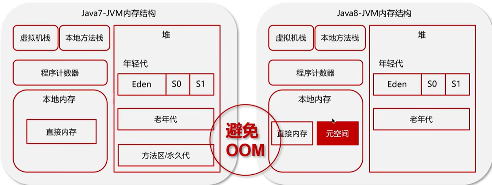

# JVM Q&A

Q1：程序计数器是什么？

程序计数器是每个线程私有的、内部保存的字节码的行号，用于记录正在执行的字节码指令的地址。

Q2：你能详细介绍一下JVM堆吗？

+ JVM堆是线程共享的区域，主要用来保存对象实例、数组等，堆内存不够会抛出OutOfMemory(OOM)异常。
+ JVM堆采用分代模型，主要分为以下两个部分：
  + **新生代**：新生代分为三个区域，Eden区是新对象的创建区域，S0和S1是幸存者区，用于存放经过垃圾回收后仍然存活的对象。
  + **老年代**：存储生命周期长的对象。当新生代的对象经过多次垃圾回收后仍然存活时，会被移动到老年代。
+ JDK8前后，JVM堆的区别：
  + JDK8之前，JVM堆中有一个**永久代**，存储的是类信息、静态变量、常量和编译后的代码。
  + 从JDK8开始，JVM堆移除了永久代，将原本存储在永久代中的数据迁移到了本地内存中的**元空间**，以避免OOM异常。

Q3：什么是虚拟机栈？

+ 虚拟机栈指的是每个线程运行时所需要的内存。
+ 每个虚拟机栈由多个栈帧组成，每个栈帧对应着每次方法调用时所占用的内存。
+ 每个线程只能有一个活动栈帧，对应着当前正在执行的方法。

Q4：垃圾回收是否涉及栈内存？

垃圾回收主要针对堆内存，不涉及栈内存。当一个虚拟机栈的所有栈帧都弹栈后，这个栈所占用的内存就自动释放了。

Q5：栈内存分配越大越好吗？

不一定，默认的栈内存是1MB，每个栈分配的内存过大会导致可用线程数变少。

Q6：方法内的局部变量是否线程安全？

+ 如果方法内的局部变量是基本数据类型，且没有逃离方法的作用范围，则它是线程安全的。
+ 如果方法内的局部变量是引用数据类型：
  + 如果这个对象是在方法内部创建的，且没有逃离方法的作用范围，则它是线程安全的。
  + 如果这个对象是外部传入的，或者逃离了方法的作用范围，则需要考虑线程安全问题。

Q7：什么情况下会导致栈内存溢出？

+ 栈帧过多导致栈内存溢出，典型问题是递归调用过深。
+ 栈帧过大导致栈内存溢出，比较少见。

Q8：堆和栈的区别是什么？

+ 堆内存用来存储Java对象和数组等，具备垃圾回收机制；栈内存一般用来存储局部变量和方法调用，不需要垃圾回收。
+ 堆内存是线程共享的，栈内存是线程私有的。
+ 堆内存不足抛出OutOfMemory异常，栈内存不足抛出StackOverflow异常。

Q9：你能不能解释一下方法区？

+ 方法区是各个线程共享的内存区域，主要存储了类信息、字段信息、方法信息、运行时常量池和静态变量。
+ 方法区在JVM启动时创建，在JVM关闭时释放。
+ 在JVM中，方法区是一个逻辑概念，而永生代和元空间是方法区在不同时期的具体实现。
+ 如果方法区内存无法满足分配请求，则会抛出OutOfMemoryError: Metaspace。

Q9：介绍一下运行时常量池？

+ 常量池可以看作是一张常量表，字节码指令根据这张常量表找到要执行的类名、方法名、参数类型、字面量等信息。
+ 当类被加载后，它在常量池中的信息就会放入运行时常量池，并把里面的符号地址替换为真实地址。

Q10：直接内存是什么？

+ 直接内存是JVM向操作系统临时借用的一块系统内存，不由JVM进行管理。
+ 直接内存允许Java程序直接操作电脑的物理内存，跳过“系统内存拷贝到JVM堆内存”这一步，常见于NIO(New I/O)操作。
+ 直接内存的分配和回收成本较高，但读写性能高，不受JVM垃圾回收管理，容易导致内存泄露。

