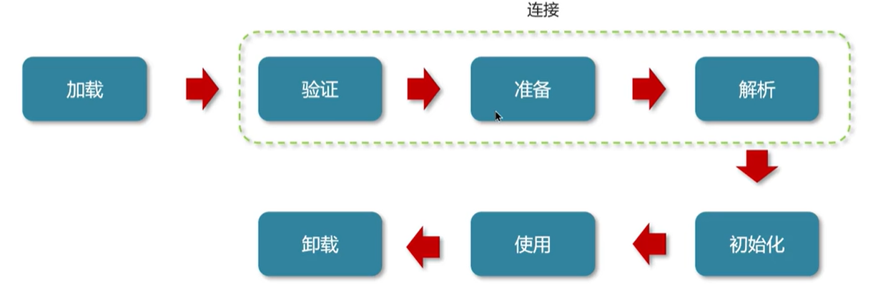
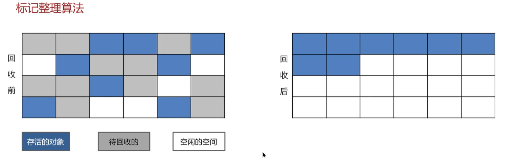
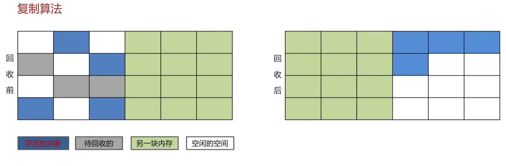
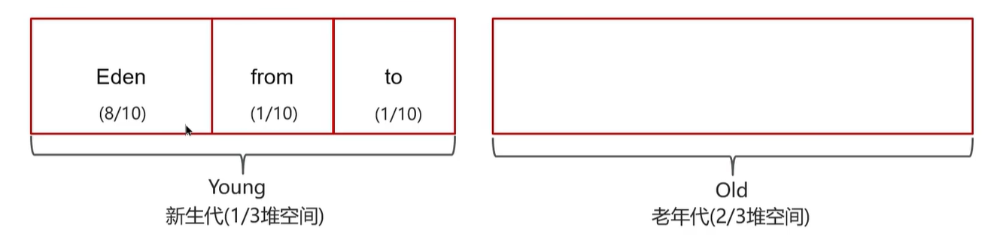

# JVM Q&A

### Q1：程序计数器是什么？

程序计数器是每个线程私有的、内部保存的字节码的行号，用于记录正在执行的字节码指令的地址。

### Q2：你能详细介绍一下JVM堆吗？

+ JVM堆是线程共享的区域，主要用来保存对象实例、数组等，堆内存不够会抛出OutOfMemory(OOM)异常。
+ JVM堆采用分代模型，主要分为以下两个部分：
  + **新生代**：新生代分为三个区域，Eden区是新对象的创建区域，S0和S1是幸存者区，用于存放经过垃圾回收后仍然存活的对象。
  + **老年代**：存储生命周期长的对象。当新生代的对象经过多次垃圾回收后仍然存活时，会被移动到老年代。
+ JDK8前后，JVM堆的区别：
  + JDK8之前，JVM堆中有一个**永久代**，存储的是类信息、静态变量、常量和编译后的代码。
  + 从JDK8开始，JVM堆移除了永久代，将原本存储在永久代中的数据迁移到了本地内存中的**元空间**，以避免OOM异常。

### Q3：什么是虚拟机栈？

+ 虚拟机栈指的是每个线程运行时所需要的内存。
+ 每个虚拟机栈由多个栈帧组成，每个栈帧对应着每次方法调用时所占用的内存。
+ 每个线程只能有一个活动栈帧，对应着当前正在执行的方法。

### Q4：垃圾回收是否涉及栈内存？

垃圾回收主要针对堆内存，不涉及栈内存。当一个虚拟机栈的所有栈帧都弹栈后，这个栈所占用的内存就自动释放了。

### Q5：栈内存分配越大越好吗？

不一定，默认的栈内存是1MB，每个栈分配的内存过大会导致可用线程数变少。

### Q6：方法内的局部变量是否线程安全？

+ 如果方法内的局部变量是基本数据类型，且没有逃离方法的作用范围，则它是线程安全的。
+ 如果方法内的局部变量是引用数据类型：
  + 如果这个对象是在方法内部创建的，且没有逃离方法的作用范围，则它是线程安全的。
  + 如果这个对象是外部传入的，或者逃离了方法的作用范围，则需要考虑线程安全问题。

### Q7：什么情况下会导致栈内存溢出？

+ 栈帧过多导致栈内存溢出，典型问题是递归调用过深。
+ 栈帧过大导致栈内存溢出，比较少见。

### Q8：堆和栈的区别是什么？

+ 堆内存用来存储Java对象和数组等，具备垃圾回收机制；栈内存一般用来存储局部变量和方法调用，不需要垃圾回收。
+ 堆内存是线程共享的，栈内存是线程私有的。
+ 堆内存不足抛出OutOfMemory异常，栈内存不足抛出StackOverflow异常。

### Q9：你能不能解释一下方法区？

+ 方法区是各个线程共享的内存区域，主要存储了类信息、字段信息、方法信息、运行时常量池和静态变量。
+ 方法区在JVM启动时创建，在JVM关闭时释放。
+ 在JVM中，方法区是一个逻辑概念，而永生代和元空间是方法区在不同时期的具体实现。
+ 如果方法区内存无法满足分配请求，则会抛出OutOfMemoryError: Metaspace。

### Q9：介绍一下运行时常量池？

+ 常量池可以看作是一张常量表，字节码指令根据这张常量表找到要执行的类名、方法名、参数类型、字面量等信息。
+ 当类被加载后，它在常量池中的信息就会放入运行时常量池，并把里面的符号地址替换为真实地址。

### Q10：直接内存是什么？

+ 直接内存是JVM向操作系统临时借用的一块系统内存，不由JVM进行管理。
+ 直接内存允许Java程序直接操作电脑的物理内存，跳过“系统内存拷贝到JVM堆内存”这一步，常见于NIO(New I/O)操作。
+ 直接内存的分配和回收成本较高，但读写性能高，不受JVM垃圾回收管理，容易导致内存泄露。

### Q11：什么是类加载器？

JVM只会运行二进制文件，类加载器的作用就是将字节码文件加载到JVM中，让Java程序能够启动起来。

### Q12：类加载器有哪些？

JVM的类加载器默认分为三层类加载器：启动类加载器、扩展类加载器、应用程序类加载器，同时JVM还支持自定义类加载器，可以实现自定义类加载规则。

JVM内置的三大类加载器，从顶层父类到底层子类依次为：

+ `Bootstrap ClassLoader`：启动类加载器。由C/C++编写，加载Java核心类库，即`JAVA_HOME/jre/lib`目录下的核心jar包。
+ `Extension ClassLoader`：扩展类加载器。加载Java扩展类库，即`JAVA_HOME/jre/lib/ext`目录下的jar包。
+ `Application ClassLoader`：应用类加载器。这是日常开发中最常用的类加载器，加载开发者自己编写的Java类。

### Q13：什么是双亲委派模型？

加载某一个类前，先委托上一级类加载器进行加载，如果上级类加载器也有上级，则继续向上委托直到顶层类加载器。只有当这个类委托上级后没有被加载，子类加载器才会尝试加载该类。

### Q14：JVM为什么采用双亲委派模型？

+ 通过双亲委派可以避免一个类被重复加载，当父类加载器已经加载后，子类加载器无需重复加载，保证这个类的唯一性。
+ 为了安全，保证Java核心类库API不会被替换。Java最核心的类，比如`java.lang.String`都是由启动类加载器加载的，如果没有双亲委派，开发者自己写一个`java.lang.String`并让它被应用类加载器加载，会直接替换掉JDK的原生`String`，导致整个系统被恶意代码劫持。

### Q15：说一下类装载的执行过程？

+ **加载**：通过类的全名获取类的二进制数据流，将类的二进制数据流解析为方法区内的数据结构（Java类模型），创建这个类的`Class`对象表示该类型，作为方法区这个类的各种数据的访问入口。
+ **验证**：验证类是否符合JVM规范，包括文件格式验证、元数据验证、字节码验证、符号引用验证。
+ **准备**：为类静态变量分配内存并设置类静态变量的默认初始值。
  + `static`变量：分配内存在准备阶段完成，赋值在初始化阶段完成。
  + `static final`基本类型变量及字符串常量：因为值已经确定，所以分配内存和赋值都在准备阶段完成。
  + `static final`引用类型变量：分配内存在准备阶段完成，赋值在初始化阶段完成。
+ **解析**：把类中的符号引用转换为直接引用。
+ **初始化**：对类的静态变量、静态代码块进行初始化操作。
  + 如果初始化一个类时，其父类尚未初始化，则先初始化其父类。
  + 如果这个类包含多个静态变量和静态代码块，则按照自上而下的顺序依次初始化。
+ **使用**：JVM从入口方法开始执行用户的程序代码，调用类的静态成员信息，并使用new关键字为这些类创建对象实例。
+ **卸载**：当用户的程序代码执行完毕后，JVM开始销毁创建过的`Class`对象和它在方法区里的数据结构。

### Q16：对象什么时候可以被垃圾回收？

如果一个对象不再被任何地方引用了，那么这个对象就被标记成了垃圾，有可能被垃圾回收器回收。

标记垃圾的方式有2种：

+ 引用计数法：给每个对象加个计数器，有地方引用它就+1，引用失效就-1，计数器为0就代表这个对象可以回收。
  + **缺陷**：当对象之间出现了**循环引用**，则引用计数法会失效。
+ 可达性分析算法（现代JVM采用的方式）：以一些`GC Roots`为起点，沿着引用链向下搜索，能被搜索到的对象标记为“可达”，存活下来；搜索不到的对象标记为“不可达”，可以回收掉。

### Q17：哪些对象可以作为`GC Roots`？为什么？

+ 虚拟机栈中引用的对象，比如方法内的局部变量、方法参数。
+ 本地方法栈(JNI)中引用的对象。
+ 方法区中类静态变量(`static`)引用的对象。
+ 方法区中常量(`static final`)引用的对象。
+ 被同步锁持有的对象（`synchronized`锁住的对象）。

这些对象之所以可以作为`GC Roots`，是因为它们生命周期长，是程序运行过程期间必须存活、由系统管控、不能随便回收的对象，是整个引用链的起点。

### Q18：JVM的垃圾回收算法有哪些？

| 算法          | 内容                                                         | 优点                                                   | 缺点                                                         |
| ------------- | ------------------------------------------------------------ | ------------------------------------------------------ | ------------------------------------------------------------ |
| 标记-清除算法 | 标记可达性分析算法计算出的存活对象， 然后统一清除未标记的垃圾对象 | 实现简单，逻辑清晰                                     | 会导致严重的内存碎片化问题， 可能无法为大对象分配连贯空间 |
| 标记-整理算法 | 标记可达性分析算法计算出的存活对象， 将所有存活对象向内存一端紧凑移动， 然后直接清除掉边界以外的内存 | 不会产生内存碎片， 内存利用率接近100%             | 移动对象开销大，需更新所有引用                               |
| 标记-复制算法 | 把内存分成两块相等区域，只使用其中一块， 用满了就把存活对象复制到另一块，然后清空原先那块 | 不会产生内存碎片， 在存活对象较少的情况下效率较高 | 内存利用率低，只能用一半空间                                 |

### Q19：说一下JVM中的分代回收？

> [!TIP]
>
> STW(Stop-The-World)：暂停所有应用程序线程，等待垃圾回收完成。

#### 1.堆的区域划分

+ JDK 8时，堆被划分为两部分：新生代占1/3，老年代占2/3。
+ 而新生代内部又被划分为三部分：Eden占80%，Survivor From和Survivor To各占10%。

#### 2.GC方式

+ `Minor GC(Young GC)`：发生在新生代的垃圾回收，STW时间短。
+ `Mixed GC`：新生代+老年代部分区域的垃圾回收，G1垃圾回收器特有。
+ `Full GC`：新生代+老年代所有区域的垃圾回收，STW时间长，应该尽量避免。

#### 3.分代回收策略

+ 新创建的对象都会优先分配到Eden区，但大对象会直接进入老年区以避免重复复制。
+ 当Eden区满了之后会触发`Minor GC(Young GC)`，存活对象复制到To，Eden和From全部清空，然后From和To交换名字。
+ 对象在Survivor区之间来回复制，每熬过一次GC年龄+1，默认到15岁晋升老年代，Survivor区内存不足或大对象则会提前晋升。
+ 老年代空间不足会触发`Full GC`，对新生代和老年代的所有区域进行垃圾回收。

